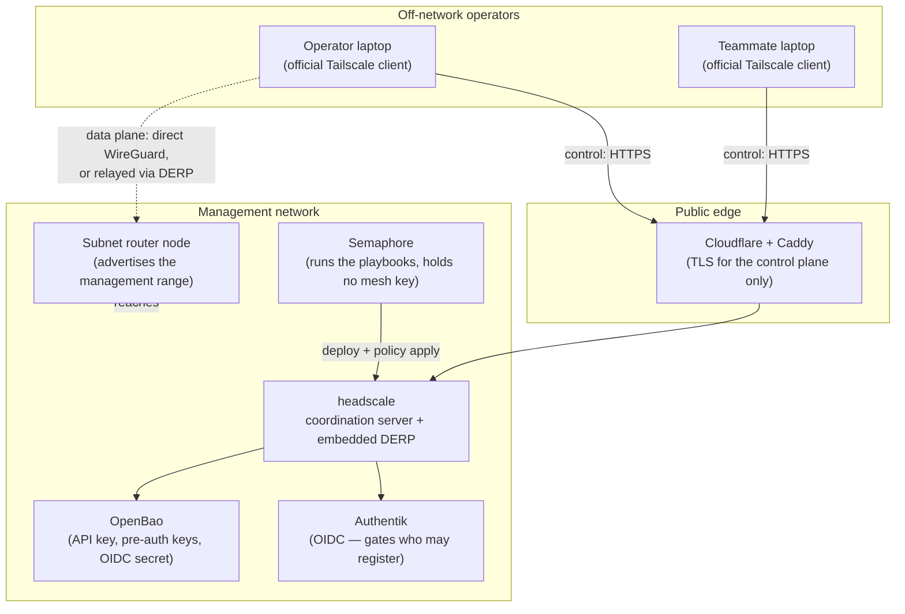

# 15 — Operator Access Mesh (self-hosted headscale + Tailscale clients)

> **Depends on:** 00 (foundation), 01 (secrets — every key below lives in OpenBao),
> 02 (SSO — Authentik is the intended identity source), 12 (RBAC — but see the
> **group limitation** in §4, which constrains how much of 12 can be reused here).
>
> **Status:** **PLANNING** (outline only; sections 5–8 are designed, nothing is
> built). **Owner:** uhstray-io.
>
> **Context:** Operator access to the internal network is currently
> all-or-nothing: on the LAN everything is reachable, off it almost nothing is.
> That gap blocked a production change on 2026-08-25 and is the reason this
> document exists. The intent is a single, auditable, always-available path to
> the management network that does not depend on where the operator is sitting.

---

## 1. Problem

Off-LAN, the operator has the orchestrator's web UI and API and essentially
nothing else. That is not merely inconvenient — it makes some changes
**unperformable**, because the platform's own safety gates deliberately require
proof from two independent directions.

Measured this session, not hypothesised:

| Observation | Consequence |
|---|---|
| The host-access gate caps its verdict at `PENDING-OPERATOR` and requires key auth proven from an **operator workstation** as well as from the orchestrator | SSH hardening of a new service host cannot be cleared from off-LAN at all |
| An orchestrator-adjacent VM refused SSH from the operator's segment while other hosts accepted it | Diagnosis had to stop; no second vantage was available |
| One address answered as **two different machines** depending on which host asked (two distinct SSH host keys, same moment) | The conflict was only provable because two vantages happened to exist |
| Every controller that had reached the previous occupant of an address held a stale host key, refusing the next connection | Recovery needed a shell on each affected controller |

The common thread: **diagnosis and safety gating both require more than one
vantage point, and off-LAN there is exactly one.** Routing individual services
through the public edge does not fix it — the edge deliberately publishes only
chosen HTTP hostnames, while the things that were needed here were SSH, ARP
state, and a second independent path to port 22.

**Non-goals.** This is not a user-facing VPN, not a way to publish services, and
not a replacement for the public edge. It is operator and automation access to
the management network.

---

## 2. Design Principles

1. **Self-hosted control plane.** The coordination server runs on hardware the
   team owns, consistent with the platform's privacy commitment. Using a hosted
   control plane would put the membership list and key exchange for the
   management network in someone else's account.
2. **Config as code, orchestrated.** The server is deployed by a playbook run
   from the orchestrator, its policy is a file in a repository, and its secrets
   come from OpenBao. No console clicks, no hand-edited state.
3. **Never share a device identity.** Onboarding a teammate issues *them* a
   credential that mints *their own* node. Copying a configured client's keys to
   a second machine is forbidden — it destroys per-device attribution and makes
   revocation impossible.
4. **Least reachability, not flat access.** Joining the mesh must not equal
   reaching everything. Policy is written per-role and denies by default.
5. **The mesh must not become the only way in.** A control plane that is itself
   unreachable would strand the operator. An independent break-glass path
   survives, and its existence is a deliberate accepted risk, not an oversight.
6. **Two vantages, preserved.** The whole point is a *second* independent path.
   If the mesh becomes the sole path, the safety gates that demand independence
   are satisfied only nominally.

---

## 3. Architecture

Verified against the headscale documentation (see §9 for what was checked):
headscale is a self-hosted implementation of the Tailscale coordination server,
driven by the **official Tailscale clients**. It supports pre-authentication keys,
ACL/"Grants" policy, tags, subnet routers and exit nodes (both with
auto-approval), an embedded DERP relay, MagicDNS, ephemeral nodes, Taildrop,
Tailscale SSH, and node registration via OIDC.

**Two planes, deliberately separated.** The *control* plane is HTTPS to the
coordination server and can sit behind the existing edge. The *data* plane is
WireGuard between peers, direct where the network allows and relayed otherwise.
Relay and NAT traversal are UDP, which the HTTP edge does not proxy — so the
relay's exposure is a **decision to make in Phase 2**, not something the existing
Caddy path solves for free. The two candidate answers are self-hosting the
embedded relay on a directly reachable UDP port, or accepting Tailscale's public
relays for the fallback path only. Both are viable; they trade operational
surface against sending relayed (still end-to-end encrypted) traffic through
third-party infrastructure.

**Reaching hosts that will never run a client.** Switches, the hypervisors, and
appliances cannot join a mesh. A **subnet router** node inside the management
network advertises the management range so those remain reachable. This is the
component that actually restores the missing second vantage, and it is also the
single largest piece of blast radius in this design (§8).

---

## 4. The group limitation (decide before building)

Headscale's documentation states two constraints that bear directly on how much
of the platform's existing RBAC can be reused:

- **"OIDC groups cannot be used in policy rules."** Groups can gate *who may
  authenticate* (`allowed_groups`, alongside `allowed_domains` and
  `allowed_users`), but they cannot express *what a member may reach*. Policy
  must therefore be written against users and tags.
- **"Headscale only supports a single OIDC provider."** Fine here — Authentik is
  the platform's one identity provider — but it means the mesh inherits
  Authentik's availability.

**Consequence for this plan:** the Authentik group that gates login is the
membership decision; the reachability decision is a separate, checked-in policy
file keyed on tags. Anyone expecting group-driven authorization to carry over
from plan 12 will be wrong, and that expectation is exactly the kind of
assumption worth writing down before it becomes a defect.

---

## 5. Implementation Phases

### Phase 1 — Coordination server, deployed like every other service

Deploy headscale as a composable service: secrets from OpenBao, an env file
rendered from a template, containers started by a `deploy.sh` that does nothing
else, verification after.

- Secrets under `secret/services/headscale`: the OIDC client secret (shared-read
  from the Authentik-owned path, per the established pattern), its database
  password, and its admin API key.
- A route on the central proxy for the control plane, declared in inventory
  rather than hand-added.
- **Acceptance:** the service answers over TLS at its public hostname; a
  redeploy regenerates nothing and changes no key; the health check passes from
  the orchestrator.

### Phase 2 — Relay and NAT traversal decision

Settle how the data plane traverses NAT (see §3), record the decision and the
rejected option with its reason, and open only what the chosen answer needs.

- **Acceptance:** two nodes on different networks reach each other; the path
  taken (direct or relayed) is observed and recorded rather than assumed.

### Phase 3 — Policy as code, denying by default

The ACL/Grants policy is a file in this repository, applied by a playbook, with
tags for machine roles and users for humans.

- Start from deny-all; add one rule at a time, each with a stated reason.
- Automation nodes get tags, not user identities, so a rotated human account
  cannot silently change what automation may reach.
- **Acceptance:** a node with no matching rule reaches nothing; each added rule
  has a test that fails when the rule is removed.

### Phase 4 — Subnet router for the un-meshable

One node inside the management network advertises the management range, with
route approval explicit rather than automatic on first request.

- **Acceptance:** an off-LAN operator reaches a host that runs no client; a node
  outside the operator role does not.

### Phase 5 — Onboarding, and the secure-sharing question

This is the part the request specifically asked for, and the answer is that
**client configuration is never what gets shared.**

Two supported paths, in preference order:

1. **OIDC login (preferred).** The teammate runs the official client, is sent to
   Authentik, and their node is created under their own identity. Nothing is
   handed over at all. Membership is a group change; revocation is an account
   change.
2. **Pre-authentication key (for machines and for people who cannot use the
   IdP).** A key is minted per recipient, scoped to a tag, short-lived, and
   single-use unless there is a stated reason otherwise. It is delivered by
   writing it to a path in OpenBao that only that recipient can read — not
   pasted into chat, not emailed, not committed.

**Forbidden, and worth stating explicitly because it is the obvious shortcut:**
copying an already-configured client's private key or state directory to a second
machine. It yields two devices with one identity, so audit attributes their
actions to the same node and revoking one revokes both.

- **Acceptance:** a second person reaches an internal host from off-LAN without
  any private key having been transmitted; revoking their access removes
  reachability within one policy apply; the audit log attributes their session
  to them and not to the operator.

### Phase 6 — Close the loop that motivated this

Re-run the host-access gate that could not be satisfied off-LAN, this time with
the operator vantage supplied over the mesh.

- **Acceptance:** the gate renders a verdict rather than aborting, and the
  operator-side direction of proof is obtainable without being on the LAN.

---

## 6. Validation Criteria

| # | Check | Pass condition |
|---|---|---|
| 1 | Redeploy is idempotent | A second run changes nothing and rotates no key |
| 2 | Secrets are sourced, not generated on the host | Every credential resolves from OpenBao; none appears in the repository or on disk outside a gitignored env file |
| 3 | Policy denies by default | A node matching no rule reaches nothing |
| 4 | Policy rules are individually load-bearing | Removing any one rule fails a test |
| 5 | Second vantage genuinely independent | An off-LAN operator reaches port 22 on an internal host **without** the LAN path |
| 6 | Onboarding transmits no private key | A new member is productive with no key material sent to them |
| 7 | Revocation is prompt and complete | After revoking, reachability stops within one policy apply, verified by probe |
| 8 | Attribution is per device and per person | The audit log distinguishes two members' sessions |
| 9 | Control-plane loss is survivable | With the coordination server stopped, existing sessions behave as documented and the break-glass path still works |
| 10 | The gate that motivated this can pass | Re-run of the access gate reaches a verdict with the operator direction supplied |

Checks 5, 7 and 9 are the ones that would actually catch a bad outcome; 1–4 are
hygiene. Check 9 in particular must be *exercised*, not reasoned about — this
repository's ledger records several mechanisms that were documented as working
and had never once been run.

---

## 7. Open questions (answer before Phase 2)

1. **Relay exposure** — self-host the embedded relay on an open UDP port, or use
   public relays for fallback only? (§3)
2. **Where does the coordination server run** — its own VM, or alongside an
   existing service? Its blast radius argues for isolation.
3. **Break-glass** — what independent path survives a mesh outage, and who holds
   it? Principle 5 requires an answer, not an intention.
4. **Does the orchestrator join the mesh?** It already reaches the management
   network directly. Joining adds reach it does not need; not joining means mesh
   membership is operator-only. Leaning **not joining**.
5. **Node expiry** — the feature documentation did not state node expiry/key
   rotation support either way. **Unverified; must be established before Phase 3**,
   because a mesh whose credentials never expire is a standing grant.

---

## 8. Security Considerations

**This is the largest single expansion of the management network's attack surface
proposed so far, and it should be read as such.** A subnet router that advertises
the management range converts any compromised mesh member into a foothold on that
range. The mitigations are the whole point of Phases 3–4 and are not optional
extras.

| Concern | Handling |
|---|---|
| Blast radius of a compromised member device | Deny-by-default policy; per-role tags; the subnet router advertises the narrowest workable range, not the whole network |
| Coordination-server compromise | It can re-key the mesh, so it is treated as tier-0 alongside the secret store: isolated host, no co-tenancy, its own credentials |
| Admin API key | Created server-side with a stated default 90-day expiry and **not retrievable after creation** — so it is written to OpenBao at creation time or it is lost. Rotation is a scheduled task, not a memory |
| Remote administration transport | The documentation requires an encrypted connection for remote gRPC (default port 50443) and explicitly does **not** recommend disabling certificate validation. Never disable it |
| Pre-auth keys | Short-lived, single-use by default, tag-scoped, delivered via the secret store; a leaked key mints a node, so it is treated as a credential |
| Device identity sharing | Forbidden (Phase 5). Per-device keys are what make revocation and attribution possible |
| Identity-provider dependency | Only one OIDC provider is supported, so an Authentik outage blocks new registrations. Existing nodes keep working; this is acceptable, but the break-glass path (§7.3) must not depend on the IdP |
| Credential handling in playbooks | `no_log` scoped to the credential tasks only — never on deploys, waits, or verification, per the platform's standard |
| Secrets in this repository | None. Real addresses and keys live in the private configuration repository and OpenBao |

---

## 9. What was verified, and what was not

Verified against headscale's official documentation while writing this:

- The supported-feature set listed in §3, including pre-auth keys, ACLs/Grants,
  tags, subnet routers and exit nodes with auto-approval, embedded DERP,
  MagicDNS, ephemeral nodes, Taildrop, Tailscale SSH, and OIDC registration.
- **"OIDC groups cannot be used in policy rules"** and single-provider support
  (§4), with `allowed_domains` / `allowed_users` / `allowed_groups` gating
  authentication.
- Admin API keys are created server-side, default to a 90-day expiry, and cannot
  be retrieved after creation; the REST interface uses bearer authentication.
- Remote gRPC administration defaults to port 50443, requires TLS, and the
  documentation advises against disabling certificate validation.

**Not verified, and therefore not asserted anywhere above as fact:** exact CLI
flags for minting pre-auth keys, the policy file's schema, node-expiry behaviour
(§7.5), and container image tags. Each must be read from the documentation at
implementation time rather than recalled.

---

## 10. Cross-references

- `plan/development/00-foundation-local-dev.md` — local-dev tier; the mesh is the
  production-access counterpart
- `plan/development/01-secrets-credentials.md` — where every key here lives
- `plan/development/02-sso-auth.md` — Authentik as the identity source
- `plan/development/12-rbac-user-provisioning.md` — group-based RBAC, and see §4
  for the part that does **not** carry over
- `plan/development/13-cloudflare-iac.md` — the edge that fronts the control plane
- `plan/architecture/04-credentials-access.md` — Semaphore vs SSH access rules
- `plan/architecture/05-platform-infra.md` — Caddy routing and TLS
- `docs/MISTAKES.md` §3 (acting on live state) and §10 (mechanisms asserted but
  never exercised) — validation check 9 exists because of §10
- Root `CLAUDE.md` — service and workflow tables to update when Phase 1 lands

---

## 11. Revision History

| Date | Change |
|---|---|
| 2026-08-25 | Initial draft. Written after an off-LAN session could not satisfy the host-access gate's operator-side proof, which is recorded in §1 as the motivating evidence. |
