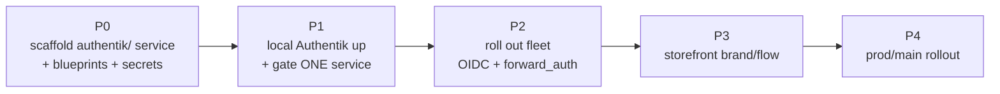
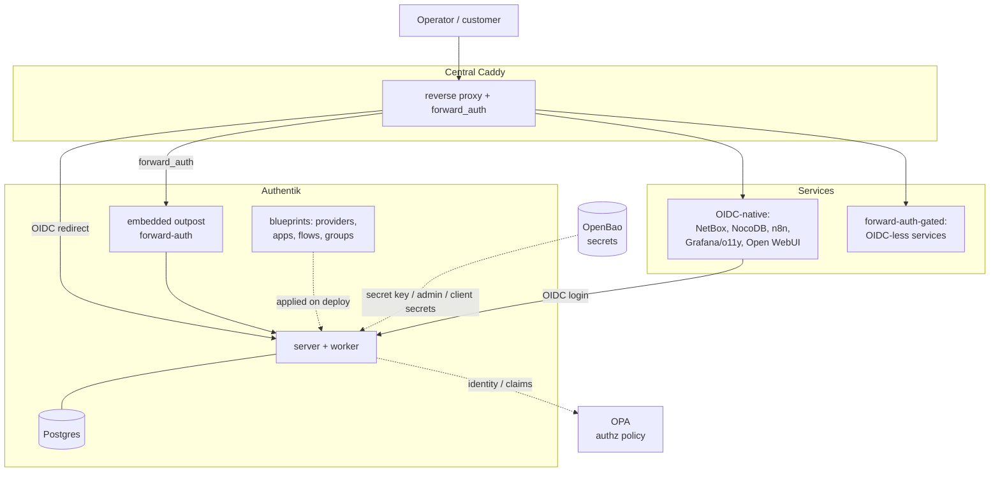

# Auth / SSO Deployment Plan — Authentik Central IdP

> **Location:** `plan/development/AUTH-SSO-DEPLOYMENT.md`
> **Date:** 2026-06-13 · **Status:** PROPOSED · **Owner:** uhstray-io
> **Context:** agent-cloud has machine auth (OpenBao secrets, OPA policy, AppRole) but **no human-identity layer**. This plan adds a central Identity Provider — **Authentik** — to give every Caddy-fronted service single sign-on, operator login, and (later) storefront-customer auth. Local-dev first (it deploys with the composable pattern already proven for DNS/Caddy/NetBox), then prod/main.
>
> **For agentic workers:** Execute phase-by-phase; every phase ends at a validation gate. Real domains/secrets stay in site-config; the public repo uses placeholders + `LOCAL_FAKE_` values.

**Goal:** One login for the whole platform — operators authenticate once at Authentik and reach every service (Semaphore, NetBox, NocoDB, n8n, o11y, Open WebUI, …) via OIDC or Caddy forward-auth; storefront customers get their own brand/flow on the same IdP.

**Architecture:** Authentik (server + worker + Postgres) runs as a composable platform service behind central Caddy. Services that speak OIDC integrate natively; those that don't are gated by Caddy `forward_auth` to an Authentik **embedded outpost**. All Authentik configuration (providers, applications, flows, groups) is declared as **blueprints** (YAML applied at startup) — config commits, not console clicks. Secrets flow from OpenBao exactly like every other service.

**Tech stack:** Authentik (Django + Go outpost), Postgres, Caddy `forward_auth`, OIDC/OAuth2, Authentik blueprints, OpenBao, composable Ansible tasks, Semaphore.

---

## Target outcome

When Phase 4's gate passes:

- **One identity, many services.** An operator logs in once at `auth.<zone>` and reaches Semaphore/NetBox/NocoDB/n8n/o11y/Open WebUI without re-authenticating — OIDC where supported, Caddy forward-auth elsewhere.
- **Human-identity fills the empty guardrail slot.** OpenBao (machine secrets) + OPA (authz policy) + **Authentik (human authn)** form the complete guardrail triad. Authentik says *who you are*; OPA says *what you may do*; OpenBao holds *machine credentials*.
- **Config is code.** Every realm/provider/application/flow is an Authentik blueprint in the repo, applied on deploy — adding a service to SSO is a config commit reviewed like any other.
- **Local mirrors prod.** Authentik deploys locally via the same composable service pattern (compose + `compose.local.yml` + `deploy-authentik.yml` + blueprints + `manage-secrets`) and is reached at `https://auth.agent-cloud.test`; prod is the same playbook with real OIDC clients + TLS.
- **Storefront on the same IdP.** UhhCraft customers authenticate through a dedicated Authentik brand/flow (separate from operator SSO), one system to run.

## 1. Problem

Every service currently has its own login (or none), each with separate credentials. There is no single sign-on, no central operator-identity, no consistent way to gate a new service, and no customer-identity story for the storefront. The guardrail layer protects *machines and actions* (OpenBao, OPA, Kyverno) but nothing answers *which human is this*. Adding SSO per-service ad-hoc would be 14× the work and inconsistent.

## 2. Decision criteria — why Authentik

The owner researched four products [1]. The decisive framing: **two are IdPs/SSO gateways (Authentik, Keycloak), two are embedded single-app libraries (Hanko, BetterAuth)** — and agent-cloud's ~14 Caddy-fronted services need a gateway, not a library.

| Option | Category | Verdict for agent-cloud |
|---|---|---|
| **Authentik** | Full IdP + **built-in forward-auth outpost** | **CHOSEN** — matches the Caddy-fronted fleet topology, ships forward-auth (no extra sidecar), MIT core, Python/Postgres footprint suits Proxmox, first-class blueprints/REST API = config-as-code, fully self-hosted |
| Keycloak | Full IdP (enterprise IAM) | Defensible alternative — most battle-tested, pure Apache-2.0, deep AD/LDAP. Rejected: heavier JVM footprint, dated admin UX, needs a separate `oauth2-proxy` for Caddy forward-auth |
| Hanko | Embedded auth (passkey-first) | Not a fleet gateway. **Reserved** as an optional future passkey-first login *embedded in UhhCraft* only — and its **AGPLv3 backend** is a flag for a commercial storefront |
| BetterAuth | Embedded TS library | Ruled out — TS library, can't gate a fleet, and UhhCraft is Go |

**Repo-grounded reasons Authentik wins here specifically:**
1. **Topology fit** — ~14 services behind central Caddy [2]; Authentik's embedded outpost + Caddy `forward_auth` gates them with no extra proxy. The local Caddy already routes `semaphore.agent-cloud.test`/`netbox.agent-cloud.test`/`openbao.agent-cloud.test` — those become the first gated apps.
2. **Config-as-code** — blueprints (declarative YAML) + REST API satisfy the "policy and configuration changes — code only" rule [3]; realms/clients become reviewed commits, not console state.
3. **Fills a real gap** — no human-identity layer exists; Authentik is additive, not a replacement.
4. **Ops + privacy fit** — Python/Ansible/pytest culture, self-hosted, MIT core, forkable.

**Two existing components it must NOT be confused with:**
- **Ory Hydra** already runs — but *only inside NetBox's Diode pipeline* for service-to-service OAuth2 ingestion [4]. It is not a human IdP. Authentik and Hydra stay **separate** (different jobs). Consolidating Diode onto Authentik is a far-future option, explicitly out of scope here.
- **OpenBao** is machine secrets, **OPA** is authz policy. Authentik is **authn (human identity)** — complementary. A clean future composition: Authentik authenticates → emits identity/claims → OPA authorizes the action.

## 3. Design principles

1. **Authentik is the human-identity layer; it does not replace OpenBao or OPA.** authn ≠ authz ≠ secrets.
2. **Config is blueprints, not clicks.** Every provider/application/flow/group is a versioned blueprint applied on deploy; the admin UI is read-only-by-convention.
3. **Prefer native OIDC; forward-auth only where a service can't.** OIDC gives real per-service identity + logout; forward-auth is the fallback gate for OIDC-less services.
4. **One codebase, two targets.** The same `deploy-authentik.yml` + blueprints run local and prod; differences are inventory vars + `LOCAL_FAKE_` secrets + TLS.
5. **Secrets through OpenBao only.** Authentik's secret key, bootstrap admin, DB password, and per-client secrets flow OpenBao → manage-secrets → `.env`/blueprint — never committed.
6. **SSO is additive and reversible.** Each service keeps a break-glass local admin; gating a service is one blueprint + one Caddy/OIDC change, revertable independently.

## 4. Architecture

Authentik sits in the guardrail layer as the human-identity component, in front of the service fleet via Caddy:

### Per-service integration matrix

| Service | Mechanism | Notes |
|---|---|---|
| NetBox | **OIDC** (`SOCIAL_AUTH`/`REMOTE_AUTH`) | native; group→role mapping via blueprint |
| NocoDB | **OIDC** (enterprise; else forward_auth) | OIDC SSO is a paid-tier feature like n8n — confirm edition at execution; community edition falls back to forward_auth |
| n8n | **OIDC** (enterprise SSO; else forward_auth) | confirm edition at execution |
| o11y (Grafana) | **OIDC** | Grafana generic OAuth |
| Open WebUI / WisAI | **OIDC** | OAUTH env config |
| Semaphore | **OIDC** (OpenID) | built-in OIDC |
| Nextcloud / WikiJS | **OIDC** | native |
| OpenBao UI | **forward_auth** or OIDC (JWT auth method) | break-glass token always retained |
| UhhCraft (storefront) | **OIDC** (separate brand/flow/tenant) | customer identity, not operator |
| services with no OIDC | **Caddy forward_auth** → outpost | uniform gate |

The matrix is a blueprint-per-service: each row is an Authentik `application` + `provider` blueprint + the service's OIDC/forward-auth config (templated from OpenBao client secrets).

## 5. Implementation phases

> **Prerequisite:** trusted local TLS (`LOCAL-DEV-TLS-TRUST.md`) + clean URLs
> (`make local-https`) should be in place **before Phase 1** — OIDC cookies and
> discovery break on an untrusted cert / port-mismatched issuer (see §6 + the
> TLS plan's sequencing note). The canonical local issuer is the **port-free**
> `https://auth.agent-cloud.test` (requires `make local-https`); register all OIDC
> `redirect_uri`s against it (exact-match, port-sensitive).

### Phase 0 — Scaffold the service (composable, local-first)
- [ ] `platform/services/authentik/deployment/`: `compose.yml` (**server + worker + Postgres + Redis/valkey** — Authentik requires a Redis broker for the worker, matching NetBox's valkey choice; pinned image), `compose.local.yml` (caps, `label=disable`, `local-dev` network), `deploy.sh` (container lifecycle only), `templates/env.j2` (`AUTHENTIK_SECRET_KEY`, bootstrap admin, DB, Redis — from OpenBao; set `AUTHENTIK_LISTEN__HTTP` so Authentik serves plain HTTP on `:9000` behind Caddy, which terminates TLS), `blueprints/` (seed: default flow, an `agent-cloud` group), `context/architecture.md`
- [ ] **Caddy forward-auth shape**: extend `Caddyfile.local.j2` (and prod `Caddyfile`) with an optional `forward_auth` route form (a `caddy_routes` entry flag like `forward_auth: true` emitting the `forward_auth auth.agent-cloud.test { uri /outpost.goauthentik.io/auth/caddy … copy_headers X-authentik-* }` block + the `/outpost.goauthentik.io/*` passthrough). This is the real composable touch point Phase 2 needs — `caddy_routes` only renders flat `reverse_proxy` today.
- [ ] `deploy-authentik.yml` — composable: `place-monorepo` → `manage-secrets` → render env + blueprints → deploy.sh → wait healthy → verify `/api/v3/root/config/`
- [ ] OpenBao layout: `secret/services/authentik` (secret_key, bootstrap_password, bootstrap_token, db_password, per-client secrets)
- [ ] Wire local: `templates-local.yml` "Deploy Authentik (Local)", `authentik_svc` inventory group, `auth.agent-cloud.test` Caddy route (`caddy_routes`), bootstrap `_inv_ini`; port `127.0.0.1:9000`
- [ ] BATS: compose pinned/healthcheck, deploy.sh container-only, blueprint validity

**Gate 0:** CI green; templates registered; `ansible-playbook --syntax-check` clean.

### Phase 1 — Local Authentik up + gate ONE service
- [ ] `make local-deploy-authentik` → Authentik healthy at `https://auth.agent-cloud.test:8443` (via Caddy), admin login works (`LOCAL_FAKE_` bootstrap)
- [ ] Gate **one** service end-to-end (recommend **Semaphore**, native OIDC, or **NetBox**): blueprint creates the OIDC provider+app; service configured to use it; login redirects to Authentik and back
- [ ] Prove blueprint-as-code: change a blueprint → redeploy → change reflected (no console edit)

**Gate 1:** one service's login flows through Authentik via local Semaphore deploy; identity claims visible; blueprint round-trip proven.

### Phase 2 — Roll out the fleet
- [ ] One blueprint + config change per service in the §4 matrix (OIDC where native, Caddy `forward_auth` → embedded outpost otherwise)
- [ ] Group→role mapping (e.g. `operators`, `admins`) in blueprints; each service maps Authentik groups to its roles
- [ ] Smoke: `make local-smoke` extended with an SSO check (auth.agent-cloud.test healthy + one gated route 302→Authentik)

**Gate 2:** every covered service reachable through SSO; break-glass local admin retained on each.

### Phase 3 — Storefront brand/flow
> **This OVERRIDES a signed-spec decision.** UhhCraft's `context/spec/SPEC.md`
> specifies **self-built** customer auth (`scs` sessions, bcrypt cost 12, Redis
> login rate-limit, guest/account/admin roles). "Authentik for everything"
> replaces that subsystem — so this is a **migration**, not greenfield. Before
> building: record the override in the SPEC's `## Alignment with agent-cloud
> conventions` section (the spec's own override mechanism), and design the
> guest-checkout / session-cart / rate-limit-tier behaviors that are currently
> auth-coupled. Reference this decision from `WEBSMITH-INTEGRATION-PLAN.md`.
> *(Conservative fallback if the migration is too costly: scope Phase 3 to
> operator/admin SSO into UhhCraft's ADMIN surface only, leave customer auth as
> the SPEC defines it — the §8 "Hanko reserve" row already hints this is the
> softer decision.)*
- [ ] Reconcile with the UhhCraft SPEC (override recorded in its alignment section) + guest/cart/rate-limit migration design
- [ ] Separate Authentik **brand** + enrollment/login **flow** for UhhCraft customers (distinct from operator SSO); UhhCraft uses OIDC against it
- [ ] Customer self-enrollment + (optional) passkey stage

**Gate 3:** a customer signs up + logs into UhhCraft via the storefront flow; guest checkout + cart semantics preserved; SPEC override recorded; operators unaffected.

### Phase 4 — Prod/main rollout
- [ ] Provision the prod Authentik (own VM/secrets); real OIDC clients per service; real TLS (depends on `DNS-SERVER-DEPLOYMENT.md` + `LOCAL-DEV-TLS-TRUST.md` prod path)
- [ ] Promote per the risk-classed pipeline (secret-flow/multi-service = high → branch-deploy + rollback)
- [ ] Migrate each prod service to OIDC behind a maintenance gate; verify break-glass before disabling local auth (Critical Rule #5: verify before hardening)

**Gate 4:** prod operators SSO into the fleet; rollback path proven; no service left without break-glass.

## 6. Security considerations
- Local: all Authentik secrets are `LOCAL_FAKE_`; bootstrap admin is fake; bound to the local-dev network + Caddy.
- Prod: secret key + admin + client secrets in OpenBao; rotation via `CREDENTIAL-LIFECYCLE-PLAN.md`; cookies `Secure`/`HttpOnly`/`SameSite`; forward-auth only over TLS.
- **Break-glass**: every service keeps a local admin until SSO is proven (rule #5) — an IdP outage must not lock operators out of everything.
- **TLS dependency (prerequisite, not follow-on):** OIDC cookies (`Secure`/`SameSite`) and server-to-server discovery break on Caddy's untrusted internal CA. Trusted local TLS (`LOCAL-DEV-TLS-TRUST.md`) + clean port-free URLs (`make local-https`) should land **before Phase 1**. The owner's stated order was auth-first; the review recommends the TLS fix first (it's small) — owner to confirm (see §8).
- Authentik EE features (RAC, AI risk) stay off (MIT core only) to avoid the paid-license surface.

## 7. Validation (master)

| Phase | Check | Pass |
|---|---|---|
| 0 | Scaffold | CI green; templates registered; blueprints validate |
| 1 | One service via SSO | local deploy → Authentik gates one service; blueprint round-trip |
| 2 | Fleet | all matrix services through SSO; break-glass retained |
| 3 | Storefront | customer signup/login via storefront flow |
| 4 | Prod | prod SSO + rollback proven; no service without break-glass |

## 8. Open decisions & risks

| Item | Status | Resolution |
|---|---|---|
| OIDC vs forward_auth per service | Matrix drafted (§4) | Confirm each service's OIDC support at execution; default forward_auth |
| Existing Ory Hydra consolidation | Out of scope | Keep separate; revisit only if Diode is reworked |
| Authentik image pin + upgrade backups | P0 | Pin a release; Authentik upgrades ship breaking changes + no downgrade — back up Postgres before each upgrade [1] |
| Authentik authn → OPA authz wiring | Future | Compose after SSO lands; not required for Phase 1–4 |
| Storefront passkey UX (Hanko reserve) | Deferred | Owner chose Authentik-for-everything; revisit Hanko-embedded only if a distinct passkey storefront is wanted (AGPLv3 flag) |
| Local port for Authentik (9000) vs Caddy | P0 | `127.0.0.1:9000` direct (HTTP, `AUTHENTIK_LISTEN__HTTP`); `auth.agent-cloud.test` via Caddy (add to `caddy_routes` → `local-authentik-server:9000`; registry of record: `docs/LOCAL-DEV.md`) |
| **Sequencing: TLS-trust before or after auth?** | **Owner to confirm** | Review recommends TLS-trust + `make local-https` **first** (OIDC needs trusted TLS + port-free issuer). Owner originally said auth-first; if kept, Phase 1 needs per-service TLS-verify-skip as a throwaway. |

## 9. References
1. *(owner research)* Four-product auth comparison (Authentik / Keycloak / Hanko / BetterAuth), 2026-06-13 — category framing (IdP vs embedded), licensing (Authentik MIT core + EE folder; Hanko AGPLv3 backend; Keycloak Apache-2.0; BetterAuth MIT), footprint, upgrade caveats.
2. *(repo)* `platform/services/caddy/deployment/` + `CLAUDE.md` — central Caddy fronts the service fleet; `forward_auth` available; the local Caddy already routes the control plane.
3. *(repo)* `CLAUDE.md` — "Policy and Configuration Changes — Code Only"; the composable secret flow Authentik reuses.
4. *(repo)* `platform/services/netbox/deployment/CLAUDE.md` — Ory Hydra is Diode-internal service-to-service OAuth2, not a human IdP.
5. *(repo)* `plan/development/LOCAL-DEV-DEPLOYMENT.md` — the composable local pattern Authentik deploys with; Caddy/DNS already proven.
6. *(repo)* `plan/development/OPA-INTEGRATION-PLAN.md` — the authz layer Authentik's identity later feeds.
7. *(repo)* `plan/development/LOCAL-DEV-TLS-TRUST.md` — the TLS-trust fix SSO depends on (executed right after this plan).

## 10. Revision history
| Date | Change |
|---|---|
| 2026-06-13 | Initial plan: Authentik chosen as central IdP (decision criteria + rejected alternatives from owner research, repo-grounded); composable local-first → prod architecture; per-service OIDC/forward_auth matrix; phases + gates; Authentik-for-everything incl storefront; kept separate from Ory Hydra; TLS-trust + OPA cross-refs |
| 2026-06-13 | Adversarial-review fixes: added Redis to the Phase-0 compose (Authentik requires a broker); flagged TLS-trust as a prerequisite (OIDC cookies/discovery) and surfaced the auth-vs-TLS sequencing as an owner decision; added the `forward_auth` Caddyfile-template task (the real Phase-2 touch point); NocoDB OIDC marked enterprise-gated like n8n; Phase 3 reconciled with UhhCraft's signed self-built-auth SPEC (override-or-descope); Authentik HTTP `:9000` behind Caddy + port-free issuer |
