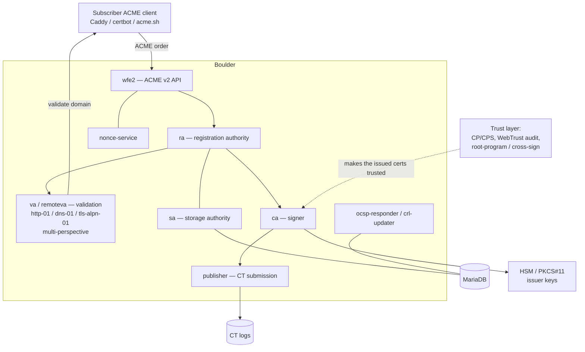

# Boulder CA Deployment Plan — Public ACME CA Product

> **Location:** `plan/development/BOULDER-CA-DEPLOYMENT.md`
> **Date:** 2026-06-13 · **Status:** PROPOSED (scoping) · **Owner:** uhstray-io
> **Context:** uhstray-io intends to **operate a public-facing ACME CA as a product** — issuing certificates to external tenants/customers at scale, the way Let's Encrypt does. The chosen engine is **Boulder** (the software that runs Let's Encrypt). This plan scopes that program honestly: Boulder is the *technical* core, but a **publicly-trusted** CA is a multi-year **compliance and trust program**, not a service deploy.
>
> **Scope boundary:** this is the **public** CA product. **Internal** TLS for `*.dev.test` / internal zones is a *separate* concern handled by `INTERNAL-CA-DEPLOYMENT.md` (step-ca) — Boulder can't and shouldn't issue for non-public, non-validatable names. The two CAs coexist; don't conflate them.
>
> **For agentic workers:** This plan has phases that are **not all engineering** — Phase 2 is legal/audit/compliance. Do not treat "publicly trusted" as achievable by deploying Boulder. Real domains/keys/secrets stay in site-config; placeholders here.

**Goal:** Stand up Boulder as the ACME CA engine for a uhstray-io CA service that issues certificates to external subscribers — starting as a **private/opt-in-trust** CA that works immediately, with a defined path toward **public trust** (root-program inclusion or cross-signature) gated on audit and compliance.

**Architecture:** Boulder's ~10 Go microservices + MariaDB + Certificate Transparency, issuing from issuer keys protected by an HSM/PKCS#11, fronted by the ACME v2 API (WFE2). Deployed via the composable pattern where it fits; the trust/compliance layer (audits, CT accreditation, root programs) wraps the technical deployment.

**Tech stack:** Boulder (Go microservices), MariaDB, Certificate Transparency logs, HSM/PKCS#11 (SoftHSM for dev), ACME v2, OpenBao (operational secrets — *not* issuer private keys, which live in the HSM), composable Ansible/Semaphore.

---

## ⚠️ The reality check (read this first)

**Running Boulder ≠ being a trusted CA.** Browsers and operating systems trust CAs that are in their **root programs** (Mozilla NSS, Apple, Microsoft, Chrome). Inclusion requires, at minimum:

- A **WebTrust for CAs** (or ETSI EN 319 411) **audit** by an accredited auditor — recurring, expensive.
- A published **Certificate Policy / Certification Practice Statement (CP/CPS)**.
- Compliance with the **CA/Browser Forum Baseline Requirements** (issuance rules, validation methods, key sizes, lifetimes, revocation).
- **Certificate Transparency** logging to accredited logs (SCTs in every cert).
- **HSM-protected** issuer keys + audited **key-generation ceremonies**.
- Incident response, revocation infrastructure (CRL/OCSP), and typically a **multi-year track record** before root-program acceptance.

This is a **legal/operational program measured in months-to-years and real money**, independent of the software. Therefore this plan **phases**:

1. **Private CA first** (works immediately): Boulder issues from a uhstray-io root that subscribers **explicitly opt into trusting** (install the root). Fully functional ACME for a *closed ecosystem* (your tenants, your devices) — no browser-default trust.
2. **Public trust later** (compliance-gated): pursue cross-signature from an established trusted CA *or* root-program inclusion, with the audits/CT/HSM/CP-CPS above.

And it surfaces the question that may make this far cheaper (§2).

## Target outcome

- **Phase 1:** Boulder runs as a uhstray-io ACME CA; subscribers point any ACME client (Caddy, certbot, acme.sh) at our directory and get certs from our issuer; works for any subscriber who trusts our root (private/opt-in). CT-ready, HSM-backed keys, MariaDB-persisted, revocation working.
- **Public-trust track (Phase 2+):** a documented, costed compliance roadmap toward cross-sign/root-inclusion — explicitly NOT promised by software alone.
- **Clean separation:** internal `*.dev.test` TLS stays on step-ca (`INTERNAL-CA-DEPLOYMENT.md`); Boulder only issues for **publicly-validatable** subscriber domains.

```mermaid
flowchart LR
  P0[P0<br/>local Boulder dev harness<br/>SoftHSM, MariaDB, fake CT<br/>prove the ACME flow] --> P1[P1<br/>private CA service<br/>real issuer keys (HSM),<br/>opt-in root trust]
  P1 --> P2[P2 - compliance PROGRAM<br/>CP/CPS, WebTrust audit, CT<br/>accreditation, key ceremony]
  P2 --> P3[P3<br/>public trust:<br/>cross-sign or root inclusion]
```

## 1. Problem

uhstray-io wants to *be* a CA — issue certs to external subscribers via ACME at scale. Off-the-shelf private-CA tools (step-ca) are right for *internal* TLS but aren't built to *operate a CA as a public service* (CT, OCSP at scale, BR-compliant issuance, the LE operational model). Boulder is — it literally runs Let's Encrypt. But adopting Boulder means taking on both its **operational complexity** (microservices + DB + HSM + CT) and the **CA trust/compliance burden** that makes a CA actually useful publicly. Underestimating the latter is the primary risk.

## 2. Decision criteria (alternatives considered)

| Option | Verdict | Why |
|---|---|---|
| **Boulder** | **CHOSEN (owner)** | The reference public-CA ACME stack (runs Let's Encrypt); BR-compliant issuance, CT, OCSP/CRL, multi-perspective validation, HSM support. Correct if the goal is genuinely *operating a public CA*. Cost: ~10 microservices + MariaDB + HSM + CT + not-turnkey self-hosting. |
| **Orchestrate ACME instead of being a CA** | **Must rule in/out first (§7)** | If subscribers want certs for *their own public domains*, you may **not need to be a CA at all** — automate issuance from Let's Encrypt/ZeroSSL on their behalf (DNS-01 delegation / `caddy-dns`). Vastly cheaper, instantly publicly-trusted, no audit. **Strongly consider before committing to Boulder.** |
| step-ca as a "public" CA | Rejected for public | Great private CA; not built to operate as an audited public CA at scale (CT/BR/OCSP-at-scale). Stays the **internal** CA. |
| OpenBao PKI as public CA | Rejected for public | Same — fine for private/internal issuance; not a public-CA operational platform. |
| Smallstep/commercial CA platform | Noted | Managed offerings exist; revisit if self-operating Boulder's compliance proves too heavy. |

**Open, gating decision (§7):** *be a CA* (Boulder, this plan) vs *orchestrate public ACME for subscribers' domains* (no CA, no audit). The owner chose "operate a public ACME CA," so this plan proceeds — but the orchestration alternative is recorded because it may achieve the business goal at a fraction of the cost.

## 3. Design principles
1. **Software is the easy part; trust is the program.** Treat audit/CT/CP-CPS/root-programs as first-class phases, not afterthoughts.
2. **Private-CA-first, public-trust-later.** Ship a working opt-in-trust CA early; pursue public trust as a separate, compliance-gated track.
3. **Issuer keys never leave the HSM.** Root/intermediate private keys live in an HSM (SoftHSM in dev, real HSM in prod) with audited ceremonies. OpenBao holds *operational* secrets (DB creds, API), **never** issuer keys.
4. **Public CA ≠ internal CA.** Boulder issues only for publicly-validatable subscriber domains; `*.dev.test`/internal zones stay on step-ca.
5. **BR/CT compliance by construction.** Issuance profiles, lifetimes, and logging follow CA/Browser Forum BRs from day one (cheaper than retrofitting for an audit).
6. **Composable where it fits, but honest about scale.** Boulder's microservices + MariaDB deploy via the platform pattern; this is a heavier service than anything else in agent-cloud and gets its own VM(s)/cluster.

## 4. Architecture

Boulder is a microservice ACME CA; the trust/compliance machinery wraps it:



**Why each piece matters:** WFE2 is the ACME endpoint subscribers hit; VA does Domain Control Validation (and Boulder's is *built for public domains* — multi-perspective, internet-reachable, which is exactly why it's wrong for internal names); CA signs from HSM-held issuers; PUB logs to CT (required for public trust); SA/MariaDB persist accounts/orders/certs; OCSP/CRL serve revocation.

## 5. Implementation phases

### Phase 0 — Local Boulder dev harness (prove the ACME flow)
- [ ] Stand up Boulder's dev configuration locally (its `docker-compose`-based test env: Boulder services + MariaDB + SoftHSM + a test CT/`pebble`-style setup). Goal: a working ACME directory a client can hit, issuing from a throwaway dev issuer.
- [ ] Point a test ACME client (Caddy or certbot) at it; obtain + renew + revoke a cert against a test domain.
- [ ] Document the component map + config; identify what the composable platform deploy must template.
- [ ] *(local only; not the composable platform service yet — Boulder's dev env is heavy and bespoke)*

**Gate 0:** an ACME client completes issue→renew→revoke against local Boulder; the team understands the moving parts + cost.

### Phase 1 — Private CA service (opt-in trust, real ops)
- [ ] Compose-ify Boulder for the platform (own VM(s)/cluster — this is heavier than any current service): MariaDB, the Boulder services, real issuer keys in an HSM (SoftHSM acceptable to start, real HSM for any serious use), CT submission (or documented deferral), OCSP/CRL.
- [ ] Generate the uhstray-io issuer hierarchy (root + intermediate) via a documented **key ceremony**; root key in HSM; root cert published for opt-in trust.
- [ ] Subscriber onboarding: ACME account model, rate limits, issuance profiles (BR-aligned lifetimes/keys).
- [ ] Secrets via OpenBao (DB, API, service creds) — **not** issuer keys.
- [ ] Semaphore templates; composable deploy/clean; monitoring (issuance, revocation, CT).

**Gate 1:** external subscribers issue certs via our ACME directory; certs validate for clients that trust our root; revocation (OCSP/CRL) works; CT logging working or explicitly deferred with rationale.

### Phase 2 — Compliance program (NOT engineering-only)
- [ ] Author the **CP/CPS**; align issuance to **CA/Browser Forum Baseline Requirements**.
- [ ] Engage an accredited auditor for **WebTrust for CAs** (or ETSI EN 319 411).
- [ ] **CT log accreditation** + SCT embedding; HSM + audited **key ceremony** records.
- [ ] Incident-response, revocation SLAs, and the operational controls auditors require.

**Gate 2:** a clean WebTrust/ETSI audit opinion; BR-compliant issuance demonstrated; CT in place.

### Phase 3 — Public trust
- [ ] Pursue **cross-signature** from an established trusted CA (faster path to ubiquitous trust) **and/or** **root-program inclusion** (Mozilla/Apple/Microsoft/Chrome — long lead times, audit-gated).
- [ ] Phase subscribers from opt-in trust to public trust.

**Gate 3:** uhstray-io-issued certs are trusted by default in target clients (via cross-sign or root inclusion).

## 6. Security considerations
- **Issuer private keys** are the highest-value asset on the platform — HSM/PKCS#11 only, audited ceremonies, m-of-n control, never in OpenBao/disk/git.
- **Mis-issuance is existential** for a CA — BR-compliant validation (Boulder's VA), domain-control enforcement, rate limits, CAA checking, and linting (zlint) before issuance.
- **CT is non-optional for public trust** and is also a mis-issuance detector (monitor our own logs).
- **Revocation must work** (OCSP/CRL) under load and incident.
- **Boulder's attack surface** (10 services + DB + ACME API exposed to the internet) demands network segmentation, the guardrail layer (OpenBao/OPA), and hardening beyond a normal service.
- **Internal vs public isolation:** Boulder (public) and step-ca (internal) are separate trust domains; never cross them.

## 7. Open decisions & risks
| Item | Status | Resolution |
|---|---|---|
| **Be a CA (Boulder) vs orchestrate ACME for subscriber domains** | **Owner chose "be a CA"** — but re-confirm | Orchestrating LE/ZeroSSL issuance for subscribers' own domains is dramatically cheaper + instantly publicly trusted (no audit). Validate the business case for *being* a CA before Phase 1 spend. |
| Public trust path: cross-sign vs root-program | P3 | Cross-sign = faster ubiquity under a partner's audit/contract; root inclusion = independence, multi-year. Likely cross-sign first. |
| HSM: SoftHSM (dev) → real HSM (prod) | P1 | SoftHSM to start; a real/cloud HSM is required for any audited/public use. |
| CT logging now vs deferred | P1/P2 | Required for public trust; can defer in the private phase, but design for it. |
| Boulder self-host difficulty | P0 finding | Boulder is tuned to LE's ops, not turnkey self-hosting; budget real effort + expertise. Smallstep/managed CA is the fallback if self-operating proves too heavy. |
| Footprint / where it runs | P1 | Heavier than any current service (microservices + MariaDB + HSM); dedicated VM(s)/cluster, not the shared box. |
| Relationship to internal CA | Settled | step-ca = internal (`*.dev.test`/internal zones); Boulder = public subscriber domains. Separate trust domains. |

## 8. References
1. *(owner)* Decision (2026-06-13): operate a public ACME CA as a product; engine = Boulder.
2. *(web)* github.com/letsencrypt/boulder — the ACME CA software running Let's Encrypt (Go microservices; its compose is a dev/test harness, not a turnkey self-host recipe).
3. *(external)* CA/Browser Forum **Baseline Requirements**; **WebTrust for CAs** / **ETSI EN 319 411**; **Certificate Transparency** (RFC 6962); Mozilla/Apple/Microsoft/Chrome **root program** policies — the trust/compliance gates.
4. *(repo)* `plan/development/INTERNAL-CA-DEPLOYMENT.md` — the *internal* CA (step-ca) this plan is explicitly separate from.
5. *(repo)* `plan/development/DNS-SERVER-DEPLOYMENT.md` — public DNS-01 / ACME for *internal* names is a different problem; Boulder is for public subscriber domains.
6. *(repo)* `CLAUDE.md` — guardrail layer (OpenBao/OPA), composable deploy pattern, secrets policy (operational secrets only; issuer keys → HSM).
7. *(repo)* `plan/development/CREDENTIAL-LIFECYCLE-PLAN.md` — key/cert lifecycle the CA's operational secrets join (issuer keys excepted — HSM).

## 9. Revision history
| Date | Change |
|---|---|
| 2026-06-13 | Initial scoping plan: Boulder chosen (owner) as the public ACME CA engine; the hard reality that public trust = audit/CT/root-program compliance program (phased private-CA-first → public); architecture (Boulder microservices + MariaDB + HSM + CT); decision criteria incl. the "orchestrate ACME instead of being a CA" alternative to re-confirm; explicit separation from the internal step-ca CA; HSM/mis-issuance/CT security framing |
