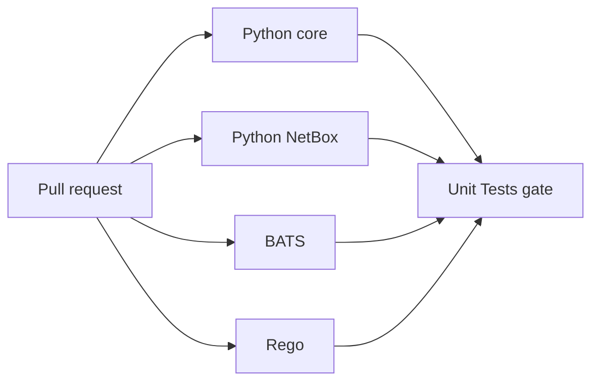

# CI Test Runtime

**Date:** 2026-09-29  
**Status:** ACTIVE  
**Context:** The agent-cloud `Unit Tests` job ran Python, BATS, and Rego sequentially. A measured run on 2026-09-29 spent 16m03s in Python and 11m18s in BATS before a BATS failure. Splitting the jobs shortened feedback without dropping any test gate.

## Problem

Long test groups delayed feedback and made hangs difficult to localize. Two PR #338 Python core attempts exceeded 45 minutes and 30 minutes; their logs were unavailable, so the stalled test and root cause remain unverified. A completed PR #342 Python core run took 12m06s. This points to an intermittent or run-specific stall, not a proven code regression.

## Design Principles

- Preserve every `pyproject.toml` testpath, every BATS file, and both Rego checks.
- Keep one visible `Unit Tests` result that fails unless every test group succeeds.
- Preserve the repository's config-as-code review and feature-to-dev promotion flow.

## Architecture

## Implementation Phases

1. Split the current serial test job into independent Python core, Python NetBox, BATS, and Rego jobs. Python core runs root `pytest` with only the existing NetBox node ID prefix deselected, so future `testpaths` additions still run. Python NetBox runs its explicit directory. Both Python jobs report the 20 slowest tests for diagnosis. Keep the original Python dependencies available to BATS, including its signing and playbook checks. Acceptance: the Python collections are disjoint and their union equals the current root collection.
2. Add an `always()` aggregate `Unit Tests` job that succeeds only if all four result values are `success`. Acceptance: a failed or cancelled group makes the aggregate fail.
3. Run the PR's normal CI and compare job durations with the measured serial baseline. Acceptance: all groups and the aggregate pass; report actual wall time rather than a projected saving.
4. Bound every child process launched through `platform/tests/harness_sandbox.py` to 120 seconds and run Python core with pytest fail-fast (`-x`). The full PR #342 Python core baseline was 12m06s, while the two PR #338 attempts exceeded 30 and 45 minutes. The per-process cap leaves room for a slow playbook test while ending a stuck harness promptly; fail-fast stops the suite after the first failure. Timeout results suppress captured stdout and stderr because test output may contain fixture credentials. These safeguards bound execution and improve diagnosis; they do not identify the cause of the earlier stalls.

## Validation Criteria

| Check | Pass condition |
|---|---|
| Python collection | Split collections are disjoint and their union equals the existing root collection |
| BATS | Existing `bats platform/tests/` command remains covered |
| Rego | Both pinned-image `check --strict` and `test` remain covered |
| Gate | Aggregate fails for any non-success dependency |
| CI | Every required group and the aggregate are green on the PR head |
| Harness timeout | A timed-out child fails with sanitized output within the configured limit |

## Security Considerations

Tests run on isolated GitHub-hosted workers and use no production credentials. A failed test must never appear as a successful aggregate result. Keep the existing security scan as a separate required review gate.

## Cross-references

- [Platform principles](../../PRINCIPLES.md)
- [Testing, CI and quality gates](../architecture/03-testing-ci-quality.md)
- [Agent instructions](../../AGENTS.md)
