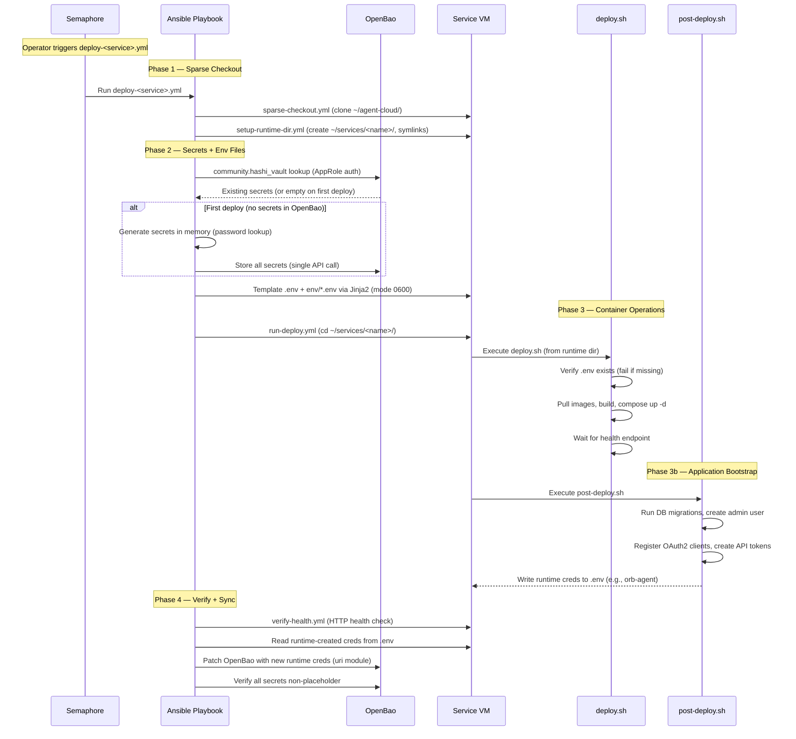

# Agent Cloud — Implementation Plan

## Agent Role Definitions

### NemoClaw (Engineer / Service Account)
NemoClaw is NVIDIA's open-source security stack wrapping OpenClaw. It runs headless inside a sandboxed OpenShell runtime with policy-enforced security, credential injection via YAML policies, and full audit logging.

**Best suited for:** Background automation, API integrations, health monitoring, CI/CD tasks, incident response, data aggregation, anything that runs unattended on a schedule or webhook trigger.

### Claude Cowork (Architect / Researcher)
Claude Cowork runs on the user's personal device with browser automation, local file access, and interactive GUI capabilities.

**Best suited for:** Research tasks, architecture decisions, browser-based workflows, document generation, visual verification, anything requiring personal context or GUI interaction.

---

## Services Involved

| Service | VM | Runtime | Purpose |
|---|---|---|---|
| OpenBao | openbao ({{ openbao_host }}) | Podman | Secrets management — KV v2, AppRole auth, database engine |
| NocoDB | nocodb ({{ nocodb_host }}) | Podman | Shared data layer — tables, views, REST API |
| n8n | n8n ({{ n8n_host }}) | Podman | Workflow automation — scheduling, webhooks, event routing |
| Semaphore | semaphore ({{ semaphore_host }}) | Podman | Ansible/task automation — playbooks against lab inventory |
| NemoClaw/OpenClaw | nemoclaw ({{ nemoclaw_host }}) | Docker (NOT podman) | Headless AI agent sandbox |
| NetBox | netbox ({{ netbox_host }}) | Podman | Infrastructure modeling — IPAM/DCIM + Diode discovery |
| Discord | — | API | Agent notification/interaction channel |
| GitHub | — | API | Repo management, issue tracking |
| Proxmox | aurora ({{ proxmox_host }}) | API | VM provisioning + infrastructure monitoring |

### Production Topology

Each service runs on its own VM, provisioned via the Proxmox API on aurora ({{ proxmox_host }}). OpenBao has been separated from NocoDB to give the secrets backbone an independent failure domain.

| VM Name | VMID | IP | Services | Port(s) | Runtime | Cores | Memory | Disk |
|---|---|---|---|---|---|---|---|---|
| `openbao` | 210 | `{{ openbao_host }}` | OpenBao | 8200 | Podman | 2 | 2 GB | 20 GB |
| `nocodb` | 161 | `{{ nocodb_host }}` | NocoDB + Postgres | 8181 | Podman | 2 | 4 GB | 40 GB |
| `n8n` | 118 | `{{ n8n_host }}` | n8n + Worker + Postgres + Redis | 5678 | Podman | 4 | 4 GB | 40 GB |
| `semaphore` | 117 | `{{ semaphore_host }}` | Semaphore + Postgres | 3000 | Podman | 2 | 2 GB | 20 GB |
| `nemoclaw` | 163 | `{{ nemoclaw_host }}` | NemoClaw + OpenShell | — | Docker | 4 | 8 GB | 60 GB |
| `netbox` | 116 | `{{ netbox_host }}` | NetBox + Diode Pipeline | 8000 | Podman | 2 | 4 GB | 40 GB |

All VMs are cloned from template VMID 9000 (Ubuntu 24.04 cloud-init) on the Proxmox cluster. VM placement is determined at provisioning time by cluster load; default target node is aurora. Resource specs are defined in `proxmox/vm-specs.yml`.

### Proxmox API Access

VM provisioning and monitoring uses the PVE REST API at `https://{{ proxmox_host }}:8006`. API token `{{ proxmox_token_id }}` stored in `proxmox/secrets/`. Auth header format: `Authorization: PVEAPIToken={{ proxmox_token_id }}=<token>`.

### Deployment Modes

1. **Semaphore (production, recommended)** — task templates trigger composable playbooks: sparse checkout → manage secrets → deploy.sh → verify health. All deployments should go through Semaphore.
2. **Ansible CLI (development)** — `ansible-playbook deploy-<service>.yml` runs the same composable playbook locally. Requires Semaphore environment variables for OpenBao access.
3. **Legacy CLI** — `orchestrate.sh` for quick local deploys (supports `--skip`, `--only`, `--dry-run`). Bypasses Ansible credential lifecycle — use only for local development.

> **Warning:** Running `deploy.sh` directly from the clone directory bypasses the Ansible secret lifecycle (no `manage-secrets.yml`, no env file templating). deploy.sh must run from the runtime directory `~/services/<name>/` with env files already templated by Ansible.

---

## Key Instructions

1. All deployment code lives in `platform/services/<service>/deployment/` within the **agent-cloud monorepo**
2. Container runtime is per-service: Docker for NetBox and NemoClaw, Podman for everything else. Set `container_engine` in inventory.
3. Never hardcode secrets, IPs, or usernames — all credentials go in OpenBao, all IPs in site-config (private)
4. OpenBao is the source of truth — AppRole auth at runtime, not tokens in env vars
5. Playbooks use wrapper pattern (`deploy-<service>.yml`) since Semaphore `extra_cli_arguments` is not supported
6. `become` is declared per-playbook, never in inventory. SSH keys from OpenBao, temp files cleaned in `always` blocks.
7. Audit for sensitive data before every push to this public repo

---

## Platform Design Principles

The 10 uhstray.io platform design principles are the constitutional constraints for every architectural decision:

| # | Principle | Application |
|---|-----------|-------------|
| 1 | **Develop every system "as-code"** | All infrastructure, config, policies, and workflows in version-controlled files. No manual UI-only configuration. |
| 2 | **Use open-source and free systems first** | Every component is OSS. No vendor lock-in. Proprietary tools only when no viable OSS option exists. |
| 3 | **Deploy via Kubernetes and containerized frameworks** | Compose for single-site/smaller production, K8s for multi-site/larger scale. Both are production-viable deployment paradigms. |
| 4 | **Keep platforms as simple as possible** | Prefer single-purpose tools. vLLM/llama.cpp over complex ML pipelines. NocoDB over custom CRUD apps. |
| 5 | **All deployments version or release controlled** | Compose files pin image versions (`${VERSION:-tag}`). K8s manifests reference tagged images from registry. |
| 6 | **Track and document work using agile processes** | NocoDB as task tracker, Semaphore for deployment tracking, Git history as audit trail. |
| 7 | **Single source of truth for all documentation** | Monorepo = one repo to search. CLAUDE.md as the AI agent's single guidance file. |
| 8 | **Platforms should be resilient and fault tolerant** | Health checks on every service. OpenBao HA (Raft). Compose restart policies. K8s liveness/readiness probes. |
| 9 | **Systems should use DevSecOps design principles** | OpenBao for secrets. AppRole least-privilege. Kyverno in k8s. Network policies. Container image scanning. |
| 10 | **Systems should be easy to contribute to** | Public monorepo with `.env.example` files, documented deploy patterns, and a quick-start guide. |

**Additional organizational principles:** Worker-owned not-for-profit, privacy-focused (no telemetry, self-hosted everything), education platform (codebase teaches), AI-centered (AI manages context/decisions, automation tools execute outcomes), data-driven with fair attribution.

---

## The Guardrails Model

```
┌─────────────────────────────────────────────────────┐
│                   AI Layer                           │
│  NemoClaw (workflow) + NetClaw (network) +           │
│  WisBot (community) + Claude Cowork (interactive)    │
│  Backed by: vLLM + llama.cpp (local LLM inference)   │
│  Manages: context, planning, triage, development     │
├─────────────────────────────────────────────────────┤
│                Guardrail Layer                        │
│  Policies: OpenBao (secrets), Kyverno (k8s), OPA,    │
│  OpenShell network policies, RBAC, AppRole scoping,  │
│  Authentik SSO/OIDC, ITSM gating (NetClaw config),  │
│  NeMo Guardrails (AI output validation)              │
│  AI proposes → guardrails validate → automation runs │
├─────────────────────────────────────────────────────┤
│              Automation Layer                         │
│  Ansible playbooks, Bash deploy scripts, Python      │
│  tooling — deterministic, idempotent, auditable      │
├─────────────────────────────────────────────────────┤
│              Platform Layer                           │
│  Compose/Podman (single-site prod) ↔ K8s (multi-site)│
│  Proxmox VMs → k8s nodes (scale path)               │
└─────────────────────────────────────────────────────┘
```

---

## Agent Architecture

### All Agent Roles

The platform targets **13 agent roles** (5 existing, 4 planned, 2 deferred, 2 future):

| Agent Role | Status | Platform Mapping | Runtime |
|---|---|---|---|
| **NemoClaw** (Orchestration + Dev) | ✅ Existing | Headless agent — API integrations, CI/CD, task automation | Docker sandbox |
| **NetClaw** (Network) | ✅ Existing | Device monitoring, topology, config backup, security audit | Docker sandbox |
| **Claude + Claude Cowork** (Interactive) | ✅ Existing | Research, architecture, document generation, GUI tasks | Personal device |
| **WisBot** (Community) | ✅ Existing | Discord voice/chat, user-facing AI — **external repo** (C#/.NET 10) | Podman/k8s |
| **vLLM + llama.cpp** (Inference) | ✅ Existing | LLM inference backbone for all agents and workflows | GPU VM (Docker) |
| **Reliability Agent** (SRE) | ⚠️ Planned P1 | HolmesGPT - Pending Research — root-cause analysis, alert investigation, auto-remediation | OpenClaw sandbox |
| **Governance Agent** (Policy) | ⚠️ Planned P1 | OPA enforcement + NeMo Guardrails for AI output validation + Research Kyverno for viability | OpenClaw sandbox |
| **Marketing Agent** | ⚠️ Planned P2 | n8n workflows initially, then OpenClaw — content creation via Mixpost | n8n → OpenClaw |
| **Research Agent** | ⚠️ Planned P2 | Headless research — web search, Qdrant RAG, Wiki.js knowledge base | OpenClaw sandbox |
| **CryptoBot** (Crypto Markets) | ⏸️ Deferred | Cryptocurrency market analysis — revisit when core platform is stable | TBD |
| **StockBot** (Equities) | ⏸️ Deferred | Equity market analysis — revisit when core platform is stable | TBD |
| **Accounting Agent** | 📋 Future P3 | (Akaunting/BigCapital) Research Platforms + LLM — invoice processing, financial reporting | TBD |
| **Storefront Agent** | 📋 Future P3 | (Medusa headless commerce) Research Platforms + LLM — catalog management, customer queries | TBD |

### Per-Agent Integration Summary

| Agent | OpenBao Role | Inference | Primary Integrations | Guardrails |
|---|---|---|---|---|
| **NemoClaw** | `nemoclaw-read` (read-only) | vLLM | NocoDB, n8n, GitHub, NetBox, Proxmox (read-only) | Destructive ops → Semaphore → human approval |
| **NetClaw** | `netclaw-readwrite` | vLLM | NetBox (bidirectional), pyATS (SSH/SNMP), nmap, NocoDB, n8n | Config changes → ITSM gate → approval |
| **WisBot** | via platform services | vLLM | Discord, MinIO (recordings), PostgreSQL, n8n webhooks | Voice channel join requires user command |
| **Claude + Claude Cowork** | N/A (personal device) | vLLM/llama.cpp (optional) | Local files, browser, monorepo, NocoDB (task creation) | Interactive — human in the loop |

### AI Agent Boundaries

```
AI CAN:                              AI CANNOT:
  ✓ Read all service APIs              ✗ Write OpenBao policies
  ✓ Create NocoDB rows                 ✗ Modify network configs directly
  ✓ Trigger n8n workflows              ✗ Run Ansible playbooks directly
  ✓ Open GitHub issues/PRs             ✗ Access Proxmox API (destructive)
  ✓ Query NetBox inventory             ✗ Unseal OpenBao
  ✓ Read observability data            ✗ Delete any persistent data
  ✓ Propose infrastructure changes     ✗ Apply changes without human approval
  ✓ Monitor network devices (read)     ✗ Push config changes without ITSM gate
  ✓ Scan subnets (scoped to policy)    ✗ Scan outside defined CIDR ranges
  ✓ Run local LLM inference            ✗ Send data to external AI providers without consent
```

### Cross-Agent Coordination

Task routing via NocoDB `task_type` field:

| Task Type Prefix | Routed To | Examples |
|---|---|---|
| `workflow:*` | NemoClaw | GitHub PRs, n8n triggers, Semaphore ops |
| `network:*` | NetClaw | Device health, topology, config backup, pcap |
| `infra:*` | NemoClaw or NetClaw | Proxmox monitoring → NemoClaw, network tracing → NetClaw |
| `market:*` | Deferred | CryptoBot / StockBot — not yet scoped |

**Coordination flow:** User request → WisBot (Discord) or Claude Cowork (interactive) → creates NocoDB task → NemoClaw/NetClaw picks up based on `task_type` → executes → logs result to `task_log` → Discord notification if needed.

### A2A + MCP Protocols

Agent communication uses two complementary protocols:

| Communication Pattern | Protocol | Transport |
|---|---|---|
| Agent ↔ tool/database/API | **MCP** (Model Context Protocol) | Direct HTTP/stdio |
| Agent ↔ agent coordination | **A2A** (Agent-to-Agent) | NATS JetStream |
| Workflow trigger / events | **NATS** | JetStream subjects |
| Telemetry / observability | **OpenTelemetry** | Collector → Grafana |
| Human → agent | Native interface (Discord, CLI) | A2A handles delegation behind it |

**A2A Registry:** FastAPI-based Agent Card registry at `platform/services/a2a-registry/`. Agents publish `.well-known/agent-card.json`; the registry indexes cards for discovery. OAuth 2.0 via Authentik for secured registration.

**Per-Agent MCP Server Assignments:**

| Agent | MCP Servers |
|---|---|
| NemoClaw | GitHub, NocoDB, n8n, Semaphore, NetBox (read-only) |
| NetClaw | NetBox, nmap, Prometheus, Grafana, Kroki, GitHub, packet-buddy, protocol, containerlab |
| WisBot | Discord, PostgreSQL, MinIO, Qdrant |
| Reliability | Prometheus, Alertmanager, Grafana, k8s API, NocoDB |
| Research | Web search, Qdrant, Wiki.js, document reader, NocoDB |
| Governance | OPA, Kyverno, VerifyWise, audit logs, NocoDB |

---

## Inference Backbone

> **Note:** This section outlines the target architecture. Specific model selection, quantization strategies, and multi-node scheduling will require further research during implementation.

The platform's local inference backbone is a dual-engine setup running on Proxmox VMs with NVIDIA GPU passthrough (consumer GPUs, 8–12 GB VRAM):

| Engine | Role | Port | Use Cases |
|---|---|---|---|
| **vLLM** | GPU-heavy inference | :8000 | Complex reasoning, code generation, long-context tasks. OpenAI-compatible API. |
| **llama.cpp** | Lightweight/edge inference | :8080 | Lighter workloads, speech-to-text (Whisper.cpp), CPU fallback for dev/test. |

**Architecture:** Proxmox host (GPU passthrough via vfio-pci) → Ubuntu Server VM (UEFI/q35) → Docker + NVIDIA Container Toolkit → vLLM (:8000) + llama.cpp (:8080).

**Integration:** All agents and workflows consume the inference backbone via OpenAI-compatible HTTP endpoints. Inference endpoint URL stored in OpenBao at `secret/services/inference`. Multi-node expansion: each GPU node runs vLLM independently, load balanced via Caddy/Kong.

**Monorepo location:** `platform/services/inference/` — `deployment/` contains compose files for both engines, model pull scripts, and deployment orchestration. `context/` contains model selection guides and architecture docs.

---

## Data Strategy: PostgreSQL + MinIO + DuckDB

The platform uses a three-tier data architecture:

| Tier | Engine | Purpose | Pattern |
|---|---|---|---|
| **Tier 1: OLTP** | PostgreSQL | Operational data — app state, CRUD, transactional | Per-service database (NocoDB, n8n, Semaphore, NetBox, WisBot) |
| **Tier 2: Object Storage** | MinIO | Binary blobs — recordings, backups, Parquet exports, o11y backends | Shared S3-compatible service with bucket-per-concern |
| **Tier 3: OLAP** | DuckDB | Analytical queries — fast reads over exported data | Embedded (runs wherever the query runs, reads Parquet from MinIO) |

**MinIO Bucket Layout:**

| Bucket | Contents | Lifecycle |
|---|---|---|
| `wisbot-recordings/` | Voice recordings (WAV) | 90 days → archive |
| `o11y-mimir/` | Metrics long-term storage | 1 year |
| `o11y-tempo/` | Traces | 3 months |
| `o11y-loki/` | Log chunks | 1 year |
| `backups/` | Restic backup repository | Per retention policy |
| `harbor-registry/` | Container image layers | Per tag policy |
| `data-exports/` | Parquet files for DuckDB | Rolling window |

**Data Flow:** Operational DBs (per-service PostgreSQL) → Dagster ETL assets (extract, transform, load) → warehouse DB + Parquet exports to MinIO → DuckDB queries for ad-hoc analytics / Superset dashboards.

**Data Warehouse Schema:** A dedicated `warehouse` database with source tables (`voice_activity`, `workflow_runs`, `deployments`, `infrastructure`, `incidents`, `git_activity`) populated by Dagster ETL, plus materialized views for common analytical queries.

---

## Dual-Runtime Architecture: Compose and Kubernetes

The platform supports two production-viable deployment paradigms. Both can run production workloads — they differ in scale and multi-site capability:

| Dimension | Compose (Podman/Docker) | Kubernetes |
|---|---|---|
| **Target scale** | Single-site production, homelab, small deployments | Multi-site production, larger-scale deployments |
| **Orchestration** | Semaphore + Ansible playbooks | ArgoCD GitOps |
| **Secret injection** | Ansible `manage-secrets.yml` → env files | External Secrets Operator (ESO) → k8s Secrets |
| **Policy enforcement** | OpenBao AppRole policies, OpenShell network policies | Kyverno + OPA admission policies |
| **Scaling** | Vertical (bigger VMs) | Horizontal (replica scaling, HPA) |
| **Multi-site** | Clone repo + site-config per site | Kustomize overlays per site/environment |
| **Service mesh** | N/A (direct inter-service HTTP) | Cilium (eBPF-based CNI, mTLS, network policies) |

### Source-of-Truth Cascade

Compose files remain the source of truth for service definitions:

```
platform/services/<name>/deployment/compose.yml    ← Source of truth
    │
    ├── Compose path: Ansible templates env files → deploy.sh → compose up
    │   (single-site production, Semaphore orchestrates)
    │
    └── K8s path: kompose convert → platform/k8s/base/<name>/
        → Kustomize overlays (dev/staging/prod/per-site)
        → ArgoCD syncs from git → ESO injects secrets from OpenBao
```

### Kubernetes Directory Structure

```
platform/k8s/
├── base/<service>/              ← Generated by kompose (CI step)
│   ├── deployment.yaml
│   ├── service.yaml
│   └── kustomization.yaml
├── overlays/
│   ├── dev/                     ← k3s/kind: NodePort, no replicas
│   ├── staging/                 ← Single-node: ClusterIP, 1 replica
│   ├── prod/                    ← Multi-node: Ingress, HPA, PDB
│   │   ├── kustomization.yaml
│   │   ├── hpa.yaml
│   │   └── network-policy.yaml
│   └── site-<name>/             ← Per-site overlays for multi-site
└── bootstrap/                   ← k0s/kubeadm cluster setup (from open-k8s)
```

### Secret Management Across Runtimes

OpenBao remains the single source of truth in all environments:

| Runtime | Secret Injection | Mechanism |
|---|---|---|
| **Compose (Ansible-managed)** | `manage-secrets.yml` → Jinja2 templates → env files | Ansible `community.hashi_vault` lookup |
| **Kubernetes** | ESO SecretStore → ExternalSecret → k8s Secret → pod envFrom | External Secrets Operator |

Zero secret changes when moving between runtimes — only the injection mechanism differs. Both paths read from the same OpenBao paths.

### Multi-Site Portability

The key value of the dual-runtime architecture is **site portability**:

- **Compose path:** Clone `agent-cloud` + create a `site-config` per site with real IPs/inventory → Semaphore deploys to that site's VMs. Each site is an independent deployment with its own OpenBao, inventory, and service topology.
- **K8s path:** Same monorepo + Kustomize overlays per site (`overlays/site-<name>/`) → ArgoCD syncs per-site manifests. Multi-site from a single control plane or independent clusters.

Both paradigms support creating new sites from the same codebase. The choice between them is a scale decision, not a capability limitation.

### VM-to-K8s Migration Order

Migration is not a flag day — both runtimes coexist:

```
Phase A (current): All services on Proxmox VMs via Compose
Phase B (parallel): K8s cluster runs alongside VMs
  - New services deploy to k8s first
  - Existing services migrate gradually (stateless first)
Phase C (target):  All services on k8s
  - Proxmox still runs k8s worker nodes (not eliminated)
  - VMs host k8s nodes, not individual services
```

**Migration order** (stateless → stateful → GPU):

1. Caddy → k8s Ingress Controller (Traefik)
2. WisBot → k8s Deployment (singleton)
3. n8n workers → k8s Deployment
4. o11y stack → k8s (Helm charts available)
5. MinIO → k8s StatefulSet
6. NocoDB → k8s + PVC
7. Semaphore → k8s + PVC
8. NetBox → k8s (complex — Diode pipeline, orb-agent needs host network)
9. OpenBao → k8s (critical — careful HA setup with Raft)
10. vLLM + llama.cpp → k8s on GPU nodes (NVIDIA device plugin)
11. NemoClaw → k8s (Kata Containers for sandboxing)
12. NetClaw → k8s (Kata + host network for device polling)

---

## Three-Tier Variable System

Configuration follows a three-tier hierarchy where higher tiers override lower:

| Tier | Source | Contents | Example |
|---|---|---|---|
| **Tier 1: Defaults** | Public repo (`.env.example`, compose defaults) | Ports, versions, non-secret config | `NOCODB_PORT=8181` |
| **Tier 2: Site Config** | Private repo (`site-config`) | Real IPs, hostnames, environment-specific values | `NOCODB_HOST={{ nocodb_host }}` |
| **Tier 3: Secrets** | OpenBao | Passwords, tokens, API keys, TLS certs | `POSTGRES_PASSWORD`, `NOCODB_API_TOKEN` |

**Resolution:** Tier 3 > Tier 2 > Tier 1 (secrets always win). In the composable pattern, Ansible `manage-secrets.yml` performs the merge at template-render time: Jinja2 templates reference defaults, Ansible inventory provides site-config values, and `community.hashi_vault` fetches secrets — all resolved in memory, rendered to env files in `~/services/<name>/`.

---

## Phase 0: Foundation

**Status:** COMPLETE

### What Was Built

- **OpenBao** — Initialized with KV v2, database secrets engine, AppRole auth. Policies: `nemoclaw-read`, `nemoclaw-rotate`, `nocodb-write`, `n8n-write`, `semaphore-write`, `semaphore-read`, `orb-agent`. Secrets seeded at `secret/services/{nocodb,github,discord,proxmox,n8n,semaphore}`.
- **NocoDB** — Running with PostgreSQL backend on port 8181.
- **n8n** — Running in queue mode with worker node, PostgreSQL backend, Redis queue.
- **Semaphore** — Running with PostgreSQL backend on port 3000 (3100 in local dev when VS Code holds 3000).
- **NemoClaw config** — `agent-cloud.yaml` network policy staged in `agents/nemoclaw/deployment/config/presets/`.

### Phase 0 — Validation Criteria

| Check | Pass Condition |
|-------|---------------|
| OpenBao initialized | `bao status` shows `Initialized: true, Sealed: false` |
| KV v2 engine enabled | `bao secrets list` includes `secret/` |
| AppRole auth enabled | `bao auth list` includes `approle/` |
| Secrets seeded | `bao kv get secret/services/nocodb` returns data |
| NocoDB healthy | `curl http://localhost:8181/api/v1/health` → 200 |
| n8n healthy | `curl http://localhost:5678/healthz` → 200 |
| Semaphore healthy | `curl http://localhost:3000/api/ping` → 200 |

### Phase 0 Close-Out Checklist

#### 1. Proxmox Host Configuration
- [x] NemoClaw network policy updated with real Proxmox IP
- [x] Proxmox API token stored in OpenBao at `secret/services/proxmox`

#### 2. Per-Service API Token Bootstrap

Tokens are bootstrapped via the composable deploy pattern: Ansible `manage-secrets.yml` generates/fetches DB passwords from OpenBao and templates env files → `deploy.sh` starts containers → `post-deploy.sh` creates admin users and API tokens → Ansible Phase 4 syncs runtime-created tokens back to OpenBao.

| Service | Admin Creation | Token Creation | Idempotency |
|---|---|---|---|
| **OpenBao** | Root token from `bao operator init` | AppRole via `manage-approle.yml` | Check `bao status` for initialized state |
| **NocoDB** | `POST /api/v1/auth/user/signup` (first boot) | `POST /api/v1/tokens` (fallback: `/api/v1/meta/api-tokens`) | Signin first; list tokens before creating |
| **n8n** | `POST /api/v1/owner/setup` (first boot) | `POST /api/v1/me/api-keys` (DB insert fallback) | Owner setup only works when no owner exists |
| **Semaphore** | Auto-created via `SEMAPHORE_ADMIN_PASSWORD` env var | `POST /api/auth/login` → `POST /api/user/tokens` | List tokens first, skip if exists |
| **GitHub** | N/A (external) | Fine-grained PAT via GitHub.com | `type: user` in `_secret_definitions` (never auto-generated) |
| **Discord** | N/A (external) | Bot token via Developer Portal | `type: user` in `_secret_definitions` (never auto-generated) |
| **Proxmox** | N/A (already done) | Token `{{ proxmox_token_id }}` | Stored in OpenBao |

**Bootstrap sequence:** OpenBao first (secrets backbone) → NocoDB, n8n, Semaphore in parallel → NemoClaw last (reads tokens from OpenBao via AppRole).

#### Composable Deploy Sequence Diagram

The following diagram shows how Semaphore triggers Ansible playbooks, Ansible owns all OpenBao interaction and env file templating, deploy.sh handles container lifecycle only, and post-deploy.sh handles application-level bootstrap. See [AUTOMATION-COMPOSABILITY.md](../architecture/AUTOMATION-COMPOSABILITY.md).



#### 3. Store External Credentials

External tokens (GitHub PAT, Discord bot token) are stored in OpenBao via `manage-secrets.yml` with `type: user` secret definitions — never auto-generated. GitHub PAT must be fine-grained, scoped to target repos only. Discord bot token with `Send Messages` + `Read Message History` permissions.

#### 4. Validate

| Step | Validation | Security Check |
|------|-----------|----------------|
| Proxmox IP | `curl -sk https://{{ proxmox_host }}:8006/api2/json/version` → 200 | API token scoped to VM management only |
| API tokens | Each `bao kv get secret/services/<svc>` returns non-placeholder values | Tokens created programmatically, no manual UI login |
| External creds | `secret/services/github:pat` and `secret/services/discord:bot_token` are set | GitHub PAT fine-grained, Discord bot scoped to target guild |
| NemoClaw config | `agent-cloud.yaml` has real service endpoints, no placeholders | Network policy restricts to documented endpoints only |
| Connectivity | NemoClaw reads from all 6 services without errors | All credentials from OpenBao, via composable pattern |

#### 5. NemoClaw Connectivity Smoke Test

One read operation per service after redeployment:

| Service | Test Operation | Success Condition |
|---|---|---|
| NocoDB | Fetch any row via API | HTTP 200, JSON response |
| GitHub | List issues on a repo | HTTP 200, issue array |
| Discord | Post a test message | Message appears in channel |
| Proxmox | `GET /api2/json/nodes` | HTTP 200, node status |
| n8n | `GET /api/v1/workflows` | HTTP 200, workflow list |
| Semaphore | `GET /api/projects` | HTTP 200, project list |

### Quick Health Check

```bash
podman ps --format "{{.Names}}\t{{.Status}}" | grep ac-
curl -s http://localhost:8181/api/v1/health                  # NocoDB
curl -s http://localhost:5678/healthz                        # n8n
curl -s http://localhost:3000/api/ping                       # Semaphore (3100 in local dev)

# OpenBao policy and AppRole verification (requires privileged access)
podman exec ac-openbao bao policy list
podman exec ac-openbao bao read auth/approle/role/nemoclaw

# Enumerate all secrets (check for placeholders vs real values)
for svc in nocodb github discord proxmox n8n semaphore; do
  echo "--- $svc ---"
  podman exec ac-openbao bao kv get secret/services/$svc
done
```

---

## Phase 0.5: Per-VM Deployment & Infrastructure Automation

**Status:** COMPLETE — OpenBao VM (210) provisioned on alphacentauri, OpenBao v2.5.2 deployed via Semaphore. All deployment code consolidated into the **agent-cloud monorepo**. Only two repos: agent-cloud (public) + site-config (private).

**Goal:** Split the monolithic compose stack into per-VM deployments, provision VMs via Proxmox API, and wire up Semaphore for ongoing configuration management. Each service runs on its own VM with composable deployment — Ansible manages secrets, deploy.sh handles containers, post-deploy.sh handles application bootstrap.

### What Was Built

- **Per-service compose files** — `platform/services/{openbao,nocodb,n8n,semaphore}/deployment/compose.yml`
- **Shared libraries** — `platform/lib/common.sh` (logging, compose wrapper, health checks, env generators) and `platform/lib/bao-client.sh` (HTTP-only OpenBao client for edge cases)
- **Deploy scripts** — `platform/services/{openbao,nocodb,n8n,semaphore}/deployment/deploy.sh` (container lifecycle only). NetBox also has `post-deploy.sh` for application bootstrap (migrations, superuser, OAuth2).
- **Composable task library** — `tasks/manage-secrets.yml`, `tasks/manage-approle.yml`, `tasks/manage-diode-credentials.yml`, `tasks/deploy-orb-agent.yml`, `tasks/clean-service.yml`
- **Per-service AppRole policies** — HCL files in `platform/services/openbao/deployment/config/policies/`. AppRoles provisioned via `manage-approle.yml` with TTL enforcement (90 days / 25 uses).
- **Semaphore orchestration** — Config-as-code via `platform/semaphore/templates.yml` + `setup-templates.yml`. 25+ task templates.
- **Proxmox VM provisioning** — `proxmox-validate.yml`, `provision-template.yml`, `provision-vm.yml` with cloud-init
- **Jinja2 env templates** — `platform/services/<name>/deployment/templates/*.j2` rendered by `manage-secrets.yml` into `~/services/<name>/`

### Phase 0.5 — Validation Criteria

| Check | Pass Condition |
|-------|---------------|
| Composable deploy completes | `deploy-<service>.yml` runs all 4 phases without errors |
| Deploy idempotency | Running deploy playbook twice produces no changes |
| API tokens in OpenBao | `bao kv get secret/services/<svc>` returns non-placeholder values |
| AppRole auth per service | Each service has its own AppRole via `manage-approle.yml` |
| Health endpoints respond | Each service returns HTTP 200 within 30s of compose up |
| Token round-trip | Fetch token from OpenBao, call service API, get HTTP 200 |
| Semaphore task templates | 25+ templates applied via `setup-templates.yml` |
| No `secrets/` directory | `ls ~/services/<name>/secrets/` fails or is empty |
| Env files in runtime dir | `ls ~/services/<name>/.env ~/services/<name>/env/*.env` succeeds |

**Smoke tests:**
- Run `deploy-<service>.yml` via Semaphore → verify 4-phase completion
- Run `validate-all.yml` → all services HEALTHY
- Run `check-secrets.yml` → all secrets present, no placeholders

**Security:** Per-service AppRole policies enforce least privilege. Env files mode 0600 in runtime dir. No credential files on VMs. Ansible `no_log: true` on secret-handling tasks.

### Current Repository Structure

```
agent-cloud/                              # PUBLIC monorepo — the platform
├── CLAUDE.md                             # AI agent guidance (single source of truth)
├── README.md                             # Project overview + quick start
├── CONTRIBUTING.md                       # Contribution guidelines
│
├── platform/                             # Infrastructure + service deployments
│   ├── services/                         # Per-service: deployment/ + context/
│   │   ├── openbao/
│   │   │   └── deployment/
│   │   │       ├── compose.yml           # OpenBao standalone
│   │   │       ├── deploy.sh             # Container lifecycle only
│   │   │       ├── README.md
│   │   │       ├── config/
│   │   │       │   ├── openbao.hcl       # Server config
│   │   │       │   └── policies/         # HCL policies (nemoclaw-read, semaphore-read,
│   │   │       │                         #   nemoclaw-rotate, nocodb-write, n8n-write,
│   │   │       │                         #   semaphore-write, orb-agent)
│   │   │       └── secrets/              # .gitignored (bootstrap only)
│   │   ├── netbox/
│   │   │   └── deployment/
│   │   │       ├── deploy.sh             # Container ops (clone upstream, build, start)
│   │   │       ├── post-deploy.sh        # App bootstrap (migrate, superuser, OAuth2, orb-agent)
│   │   │       ├── docker-compose.yml    # NetBox + Diode pipeline
│   │   │       ├── Dockerfile-Plugins    # Custom NetBox image with plugins
│   │   │       ├── templates/            # Jinja2 env templates (*.env.j2, hydra.yaml.j2, agent.yaml.j2)
│   │   │       ├── discovery/            # Diode pipeline config (agent.yaml, hydra.yaml, SNMP)
│   │   │       ├── lib/                  # Service-specific libs (common.sh, generate-secrets.sh, pfsense-sync.py)
│   │   │       ├── env/                  # Runtime env files (.gitignored, templated by Ansible)
│   │   │       ├── workers/              # Discovery workers (pfsense_sync)
│   │   │       ├── netbox-docker/        # Upstream netbox-docker clone
│   │   │       └── CLAUDE.md             # NetBox-specific agent guidance
│   │   ├── nocodb/
│   │   │   └── deployment/
│   │   │       ├── compose.yml           # NocoDB + Postgres
│   │   │       └── deploy.sh             # Container lifecycle
│   │   ├── n8n/
│   │   │   └── deployment/
│   │   │       ├── compose.yml           # n8n + Worker + Postgres + Redis
│   │   │       ├── deploy.sh             # Container lifecycle
│   │   │       └── config/n8n-init-data.sh
│   │   ├── semaphore/
│   │   │   └── deployment/
│   │   │       ├── compose.yml           # Semaphore + Postgres
│   │   │       ├── deploy.sh             # Container lifecycle
│   │   │       └── runner-entrypoint.sh  # Semaphore runner config
│   │   ├── caddy/
│   │   │   ├── deployment/               # Caddyfile, compose.yml, start-caddy.sh
│   │   │   └── context/                  # Caddy usage docs
│   │   ├── inference/                    # vLLM + llama.cpp (placeholder — Phase 3)
│   │   ├── a2a-registry/                 # A2A Agent Card registry (placeholder — Phase 3)
│   │   ├── o11y/                         # Observability stack (placeholder — pending absorption)
│   │   ├── nextcloud/                    # Cloud storage (context/ only)
│   │   ├── wikijs/                       # Knowledge base (context/ only)
│   │   └── postiz/                       # Content management (compose.yml)
│   │
│   ├── playbooks/                        # Ansible orchestration
│   │   ├── deploy-{netbox,openbao,nocodb,n8n,semaphore,nemoclaw,orb-agent}.yml
│   │   ├── deploy-all.yml                # Full deploy in dependency order
│   │   ├── deploy-service.yml            # Single service (-e target_service=<name>)
│   │   ├── update-{netbox,nocodb,n8n,semaphore}-service.yml
│   │   ├── clean-deploy-netbox.yml       # Destructive: revoke creds + wipe + redeploy
│   │   ├── distribute-ssh-keys.yml       # Deploy keys from OpenBao
│   │   ├── harden-ssh.yml                # NOPASSWD sudo + sshd lockdown
│   │   ├── install-docker.yml            # Docker CE from official repo
│   │   ├── validate-all.yml              # Health check all services
│   │   ├── validate-secrets.yml          # Test credentials against live services
│   │   ├── check-secrets.yml             # Read-only secret inventory
│   │   ├── sync-secrets-to-openbao.yml   # Push VM secrets → OpenBao
│   │   ├── sync-netbox-secrets.yml       # NetBox-specific secret sync
│   │   ├── apply-openbao-policies.yml    # Apply all HCL policies
│   │   ├── apply-policy-{nemoclaw,orb-agent,semaphore}.yml
│   │   ├── provision-vm.yml              # Clone template → configure → start VM
│   │   ├── provision-template.yml        # Create Ubuntu 24.04 template from ISO
│   │   ├── proxmox-validate.yml          # Pre/post cluster validation (8 checks)
│   │   ├── tasks/                        # Composable task library
│   │   │   ├── manage-secrets.yml        # Fetch/generate secrets, template env files
│   │   │   ├── manage-approle.yml        # Self-service AppRole + policy provisioning
│   │   │   ├── manage-diode-credentials.yml  # Diode orb-agent credentials
│   │   │   ├── deploy-orb-agent.yml      # Start orb-agent with vault-integrated config
│   │   │   ├── clean-service.yml         # Destroy containers, volumes, runtime dir
│   │   │   ├── clone-and-deploy.yml      # Legacy: clone monorepo + run deploy.sh
│   │   │   └── apply-openbao-policy.yml  # Apply single HCL policy
│   │   ├── collections/requirements.yml  # community.hashi_vault, ansible.posix
│   │   └── README.md                     # Playbook conventions and reference
│   │
│   ├── lib/                              # Shared bash libraries
│   │   ├── common.sh                     # Logging, compose wrapper, health checks, env gen
│   │   └── bao-client.sh                 # HTTP-only OpenBao client (curl+jq) — edge cases only
│   │
│   ├── inventory/                        # Inventory templates (no real IPs — those go in site-config)
│   │   ├── local.yml                     # All services on localhost
│   │   └── production.yml                # Per-VM inventory (placeholder IPs)
│   │
│   ├── semaphore/                        # Semaphore config-as-code
│   │   ├── templates.yml                 # Declarative task template definitions (25+)
│   │   └── setup-templates.yml           # Ansible playbook to apply templates via API
│   │
│   ├── hypervisor/proxmox/               # VM provisioning
│   │   └── cloud-init/                   # autoinstall-user-data.yml, meta-data, build-seed-iso.sh
│   │
│   ├── scripts/
│   │   └── setup-project.sh              # Legacy: programmatic Semaphore project config
│   │
│   └── k8s/                              # Kubernetes manifests (placeholder — Phase 3)
│       ├── base/                          # Generated by kompose from compose files
│       ├── overlays/{dev,staging,prod}/   # Kustomize overlays per environment/site
│       └── bootstrap/                    # k0s/kubeadm cluster setup
│
├── agents/                               # Per-agent: deployment/ + context/
│   ├── nemoclaw/
│   │   ├── deployment/                   # deploy.sh, .env.example, config/presets/, validate.sh
│   │   │   └── CLAUDE.md                 # NemoClaw-specific agent guidance
│   │   └── context/                      # skills/, prompts/, use-cases/, architecture/
│   ├── netclaw/
│   │   ├── deployment/config/            # Placeholder — testbed.yaml, network-policy.yaml
│   │   └── context/                      # skills/, prompts/, use-cases/, architecture/
│   ├── cowork/
│   │   └── context/                      # Claude Cowork agent context
│   └── workflows/                        # n8n workflow exports and templates
│
├── plan/                                 # Architecture and implementation plans
│   ├── architecture/                     # Architectural reference docs
│   │   ├── AUTOMATION-COMPOSABILITY.md   # Composable deployment patterns (authoritative)
│   │   └── CREDENTIAL-LIFECYCLE-PLAN.md  # Rotation, revocation, audit patterns
│   └── development/                      # Implementation and feature plans
│       ├── IMPLEMENTATION_PLAN.md        # This document — comprehensive implementation plan
│       ├── UNIFICATION-PLAN.md           # Platform vision (to be deprecated)
│       ├── NETCLAW-INTEGRATION-PLAN.md   # NetClaw agent architecture
│       ├── NETBOX-DISCOVERY-EXPANSION.md # NetBox discovery expansion
│       ├── SPARSE-CHECKOUT-MIGRATION.md  # Sparse checkout + runtime dir migration
│       ├── OPA-INTEGRATION-PLAN.md       # OPA policy engine integration
│       └── WISAI-DEPLOYMENT-PLAN.md      # WisAI deployment plan
│
├── data/                                 # Data warehouse, analytics (placeholder — Phase 5)
│
├── collections/
│   └── requirements.yml                  # Ansible collection dependencies
│
└── roles/
    └── requirements.yml                  # Ansible role dependencies
```

**Runtime directory structure on VMs** (not in the git clone — created by Ansible):

```
~/agent-cloud/                            # Sparse git checkout (READ-ONLY source code)
~/services/<name>/                        # Runtime working directory (GENERATED, mutable)
    .env                                  # Templated by Ansible from OpenBao secrets (mode 0600)
    env/*.env                             # Per-component env files (mode 0600)
    docker-compose.yml                    # Symlink → clone's compose file
    lib/                                  # Symlink → clone's platform/lib/
    discovery/agent.yaml                  # Templated by Ansible with vault creds (NetBox)
```

### Implementation Progress

```
Step 1: Per-service compose files                                 ✅ DONE
  │     platform/services/{openbao,nocodb,n8n,semaphore}/deployment/compose.yml
  │
Step 2: Shared libraries                                          ✅ DONE
  │     platform/lib/common.sh + platform/lib/bao-client.sh
  │
Step 3: Deploy scripts (container ops only)                       ✅ DONE
  │     platform/services/{openbao,nocodb,n8n,semaphore}/deployment/deploy.sh
  │     NetBox: deploy.sh + post-deploy.sh (split pattern)
  │
Step 4: Composable task library                                   ✅ DONE
  │     tasks/manage-secrets.yml, manage-approle.yml,
  │     manage-diode-credentials.yml, deploy-orb-agent.yml, clean-service.yml
  │
Step 5: Provision OpenBao VM via Proxmox API                      ✅ DONE (2026-03-28)
  │     Ansible playbooks: proxmox-validate, provision-template, provision-vm
  │     Validated against live PVE 9.0.3 cluster (8 PASS / 0 FAIL)
  │
Step 6: Deploy services to VMs via Semaphore                      ⬜ PENDING
  │     NocoDB and n8n need composable deploy playbooks
  │     (NetBox already deployed via composable pattern)
  │
Step 7: Jinja2 env templates for NocoDB + n8n                     ⬜ PENDING
  │     Create templates/*.j2, define _secret_definitions + _env_templates
  │     Follow NetBox template pattern
  │
Step 8: deploy.sh + post-deploy.sh split for NocoDB + n8n         ⬜ PENDING
  │     Split current monolithic deploy.sh into container ops + app bootstrap
  │
Step 9: Semaphore config-as-code                                  ✅ DONE
  │     platform/semaphore/templates.yml + setup-templates.yml
  │     25+ task templates applied via Ansible playbook
  │
Step 10: Sparse checkout + runtime dir tasks                      ⬜ PENDING
         Create sparse-checkout.yml, setup-runtime-dir.yml, run-deploy.yml,
         verify-health.yml composable tasks
```

### Per-Service deploy.sh Pattern

Every service's deployment follows the **composable 4-phase playbook pattern** (see Composable Automation Architecture section):

| Phase | Task | Responsibility |
|-------|------|---------------|
| **Phase 1** | `sparse-checkout.yml` | Clone `~/agent-cloud/` with service-specific paths |
| **Phase 2** | `manage-secrets.yml` + `setup-runtime-dir.yml` | Fetch/generate secrets from OpenBao, template env files to `~/services/<name>/`, create symlinks |
| **Phase 3** | `run-deploy.yml` | Execute deploy.sh (container ops) + post-deploy.sh (app bootstrap) from runtime dir |
| **Phase 4** | `verify-health.yml` | HTTP health check + sync runtime creds to OpenBao |

**deploy.sh responsibilities:** Verify env files exist (fail if Ansible didn't run), clone upstream dependencies, pull/build images, compose up -d, wait for health. **No** secret generation, **no** OpenBao interaction.

**post-deploy.sh responsibilities:** DB migrations, create admin user, register OAuth2 clients, create API tokens, write runtime creds to `.env`. Independently retryable from deploy.sh.

### OpenBao Client Library (bao-client.sh)

The `platform/lib/bao-client.sh` library wraps the OpenBao REST API using curl + jq (no binary required). It is **not used in the deploy path** — Ansible `community.hashi_vault` handles all OpenBao interactions natively. The library is available for edge cases and manual troubleshooting.

Functions: `bao_authenticate()`, `bao_authenticate_root()`, `bao_kv_get()`, `bao_kv_get_field()`, `bao_kv_put()`, `bao_kv_patch()`, `bao_health()`, `bao_wait_ready()`.

### AppRole Identities

Any service playbook provisions its own AppRole via `tasks/manage-approle.yml`. See [AUTOMATION-COMPOSABILITY.md](../architecture/AUTOMATION-COMPOSABILITY.md) "AppRole Management" section.

| Role | Policy | Access | Provisioned By |
|---|---|---|---|
| `nemoclaw` | `nemoclaw-read` | `secret/services/*` (read-only) | `manage-approle.yml` |
| `nocodb` | `nocodb-write` | `secret/services/nocodb` (read/write) | `manage-approle.yml` |
| `n8n` | `n8n-write` | `secret/services/n8n` (read/write) | `manage-approle.yml` |
| `semaphore` | `semaphore-write` | `secret/services/semaphore` (read/write) | `manage-approle.yml` |
| `orb-agent` | `orb-agent-read` | `secret/services/netbox/orb_agent_*` (read) | `manage-approle.yml` |

**TTL Enforcement:** `secret_id_ttl: 2160h` (90 days), `token_num_uses: 25` by default. Semaphore's orchestrator AppRole is the exception (unlimited uses).

**Credential Flow:**

1. **Semaphore environment JSON** holds orchestrator AppRole `bao_role_id` + `bao_secret_id` + `openbao_addr`
2. **Ansible `community.hashi_vault`** authenticates to OpenBao at playbook runtime (in memory)
3. **`manage-secrets.yml`** fetches/generates secrets and templates env files to `~/services/<name>/`
4. **deploy.sh** reads only from env files — never authenticates to OpenBao
5. **post-deploy.sh** creates runtime credentials (e.g., OAuth2 clients), writes to `.env`
6. **Ansible Phase 4** syncs runtime-created credentials back to OpenBao

Per-service AppRoles stored in OpenBao at `secret/services/approles/<name>`. No credential files on VMs.

### Semaphore Orchestration

Semaphore is the deployment orchestrator for production:
1. `deploy-semaphore.yml` — brings up Semaphore + creates API token (chicken-and-egg)
2. `platform/semaphore/setup-templates.yml` — applies task templates from `platform/semaphore/templates.yml` (config-as-code, 25+ templates)
3. Use Semaphore UI or API to run templates

Task templates managed as code — not ad-hoc API calls. Templates include: Deploy All, Validate All, Deploy/Update/Clean Deploy per service, Validate Proxmox, Provision VMs, Distribute SSH Keys, Harden SSH, Rotate Diode Creds, Audit Credentials.

### Proxmox VM Provisioning (Implemented)

Fully implemented with Ansible playbooks for Semaphore orchestration:
- **`proxmox/lib/pve-api.sh`** — REST API wrapper (node ops, VM CRUD, clone, template, cloud-init, storage, task tracking, validation). Key functions: `pve_clone_vm` (clone template), `pve_configure_vm` (set cores/memory/IP via cloud-init `ipconfig0`), `pve_start_vm`, `pve_vm_status`. Auth via `PVEAPIToken` header.
- **`proxmox/pre-validate.sh`** — CLI pre-validation (8 checks against live cluster)
- **`proxmox/vm-specs.yml`** — Resource specs for all 6 services (cores, memory, disk, IP, node) — see Production Topology table above
- **`proxmox/cloud-init/`** — Ubuntu autoinstall config + seed ISO builder
- **Ansible playbooks** — `proxmox-validate.yml` (pre/post validation), `provision-template.yml` (template from ISO), `provision-vm.yml` (clone + configure + start)
- **Semaphore templates** — 8 new task templates (validate, create template, provision each service)
- **Validated** against PVE 9.0.3 cluster: API, 11 nodes, alphacentauri storage (931GB on vm-lvms), Ubuntu ISO on SharedISOs, SSH keys, network bridge vmbr0

**Known issue: VM template creation.** Automated autoinstall via ISO + seed ISO hangs on serial console. Template creation currently requires manual installation: install from `SharedISOs:iso/ubuntu-24.04.3-live-server-amd64.iso`, 2 CPU/2GB/20GB on `vm-lvms`, install packages (`qemu-guest-agent cloud-init podman curl jq ansible genisoimage`), create `{{ ansible_user }}` user with SSH key + NOPASSWD sudo, run `cloud-init clean`, truncate machine-id, remove SSH host keys, add cloud-init drive, convert to template (VMID 9000). `provision-template.yml` automates the post-install steps.

### Phase 0.5 Validation Checklist

**Completed:**
- [x] Per-service compose files at `platform/services/<name>/deployment/compose.yml`
- [x] Per-service AppRole identities via `manage-approle.yml` with TTL enforcement
- [x] Semaphore playbooks for deploying/updating/validating each service
- [x] Semaphore config-as-code: 25+ templates via `setup-templates.yml`
- [x] n8n DB fallback has SQL injection protection (hex validation)
- [x] Local deployment tested: all 4 core services deploy and validate (2026-03-28)
- [x] Idempotency verified: second run is no-op with all services healthy
- [x] Ansible `validate-all.yml` reports all services HEALTHY
- [x] NemoClaw network policy updated: OpenBao = {{ openbao_host }}
- [x] Proxmox API validated against live PVE 9.0.3 cluster (2026-03-28)
- [x] VM template + cloning playbooks with cloud-init (2026-03-28)

**Pending:**
- [ ] NocoDB deployed via composable pattern (Jinja2 templates, manage-secrets, deploy.sh + post-deploy.sh split)
- [ ] n8n deployed via composable pattern
- [ ] Sparse checkout + runtime dir tasks created (`sparse-checkout.yml`, `setup-runtime-dir.yml`, `run-deploy.yml`, `verify-health.yml`)
- [ ] OpenBao runs on its own VM at {{ openbao_host }}
- [ ] `validate-all.yml` checks remote health endpoints (multi-VM topology)

---

## Phase 0.75: Semaphore Automation Infrastructure

**Status:** COMPLETE — Monorepo consolidated, SSH hardened, Semaphore pipeline operational, NetBox deployed with Diode discovery + Orb Agent (OpenBao vault integration). Composable automation implemented. Dynamic inventory migration deferred to Phase 1.

**Goal:** Establish Semaphore as the production-grade automation platform with git-based workflows, OpenBao-backed credentials, and full service deployment automation.

### Step 1: Monorepo Consolidation (DONE — 2026-03-30/04-01)

Consolidated all deployment code into the **agent-cloud monorepo**. Only two repos remain: agent-cloud (public) + site-config (private).

**Completed:**
- [x] Migrate all playbooks to `platform/playbooks/` with shared task files
- [x] Migrate openbao deployment into `platform/services/openbao/deployment/` (parameterized, secrets gitignored)
- [x] Standardize inventory groups to `_svc` suffix (openbao_svc, nocodb_svc, etc.)
- [x] Shared `tasks/clone-and-deploy.yml` for monorepo clone pattern (to be replaced by `sparse-checkout.yml`)
- [x] HTTPS clone (public repo, no deploy key needed)
- [x] Semaphore project reconfigured to point at agent-cloud monorepo
- [x] 25+ task templates configured via `setup-templates.yml`
- [x] `collections/requirements.yml` for auto-installing hashi_vault + posix
- [x] Remove all hardcoded usernames from public playbooks
- [x] Remove all IPs from plan/ files (replaced with `{{ }}` placeholders)

### Step 2: SSH Key Authentication (DONE — 2026-04-01)

Eliminated password-based SSH. Per-service ed25519 keys stored in OpenBao.

**Completed:**
- [x] Generated 6 per-service SSH key pairs (stored in site-config + OpenBao)
- [x] `distribute-ssh-keys.yml` — deploys keys from OpenBao, verifies key auth
- [x] `harden-ssh.yml` — NOPASSWD sudo, sshd lockdown, post-lockdown verification
- [x] Management key in Semaphore key store for all VM access
- [x] Password auth disabled, root login disabled on all 6 VMs
- [x] All verification automated (password rejected + key auth confirmed)

### Step 3: Service Deployment via Semaphore (NETBOX COMPLETE — 2026-04-04)

**Completed:**
- [x] `install-docker.yml` — Docker CE install playbook (official repo)
- [x] Docker installed on NetBox VM
- [x] NetBox fully deployed via composable 5-phase pipeline (2026-04-04)
- [x] Diode discovery pipeline operational (ingester, reconciler, auth, Hydra)
- [x] Orb Agent deployed with OpenBao vault integration (SYN scan + SNMP discovery)
- [x] 32 IPs + pfSense gateway device discovered in NetBox
- [x] Composable automation: manage-secrets, manage-diode-credentials, manage-approle, deploy-orb-agent
- [x] Semaphore templates managed as code (platform/semaphore/templates.yml)

**Pending:**
- [ ] Deploy NocoDB via composable pattern
- [ ] Deploy n8n via composable pattern
- [ ] Create run-pfsense-sync.yml as independent 15-min scheduled workflow
- [x] Create dedicated orb-agent AppRole (done 2026-04-04 — policy: read secret/services/netbox, TTL 4h)
- [ ] Enable OpenTelemetry metrics export from orb-agent to o11y stack
      Config: `common.otel.grpc` endpoint pointing at OTel collector, `agent_labels` for environment/service tagging
      Ref: https://github.com/netboxlabs/orb-agent/blob/develop/docs/config_samples.md

### Step 4: Remaining Infrastructure (PENDING)

- [ ] NetBox dynamic inventory (`netbox.netbox.nb_inventory` plugin)
- [ ] Migrate playbooks from static inventory to dynamic
- [ ] Webhook for auto-sync on push to agent-cloud
- [ ] Set up Semaphore MCP server for task management
- [ ] Set up Proxmox MCP server for VM management

### Phase 0.75 — Validation Criteria

**Step 1 (Monorepo):**

| Check | Pass Condition |
|-------|---------------|
| All playbooks syntax check | `ansible-playbook --syntax-check` passes for every `.yml` |
| Inventory groups resolve | `ansible-inventory --graph` shows `_svc` groups with correct hosts |
| No secrets in public repo | `grep -r '192.168' platform/ plan/` returns only `{{ }}` placeholders |
| Semaphore templates point at agent-cloud | All 25+ templates use repo id for agent-cloud |
| HTTPS clone works | Semaphore clones via `https://github.com/uhstray-io/agent-cloud.git` |

**Smoke test:** Run "Validate All Services" in Semaphore — all VMs reachable, health checks pass.

**Security:** No IPs, usernames, or credentials in agent-cloud repo. Template variables (`{{ }}`) only. `collections/requirements.yml` auto-installs dependencies.

**Step 2 (SSH):**

| Check | Pass Condition |
|-------|---------------|
| Per-service keys in OpenBao | `bao kv get secret/services/ssh/<svc>` returns private + public key |
| Keys deployed to VMs | `authorized_keys` on each VM contains management + service key |
| Key auth works | `ssh -i <mgmt_key> {{ ansible_user }}@<IP> hostname` succeeds |
| Password auth disabled | `ssh -o PubkeyAuthentication=no <IP>` → "Permission denied (publickey)" |
| Root login disabled | `ssh root@<IP>` → rejected |
| NOPASSWD sudo | `ssh <IP> sudo whoami` → "root" (no password prompt) |

**Smoke test:** Run `distribute-ssh-keys.yml` → all keys deployed + verified. Run `harden-ssh.yml` → password rejected, key confirmed on all VMs.

**Security:** Always verify key auth works BEFORE disabling password auth. Per-service keys provide isolation — compromise of one key affects only one VM. Management key stored in Semaphore key store + OpenBao.

**Step 3 (Service Deployment):**

| Check | Pass Condition |
|-------|---------------|
| NetBox deploy completes all 17 steps | deploy.sh exits 0, health check passes |
| NocoDB deploy via Semaphore | Task succeeds, HTTP 200 at health endpoint |
| n8n deploy via Semaphore | Task succeeds, HTTP 200 at /healthz |
| Monorepo cloned on each VM | `~/agent-cloud/` exists, `~/services/<service>/` runtime dir exists with env files and compose symlink |
| Secrets stored in OpenBao | `bao kv get secret/services/netbox` returns superuser_password, url |

**Smoke test:** Run "Validate All Services" — all 6 services HEALTHY. Run each "Deploy" template once.

**Security:** deploy.sh runs as `{{ ansible_user }}` (not root). `become: false` on clone/deploy tasks prevents root-owned files. CONTAINER_ENGINE set per host in inventory.

### Step 5: OpenBao as Semaphore Credential Manager (DONE — 2026-03-30)

All playbooks authenticate to OpenBao via AppRole at runtime — no file-based secrets.

**Architecture:** Semaphore environment JSON holds `bao_role_id` + `bao_secret_id` → playbook starts → `community.hashi_vault` lookup → AppRole auth → scoped token → fetch `secret/services/*`.

**Checklist:**
- [x] Semaphore AppRole with `semaphore-read` policy (2026-03-30)
- [x] All service credentials stored in OpenBao (Proxmox, SSH, Semaphore-VM) (2026-03-30)
- [x] `hvac` Python library in Semaphore container (2026-03-30)
- [x] `collections/requirements.yml` with `community.hashi_vault` (2026-03-30)
- [x] AppRole role-id + secret-id in Semaphore environment JSON (2026-03-30)
- [x] All playbooks refactored: vault lookups replace `lookup('file', ...)` (2026-03-30)
- [x] Validated: `Validate Proxmox Cluster` via Semaphore — 9 PASS / 0 FAIL (2026-03-30)
- [ ] Refactor `deploy-service.yml` to fetch service-specific credentials from OpenBao

### Step 3: NetBox Dynamic Inventory via Diode

Replace static `production.yml` inventory with NetBox as the single source of truth for IP addresses and VM metadata. Uses Option B (hybrid): `vm-specs.yml` for initial provisioning, Diode auto-discovers running VMs into NetBox, Semaphore switches to dynamic inventory once NetBox is populated.

**Architecture:**
```
Proxmox cluster ({{ proxmox_host }})
pfSense ({{ pfsense_host }})
Network devices (SNMP)
    ↓ Diode Orb agent (central poller)
NetBox ({{ netbox_host }}:8000)
    ↓ netbox.netbox.nb_inventory plugin
Semaphore dynamic inventory
    ↓
Ansible playbooks (deploy, update, validate)
```

**Diode Orb Agent — Central Poller:**
A single Orb agent runs on the NetBox VM ({{ netbox_host }}) and performs:
- **Proxmox discovery**: Polls PVE API → discovers all VMs, their IPs, node placement, resource allocation
- **pfSense discovery**: Polls pfSense API → discovers DHCP leases, firewall rules, interfaces
- **Network discovery**: Scans subnets for active hosts, discovers devices
- **SNMP discovery**: Polls switches/routers for interface data, LLDP neighbors, VLAN assignments

All discovered data is pushed to NetBox via the Diode ingestion pipeline, keeping NetBox automatically up-to-date.

**Semaphore Dynamic Inventory Config:**
```yaml
# In Semaphore inventory (type: netbox.netbox.nb_inventory)
plugin: netbox.netbox.nb_inventory
api_endpoint: http://{{ netbox_host }}:8000
token: "{{ lookup('community.hashi_vault.hashi_vault', 'secret/data/services/netbox:api_token', ...) }}"
validate_certs: false
group_by:
  - cluster
  - role
  - tags
compose:
  ansible_host: primary_ip4.address | ansible.utils.ipaddr('address')
  service_name: name
  service_url: "http://{{ primary_ip4.address | ansible.utils.ipaddr('address') }}:{{ custom_fields.service_port | default('') }}"
```

**Transition Plan:**
1. `vm-specs.yml` remains the provisioning source (defines what *should* exist)
2. After VMs are provisioned and running, Diode auto-discovers them into NetBox
3. Once NetBox has accurate VM data, create dynamic inventory in Semaphore
4. Update deploy/update/validate playbooks to use dynamic inventory
5. `vm-specs.yml` retained as the "desired state" for provisioning new VMs; NetBox becomes the "actual state" for managing existing VMs

**Checklist:**
- [ ] Deploy NetBox to production VM ({{ netbox_host }}) — blocked by podman networking on macOS; deploy on VM directly
- [ ] Configure Diode Orb agent on NetBox VM with Proxmox API credentials
- [ ] Configure Diode pfSense discovery (pfSense API at {{ pfsense_host }})
- [ ] Configure Diode network/SNMP discovery for switches and other devices
- [ ] Verify VMs appear in NetBox with correct IPs after Diode sync
- [ ] Install `netbox.netbox` collection on Semaphore VM: `ansible-galaxy collection install netbox.netbox`
- [ ] Install `ansible.utils` collection (for `ipaddr` filter): `ansible-galaxy collection install ansible.utils`
- [ ] Create dynamic inventory in Semaphore using `netbox.netbox.nb_inventory` plugin
- [ ] NetBox API token fetched from OpenBao (requires Step 2 complete)
- [ ] Test: run `Validate All Services` using NetBox dynamic inventory
- [ ] Migrate deploy/update playbooks from static `production.yml` to dynamic inventory
- [ ] Add NetBox custom fields: `service_port`, `deploy_dir`, `container_runtime` (for playbook compatibility)

### Step 4: Semaphore Runner on Every VM

Each provisioned VM includes a pre-pulled Semaphore runner. At provision time, the runner is configured with the registration token and server URL, then starts automatically.

**Current state:** Runner image pre-pulled in VM template. `provision-vm.yml` configures and starts the runner via SSH after boot.

**Checklist:**
- [x] Runner image pre-pulled in VM template (podman pull during template creation)
- [x] Runner configuration in provision-vm.yml (inject token + enable systemd service)
- [ ] Runner health monitoring via Semaphore API (`GET /api/runners`)
- [ ] Runner auto-registration verification in post-provision validation playbook
- [ ] Document runner troubleshooting (restart, re-register, logs)

### Phase 0.75 Validation Checklist

When Phase 0.75 is complete:
- [x] Semaphore project points to GitHub repo (not local path) (2026-03-29)
- [x] Playbook changes deployed via `git push` → Semaphore auto-sync (2026-03-29)
- [x] All secrets fetched from OpenBao at runtime (no file-based lookups) (2026-03-30)
- [x] Only AppRole role-id/secret-id stored in Semaphore environment JSON (2026-03-30)
- [ ] NetBox contains all VMs with correct IPs (populated by Diode)
- [ ] Semaphore uses NetBox dynamic inventory for deploy/update/validate playbooks
- [ ] Diode Orb agent running on NetBox VM, auto-syncing from Proxmox + pfSense + SNMP
- [ ] Every provisioned VM has an active Semaphore runner
- [ ] `vm-specs.yml` used only for new VM provisioning; NetBox is source of truth for existing VMs

---

## Composable Automation Architecture

**Status:** IMPLEMENTED for NetBox. NocoDB and n8n rollout pending.
**Full specification:** [AUTOMATION-COMPOSABILITY.md](../architecture/AUTOMATION-COMPOSABILITY.md)

This section summarizes the composable automation patterns that govern all service deployments going forward. Phase 0/0.5 established the initial infrastructure; this architecture decomposes the monolithic deploy.sh into reusable Ansible building blocks.

### Core Principles

1. **OpenBao is the single source of truth** — No `secrets/` directory on VMs. No local secret generation. Ansible fetches from OpenBao, templates compose-ready env files.
2. **Source/runtime directory split** — `~/agent-cloud/` is a read-only sparse git checkout. `~/services/<name>/` is the mutable runtime directory with env files and symlinks to compose file and libs. Filesystem isolation replaces `.gitignore` as the security boundary.
3. **deploy.sh is pure container operations** — No secret generation, no OpenBao interaction, no `generate-secrets.sh`. Verifies env files exist (fails if Ansible didn't run). Sources libs from clone via `CLONE_DIR`.
4. **deploy.sh + post-deploy.sh split** — deploy.sh handles infrastructure (clone upstream deps, pull/build images, start compose, wait for health). post-deploy.sh handles application (DB migrations, admin creation, OAuth2 registration, agent credentials). Independent retry.
5. **Config-as-code** — Semaphore templates managed via `platform/semaphore/templates.yml` + `setup-templates.yml` (Ansible playbook). No ad-hoc API calls.

### 4-Phase Composable Playbook Pattern

Every `deploy-<service>.yml` follows this structure:

```
Phase 1: Sparse Checkout     → sparse-checkout.yml (clone ~/agent-cloud/ with minimal paths)
Phase 2: Secrets + Runtime   → manage-secrets.yml (OpenBao → Jinja2 → env files)
                             + setup-runtime-dir.yml (create ~/services/<name>/, symlinks)
Phase 3: Container Ops       → run-deploy.yml (execute deploy.sh from runtime dir)
Phase 4: Verify              → verify-health.yml (HTTP health check with retries)
```

**Variable contract:** `_monorepo_dir` (read-only clone), `_deploy_dir` (source code within clone), `_runtime_dir` (mutable working directory).

### Composable Task Library

| Task | Purpose | Status |
|------|---------|--------|
| `manage-secrets.yml` | Fetch/generate secrets from OpenBao, template env files | Implemented |
| `manage-approle.yml` | Self-service AppRole + policy provisioning with TTL enforcement | Implemented |
| `manage-diode-credentials.yml` | Create fresh Diode orb-agent credentials | Implemented |
| `sparse-checkout.yml` | Sparse-clone monorepo with service-specific paths | Planned |
| `setup-runtime-dir.yml` | Create `~/services/<name>/`, set up symlinks to clone | Planned |
| `run-deploy.yml` | Execute deploy.sh from runtime dir with `CLONE_DIR` env var | Planned |
| `verify-health.yml` | HTTP health check with retries and backoff | Planned |
| `clean-service.yml` | Destroy containers, volumes, runtime dir, clone | Implemented |
| `write-secret-metadata.yml` | Write KV v2 lifecycle metadata after secret store | Planned |
| `rotate-credential.yml` | Generic Create→Verify→Retire rotation wrapper | Planned |
| `revoke-service-credentials.yml` | Revoke AppRole secret_ids + Hydra clients | Planned |
| `audit-credentials.yml` | Weekly credential inventory + stale detection | Planned |

### Secret Lifecycle

**First deploy:** `manage-secrets.yml` checks OpenBao (empty) → generates in Ansible memory → stores in OpenBao → templates env files to `~/services/<name>/` → deploy.sh starts containers using env files.

**Subsequent deploys:** `manage-secrets.yml` checks OpenBao (has values) → reuses ALL existing secrets (no regeneration, no drift) → re-templates env files → deploy.sh restarts containers with matching passwords.

**Credential rotation:** Create new credential → verify against live service → retire old credential. Dual-valid window with explicit verification gate. If verification fails, old credential remains active.

### Credential Lifecycle Workflows

| Workflow | Playbook | Schedule | Pattern |
|----------|----------|----------|---------|
| Rotate Diode Creds | `rotate-diode-credentials.yml` | Monthly | Create→Verify→Retire |
| Rotate SSH Keys | `rotate-ssh-keys.yml` | Annual | Create→Verify→Retire |
| Audit Credentials | `audit-credentials.yml` | Weekly | Read-only scan + report |

### What deploy.sh Keeps vs What Moved to Ansible

| Concern | deploy.sh | Ansible |
|---------|-----------|---------|
| Clone upstream repos | Yes | No |
| Pull/build images | Yes | No |
| Start/stop compose | Yes | No |
| Wait for health | Yes | No |
| DB migrations, admin users, OAuth2 | post-deploy.sh | No |
| **Generate secrets** | **No** | **manage-secrets.yml** |
| **Write env files** | **No** | **Jinja2 templates** |
| **OpenBao read/write** | **No** | **community.hashi_vault** |
| **Clone monorepo** | **No** | **sparse-checkout.yml** |
| **Setup runtime dir** | **No** | **setup-runtime-dir.yml** |
| **Health verification** | **No** | **verify-health.yml** |
| **Credential rotation** | **No** | **rotate-credential.yml** |

### Anti-Patterns

- **No `secrets/` directory** on VMs — env files in `~/services/<name>/` only
- **No `generate-secrets.sh`** — Ansible generates in memory
- **No OpenBao calls from deploy.sh** — no `bao-client.sh`, no `BAO_ROLE_ID`
- **No convenience symlinks** (`~/<service>` → clone) — use `~/services/<name>/` runtime dir
- **No generated files in git clone** — all mutable files go to runtime dir
- **No running deploy.sh from clone dir** — must run from `~/services/<name>/`
- **No ad-hoc API calls** for Semaphore/OpenBao management — use config-as-code playbooks

---

## Phase 1: NemoClaw Task Automation

**Goal:** Transition NemoClaw from "deployed and connected" to actively performing useful work across all six service integrations, with consistent scheduling, logging, and alerting.

### Architecture Decisions

#### ADR-1: Task Dispatch Pattern

**Context:** NemoClaw executes tasks against six services, triggered by schedule, webhook, manual invocation, or cross-agent request. A consistent dispatch pattern prevents sprawl.

**Decision:** n8n is the orchestration layer. Each integration consists of three parts: a NemoClaw tool (callable script in the sandbox), an n8n workflow (schedule/webhook trigger), and a NocoDB `task_log` entry (audit trail).

**Consequences:** n8n becomes the single scheduling and event routing layer — no cron inside NemoClaw. NocoDB becomes the audit trail. Adding a new integration always follows the same three-part pattern.

#### ADR-2: Error Handling and Alerting

**Decision:** All tasks write results to a NocoDB `task_log` table. Failed tasks trigger a Discord notification via an n8n webhook. Critical failures (OpenBao unreachable, NemoClaw crash) escalate to a dedicated `#agent-alerts` Discord channel.

**Consequences:** Requires a `task_log` table, a Discord alert webhook URL, and an n8n workflow that monitors the log for failures.

### Implementation Order

Dependencies dictate the build sequence. Steps 3 and 4 can be parallelized once 1 and 2 are complete.

```
Step 1: NocoDB CRUD + task_log table          (foundation for everything)
  |
Step 2: Discord messaging + alert webhook      (needed for error reporting)
  |
Step 3: GitHub issue management                 (first real integration)     ─┐
  |                                                                           ├─ parallelizable
Step 4: Proxmox monitoring                      (second integration)         ─┘
  |
Step 5: n8n workflow triggering                 (builds the orchestration workflows)
  |
Step 6: Semaphore playbook execution            (final integration)
  |
Step 7: Scheduled task framework                (ties everything together)
```

### Step 1: NocoDB CRUD Operations

**Goal:** NemoClaw can create, read, update, and delete records in NocoDB via the REST API.

**NocoDB Schema — Foundational Tables:**

| Table | Columns | Purpose |
|---|---|---|
| `task_log` | id, timestamp, service, operation, status (success/fail/warn), message, duration_ms, triggered_by | Audit trail for all automated actions |
| `monitored_resources` | id, service, resource_type, resource_id, last_check, status, metadata (JSON) | Proxmox health data, VM inventory |
| `github_issues_cache` | id, repo, issue_number, title, state, labels (JSON), updated_at, synced_at | Local cache of GitHub issues |

**API Client Library** (Node.js or Python):

| Operation | Endpoint | Method |
|---|---|---|
| List/filter rows | `/api/v1/db/data/noco/{orgId}/{projectId}/{tableId}` | GET |
| Create row | `/api/v1/db/data/noco/{orgId}/{projectId}/{tableId}` | POST |
| Update row | `/api/v1/db/data/noco/{orgId}/{projectId}/{tableId}/{rowId}` | PATCH |
| Delete row | `/api/v1/db/data/noco/{orgId}/{projectId}/{tableId}/{rowId}` | DELETE |

Auth: `xc-token: <api_token>` header, injected from OpenBao env var.

Write a `log_task()` helper that all subsequent integrations call to record execution results.

**Acceptance Criteria:**
- [ ] NemoClaw performs all four CRUD operations through the network policy
- [ ] `task_log` table exists and receives entries
- [ ] API token is read from environment, never from config

**Smoke test:** Create a `task_log` row, read it back, update status to `success`, delete it. Verify round-trip.

**Security:** NocoDB API token fetched from OpenBao (`secret/services/nocodb:api_token`), injected as env var. Network policy restricts NemoClaw to NocoDB endpoint only for CRUD operations. No admin-level NocoDB access from NemoClaw — read/write to data tables only.

### Step 2: Discord Messaging

**Goal:** NemoClaw can post messages and read channel history. Discord becomes the alerting backbone.

**API Client:**

| Operation | Endpoint | Method |
|---|---|---|
| Send message | `/channels/{id}/messages` | POST |
| Read messages | `/channels/{id}/messages` | GET |

Auth: `Authorization: Bot <bot_token>` header, from OpenBao.

**Notification Channels:**
- `#agent-alerts` — task failures, health check issues (error severity)
- `#agent-activity` — task completions, sync summaries (info severity)
- Store channel IDs in OpenBao at `secret/services/discord` (add fields: `alert_channel_id`, `activity_channel_id`)

**n8n Alert Webhook:** A universal notification endpoint that accepts `{severity, service, message}` and routes to the appropriate Discord channel. All integrations call this webhook on failure. Webhook must require authentication (n8n header auth or network-restricted to NemoClaw's IP only) to prevent unauthorized triggering.

**Daily Digest:** An n8n scheduled workflow that summarizes the day's `task_log` entries and posts to `#agent-activity`.

**Acceptance Criteria:**
- [ ] NemoClaw can post to a specific Discord channel
- [ ] Alert webhook is operational: `curl -X POST <n8n_webhook_url> -d '{"severity":"error","message":"test"}'`
- [ ] Daily digest runs and posts summary

**Smoke test:** Post a test message to `#agent-alerts`, verify it appears. Trigger alert webhook with test payload, verify Discord notification. Wait for daily digest schedule to fire.

**Security:** Discord bot token from OpenBao (`secret/services/discord:bot_token`). Channel IDs stored in OpenBao (not hardcoded). Bot permissions should be scoped to target channels only — no admin/manage permissions. Webhook URL is internal (n8n), not exposed externally.

### Step 3: GitHub Issue Management

**Goal:** NemoClaw can list, create, update, and comment on GitHub issues.

**API Client (REST, not GraphQL):**

| Operation | Endpoint | Method |
|---|---|---|
| List issues | `/repos/{owner}/{repo}/issues` | GET |
| Create issue | `/repos/{owner}/{repo}/issues` | POST |
| Update issue | `/repos/{owner}/{repo}/issues/{number}` | PATCH |
| Add comment | `/repos/{owner}/{repo}/issues/{number}/comments` | POST |

Auth: `Authorization: Bearer <pat>` header, from OpenBao.

**n8n Issue Sync Workflow:**
- Runs every 15 minutes
- Fetches open issues from target repos
- Upserts into `github_issues_cache` in NocoDB
- Logs sync to `task_log`

**Label Convention:** `priority:high`, `type:bug`, `agent:nemoclaw` for NemoClaw-created issues. Issues created by automation post a Discord notification.

**Acceptance Criteria:**
- [ ] NemoClaw can list issues from a target repo
- [ ] NemoClaw can create an issue with title, body, and labels
- [ ] Issue sync runs on schedule via n8n and populates NocoDB
- [ ] All operations logged to `task_log`

**Smoke test:** List issues from `uhstray-io/agent-cloud`. Create a test issue with `agent:nemoclaw` label, verify it appears on GitHub. Run sync workflow, verify `github_issues_cache` table populated.

**Security:** GitHub PAT must be fine-grained, scoped to target repos only (not org-wide). PAT stored in OpenBao (`secret/services/github:pat`). Issues created by automation include `agent:nemoclaw` label for attribution. No write access to protected branches.

### Step 4: Proxmox Resource Monitoring

**Goal:** NemoClaw monitors Proxmox cluster health and alerts on resource issues.

**API Client:**

| Operation | Endpoint | Method |
|---|---|---|
| List nodes | `/api2/json/nodes` | GET |
| Node status | `/api2/json/nodes/{node}/status` | GET |
| List VMs | `/api2/json/nodes/{node}/qemu` | GET |
| VM status | `/api2/json/nodes/{node}/qemu/{vmid}/status/current` | GET |

Auth: `PVEAPIToken=<token_id>=<api_token>` header, both values from OpenBao.

**n8n Health Check Workflow:**
- Runs every 5 minutes
- Checks: node online status, CPU > 90%, memory > 90%, disk > 85%, VM running state
- Writes results to `monitored_resources` in NocoDB
- Triggers Discord alert on threshold breach

**VM Inventory Sync:** Daily workflow lists all VMs across all nodes, updates `monitored_resources`, and flags discrepancies against `config/inventory.yml`.

**On-Demand Status Command:** Returns formatted cluster summary (health, per-node CPU/memory/disk, VM count). Claude Cowork queries this via NocoDB in Phase 2.

**Acceptance Criteria:**
- [ ] Health check runs every 5 minutes, results in NocoDB
- [ ] Discord alert fires on threshold breach
- [ ] On-demand status command returns formatted cluster summary

**Smoke test:** Run health check manually, verify `monitored_resources` table populated with node/VM data. Artificially trigger a threshold (or wait for one) and verify Discord alert posts.

**Security:** Proxmox API token scoped to read-only where possible (`PVEAuditor` role). Token stored in OpenBao (`secret/services/proxmox:api_token`). NemoClaw should NOT have VM start/stop/delete permissions — read-only monitoring. Destructive Proxmox operations go through Semaphore playbooks only.

### Step 5: n8n Workflow Triggering

**Goal:** NemoClaw can list, trigger, activate/deactivate, and monitor n8n workflows.

**API Client:**

| Operation | Endpoint | Method |
|---|---|---|
| List workflows | `/api/v1/workflows` | GET |
| Activate | `/api/v1/workflows/{id}/activate` | POST |
| Deactivate | `/api/v1/workflows/{id}/deactivate` | POST |
| List executions | `/api/v1/executions` | GET |

Auth: `X-N8N-API-KEY: <api_key>` header, from OpenBao.

**Core n8n Workflows to Build:**
- GitHub issue sync (Step 3)
- Proxmox health check (Step 4)
- Discord daily digest (Step 2)
- Task failure alerter (watches `task_log` for new failure rows)

**Workflow Health Monitoring:** Execution failures logged to `task_log`. Stale workflows (not executed in expected window) trigger alerts.

**Acceptance Criteria:**
- [ ] NemoClaw can list active workflows
- [ ] NemoClaw can trigger a workflow execution
- [ ] Failed executions appear in `task_log` and trigger Discord alerts

**Smoke test:** List all n8n workflows. Trigger the GitHub sync workflow manually. Verify execution appears in `task_log`. Create a deliberately failing workflow and verify Discord alert fires.

**Security:** n8n API key from OpenBao (`secret/services/n8n:api_key`). NemoClaw can list and trigger workflows but cannot modify workflow definitions — no workflow editor access. Webhook endpoints should validate source (internal network only).

### Step 6: Semaphore Playbook Execution

**Goal:** NemoClaw can trigger Ansible playbooks via Semaphore for infrastructure tasks.

**API Client:**

| Operation | Endpoint | Method |
|---|---|---|
| List projects | `/api/projects` | GET |
| List templates | `/api/project/{id}/templates` | GET |
| Run task | `/api/project/{id}/tasks` | POST |
| Check task status | `/api/project/{id}/tasks/{task_id}` | GET |

Auth: `Authorization: Bearer <api_token>` header, from OpenBao.

**Semaphore Project Setup:**
- Create "agent-cloud" project
- Add lab inventory (`config/inventory.yml`)
- Create task templates: `ping-all`, `update-packages`, `restart-service`, `collect-facts`

**Weekly Infrastructure Check:** Runs `ping-all` + `collect-facts` every Monday at 6 AM. Results summarized in Discord, facts stored in NocoDB for trending.

**Acceptance Criteria:**
- [ ] NemoClaw can list Semaphore projects and templates
- [ ] NemoClaw can trigger a playbook run and poll for completion
- [ ] Weekly infrastructure check runs and reports results

**Smoke test:** List Semaphore templates via API. Trigger "Validate All Services" and poll until completion. Verify task log entry created in NocoDB.

**Security:** Semaphore API token from OpenBao (`secret/services/semaphore:api_token`). NemoClaw can only trigger existing templates — cannot create/modify templates or change inventory. Restrict NemoClaw to non-destructive playbooks (validate, collect-facts, ping). Destructive playbooks (deploy, update) require human approval via ITSM gate.

### Step 7: Scheduled Task Execution Framework

**Goal:** A consistent, NocoDB-driven scheduling layer that ties all integrations together.

**Schedule Registry Table in NocoDB:**

| Column | Type | Purpose |
|---|---|---|
| id | Auto | Primary key |
| name | Text | Human-readable schedule name |
| service | Text | Target service (github, proxmox, etc.) |
| cron_expression | Text | Standard 5-field cron |
| n8n_workflow_id | Text | ID of the n8n workflow to trigger |
| enabled | Boolean | Active/inactive toggle |
| last_run | DateTime | Last execution timestamp |
| next_run | DateTime | Computed next execution |
| description | Text | What the schedule does |

**Master Scheduler Workflow (n8n):**
- Runs every minute
- Reads active schedules from `schedules` table
- Triggers the corresponding n8n workflow when cron matches
- Updates `last_run` and `next_run`

**Initial Schedules:**

| Name | Cron | Description |
|---|---|---|
| GitHub issue sync | `*/15 * * * *` | Sync open issues to NocoDB every 15 min |
| Proxmox health check | `*/5 * * * *` | Check cluster health every 5 min |
| Discord daily digest | `0 9 * * *` | Post yesterday's activity summary at 9 AM |
| Semaphore weekly check | `0 6 * * 1` | Ping all hosts + collect facts Monday 6 AM |
| n8n execution audit | `0 */6 * * *` | Check for stale/failed workflows every 6 hours |

**Acceptance Criteria:**
- [ ] `schedules` table exists in NocoDB with seeded entries
- [ ] Master scheduler triggers workflows on cron match
- [ ] Adding a new schedule requires only a NocoDB row insertion

**Smoke test:** Add a test schedule (every minute, triggers a no-op workflow). Verify master scheduler picks it up within 60s. Disable the schedule, verify it stops firing. Delete the row, verify no orphaned triggers.

**Architectural note:** NocoDB as schedule registry means schedules are human-browsable and editable without code changes. n8n is the execution engine, NocoDB is the control plane. This separation allows Claude Cowork (Phase 2) to manage schedules via NocoDB API.

**Security:** Master scheduler runs inside n8n with read access to NocoDB schedules table. New schedules can only reference existing n8n workflow IDs — cannot create arbitrary code execution. Schedule modifications logged to `task_log` for audit trail.

### Phase 1 Validation Checklist

When Phase 1 is complete, all of the following should be true:

- [ ] NocoDB has `task_log`, `monitored_resources`, `github_issues_cache`, and `schedules` tables
- [ ] NemoClaw can CRUD all NocoDB tables through the network policy
- [ ] GitHub issues sync to NocoDB every 15 minutes
- [ ] NemoClaw can create GitHub issues programmatically
- [ ] Discord bot posts to `#agent-alerts` and `#agent-activity`
- [ ] Discord alert webhook is operational
- [ ] Proxmox health checks run every 5 minutes with threshold alerting
- [ ] n8n has active workflows for all scheduled tasks
- [ ] Semaphore has a "agent-cloud" project with task templates
- [ ] Weekly infrastructure check runs via Semaphore
- [ ] All task executions are logged to `task_log`
- [ ] Daily digest summarizes activity in Discord
- [ ] No secrets are hardcoded; all credentials flow through OpenBao

---

## Phase 2: Claude Cowork Workflows + Platform Services Expansion

**Goal:** Enable Claude Cowork as a productive agent, deploy remaining core services (NocoDB, n8n) via composable pattern, parameterize all compose files, and begin data infrastructure.

### 2A. Claude Cowork Workflows

- Browser-based research pulling data from NocoDB
- Document generation from monitoring data and issue summaries
- Visual verification of deployments (screenshot + compare)
- Architecture decision records stored in the repo
- NocoDB task creation for NemoClaw background execution

### 2B. NocoDB + n8n Composable Deployment

- Deploy NocoDB via composable pattern (sparse checkout + manage-secrets + deploy.sh + verify)
- Deploy n8n via composable pattern
- Create Jinja2 env templates (`_secret_definitions`, `_env_templates`) for each service
- Validate: idempotent redeploy, secrets from OpenBao, no `secrets/` directory

### 2C. Compose Parameterization Audit

- Audit ALL compose files for hardcoded values (IPs, ports, passwords, versions)
- Replace with `${VAR:-default}` syntax
- Create `.env.example` for every service
- Validate: `docker compose config` passes without errors for all services
- Validate: fresh clone + site-config overlay → deploy succeeds

### 2D. MinIO Promotion to Shared Service

- Promote MinIO from o11y-only to shared platform service (`platform/services/minio/`)
- Configure declarative bucket layout (wisbot-recordings, backups, data-exports, etc.)
- Deploy via composable pattern with OpenBao-managed credentials

**Validation:** All services deployed via composable pattern. No hardcoded values in any compose file. `.env.example` exists for every service. MinIO accepting S3 API calls.

---

## Phase 3: Cross-Agent Coordination + K8s Foundation

**Goal:** Enable multi-agent task routing via NocoDB, deploy container registry and initial Kubernetes cluster, establish the dual-runtime deployment path.

### 3A. Cross-Agent Coordination

- NocoDB as shared task queue with `task_type` routing (`workflow:*` → NemoClaw, `network:*` → NetClaw)
- Handoff workflows: NemoClaw gathers data → writes to NocoDB → Claude Cowork generates reports
- Audit logging: all cross-agent actions recorded with provenance in `task_log`
- Human-in-the-loop: Discord notifications when agent actions need approval
- A2A registry service deployment (`platform/services/a2a-registry/`)
- NATS deployment for event streaming and A2A message transport

### 3B. Container Registry (Harbor)

- Deploy Harbor on a Proxmox VM (compose-based)
- Configure image push workflow: build → tag → push to Harbor
- RBAC: push = CI only, pull = all nodes
- Add Harbor to `platform/services/harbor/deployment/`
- Semaphore templates for Harbor management

### 3C. Kubernetes Foundation

- Deploy k0s or k3s cluster (from `platform/k8s/bootstrap/`)
- Run `kompose convert` on all compose files → `platform/k8s/base/`
- Create Kustomize overlays for dev/staging/prod
- Install ArgoCD, point at monorepo `platform/k8s/` path
- Install ESO, configure OpenBao SecretStore
- Install Kyverno, create admission policies (no `latest` tags, no privileged containers except agent sandboxes, resource limits required)
- Deploy first service to k8s (Caddy or NocoDB) alongside compose deployment
- Validate: same service running on both compose (VM) and k8s paths

### 3D. Inference Backbone Deployment

- Deploy vLLM on GPU VM with NVIDIA passthrough
- Deploy llama.cpp for lightweight/CPU inference
- Store inference endpoint URL in OpenBao (`secret/services/inference`)
- Configure all agents to consume inference via OpenAI-compatible API
- Semaphore templates: deploy vLLM, deploy llama.cpp, pull models

**Validation:** Harbor accepting image pushes. k8s cluster running with ArgoCD syncing. ESO creating k8s Secrets from OpenBao. At least one service deployed to both runtimes. Inference backbone responding to OpenAI-compatible API calls.

---

## Phase 4: Identity + API Gateway + Alerting

**Goal:** SSO across all services, API gateway for external access, alert routing, and GitHub Actions CI.

1. Deploy Authentik as identity provider (SSO/OIDC)
2. Configure OIDC for: Grafana, NocoDB, n8n, Semaphore, NetBox, Wiki.js, A2A registry
3. Deploy Kong or APISIX as API gateway (replaces Caddy for API routing; Caddy remains for static sites/compose environments)
4. Configure Alertmanager rules for critical service health
5. Deploy ntfy for self-hosted push notifications
6. Wire agent alerts through ntfy → Discord
7. Set up GitHub Actions for code CI: WisBot .NET builds, container image builds → Harbor push
8. Deploy Reliability Agent (HolmesGPT + Prometheus/Alertmanager MCP servers)
9. Deploy Governance Agent (OPA/Kyverno enforcement + NeMo Guardrails)

**Validation:** Single OIDC login grants access to all web services. API gateway routes `/api/<service>/` to correct backends. Alertmanager fires test alert → ntfy → Discord within 2 minutes. WisBot image builds in GitHub Actions and pushes to Harbor.

---

## Phase 5: Data + AI Pipeline + Community

**Goal:** Data warehouse populated, analytics dashboards live, AI agents have RAG context, community platform operational.

1. Deploy Dagster for ETL orchestration
2. Build ETL pipelines: NetBox → warehouse, NocoDB → warehouse, WisBot voice stats → warehouse
3. Export pipeline: PostgreSQL → Parquet → MinIO for DuckDB consumption
4. Deploy Superset for self-service analytics over warehouse + DuckDB
5. Deploy Qdrant for vector storage
6. Build RAG pipeline: Wiki.js docs + WisBot transcripts → embeddings → Qdrant
7. Deploy NATS JetStream for persistent event streaming (if not already in Phase 3)
8. Deploy Whisper.cpp via llama.cpp on GPU nodes for voice transcription
9. Wire n8n trigger: MinIO upload event → Whisper transcription → LLM summary → Discord post
10. Deploy Discourse (community forum) + Matterbridge (chat bridge to Discord)
11. Deploy Mixpost for social media scheduling
12. Migrate WisBot recording storage from local disk to MinIO (S3 SDK in C#)
13. Deploy Research Agent (OpenClaw + Qdrant + Wiki.js MCP servers)
14. Deploy Marketing Agent (n8n workflows → Mixpost MCP server)

**Validation:** DuckDB reads Parquet from MinIO without errors. Superset dashboards show live data. Qdrant returns relevant results for test queries. Full transcription pipeline: audio → MinIO → Whisper → LLM summary → Discord. Discourse accessible with Authentik SSO.

---

## Trade-Off Analysis

### Phase 0/0.5 Architecture Decisions

| Decision | Chosen | Alternative | Rationale |
|----------|--------|-------------|-----------|
| OpenBao on own VM | Dedicated VM ({{ openbao_host }}) | Keep co-located with NocoDB | Independent failure domain; secrets backbone shouldn't depend on data service availability |
| Ansible-native OpenBao access | `community.hashi_vault` lookup (supersedes `bao-client.sh` for deploy path) | Install OpenBao binary on each VM, or use `bao-client.sh` from deploy scripts | No OpenBao dependency on service VMs at all; Ansible handles auth natively. `bao-client.sh` retained in `platform/lib/` for edge cases |
| Per-service AppRole | Separate role per service | Single shared role for all services | Least-privilege; compromise of one VM's credentials doesn't expose other services |
| Proxmox REST API for VM creation | Direct curl wrapper (`pve-api.sh`) | Terraform provider or Ansible proxmox module | Simpler; no Terraform state to manage; matches existing script-based approach |
| n8n API key: API first, DB fallback | Try REST API, fall back to direct DB insert | DB insert only | API is cleaner and version-stable; DB insert is the safety net if n8n version doesn't expose the endpoint |
| Monorepo (agent-cloud) | Single public repo + site-config (private) | Separate repos per service (infra-automation, openbao) | Simpler git operations, single Semaphore project, atomic cross-service changes |

### n8n as Orchestrator vs. NemoClaw-Native Scheduling (Phase 1)

| Dimension | n8n Orchestration | NemoClaw Cron |
|---|---|---|
| Visibility | UI shows execution history, logs, timing | Hidden inside sandbox, log files only |
| Error handling | Built-in retry, webhook on failure | Custom retry logic per script |
| Complexity | Additional service to maintain | Simpler, fewer moving parts |
| Flexibility | Visual workflow builder, branching | Code-only, full programming flexibility |

**Decision:** Use n8n. Visibility and built-in error handling justify the dependency; n8n is already deployed.

### NocoDB as Task Queue vs. Redis/RabbitMQ (Phase 1)

| Dimension | NocoDB | Dedicated Queue |
|---|---|---|
| Already deployed | Yes | No, additional service |
| Query flexibility | SQL-like filtering, views, API | Purpose-built queue semantics |
| Performance | Fine for < 100 tasks/min | Needed for high-throughput |
| Human visibility | Browsable UI, exportable | Requires monitoring tools |

**Decision:** NocoDB is sufficient for Phase 1–3 task volumes. Revisit if frequency exceeds 100/minute.

---

## Risk Assessment

| Risk | Likelihood | Impact | Mitigation |
|---|---|---|---|
| OpenBao sealed after reboot | High | All services lose credential access | `unseal.sh` in VM startup scripts; auto-unseal with transit backend for production |
| OpenBao VM failure | Medium | All services lose secret access | Raft snapshots + automated backup; running services continue with env files from last deploy (`~/services/<name>/.env`); no new deploys possible until OpenBao is restored |
| NocoDB API token expiry | Medium | NemoClaw CRUD breaks | Monitor token health; OpenBao static role rotation in Phase 2 |
| n8n API key endpoint unavailable | Medium | Programmatic bootstrap fails | DB insert fallback in deploy.sh; test endpoint availability per n8n version |
| n8n workflow failure unnoticed | Medium | Scheduled tasks silently stop | n8n execution audit workflow every 6 hours |
| Proxmox API token insufficient perms | Medium | VM provisioning or monitoring fails | Test all required endpoints (clone, config, start, status) before relying on automation |
| Cross-VM network partition | Low | Services can't reach OpenBao or each other | Health checks in each deploy.sh; Proxmox monitoring in Phase 1 Step 4 |
| Discord rate limiting | Low | Alert delivery delayed | Batch notifications; webhook for critical only |
| Compose split breaks dependencies | Medium | Services fail to start independently | Test each vms/<service>/compose.yml locally before deploying to VMs |

---

## Security Considerations

### Addressed in Phase 0 (Local Dev)
- All ports bound to `127.0.0.1`
- Root token stored in file (not stdout), chmod 600
- Shell injection prevented via array-based BAO command
- AppRole token TTL tightened to 30m (default) / 2h (max) — this is the *post-login token lifetime*, not the secret_id validity
- All secret files chmod 600, gitignored

### Addressed in Phase 0.5 (Per-VM Deployment)
- **Per-service AppRole identities** — each VM gets its own role scoped to minimum required secret paths (no shared credentials). HCL policies: `nocodb-write`, `n8n-write`, `semaphore-write`
- **HTTP-only OpenBao client** — service VMs use curl+jq wrapper (`bao-client.sh`), no OpenBao binary to maintain
- **Programmatic token creation** — eliminates manual UI steps; tokens never pass through human clipboard
- **AppRole credential distribution** — AppRole credentials provisioned via `manage-approle.yml` and stored in OpenBao at `secret/services/approles/<name>`. Semaphore's orchestrator AppRole injected via environment JSON. No credential files on service VMs — Ansible authenticates natively via `community.hashi_vault`
- **OpenBao on its own VM** — independent failure domain from data services
- **Credentials via stdin** — deploy scripts use `curl -d @-` and `--data-raw` instead of inline `-d` args, preventing process list exposure. Note: some bootstrap examples in earlier design docs show inline args for illustration; the actual deploy scripts use the stdin pattern.
- **SQL injection protection** — n8n DB fallback generates API keys via `openssl rand -hex 20` and validates the output matches `^[a-f0-9]{40}$` before SQL insertion, preventing injection via malformed key values
- **Cookie jar cleanup** — `trap EXIT INT TERM` ensures temp files with session cookies (used by Semaphore and n8n cookie-based auth during bootstrap) are removed on all exit paths
- **Unseal verification** — OpenBao deploy.sh verifies unseal succeeded before continuing

### Deferred to Production Hardening

#### TLS on OpenBao
Currently `tls_disable=1`; enable on {{ openbao_host }} before production use. Migration steps:
1. Generate self-signed CA + server cert for {{ openbao_host }}
2. Distribute CA cert to all VMs via Ansible task
3. Update `OPENBAO_ADDR` from `http://` to `https://` in all deploy scripts and `bao-client.sh`
4. Add `--cacert /etc/openbao/ca.pem` to all curl calls in `bao-client.sh`
5. Test all deploy scripts with TLS enabled
6. Remove `tls_disable=1` from `openbao.hcl`

Self-signed CA is acceptable for internal lab traffic. The `OPENBAO_ADDR` variable is the toggle — deploy scripts support both protocols without code changes.

**Open question:** Enable TLS before or after remaining VM migrations? Recommendation: after all services are deployed (reduces variables during deployment troubleshooting), before Phase 1 NemoClaw automation goes live.

#### Other Deferred Items
- **Auto-unseal** — currently 1-of-1 Shamir; use transit auto-unseal or 3-of-5 threshold for production
- **AppRole secret_id TTL** — ✅ Resolved: `manage-approle.yml` enforces `secret_id_ttl: 2160h` (90 days) and `token_num_uses: 25` by default. Semaphore's orchestrator AppRole is the documented exception (unlimited uses). Rotation scheduling is a Semaphore-scheduled playbook responsibility.
- **Root token revocation** — revoke root token after initial setup; generate recovery tokens for break-glass. Validation: `bao token lookup` with stored root token should return 403. Remove `secrets/init.json` from all hosts post-bootstrap.
- **NemoClaw network policy audit** — `agent-cloud.yaml` currently grants `access: full` on all endpoints; restrict to specific HTTP methods and paths per service (e.g., NocoDB: GET/POST/PATCH/DELETE on data endpoints only, no admin APIs)
- **Credential scoping** — verify minimum permissions per service token (read-only where possible)
- **Proxmox API token scoping** — current token may have broad access; restrict to `PVEAuditor` role for monitoring, separate token for VM provisioning
- **OpenBao audit logging** — enable audit device (`bao audit enable file file_path=/var/log/openbao/audit.log`) and forward to o11y stack (Loki). Critical for detecting unauthorized access patterns given NemoClaw's read-all policy.
- **Service API token rotation** — NocoDB, n8n, Semaphore tokens are static and long-lived. Rotation follows the composable Create→Verify→Retire pattern via `rotate-credential.yml` (see Composable Automation Architecture section). Each service will need a service-specific `_create_tasks`/`_verify_tasks`/`_retire_tasks` implementation.
- **OpenBao backup/DR** — Raft snapshots on schedule, stored on a separate VM from openbao. Document restore procedure and schedule periodic restore tests.
- **Inter-VM network segmentation** — all VMs currently on same flat /24 subnet. Define expected inter-VM communication flows and consider pfSense/Proxmox firewall rules: e.g., NocoDB VM should not need direct access to Semaphore VM.
- **n8n webhook authentication** — Phase 1 alert webhooks must require authentication (n8n header auth) or be network-restricted (only NemoClaw's IP) to prevent unauthorized workflow triggering.
- **VM firewall rules** — Proxmox firewall: Semaphore→all:22, all→OpenBao:8200, NemoClaw→services, Diode→Proxmox:8006. Currently no inter-VM firewall rules.
- **OpenBao listener binding** — Bind to `{{ openbao_host }}:8200` instead of `0.0.0.0:8200`. Reduces attack surface.
- **Persistent hvac in Semaphore** — Custom Semaphore image (`FROM semaphore:latest` + `pip install hvac`) or startup hook. Lost on container restart breaks vault lookups.
- **Rename PVE API token** — `{{ proxmox_token_id }}` → `stray@pve!agent-cloud`. Update Proxmox, OpenBao, all playbooks.
- **Per-agent network policies** — NetClaw's OpenShell policy allows {{ lan_subnet }} SSH+SNMP access for device management. NemoClaw stays restricted to service APIs only. Each agent's network policy must be documented and enforced.
- **Kata Containers for k8s sandboxing** — Phase 3+: NemoClaw and NetClaw in k8s use Kata Containers (lightweight VM per sandbox) instead of Docker-in-Docker. No privileged containers in production.
- **Authentik SSO/OIDC** — Phase 4: centralized identity provider. Revoke one user = revoke everywhere. Required before any multi-user or external access scenarios.

---

## Open Questions

Unresolved design decisions carried forward from architecture evaluation. These should be resolved before Phase 1 goes live.

| # | Question | Context | Options | Status |
|---|----------|---------|---------|--------|
| 1 | NemoClaw AppRole distribution method | How should NemoClaw VM receive AppRole credentials on first boot? | (a) SCP/Ansible like other services, (b) cloud-init user-data for zero-touch provisioning | Open — cloud-init embeds secrets in VM config; SCP requires orchestrator access |
| 2 | TLS timeline | When to enable OpenBao TLS relative to remaining VM deployments? | (a) Before remaining deploys (more secure), (b) After all services deployed (fewer variables) | Open — recommendation: after deploys, before Phase 1 |
| 3 | NemoClaw network policy granularity | How far to restrict `access: full` on NemoClaw endpoints? | (a) Per-method/path restrictions, (b) IP-only restrictions, (c) Keep full access | Open — depends on whether NemoClaw's API client needs are fully mapped |

### Resolved Questions

| # | Question | Resolution | Date |
|---|----------|-----------|------|
| 1 | OpenBao VM IP | {{ openbao_host }} confirmed available, not in existing inventory | 2026-03-28 |
| 2 | VM Template ID | VMID 9000, manual creation required (autoinstall serial console hang) | 2026-03-28 |
| 3 | Monorepo vs. multi-repo | Consolidated to agent-cloud (public) + site-config (private); deprecated infra-automation and openbao repos | 2026-04-01 |
| 4 | Caddy vs Traefik | Split: Caddy (compose) + Traefik (k8s). Two tools, each in its best context. | 2026-03-30 |
| 5 | NemoClaw k8s sandboxing | Kata Containers — lightweight VM per sandbox, better isolation than DinD | 2026-03-30 |
| 6 | WisBot SQLite → PostgreSQL | After platform PG patterns are solid (Phase 2+). WisBot migrates on its own timeline. | 2026-03-30 |
| 7 | Inference multi-node scheduling | k8s Deployment with `nvidia.com/gpu` resource requests — only schedules on GPU nodes | 2026-03-30 |
| 8 | Multi-tenancy scope | Single organization, namespace isolation + Authentik groups for internal team boundaries | 2026-03-30 |
| 9 | Airflow vs Dagster | Dagster — asset-based model, built-in lineage, Python-native, better fit for platform data patterns | 2026-03-30 |
| 10 | CryptoBot + StockBot | Defer entirely — P3+ at best, revisit when core platform is stable | 2026-03-30 |
| 11 | WisBot transcription mode | Configurable: automatic via n8n trigger rules, or on-demand via Discord command. Both call same Whisper.cpp pipeline. | 2026-03-30 |
| 12 | A2A registry hosting | FastAPI server — SQLite + JSON storage, OAuth 2.0 via Authentik, at `platform/services/a2a-registry/` | 2026-03-30 |
| 13 | Agent lifecycle management | k8s-native liveness probes + o11y stack (Grafana/Prometheus). No custom heartbeat protocol. | 2026-03-30 |
| 14 | Storefront + Accounting | Keep in plan as P3 possibilities, defer execution until concrete business need | 2026-03-30 |

---

## Appendix A: Technology Gap Analysis

### What We Have (Solid)

| Category | Technology | Status |
|---|---|---|
| Secrets management | OpenBao (KV v2, AppRole, database engine) | ✅ Deployed |
| Workflow automation | n8n (event-driven, LLM-capable) | ✅ Deployed |
| Deployment orchestration | Semaphore + Ansible | ✅ Deployed |
| Data/project management | NocoDB | ✅ Deployed |
| Infrastructure modeling | NetBox + Diode discovery | ✅ Deployed |
| AI agents | NemoClaw + NetClaw + Claude Cowork + WisBot | ✅ Active |
| LLM inference | vLLM + llama.cpp on GPU nodes | ✅ Architecture defined |
| Observability | Grafana + Prometheus + Loki + Tempo + Mimir | ✅ Deployed |
| VM provisioning | Proxmox API + Ansible playbooks | ✅ Deployed |
| Reverse proxy | Caddy (CloudFlare DNS) | ✅ Deployed |
| S3 object storage | MinIO (in o11y, promoting to shared) | ✅ Partial |
| Operational databases | PostgreSQL (per-service) | ✅ Deployed |

### Partial (Needs Work)

| Category | Gap | Phase |
|---|---|---|
| Container registry | No Harbor — needed for k8s image pulls | Phase 3 |
| Kubernetes runtime | open-k8s configs exist but no platform integration | Phase 3 |
| GitOps for k8s | No ArgoCD/Flux | Phase 3 |
| Policy engine (k8s) | Need Kyverno + OPA for k8s admission policies | Phase 3 |
| Data warehouse | Strategy defined (PG + MinIO + DuckDB), needs implementation | Phase 5 |
| CNI / service mesh | No inter-service encryption. Need Cilium for k8s. | Phase 3 |
| Backup/DR | OpenBao backed up, no system-wide strategy | Phase 3+ |
| Instrumentation | Services emit metrics but no unified tracing (OpenTelemetry) | Phase 4+ |

### Missing (Gaps)

| Category | Technology | Priority | Phase |
|---|---|---|---|
| External Secrets Operator | ESO for OpenBao → k8s secret injection | P0 | Phase 3 |
| API Gateway | Kong/APISIX (rate limiting, auth, routing) | P1 | Phase 4 |
| Identity provider | Authentik SSO/OIDC across all services | P1 | Phase 4 |
| Message queue / event bus | NATS JetStream for persistent streaming | P1 | Phase 3 |
| Alert routing | Alertmanager + ntfy | P1 | Phase 4 |
| Backup | Restic + MinIO | P1 | Phase 3+ |
| Code CI/CD | GitHub Actions for WisBot builds, container images | P1 | Phase 4 |
| Vector database | Qdrant for RAG | P2 | Phase 5 |
| ETL orchestration | Dagster (asset-based pipelines) | P2 | Phase 5 |
| Data flow / routing | NiFi (real-time) | P2 | Phase 5 |
| BI / Analytics | Superset dashboards | P2 | Phase 5 |
| Speech-to-text | Whisper.cpp via llama.cpp | P2 | Phase 5 |
| Community forum | Discourse | P3 | Phase 5 |
| Chat bridge | Matterbridge (Discord ↔ Discourse) | P3 | Phase 5 |
| Social media | Mixpost (scheduling/publishing) | P3 | Phase 5 |
| ML pipeline | Kubeflow (model training/serving on k8s) | P3 | Future |

---

## Appendix B: Decision Matrix

| Decision | Recommendation | Rationale |
|----------|---------------|-----------|
| Monorepo vs multi-repo | **Monorepo** (agent-cloud) | Atomic changes, shared libs, single AI agent context |
| K8s distro | **k0s** | Lightweight, single-binary, already documented in open-k8s |
| GitOps | **ArgoCD** | Largest OSS community, native Kustomize support |
| Secret injection (k8s) | **ESO + OpenBao** | Keeps OpenBao as single source of truth across runtimes |
| Policy engine | **Kyverno** + **OPA** | Kyverno for k8s-native YAML; OPA for cross-platform policy-as-code |
| IdP | **Authentik** | Python-based, lighter than Keycloak, better for small teams |
| Reverse proxy (compose) | **Caddy** | Simple config, CloudFlare DNS. No migration needed. |
| Ingress (k8s) | **Traefik** | Native k0s integration, IngressRoute CRDs |
| API Gateway | **Kong OSS** or **APISIX** | Kong has largest ecosystem; APISIX is more performant |
| Container Registry | **Harbor** | Vuln scanning, Helm charts, replication, CNCF graduated |
| CNI / Service Mesh | **Cilium** | eBPF-based, mTLS, network policies, observability |
| Message queue | **NATS** | Lightweight, JetStream for persistence, no JVM dependency |
| LLM Inference | **vLLM** (GPU) + **llama.cpp** (lightweight) | vLLM for throughput; llama.cpp for edge/CPU. Both OpenAI-compatible. |
| Vector DB | **Qdrant** | Rust-based, simple API, good filtering |
| Data warehouse | **PostgreSQL** | Already deployed, shared tooling, pg extensions |
| Object storage | **MinIO** | Already in o11y, promoting to shared service |
| OLAP queries | **DuckDB** | Embedded, reads Parquet from MinIO, zero-server overhead |
| BI / Analytics | **Superset** | Self-service dashboards over PG + DuckDB |
| ETL orchestration | **Dagster** | Asset-based model, built-in lineage, Python-native |
| Data flow | **NiFi** | Real-time data routing between services |
| Speech-to-text | **Whisper.cpp** | Runs via llama.cpp on GPU nodes |
| Alerting | **Alertmanager + ntfy** | Already in Prometheus ecosystem + self-hosted push |
| Instrumentation | **OpenTelemetry** | Unified traces/metrics/logs standard |
| Community forum | **Discourse** | Async discussion, SSO via Authentik |
| Chat bridge | **Matterbridge** | Cross-platform relay (Discord ↔ Discourse) |
| Social media | **Mixpost** | Self-hosted scheduling/publishing |
| Code CI/CD | **GitHub Actions** | WisBot .NET builds, container images |
| Agent↔Agent protocol | **A2A** (Linux Foundation) | Task delegation, capability discovery |
| Agent↔Tool protocol | **MCP** (Agentic AI Foundation) | Structured tool/data access per agent |
| NemoClaw k8s sandbox | **Kata Containers** | Lightweight VM per sandbox, better than DinD |
| Backup | **Restic + MinIO** | Incremental, encrypted, MinIO as backup target |

---

## Appendix C: Scaling Triggers

| Service | Trigger | Threshold | Action |
|---------|---------|-----------|--------|
| OpenBao | Concurrent AppRole logins | >200 | Vertical: 4 vCPU / 2 GB. Eventually: 3-node Raft HA (requires TLS first). |
| NocoDB | Postgres WAL size | >20 GB | Expand disk to 64 GB. Stage 2: read replicas. Stage 3: dedicated PG cluster. |
| n8n | Queue backlog | >100 pending | Add worker replicas in compose (zero-config if Redis/PG handle load). |
| Semaphore | Concurrent playbooks | >10 | Deploy remote runners on Proxmox nodes (256 MB RAM each). |
| NemoClaw | OpenShell OOM | — | 6 vCPU / 24 GB / 48 GB. Multi-sandbox: ~4 GB per sandbox, max 3-4 per VM. |
| NetBox | Device count | >5000 | Expand Postgres: 4 vCPU / 12 GB / 64 GB. |
| VM disk | Usage | >80% | Expand disk via Proxmox API. |

### Infrastructure Scaling Stages

**Network:** Stage 1 — VLAN segmentation (management, service mesh, cluster, storage). Stage 2 — Service mesh (Cilium) at 15+ services.

**DNS:** Stage 1 — CoreDNS with `*.ac.lab` entries. Stage 2 — NetBox-driven zone export. Stage 3 — Consul service registry.

**Backup/DR:** (1) VM daily snapshots via Semaphore, 7-day retention. (2) OpenBao Raft snapshots. (3) pg_dump for all PG services. (4) Off-site replication to MinIO (future).

**Observability:** Stage 1 — Log aggregation (Vector/Promtail → Loki). Stage 2 — Metrics (Prometheus + Grafana). Stage 3 — Distributed tracing (OpenTelemetry).

---

## Appendix D: Repository Consolidation

### What Was Absorbed

| Original Repo | Destination | Status |
|---|---|---|
| `infra-automation` | `platform/playbooks/` | ✅ Done |
| `openbao` (full repo — deployment + secrets DR) | `platform/services/openbao/deployment/` + `site-config` (secret backups) | ✅ Done — repo deprecated |
| `open-k8s` | `platform/k8s/bootstrap/` | Planned |
| `o11y` | `platform/services/o11y/` | Planned |
| `data-warehouse` | `data/` | Planned |
| `workstations` | `workstations/` | Planned |
| `autobox` | Retired → replaced by `platform/lib/` | ✅ Done |

### What Stays Separate

| Repo | Rationale |
|---|---|
| **WisBot** (`uhstray-io/WisBot`) | Independent .NET 10 build toolchain, own release cadence. Integrates via A2A as external dependency. |
| **WisAI** (`uhstray-io/WisAI`) | Personal/workstation LLM stack (Ollama + Open WebUI). Not the platform inference backbone. |
| **NemoClaw** (`uhstray-io/NemoClaw`) | Upstream NVIDIA fork — separate lifecycle for upstream tracking. |
| **site-config** (private) | Real IPs, production inventory, Semaphore env configs. ONLY repo with environment-specific data. |

> **Note:** OpenBao deployment and configuration are fully consolidated into `platform/services/openbao/deployment/` within the agent-cloud monorepo. The previously separate `uhstray-io/openbao` private repo has been deprecated — there are only **two repos**: agent-cloud (public) + site-config (private). OpenBao secret backups for disaster recovery are managed via `site-config`, not a separate repository.

### Idempotency Contract

Every operation must be safe to run repeatedly:

| Layer | Idempotency Mechanism |
|-------|----------------------|
| Compose | `up -d` is inherently idempotent |
| Ansible | Declarative modules (`state: present`) |
| manage-secrets.yml | Fetch from OpenBao; generate only if missing; reuse existing |
| deploy.sh | Verifies env files exist; starts containers idempotently |
| ArgoCD (k8s) | Continuous reconciliation — desired state always converges |
| Kustomize (k8s) | Declarative overlays — applying twice produces same result |
| ESO (k8s) | Sync loop — OpenBao changes auto-propagate to k8s Secrets |
