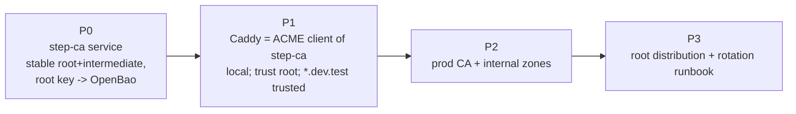
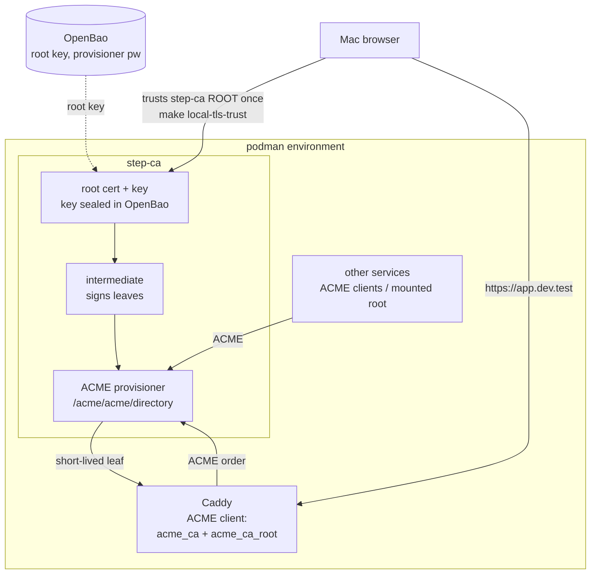

# Internal CA Deployment Plan — step-ca Platform CA

> **Location:** `plan/development/INTERNAL-CA-DEPLOYMENT.md`
> **Date:** 2026-06-13 · **Status:** PROPOSED (optional upgrade) · **Owner:** uhstray-io
>
> **Standing decision update (2026-06-13):** this is the **internal** CA (for `*.dev.test` / internal zones), distinct from the **public** CA product (Boulder — `BOULDER-CA-DEPLOYMENT.md`). It is an *optional robustness upgrade*: `make local-tls-trust` (trusting Caddy's own root) **already fixes the cert warning today**. Adopt step-ca only if the stable-shared-root benefits are wanted. **Two review corrections to fold in before any build** (below).
>
> **Review corrections (must apply before build):**
> 1. **OpenBao is NOT a step-ca keystore.** step-ca holds its root+intermediate keys in its volume, encrypted at rest; the realistic OpenBao integration is the **decryption password + provisioner secrets** (injected at deploy via `manage-secrets.yml`), not the key bytes. Treat every "root key sealed in OpenBao" phrase below as "encrypted keys in the step-ca volume; password/secrets in OpenBao."
> 2. **ACME challenge = `tls-alpn-01`, not a spike.** In-network `http-01` is unviable (containers don't resolve `*.dev.test`); wildcards need `dns-01` (DNS plan Phase 2, unbuilt). Use per-host `tls-alpn-01` (step-ca → Caddy on 443, same container, no DNS round-trip); wildcard support is out of scope until DNS Phase 2. Also: the step-ca root cert must be rendered into Caddy's deploy dir (via `manage-secrets`, same-path shared mount) before Caddy starts — a deploy-ordering dependency, not a runtime one.
> **Context:** Today Caddy is its own throwaway CA (`local_certs`) — the root is ephemeral (regenerated on a `caddy-data` wipe) and per-instance (local ≠ prod, dev ≠ dev), so every machine/redeploy re-trusts a *different* root. This plan replaces that with a **dedicated internal CA — `step-ca` (Smallstep)** — as a composable platform service: one **stable** root, issued to Caddy and any service via ACME, trusted **once** per client and **reusable across local-dev, prod, and every developer**.
>
> **For agentic workers:** Execute phase-by-phase; every phase ends at a validation gate. The root certificate is non-secret (distributable); only the root **key** is a secret (OpenBao). Real domains/IPs stay in site-config.

**Goal:** A single, stable, platform-managed internal CA whose root is trusted once per client and which issues short-lived leaf certs to every internal service (Caddy first) via ACME — so `https://*.dev.test` (local) and `https://*.<internal-zone>` (prod) are trusted with no per-instance, per-machine churn.

**Architecture:** `step-ca` runs as a composable service holding a stable root + intermediate (root key sealed in OpenBao, online intermediate signs leaves). Caddy becomes an **ACME client** of step-ca (`acme_ca` + `acme_ca_root`) instead of self-signing. Clients trust the **step-ca root** once (the existing `make local-tls-trust` tooling adapts to extract+trust *that* root). The same CA serves prod.

**Tech stack:** step-ca (Smallstep) container, ACME provisioner, Caddy ACME client, OpenBao (root key + provisioner secrets), composable Ansible tasks, the existing `local-dev.sh` trust tooling.

---

## The unavoidable truth this plan does NOT change

**Browser trust is client-side.** A CA running in podman still needs its **root in the client's trust store** for a browser on that machine to trust the cert — there is no way for a container to inject trust into the Mac keychain. So a one-time per-client "trust the root" step (`make local-tls-trust`) **remains**. What changes is *what* you trust: a **stable, shared, platform root** instead of Caddy's per-instance throwaway. (The only way to drop the client-trust step entirely is publicly-trusted ACME certs — impossible for LAN-only `*.dev.test`/internal zones.) Container-to-container TLS *can* skip the keychain by mounting the root into each container's `ca-certificates` — handled here for services that talk to step-ca.

## Target outcome

When Phase 2's gate passes:

- **One root, every environment.** The same step-ca root certificate is trusted on the laptop, on prod hosts, and by every developer — trust it once, it covers `*.dev.test` (local) and the internal zones (prod). No re-trust on Caddy redeploy / volume wipe.
- **Caddy (and any service) gets certs via ACME from step-ca** — short-lived leaves, auto-renewed, no manual cert handling.
- **The root is durable + managed.** Root key sealed in OpenBao (offline-ish; intermediate signs day-to-day), rotation is a documented procedure, the root cert is a committed/distributable artifact (non-secret).
- **`make local-tls-trust` still one command** — now extracting + trusting the *step-ca* root (stable), so it's truly install-once.
- **Prod internal TLS solved without public exposure** — the DNS plan's internal-zone TLS gap is filled by this CA (the alternative to Cloudflare DNS-01 for non-public names).



## 1. Problem

Caddy's `local_certs` is convenient but its CA is (a) **ephemeral** — wiped with `caddy-data`, forcing a re-trust; (b) **per-instance** — local, prod, and each developer have *different* roots, so trust doesn't transfer; (c) **invisible** — not a managed platform artifact with a rotation story. The result: the cert-trust step is a recurring, per-machine, per-redeploy chore rather than a one-time platform fact. There is no internal CA that multiple environments and people share.

## 2. Decision criteria (alternatives considered)

| Option | Verdict | Why |
|---|---|---|
| **step-ca (Smallstep)** | **CHOSEN** — owner-directed | Purpose-built private CA + **ACME server**; Caddy is a first-class ACME client; root key sealable in OpenBao; short-lived leaves + auto-renew; one stable root reusable local+prod+multi-dev; self-hosted, Apache-2.0. The "CA inside the podman environment, robust + reusable" the owner asked for. |
| Caddy `local_certs` (current) | Superseded | Simple, zero extra service — but ephemeral + per-instance + unmanaged (§1). Fine as the *fallback* if step-ca is down; not the platform answer. |
| mkcert | Rejected | Great for a single dev laptop, but it's a *local* tool — no shared/prod root, no ACME, no central management. Doesn't scale to a platform CA. |
| Public ACME (Let's Encrypt, DNS-01) | Complementary, not this | Only for **publicly-resolvable** names (the prod public storefront/erp). Can't issue for LAN-only `*.dev.test`/internal zones — which is exactly what an internal CA is for. The two coexist: public ACME for public names, step-ca for internal. |
| HashiCorp Vault PKI / OpenBao PKI | Viable alt, deferred | OpenBao *can* be a CA (PKI secrets engine) — attractive since OpenBao is already core. But it lacks a built-in ACME server as turnkey as step-ca's (ACME support is newer/less mature), and step-ca is purpose-built. **Recorded as the strongest alternative** — revisit if we'd rather not run a second CA component. |

**Decision:** step-ca as a dedicated platform CA + ACME server; Caddy (and future services) are ACME clients; OpenBao holds the root key. (OpenBao-PKI is the fallback if we later consolidate.)

## 3. Design principles
1. **One root, trusted once, everywhere.** The platform has a single internal root; trusting it is a one-time per-client fact, not a per-deploy chore.
2. **Root key is the only secret; the root cert is public.** Seal the root *key* in OpenBao; the root *certificate* is a distributable artifact (committed/published for clients to trust).
3. **Issue via ACME, short-lived + auto-renewed.** No manual cert files; Caddy and services renew automatically. Leaves are short-lived; compromise window is small.
4. **Same CA, every environment.** Local and prod use the same step-ca deployment pattern + (ideally) the same root, so trust and tooling transfer.
5. **Degrade gracefully.** If step-ca is unavailable, a service may fall back to Caddy `local_certs` (untrusted, with a warning) — TLS never *fails*, it just isn't trusted until step-ca is back.
6. **Client trust stays a make target.** `make local-tls-trust` carries over — now trusting the step-ca root; still idempotent, fingerprint-based, reversible.

## 4. Architecture



**Caddy ACME wiring:** the local Caddy switches from `local_certs` to:
```
{
  acme_ca https://step-ca:9000/acme/acme/directory
  acme_ca_root /etc/caddy/step-ca-root.crt   # so Caddy trusts step-ca's own TLS
}
```
Caddy then orders `*.dev.test` leaves from step-ca via ACME. The **ACME challenge** is the key wrinkle (§7): within the podman network, step-ca can reach Caddy for `http-01`/`tls-alpn-01`; for wildcard or awkward names, a `dns-01` against hickory (ties to `DNS-SERVER-DEPLOYMENT.md`) or per-host `http-01` is used. step-ca can also be configured to accept ACME from trusted in-network clients with a lightweight challenge.

## 5. Implementation phases

### Phase 0 — step-ca service (composable, stable root)
- [ ] `platform/services/step-ca/deployment/`: `compose.yml` (smallstep/step-ca, pinned; persistent `step-ca-data` volume), `compose.local.yml` (caps, label=disable, `local-dev` network), `deploy.sh` (container lifecycle only), `templates/` (ca.json provisioner config), `context/architecture.md`
- [ ] First-run init → root + intermediate; **seal the root key in OpenBao** (`secret/services/step-ca`), persist intermediate + config in the volume; subsequent deploys reuse (idempotent — never regenerate the root)
- [ ] ACME provisioner enabled; expose the directory endpoint on the `local-dev` network
- [ ] `deploy-step-ca.yml` composable (place-monorepo → manage-secrets → render ca.json → deploy.sh → verify `/health` + the ACME directory)
- [ ] Wire local: `templates-local.yml` "Deploy step-ca (Local)", `step_ca_svc` inventory group, bootstrap `_inv_ini`; root cert exported for trust
- [ ] BATS

**Gate 0:** step-ca healthy via local Semaphore; ACME directory reachable in-network; root key in OpenBao; root cert exported; re-deploy reuses the same root (idempotent).

### Phase 1 — Caddy as ACME client + trust the root (local)
- [ ] Caddy local profile: replace `local_certs` with `acme_ca` (step-ca directory) + `acme_ca_root` (step-ca root); fallback-to-`local_certs` documented if step-ca down
- [ ] Resolve the ACME challenge mechanism (http-01 in-network, or dns-01 via hickory) — verified end to end
- [ ] Adapt `make local-tls-trust`: extract the **step-ca** root (from the service / OpenBao) instead of Caddy's self-signed root; same idempotent, fingerprint-based install
- [ ] Validate: `https://netbox.dev.test` / `semaphore.dev.test` / `openbao.dev.test` trusted by a step-ca-issued leaf, root trusted once; `make local-clean` + redeploy Caddy keeps the SAME trusted root (the win over `local_certs`)

**Gate 1:** all `*.dev.test` served by step-ca-issued certs, trusted after one `make local-tls-trust`; Caddy redeploy/volume-wipe does **not** require re-trust (root persists in step-ca).

### Phase 2 — Prod CA + internal zones
- [ ] step-ca deployed in prod (own VM/secrets); issues for the internal zones (`<internal-zone>`); ties into `DNS-SERVER-DEPLOYMENT.md` (internal-ACME path = step-ca, the alternative to Cloudflare DNS-01 for non-public names)
- [ ] Decide root scope: **same root** local+prod (max reuse) vs separate roots per environment (blast-radius isolation) — record the call
- [ ] Public-facing names keep public ACME; internal names use step-ca

**Gate 2:** a prod internal service is served by a step-ca leaf, trusted by managed clients; public names unaffected.

### Phase 3 — Root distribution + rotation runbook
- [ ] Distribute the root cert to clients/devices (the non-secret artifact): committed path / MDM / docs
- [ ] Rotation runbook: intermediate rotation (routine), root rotation (rare, planned, dual-trust window); ties to `CREDENTIAL-LIFECYCLE-PLAN.md`

**Gate 3:** root distribution documented; rotation rehearsed (at least intermediate).

## 6. Security considerations
- **Root key is the crown jewel** — sealed in OpenBao, not on disk in the clear; the online intermediate does day-to-day signing so the root key is used rarely. Compromise of the intermediate ≠ compromise of the root.
- **The root cert is public** — distributing it is fine; never distribute the key.
- **Trust scope** — trusting the root means clients trust *any* cert step-ca issues; step-ca's provisioners/policies bound what it will issue (name constraints to the internal zones). Add name constraints so the internal CA can't mint certs for arbitrary public domains.
- **Short-lived leaves** — small compromise window; auto-renew via ACME.
- **Local fakes** — local step-ca root/keys are local-only (`LOCAL_FAKE_`-tier); never the prod root. Same-root-local+prod (if chosen in P2) is a deliberate trade-off — otherwise keep them separate.
- **Caddy↔step-ca TLS** — Caddy trusts step-ca via `acme_ca_root`, not blind-skip; step-ca's ACME endpoint isn't exposed beyond the internal network.

## 7. Open decisions & risks
| Item | Status | Resolution |
|---|---|---|
| ACME challenge type (http-01 vs dns-01 vs in-network) | **P1 spike** | Test http-01 in-network first (step-ca→Caddy reachable on `local-dev`); fall back to dns-01 via hickory for wildcards (ties DNS plan) |
| Same root local+prod vs separate | P2 | Reuse maximizes "trust once everywhere"; separate isolates blast radius — owner call at P2 |
| step-ca vs OpenBao-PKI | Chosen step-ca; OpenBao-PKI noted | Revisit only if consolidating CA into OpenBao later (avoid a 2nd CA component) |
| Root key in OpenBao: seal/unseal vs file | P0 | Prefer OpenBao-stored root key; if step-ca can't load a key from OpenBao directly, store there + inject at init, persist intermediate online |
| Relationship to `LOCAL-DEV-TLS-TRUST.md` | This supersedes the *source* | The trust tooling carries over (extract+trust a root); the root is now step-ca's, not Caddy's. Update that plan to point here. |
| Image pin | P0 | Pin a step-ca release; verify ACME provisioner config across versions |

## 8. References
1. *(owner)* Decision (2026-06-13): adopt a step-ca platform CA over Caddy's per-instance internal CA, for robustness + reuse; build it before Authentik.
2. *(repo)* `plan/development/LOCAL-DEV-TLS-TRUST.md` — the Caddy-root-trust approach this supersedes (tooling reused); decision table already listed step-ca as the heavier/prod option now promoted.
3. *(repo)* `plan/development/DNS-SERVER-DEPLOYMENT.md` §2 — internal-zone ACME options; step-ca is option (c), now the chosen internal-CA mechanism.
4. *(repo)* `platform/services/caddy/deployment/` — Caddy local profile (`local_certs` today → `acme_ca`/`acme_ca_root`); the `make local-tls-trust` tooling that adapts.
5. *(repo)* `CLAUDE.md` — OpenBao as source of truth (root key); "config/policy as code"; "Foundational Over One-Shot" (a reusable platform CA over a per-machine chore).
6. *(repo)* `plan/development/CREDENTIAL-LIFECYCLE-PLAN.md` — rotation lifecycle the CA's keys join.
7. *(repo)* `plan/development/AUTH-SSO-DEPLOYMENT.md` — Authentik (built after this) benefits from trusted TLS issued by this CA.

## 9. Revision history
| Date | Change |
|---|---|
| 2026-06-13 | Initial plan: step-ca chosen as the platform internal CA (owner-directed; decision criteria + rejected alternatives incl OpenBao-PKI); architecture (Caddy ACME client, root key in OpenBao, one stable reusable root); the client-trust-is-unavoidable nuance stated; phases local→prod→rotation; supersedes the Caddy-root *source* in LOCAL-DEV-TLS-TRUST (trust tooling reused); ties to DNS internal-ACME + Authentik |
