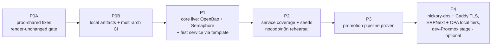
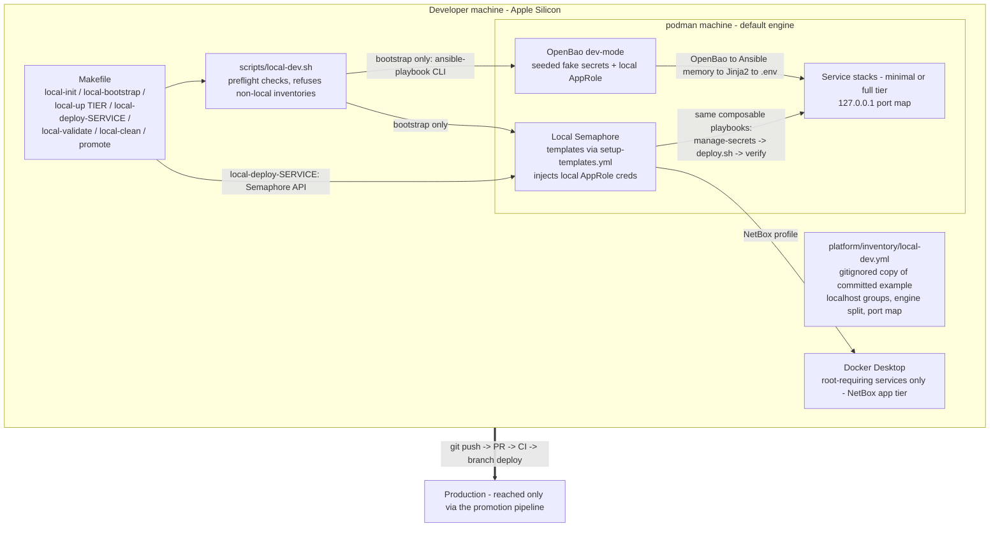
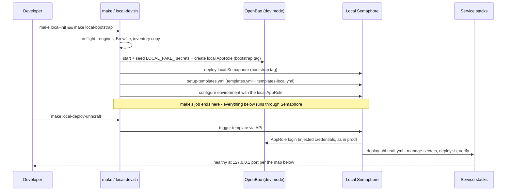
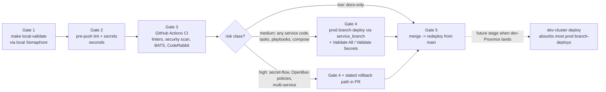

# Local Dev Deployment + Promotion Pipeline Implementation Plan

> **Location:** `plan/development/LOCAL-DEV-DEPLOYMENT.md`
> **Date:** 2026-06-12 · **Status:** ACTIVE (Phases 0A–1 in execution on `feat/local-dev-phase0`) · **Owner:** uhstray-io
> **Context:** A local development instance of agent-cloud on developer machines (Apple Silicon macOS; podman machine default, Docker Desktop where root is required), driven by a **local Semaphore** so the laptop mirrors production's entire control plane, plus a promotion pipeline that carries locally-validated changes to production.
>
> **For agentic workers:** Execute phase-by-phase with `superpowers:executing-plans` or `superpowers:subagent-driven-development`. Every phase ends at a validation gate — do not start a phase until the prior gate passes.

**Goal:** One command takes a fresh clone to a running local agent-cloud stack — OpenBao, Semaphore, and services deployed by the same templates and playbooks as production — and a defined gate sequence promotes validated changes from laptop to prod.

**Architecture:** Two-stage paradigm — **make bootstraps, Semaphore operates**. The Makefile provisions initial resources only (engines, pinned deps, inventory, dev-mode OpenBao, local Semaphore, registered templates, local AppRole) — exactly what prod itself bootstraps outside Semaphore. From that point **every platform stands up through local Semaphore templates running the unchanged Ansible playbooks**, with credentials injected just like prod. Containers run under podman machine (Docker Desktop only for root-requiring services — today: NetBox app tier); each service carries a `compose.local.yml` slim overlay (resource caps, trimmed workers/optional sidecars, named volumes, loopback ports) so the stack fits laptop budgets. Owned GHCR images build multi-arch (arm64+amd64) in CI. Promotion: local validate → pre-push lint/secrets → CI → risk-classed prod branch-deploy → merge.

**Tech stack:** podman machine + podman-compose (default), Docker Desktop (root-requiring services), Semaphore (local instance), OpenBao (dev mode), Ansible composable tasks unchanged, make + bash wrapper, existing BATS/pytest/CI suites.

---

## Target outcome

When Phase 3's gate passes:

- **Fresh clone to running platform in one command — make bootstraps, Semaphore operates.** `make local-init && make local-bootstrap` provisions the initial resources; everything after is `make local-deploy-<service>` triggering local Semaphore templates. Cold minimal tier in under 10 minutes (pulls included), warm restart under 3.
- **Slim by default.** Every locally-deployable service ships a `compose.local.yml` overlay — memory/CPU caps, trimmed worker counts and optional sidecars, alpine-class images where prod already uses them — with a measured budget per service: minimal tier ≤4 GB RAM, full tier ≤14 GB (fits a 16 GB machine).
- **The laptop runs production's control plane, not a substitute.** Same playbooks, same `manage-secrets.yml` flow, same templates-as-code, same credential injection (local AppRole) — differences confined to inventory vars, one prerequisites task, and fake secret values. Multi-dev ready: pinned tool versions, preflight diagnostics, self-serve docs.
- **Critical Rule #1 becomes code.** Deploy playbooks refuse to run unless a Semaphore environment is detected (prod or local) or the play is tagged bootstrap — laptop-to-prod accidents are structurally impossible, not policy-discouraged.
- **No real values on the laptop.** Dev-mode OpenBao holds generated fakes seeded by the bootstrap playbook; the committed inventory is localhost-only and publishable.
- **Promotion is a pipeline.** Five gates (§8) with stricter-tier risk classes: any service code change proves itself on a prod branch-deploy until the local stack earns trust.
- **The held NocoDB/n8n migration gets rehearsed.** Local greenfield composable deploys (fresh instances — no stateful secrets to lose) exercise the migration's playbooks, unblocking the prod cutover.
- **The dev Proxmox cluster slots in later.** When `DEV-PROXMOX-CLUSTER-PLAN.md` executes, its cluster becomes a promotion stage; nothing here depends on it.

## 1. Problem

All development today validates either in CI (static only) or directly against production VMs via branch deploys — a test-in-prod mechanism with no inner loop. The playbooks assume Linux targets with `apt`/`become`, Semaphore-injected credentials, and `/home/<user>` paths; nothing defines which subset of the 15 services constitutes a workable development stack; and owned images ship amd64-only while developer machines are arm64.

## 2. Source context — the three-agent panel

This plan synthesizes a structured panel [14]: **architecture**, **automation**, and **developer-experience** agents independently reviewed agent-cloud (+ site-config structure), then cross-challenged each other's findings against the repo. Two panel recommendations were subsequently **overruled by the owner** during plan review (engine default, local Semaphore) — recorded in §4 with rationale. Bracketed `[n]` markers here and throughout resolve in §13 — References. Panel outcomes the plan rests on:

| Panel outcome | Type | Consequence |
|---|---|---|
| `tasks/sparse-checkout.yml` / `tasks/setup-runtime-dir.yml` documented in `AUTOMATION-COMPOSABILITY.md` but **absent** from `platform/playbooks/tasks/` [2][10] | Gap (high) | P0A de-references (implement on demand) |
| `tasks/install-podman-compose.yml` hardcodes `apt` + `become`; paths assume `/home/{{ ansible_user }}` [9] | Gap (high) | OS-conditional prerequisites + optional path vars, Linux defaults unchanged |
| "Linux VM impersonating a prod VM = 100% playbook parity" — debunked: Semaphore env, apt/become, paths break regardless of SSH topology [9][14] | Challenge (high) | Topology = localhost targeting with local-mode vars; no SSH theater |
| NocoDB/n8n migration HELD for **live** stateful secrets; local greenfield has none [8] | Insight | Local dev is the migration's rehearsal environment (P2) |
| Full 13-service stack ≈ 20–30 containers, 15–25 min bootstrap [14] | Challenge (high) | Three-tier service model; minimal tier is the daily path |
| NetBox orb-agent needs `--privileged`/`CAP_NET_RAW` + a real network to discover [3] | Finding | NetBox app-only locally (Docker Desktop); discovery stays prod-only |
| Prod branch-deploy is test-in-prod [4] | Challenge (med) | Risk-classed promotion (§8); dev-Proxmox absorbs this later |
| *(unexamined by panel)* owned GHCR images are amd64-only; laptops are arm64 [16] | Review gap | Multi-arch CI builds (P0B) |

The plan instantiates the platform's existing doctrine rather than inventing one: the Critical Deployment Rules and secret flow come from the root conventions [1], the composable pattern it reuses from [2], the engine constraints from [3], the Gate 4 mechanism from [4], the service-tier framing from [5], the operational boundaries it amends from [6], the scope split with the dev cluster from [7], and the plan-document conventions from [13]. The artifacts it touches are the real ones the panel verified: the task library [9][10], the shared bash library [11], and the templates-as-code apply mechanism [12].

## 3. Design principles

1. **One codebase, two targets.** Production playbooks are never forked; local behavior is selected by inventory vars and one prerequisites task. Drift between a "local copy" and prod automation was the panel's #1 risk.
2. **The control plane is part of parity.** Secrets flow, compose files, deploy scripts, playbooks, *and the Semaphore template layer* all run locally. What doesn't: TLS/DNS, multi-VM networking, SSH hardening, real data — each covered by a later promotion gate (§7).
3. **No real values on the laptop.** Local OpenBao holds generated fakes; the committed inventory is localhost-only; nothing from site-config is needed.
4. **Rules are code.** Rule #1 is enforced by an assertion task, the wrapper refuses non-local inventories, and the bootstrap playbook refuses non-local OpenBao addresses.
5. **Each promotion gate is cheaper than the failure it prevents.** Seconds for lint, minutes for local validate, CI before review, prod branch-deploy where the risk class demands it.
6. **Make bootstraps, Semaphore operates.** The Makefile's job ends when Semaphore is configured; if a step can be a playbook behind a local template (deploys, validation, data seeding), it must be — wrapper-side logic is bootstrap-only by definition.
7. **Slim by default locally.** Footprint is minimized per service via `compose.local.yml` overlays (image variants, worker counts, sidecar trims, resource caps) — never by forking base compose files. The parity cost is explicit: trimmed topology is a §7 right-column item, covered at the branch-deploy gate.

## 4. Decision criteria (alternatives considered)

| Decision | Chosen | Alternatives — and why they lost |
|---|---|---|
| Local topology | **Containers in the engine's Linux VM; playbooks target `localhost` (`ansible_connection: local`) with local-mode vars** | SSH-into-a-VM "prod impersonation" — parity claim failed challenge (env/apt/paths break identically), adds a hop for nothing; waiting for the dev Proxmox cluster — different purpose, not a laptop inner loop |
| Container engine | **podman machine default; Docker Desktop only for root-requiring services (today: NetBox app tier)** — prod's exact split [3] | Docker-Desktop-default (panel 2-of-3 pick) — **overruled by owner**: platform identity is rootless/FOSS podman, and developing on prod's engine catches podman-compose quirks before prod does; both-engines-always — VM resource thrash |
| Image architecture | **Owned GHCR images (uhhcraft, wisbot, future erpnext/llm-gate) build multi-arch (arm64+amd64) in CI** [16] | Emulation-only — slow, flaky for DB containers, undermines the bootstrap gate; build-from-source locally — minutes per rebuild, diverges from the pull-based prod path (kept as a per-service dev override, not the default) |
| Orchestrator locally | **Local Semaphore in the core tier**: bootstrap CLI-deploys OpenBao + Semaphore (exactly what prod bootstraps outside Semaphore), `setup-templates.yml` registers templates locally, all further deploys run through local Semaphore with local-AppRole credential injection | No local Semaphore + CLI wrapper (panel unanimous) — **overruled by owner**: maximal automation parity wanted; the wrapper survives as the bootstrap/convenience layer, not the deploy path |
| Rule #1 enforcement | **Code: shared assertion task — deploy plays run only under a detected Semaphore environment (prod or local) or a `bootstrap` tag** | Wrapper/doc-only guard — leaves the laptop→prod accident surface open; manual prod deploys were never permitted anyway (ACCESS-BOUNDARIES) |
| Secrets locally | **Dev-mode OpenBao seeded with fakes by `bootstrap-local-dev.yml`; `manage-secrets.yml` unchanged; local Semaphore env carries the local AppRole** | Dummy strings without OpenBao — skips the flow the platform exists to enforce; file-backed default — slower bootstrap (available via `LOCAL_OPENBAO_PERSIST=1`) |
| Inventory | **`platform/inventory/local-dev.yml.example` committed (localhost-only = publishable); `make local-init` copies to a gitignored working file** | Tracking the live file — machine drift in git; home-dir-only — breaks fresh-clone bootstrap |
| Service tiers | **Minimal (OpenBao + Semaphore + target service + backing stores, ~12 containers) / full (pre-merge integration) / excluded (GPU inference, orb-agent discovery; postiz/nextcloud/wikijs optional)** | Whole-stack default — unusable daily (panel withdrew it on challenge) |
| NocoDB/n8n locally | **Greenfield composable deploys — P2 writes the playbooks the migration plan designed; rehearsal un-HELDs the prod migration** | Waiting for prod migration first — inverts the safe order |
| Audience | **Multi-dev from day one**: pinned tool versions (Brewfile), preflight diagnostics in the wrapper, seed-fixture ownership, self-serve docs | Single-dev-now — cheaper, but retrofitting robustness costs more than building it in |
| Promotion risk classes | **Stricter tier**: low = docs-only; medium = any service code or automation/compose change → prod branch-deploy required; high = secret-flow/OpenBao/multi-service → branch-deploy + stated rollback | As-drafted (app code = low) — deferred until the local stack demonstrates local-pass→prod-pass agreement; loosen via §11 revisit |
| macOS adaptation style | **Centralized `tasks/local-prereqs.yml` + optional inventory vars (Linux defaults); named volumes for databases** (10–50× bind-mount I/O penalty) | Scattered OS-conditionals — unreviewable; forked playbooks — drift |
| Local footprint | **Per-service `compose.local.yml` slim overlay** (resource caps, reduced worker counts, trimmed optional sidecars, named volumes, loopback ports), applied by the shared `compose` wrapper in `local_mode`; budgets measured at P2 | Prod-shaped stacks locally — RAM blowout (the panel already killed the whole-stack default); forked slim compose files — drift, the panel's #1 risk |
| Local DNS / hostnames | **hickory-dns container** (official multi-arch image, ~12 MiB) authoritative for the local dev zone (wildcard → `127.0.0.1`), forwarding `.` upstream; macOS `/etc/resolver/<zone>` port-targeted entry; deployed via a local Semaphore template and **shared with the production DNS plan** (`DNS-SERVER-DEPLOYMENT.md`) so local rehearses prod DNS [17] | `/etc/hosts` entries — no wildcards, sudo edit per service; dnsmasq — C codebase, diverges from the production DNS choice; CoreDNS — heavier, another config dialect; mDNS/`.local` names — collide with Bonjour semantics |
| ERPNext locally | **Slim tier via `compose.local.yml`** (single queue worker, MinIO/backup off, ~8 containers) behind the **same** `deploy-erpnext.yml` composable deploy as the VMs — **overrules the prior P4 deferral** (owner, 2026-06-12): a paradigm-fit local version is wanted | dev-VM-only (the original deferral) — no laptop inner loop for ERPNext work; prod-shaped stack locally — RAM blowout |
| OPA locally | **Same composable deploy, port-shifted to `127.0.0.1:8281`** (NocoDB's compose already binds 8181 locally [18]); policies mount from the working-tree copy → `opa test` + live decision queries join the local inner loop | wait-for-prod-first — inverts the safe order everything else in this plan establishes |

## 5. Local architecture

Everything below runs on the laptop; the promotion pipeline (§8) is the only path out. The wrapper bootstraps; local Semaphore deploys.

The handoff at the heart of the paradigm — where make's job ends and Semaphore's begins — is easiest to see as a sequence; everything above the dividing note runs once per machine (or after a VM reset), everything below is the daily loop:

**Port map** (loopback-only, env-var overridable; `docs/LOCAL-DEV.md` is the registry of record): Semaphore keeps 3000 (prod-typical); UhhCraft shifts locally via `${UHHCRAFT_PORT:-3001}`; every service binds `127.0.0.1:<port>`.

**Slim overlays:** in `local_mode` the shared `compose` wrapper appends `-f compose.local.yml` when the file exists; overlays carry only local deltas (caps, worker counts, sidecar trims, ports, named volumes). Base compose files stay untouched — one codebase, two shapes.

### 5.1 Local DNS — hickory-dns

Loopback ports alone give services addresses, not names. A local DNS server gives every local service a stable hostname under one dev zone (e.g. `semaphore.<local-dev-zone>`, `erp.<local-dev-zone>`), which is what the Phase 4 Caddy/TLS profile needs to terminate per-service HTTPS, and what makes cookie/CORS/base-URL behavior match prod patterns. The server is **hickory-dns** — the same engine the production DNS plan (`DNS-SERVER-DEPLOYMENT.md`) deploys, so the local container rehearses prod DNS the way local Semaphore rehearses prod orchestration [17]:

- **Image:** `docker.io/hickorydns/hickory-dns` (official, pinned tag; multi-arch incl. arm64; ~12 MiB Alpine; config at `/etc/named.toml`, zones under `/var/named`).
- **Zones:** one `Primary` zone for the local dev zone, rendered from a Jinja2 zone-file template (RFC 1035 master format — wildcard `*.<local-dev-zone> A 127.0.0.1` plus optional per-service records); a `.` `External`/forward zone sends everything else to an inventory-var upstream. This authoritative + forward split is hickory's first-class, production-grade path (full recursion stays off — experimental upstream).
- **Ports:** `127.0.0.1:5300` → 53/udp+tcp in-container, via env-parameterized base-compose bindings (`DNS_LISTEN`/`DNS_PORT` — compose overlays *append* `ports` entries and can never remove the base one, so port shifts are env-driven, the NocoDB/UhhCraft pattern). Host :53 stays untouched — it's contended territory on developer Macs (Internet Sharing, VPN clients, Docker Desktop) and 5300 keeps the whole flow conflict-free.
- **macOS resolution:** `make local-init` offers to write `/etc/resolver/<local-dev-zone>` (`nameserver 127.0.0.1` + `port 5300`) — macOS's native split-DNS hook and the only sudo step in the whole local story; skippable (fall back to `dig @127.0.0.1 -p 5300`).
- **Paradigm fit:** make does **not** bootstrap DNS — the control plane never depends on names. It deploys like any service: `make local-deploy-dns` → "Deploy DNS (Local)" template in `templates-local.yml` → composable playbook (zone template → container → `dig` verify).
- **Zone value hygiene:** the real dev zone (a `<parent-domain>` subdomain) lives in the gitignored inventory working copy/site-config; the committed example carries a placeholder, per the no-real-domains rule. The laptop is the **only** authority for this zone — prod DNS does not serve it (`DNS-SERVER-DEPLOYMENT.md` §3).

**Reference machine & VM allocations:** the current dev machine (Apple Silicon 18-core / 48 GB RAM / ~580 GB free disk, measured [15]) hosts: podman machine sized **6 CPUs / 16 GB RAM / 100 GB disk** (runs minimal *and* full tier within the §10 budgets) and Docker Desktop at **2 CPUs / 4 GB** (started only for the NetBox profile). Worst case — both VMs + full tier — uses ≤20 GB of 48, leaving >50% headroom for macOS and tooling. The ≤4 GB / ≤14 GB tier budgets remain the portable floor so 16 GB-machine contributors are never excluded (multi-dev decision, §4).

## 6. Implementation phases

### Phase 0A — Prod-shared fixes (own PR; render-unchanged gate)

- [x] De-reference `sparse-checkout.yml`/`setup-runtime-dir.yml` from `AUTOMATION-COMPOSABILITY.md` (implement-on-demand later; nothing uses them today)
- [x] `tasks/install-podman-compose.yml`: gate `apt`/`become` on `ansible_os_family`; add brew path (Linux behavior byte-identical)
- [x] Path vars `local_services_dir`/`local_monorepo_dir` with `/home/{{ ansible_user }}/...` defaults in path-hardcoding playbooks *(execution note: the eager-default gotcha — `default('/home/' ~ ansible_user)` errors when `ansible_user` is undefined even if the left side is set, because Jinja evaluates filter arguments eagerly; local inventories must define `ansible_user`)*
- [ ] `tasks/assert-orchestrated.yml` — shared pre-task: fail unless a Semaphore-injected environment is detected (e.g., `BAO_ROLE_ID`/`SEMAPHORE_*` — exact marker TBD) or the play is `bootstrap-local-dev.yml` running under its `bootstrap` tag (exemption scoped to that playbook by name — the tag alone is not sufficient); wire into deploy playbooks. **Blocking precondition: verify the marker against a real prod Semaphore task before wiring** (§11) *(status 2026-06-12: task file written; UNWIRED pending the marker verification)*
- [ ] Named-volume overrides for database/storage services under `local_mode`
- [x] `platform/lib/common.sh`: `compose` wrapper appends `compose.local.yml` when present and `local_mode` is set — unset/absent = byte-identical behavior (render-unchanged gate covers it) *(also fixed a latent prod bug: preset `CONTAINER_ENGINE` left `COMPOSE_CMD` empty)*

**Gate 0A:** CI green; rendered prod plays byte-identical (diff of `ansible-playbook --check` output against a Linux container with prod-shaped inventory, before vs after); assertion task proven in both directions (passes under Semaphore env, fails bare, passes with bootstrap tag).

### Phase 0B — Local artifacts + multi-arch (own PR; additive only)

- [ ] `tasks/local-prereqs.yml` — OS/engine detection (podman machine running; Docker Desktop only when the target service needs it), brew installs, runtime dirs *(status 2026-06-12: bootstrap's preflight covers the podman-machine check; the standalone task is still to extract)*
- [x] `platform/inventory/local-dev.yml.example` — all local service groups on `localhost`, `ansible_connection: local`, `local_mode: true`, per-group `container_engine` (podman default, `docker` for NetBox), port vars. Working copy is `platform/inventory/local-dev.yml`; its `.gitignore` entry lands in the same PR
- [x] `scripts/local-dev.sh` + `Makefile` (`local-init`, `local-bootstrap`, `local-deploy-<service>` → local Semaphore API, `local-validate`, `local-clean`, `promote`); wrapper refuses non-local inventories and non-local `openbao_addr` *(remaining: `local-up [TIER=…]` meta-target)*
- [x] `platform/playbooks/bootstrap-local-dev.yml` — dev-mode OpenBao up; local AppRole + policy; fake secrets seeded (**`LOCAL_FAKE_` prefix**); local Semaphore deployed (pinned v2.18.12, sqlite — `latest`/bolt both panic); `setup-templates.yml` run against it with `templates-local.yml` merged only under `local_mode`; API token auto-created; environment carries the local AppRole + engine socket (idempotent, re-runnable after VM reset). *(Execution additions beyond the original design: the VM's rootful podman socket is mounted into Semaphore (`label=disable` — SELinux blocks cross-container sockets otherwise) so in-container deploys drive the real engine; the **working tree is bind-mounted and registered as a Semaphore local-path repository** — tasks execute uncommitted changes, the entire point of the inner loop; local-mode plays copy the workspace via tar, never `git clone` from GitHub)*
- [ ] `compose.local.yml` convention documented + first overlay (UhhCraft) *(status 2026-06-12: UhhCraft's port shift landed as env-parameterized base-compose bindings instead — the overlay pattern remains for caps/workers/sidecars)*
- [ ] Multi-arch CI: owned-image workflows publish arm64+amd64 manifests *(status 2026-06-12: blocked on [16] — `ghcr.io/uhstray-io/uhhcraft` is private; access decision needed before the manifest question is even observable)*
- [x] Multi-dev floor: `Brewfile` + pinned tool versions; wrapper preflight prints actionable diagnostics
- [x] Docs: `docs/LOCAL-DEV.md` (bootstrap, port map, engine split, triage) *(remaining: `ACCESS-BOUNDARIES.md` bootstrap-exemption amendment; root `CLAUDE.md` local-dev section)*
- [ ] BATS: wrapper refusal behavior; inventory example validity *(status 2026-06-12: compose-overlay BATS landed; wrapper-guard BATS still to write)*

**Gate 0B:** CI green; `make local-init` produces a valid working inventory on a clean machine; multi-arch manifests verified (`podman manifest inspect` shows both arches).

### Phase 1 — Core live

- [x] `make local-bootstrap` on a clean machine: OpenBao seeded → local Semaphore up → templates registered (45) → its environment carries the local AppRole *(proven: Check Secrets ran through local Semaphore with AppRole injection — 3 `LOCAL_FAKE_` keys PRESENT)*
- [ ] `make local-deploy-uhhcraft` (cleanest composable exemplar) — runs **through the local Semaphore template** *(status 2026-06-12: pipeline proven through Phase 1 + image pulls over the mounted engine socket — postgres/redis/minio pulled; **blocked at the app image: `ghcr.io/uhstray-io/uhhcraft` is private (403)**, see §11/[16])*
- [ ] `make local-validate` — local "Validate All" template, skip-unreachable for undeployed services
- [ ] Idempotency + reset: re-deploy no-ops; `make local-clean` then re-bootstrap recovers *(bootstrap idempotency proven across ≥6 re-runs; clean-path round-trip still to exercise)*

**Gate 1:** fresh clone → healthy core in **<10 min cold / <3 min warm** and **minimal tier within the ≤4 GB RAM target** (measured, recorded in docs); the deploy demonstrably ran via local Semaphore (task visible in its UI/API) with credentials injected from local OpenBao; same playbook SHA as prod; `secrets.*` in rendered `.env` provably from local OpenBao (change a seed → redeploy → value changes).

### Phase 2 — Service coverage, seeds, migration rehearsal

- [ ] **Write** the NocoDB + n8n composable playbooks designed in `nocodb-n8n-composable-migration.md`; deploy greenfield locally via local Semaphore; record findings in that plan (HELD → rehearsed)
- [ ] NetBox app-only profile under Docker Desktop (discovery/orb-agent excluded by inventory var)
- [ ] `platform/seeds/` — per-service demo fixtures (distinct from P0B's credential seeding), applied by `bootstrap-data.yml` **run as a local Semaphore template** ("Bootstrap Data (Local)"); ownership: fixtures live with each service's deployment dir owner
- [ ] **Postiz onboarding, local-first** [18]: today it is compose-only with hardcoded credentials and no playbook — run the full Adding-a-New-Service checklist (deploy.sh, `env.j2` → OpenBao-managed secrets, `deploy-postiz.yml`, Semaphore template), developed and validated against the local stack before it ever touches prod. Local port `127.0.0.1:5001` (`${POSTIZ_PORT:-5000}` pattern — macOS AirPlay Receiver squats `:5000` on default installs)
- [ ] Slim profiles for every covered service: define + measure `compose.local.yml` budgets (table in `docs/LOCAL-DEV.md`: image variant, worker counts, sidecars on/off, mem cap)
- [ ] Full tier (`make local-up TIER=full`); measure and document the resource budget

**Gate 2:** covered services healthy via their existing checks; NocoDB/n8n rehearsal findings recorded; per-service slim budgets documented; full tier measured **≤14 GB** (≥2 GB headroom on a 16 GB machine).

### Phase 3 — Promotion pipeline proven

- [ ] `.pre-commit-config.yaml`: shellcheck, yamllint, ansible-lint, secrets/IP grep (fast checks only) — automates the Mandatory Pre-Push Audit; update root `CLAUDE.md` accordingly
- [ ] `make promote`: `local-validate` → pre-push checks → branch push → PR open (CI takes over); soft local gate (`--force` to override) — CI remains the hard floor
- [ ] Risk-class policy added to `BRANCH-TESTING-WORKFLOW.md` (§8)
- [ ] Triage runbook: prod-branch-deploy failure that local passed — the parity-boundary checklist (§7 right column)

**Gate 3:** one real change ridden end-to-end — local edit → validated via local Semaphore → promoted → CI green → prod branch-deploy (per risk class) → merged → main redeploy — with per-gate evidence in the PR. (Gate 1 already proved the Semaphore mechanics; this gate proves policy and pipeline integration.)

### Phase 4 — Local DNS, TLS, and extended roster

Promoted from "optional extensions" (owner, 2026-06-12): local DNS, a paradigm-fit ERPNext tier, and OPA are now planned work; only the dev-Proxmox stage stays build-on-demand.

- [x] **hickory-dns local** (§5.1): `platform/services/dns/` scaffolding shared with `DNS-SERVER-DEPLOYMENT.md` (compose + named.toml/zone `.j2` + `deploy-dns.yml`), "Deploy DNS (Local)" in `templates-local.yml`, `dns_svc` inventory group, `make local-dns-resolver` for `/etc/resolver`, registry `127.0.0.1:5300`. *Done 2026-06-12 — first fully-working downstream deploy through local Semaphore: image pulled over the mounted socket, zone+config rendered from inventory, hickory healthy, `dig` verifies `*.dev.test → 127.0.0.1` + upstream forwarding, reachable from the Mac (udp+tcp). Forced a general fix — host bind-mounts need a same-path shared deploy dir (`/var/lib/agent-cloud-deploy`) since podman-compose runs in the Semaphore container but the engine resolves mount sources on the VM.*
- [ ] **Caddy local profile** [18]: today Caddy is prod-only (Cloudflare DNS-01 image, ports 80/443, no playbook, and a Caddyfile carrying eight legacy `{$VAR}` site blocks that fail with unset env vars). The local profile therefore needs more than an overlay: a **local Caddyfile variant** (global `local_certs`/internal CA + `import sites/*.caddy` only — no Cloudflare secret on the laptop) swapped in via the overlay's volume override, loopback port binds (env-parameterized in base compose — overlays can't replace `ports`), and **local upstream addressing** (`host.containers.internal:<port>` or container-network names — a Caddy container cannot reach the Mac's `127.0.0.1:<port>` registry entries). Writing `deploy-caddy.yml` + its Semaphore template is part of this item (Caddy has neither today — local-first like Postiz; the prod DNS plan's Phase 2 lists this as a blocking precondition)
- [ ] **ERPNext local tier** (`ERPNEXT-DEPLOYMENT.md` §7): `compose.local.yml` — one queue worker (`long,default,short` covers all queues), MinIO/backup/cross-mirror off, mem caps; frontend at `127.0.0.1:8080`; same `deploy-erpnext.yml` through a local template; `LOCAL_FAKE_` secret set at `secret/services/erpnext`; verify `docker.io/frappe/erpnext` ships arm64 manifests at execution (assumption, §11); budget target ≤3.5 GB measured
- [ ] **OPA local** (`OPA-INTEGRATION-PLAN.md`): once its Phase 0 scaffolding exists, deploy via local template at `127.0.0.1:8281` — which requires its base compose to adopt the env-parameterized binding pattern (`${OPA_LISTEN:-127.0.0.1}:${OPA_PORT:-8181}:8181`, ditto the 8282 diagnostics port; its current draft hardcodes both); policies volume-mount from the working-tree copy, so Rego edits are live-testable; add `opa test platform/services/opa/deployment/policies/` to `local-validate` when the dir exists
- [ ] **o11y** [18]: deployment dir is an empty stub — define the stack in its own plan/PR first; registry pre-reserves `3002` (grafana), `9090` (prometheus), `3100` (loki) so later services don't squat them
- [ ] dev-Proxmox promotion stage when `DEV-PROXMOX-CLUSTER-PLAN.md` executes

**Gate 4:** `dig @127.0.0.1 -p 5300 anything.<local-dev-zone>` answers `127.0.0.1` and macOS resolves it via `/etc/resolver`; ≥2 services served over HTTPS through local Caddy with internal-CA certs; ERPNext local healthy within its measured ≤3.5 GB budget via local Semaphore; an OPA decision query answers locally; every bound port matches the registry of record.

## 7. What local validates — and what it cannot

| Local pass certifies | Local pass says nothing about |
|---|---|
| Playbook/task logic on the real code path | Real credential values/rotation (prod OpenBao) |
| Secret flow end-to-end (OpenBao → AppRole injection → `.env`) | Multi-VM networking, Caddy/TLS/DNS-01, pfSense |
| **Semaphore template wiring** (templates-as-code applied + executed locally; project/inventory IDs differ) | Proxmox provisioning, SSH hardening, discovery pipeline |
| compose validity, staged startup, healthchecks, arm64+amd64 image manifests | Production data shapes and volumes |
| Service bootstrap + app behavior; BATS/pytest (also in CI) | amd64-specific runtime behavior |
| `compose.local.yml` overlay correctness | Prod-shaped topology — full worker counts, untrimmed sidecars, prod resource limits |

This table is the honest contract behind the promotion pipeline: every right-column row is covered at Gate 4 (prod branch-deploy) or a later stage.

## 8. Promotion pipeline

Five gates; Gate 4 is conditional on risk class (stricter tier, ratified 2026-06-12): **low** = docs-only; **medium** = any service code, composable tasks, playbooks, or compose topology; **high** = secret-flow, OpenBao policies, or multi-service changes (adds a stated rollback path in the PR). The dotted dev-Proxmox stage is not required by any gate in this plan.

Boundaries revisit (§11): after a sustained run of local-pass→prod-pass agreement, "medium" may relax to exclude single-service app code.

## 9. Security considerations

- Local OpenBao: generated fakes only; bootstrap refuses non-local `openbao_addr`.
- Rule #1 enforced in code (`assert-orchestrated.yml`); wrapper refuses non-local inventories — laptop→prod accidents are structurally blocked on both paths.
- Committed inventory is localhost-only (publishable by construction); working copies and rendered `.env` files gitignored; existing CI secret/IP gates apply.
- Local Semaphore binds loopback only; its admin credentials are bootstrap-generated fakes; its environment holds only the local AppRole.
- `ACCESS-BOUNDARIES.md` amendment: local bootstrap is the documented exemption; production deploys flow exclusively through (prod) Semaphore — now also asserted at runtime.

## 10. Validation criteria (master)

| Phase | Critical check | Pass |
|---|---|---|
| 0A | Prod-behavior isolation | Rendered prod plays byte-identical; assertion task proven both directions; CI green |
| 0B | Clean-machine readiness | `make local-init` valid on fresh clone; multi-arch manifests verified |
| 1 | Control-plane parity + footprint | Deploy ran via local Semaphore w/ local-AppRole injection; <10 min cold / <3 min warm; minimal tier ≤4 GB RAM; seed-change → `.env` change |
| 2 | Coverage + rehearsal + budgets | NocoDB/n8n greenfield healthy via local Semaphore; findings in migration plan; per-service slim budgets documented; full tier ≤14 GB measured |
| 3 | Pipeline proven | One change end-to-end laptop→prod with per-gate evidence in the PR |

## 11. Open decisions & risks

| Item | Status | Resolution path |
|---|---|---|
| Semaphore-environment detection marker | Verify at P0A | Confirm against a real prod Semaphore task before wiring `assert-orchestrated.yml` |
| Owned-image inventory for multi-arch | P0B start | Audit which GHCR images exist + which build workflows need the manifest change |
| Risk-class boundaries | Ratified (stricter) | Revisit after sustained local-pass→prod-pass agreement; relax medium to exclude app code |
| Local data persistence | Ephemeral default | `LOCAL_OPENBAO_PERSIST=1` + named volumes when multi-day sessions need it |
| ERPNext local tier | Planned (P4, ratified 2026-06-12) | `compose.local.yml` slim tier behind the unchanged `deploy-erpnext.yml`; the dev VM remains the pre-prod stage with real-shaped data |
| `frappe/erpnext` arm64 manifests | Verify at P4 start | `podman manifest inspect docker.io/frappe/erpnext:<pinned>` must show arm64; fallback = local build override or emulation for the app tier only |
| Local dev zone value | Working-copy/site-config only | Committed example ships a placeholder; `local-init` substitutes the real `*.uhstray.io` dev zone from the private side |
| Postiz hardcoded credentials in committed compose [18] | Fix at P2 onboarding | Replace with `${VAR}` references + `env.j2`; until then the file must not be deployed anywhere |
| o11y stack definition | Blocked (stub dir) | Own plan/PR defines grafana/prometheus/loki shape; local profile follows |
| Slim-profile budgets (targets: minimal ≤4 GB; full ≤14 GB on a 16 GB machine) | Targets set, unmeasured | Gates 1–2 measure; per-service `compose.local.yml` budgets defined at P2 |
| `validate-all.yml` skip semantics | Minor — P1 | Skip-unreachable behind `local_mode` |
| Image signing / build attestation for GHCR images | Future hardening | Multi-arch P0B change doesn't add signing; track cosign/SLSA as its own plan when supply-chain work starts |

## 12. Convention compliance map

| Platform rule | How this plan satisfies it |
|---|---|
| All deployments through Semaphore (rule #1) | **Strengthened**: local deploys also run through (local) Semaphore; rule enforced in code via `assert-orchestrated.yml`; bootstrap exemption documented in ACCESS-BOUNDARIES |
| deploy.sh containers-only (rule #2) | Same scripts run locally; no variants |
| Independent workflows (rule #3) | bootstrap, per-service templates, validate, seeds are separate playbooks/templates |
| No intermediary secret files (rule #4) | manage-secrets flow preserved against local OpenBao; fakes only |
| Templates-as-code | `setup-templates.yml` runs against local Semaphore — template changes validated locally before prod |
| Engine policy | podman default / Docker only where root is required — prod's exact split, locally too |
| One codebase / no forks | Inventory-var switching + centralized prereqs; slim profiles are overlays, never forks; Gate 0A render-unchanged check |
| Make bootstraps, Semaphore operates | Wrapper logic is bootstrap-only; platforms, validation, and data seeding all run via local Semaphore templates |
| Pre-Push Audit | Automated via `.pre-commit-config.yaml` (P3); CLAUDE.md updated |
| Plan doc standards | Status header, mermaid-only diagrams, phase gates, validation table, security section, decision criteria with rejected alternatives + owner overrides, revision history |

## 13. References

Tags: *(repo)* agent-cloud file · *(panel)* multi-agent review artifact · *(local)* measurement on the reference machine · *(assumption)* unverified, tracked in §11. Repo citations verified by the panel's repo reads on 2026-06-12; panel-reported line ranges are anchors, not exact pins.

1. *(repo)* `CLAUDE.md` — Critical Deployment Rules #1–#5; secret flow; engine policy; branch workflow.
2. *(repo)* `plan/architecture/AUTOMATION-COMPOSABILITY.md` — the composable pattern reused locally; references the two absent tasks (≈ lines 185–186) that P0A de-references.
3. *(repo)* `plan/architecture/PODMAN-VS-DOCKER-COMPOSE.md` — engine selection; podman-compose 1.0.6 gaps; privileged-container constraints behind the NetBox split.
4. *(repo)* `plan/architecture/BRANCH-TESTING-WORKFLOW.md` — `service_branch` branch-deploy mechanism (Gate 4); gains the risk-class table at P3.
5. *(repo)* `plan/architecture/SERVICE-INTEGRATION-PLAN.md` — service classification informing the three-tier model.
6. *(repo)* `plan/architecture/ACCESS-BOUNDARIES.md` — Semaphore vs SSH boundaries; amended with the bootstrap exemption.
7. *(repo)* `plan/development/DEV-PROXMOX-CLUSTER-PLAN.md` — the dev cluster's own stated scope (infra/multi-VM testing), grounding the complement-not-dependency position.
8. *(repo)* `plan/development/nocodb-n8n-composable-migration.md` — HELD status + stateful-secret rationale that the P2 rehearsal addresses.
9. *(repo)* `platform/playbooks/tasks/install-podman-compose.yml:19-26` — the `apt`/`become` hardcode P0A fixes (panel-verified lines).
10. *(repo)* `platform/playbooks/tasks/` — absence of `sparse-checkout.yml`/`setup-runtime-dir.yml` (13 task files present; panel-verified).
11. *(repo)* `platform/lib/common.sh` — `compose` wrapper + `wait_for_healthy` helpers; P0A's overlay-append touch point.
12. *(repo)* `platform/semaphore/setup-templates.yml` — templates-as-code apply mechanism reused against the local instance.
13. *(repo)* `plan/development/ERPNEXT-DEPLOYMENT.md` — current plan conventions; its dev-VM story originally justified deferring an ERPNext local tier (deferral overruled 2026-06-12 — see §4/§6 Phase 4; the dev VM remains the pre-prod stage with real-shaped data).
14. *(panel)* Workflow `wf_455fca80-37b` (2026-06-12) — three role investigations + cross-challenge round; 6 agents, repo-grounded findings with file evidence.
15. *(local)* Reference-machine measurement, 2026-06-12 — `sysctl`/`df` on the dev machine: Apple Silicon 18-core, 48 GB RAM, ~580 GB free.
16. *(assumption)* Owned GHCR images are amd64-only — inferred from prod-only build targets, not verified against the registry; **the P0B image audit confirms before the CI change** (§11). *Partially resolved 2026-06-12: `ghcr.io/uhstray-io/uhhcraft` is **private** — the local pull fails on auth (403) before architecture is even observable; local access needs a `read:packages` PAT or a local build override.*
17. *(web)* hickory-dns research, accessed 2026-06-12 — github.com/hickory-dns/hickory-dns (v0.26.1; authoritative + forwarding production-grade per maintainers, recursion experimental; TOML config, RFC 1035 zone files, wildcards supported; TSIG/RFC 2136 dynamic updates ≥0.26), hub.docker.com/r/hickorydns/hickory-dns (official multi-arch image incl. arm64, ~12 MiB), memorysafety.org/blog/hickory-update-2025 (ISRG/Prossimo production-readiness status).
18. *(repo)* Service survey, 2026-06-12 — `platform/services/{n8n,nocodb,netbox,caddy,o11y,postiz}`: n8n/nocodb legacy `deploy.sh` path (ports 5678 / 8181+5433); NetBox composable (8000); Caddy prod-only (Cloudflare DNS-01 image, no playbook, no Semaphore template); o11y empty stub; Postiz compose-only with hardcoded credentials, no automation (5000).

## 14. Revision history

| Date | Change |
|---|---|
| 2026-06-12 | Initial plan synthesized from the three-agent panel (architecture / automation / developer-experience with cross-challenge round) |
| 2026-06-12 | Interactive review: owner overruled panel on engine (podman default, Docker only for root-requiring services) and orchestrator (**local Semaphore drives local deploys**; templates-as-code validated locally); multi-arch CI builds added (panel review gap); Rule #1 code-enforced via assert-orchestrated.yml; multi-dev from day one; stricter risk classes ratified; P0 split into 0A (prod-shared, render-unchanged gate) / 0B (additive local artifacts); honesty fixes (BATS is static; cold/warm bootstrap targets); simplification pass |
| 2026-06-12 | Paradigm + footprint update: "make bootstraps, Semaphore operates" promoted to a design principle (Makefile provisions initial resources only; platforms, validation, and seeds run via local Semaphore templates); per-service `compose.local.yml` slim overlays (resource caps, trimmed workers/sidecars) applied by the shared compose wrapper in local_mode, with measured budgets |
| 2026-06-12 | /simplify + consistency pass: risk classes defined in prose (not just the diagram); §7 branch-deploy coverage consolidated to one note; Gate 2 full-tier budget made crisp (≤14 GB) and aligned across Target outcome/§10/§11; `local-up TIER` added to Makefile contract + diagram; local-only Semaphore templates split into `templates-local.yml` so the shared `templates.yml` stays prod-clean (templates-as-code adherence); assert-orchestrated marker verification made an explicit blocking precondition |
| 2026-06-12 | /security-review fixes + sizing: bootstrap exemption scoped to bootstrap-local-dev.yml by name (tag alone insufficient); working-inventory filename + .gitignore entry specified; templates-local.yml fate fixed (committed, applied only under local_mode); fake seeds carry LOCAL_FAKE_ prefix; image-signing tracked as future hardening; reference-machine VM allocations added (48 GB host — both VMs + full tier ≤20 GB) |
| 2026-06-12 | Self-explaining pass: `[n]` citations threaded through §2/§4/§5 with a tagged References section (§13, absorbing the cross-ref list; [16] marked as the one explicit assumption); bootstrap-handoff sequence diagram added to §5 showing where make's job ends and Semaphore's begins |
| 2026-06-12 | Roster + DNS expansion (owner-directed): §5.1 local DNS via hickory-dns (shared engine with the new `DNS-SERVER-DEPLOYMENT.md`); Phase 4 promoted from optional to planned — DNS, Caddy `tls internal` profile, **ERPNext local slim tier** (deferral overruled), **OPA local** (port 8281, working-tree policy mount); Postiz local-first onboarding added to Phase 2; o11y recorded as stub-blocked; service-survey + hickory references ([17][18]); [16] partially resolved (uhhcraft GHCR image is private, found by the first live local deploy) |
| 2026-06-12 | **hickory-dns local shipped + validated end-to-end through local Semaphore** (`platform/services/dns/`, `deploy-dns.yml`, `make local-deploy-dns`/`local-dns-resolver`, BATS): first working downstream deploy. Surfaced + fixed the host-bind-mount limitation of the socket model — a same-path shared deploy dir (`/var/lib/agent-cloud-deploy`) makes `./config` mounts resolve on the VM engine; SELinux needs `label=disable` on bind-mount-reading containers (local overlay only) |
