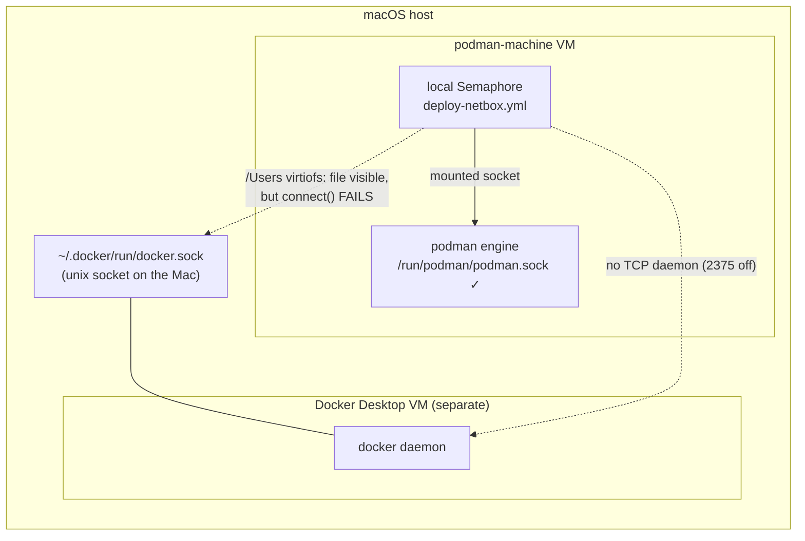

# NetBox Local Engine — Fix Plan

> **Location:** `plan/development/NETBOX-LOCAL-ENGINE.md`
> **Date:** 2026-06-12 · **Status:** PROPOSED · **Owner:** uhstray-io
> **Context:** Local-dev (`LOCAL-DEV-DEPLOYMENT.md`) wants NetBox runnable on a developer laptop. NetBox is the platform's one Docker-required service. This plan resolves a hard blocker: the local Semaphore control plane (which runs in the **podman-machine VM**) cannot drive **Docker Desktop's** daemon, and lays out the robust fix.

**Goal:** Run a NetBox **app-tier** profile locally through the same local Semaphore control plane as every other service — without depending on Docker Desktop, and without forking NetBox's deployment.

**TL;DR recommendation:** Run NetBox's app tier under **podman** via the existing mounted-socket model (Option A). NetBox's deploy library already honors `CONTAINER_ENGINE`; the real work is podman-compatible startup ordering, a podman image build, and excluding the discovery/orb-agent tier. This keeps **one local engine** and sidesteps the cross-VM problem entirely.

---

## 1. The blocker (debugged)

`make local-deploy-netbox` would run `deploy-netbox.yml` **inside the local Semaphore container**, which lives in the podman-machine VM and drives that VM's podman engine over a mounted socket (`CONTAINER_HOST=unix:///run/podman/podman.sock`). NetBox, today, is a Docker service. Docker Desktop runs in its **own, separate** VM. The Semaphore container cannot reach it:

**Evidence (2026-06-12):**
- Docker daemon socket: `unix:///Users/stray/.docker/run/docker.sock`.
- That path **is** visible in the podman VM (under the `/Users` virtiofs share) — but virtiofs shares the *file node*, not the live socket endpoint. The listening daemon is in a different VM/kernel, so `connect()` from the podman VM fails. A unix socket is not usable across a file share.
- Docker Desktop exposes **no TCP daemon** (`tcp://localhost:2375` is off by default, and enabling it is insecure + manual).
- Net: the podman-VM Semaphore has exactly one engine it can drive — podman.

## 2. Why NetBox was "Docker-required" — and what actually applies locally

From the root conventions [1] and `PODMAN-VS-DOCKER-COMPOSE.md` [2], NetBox uses Docker for four reasons. Only some matter for a **local app-tier** profile:

| Reason | Applies to local app-tier? |
|---|---|
| Privileged orb-agent (`--privileged`, `CAP_NET_RAW`, host net) for discovery | **No** — discovery/orb-agent are excluded locally (no real network to scan) [3] |
| Bind-mounted secrets (Diode client secret at `/run/secrets/...`) | **No** for app-tier; podman bind-mounts work regardless |
| `depends_on: condition: service_healthy` staged startup (podman-compose 1.0.6 ignored these) | **Partially** — needs handling under podman (§4) |
| `lib/common.sh` "hardcoded to Docker" | **No** — it already reads `CONTAINER_ENGINE` (`platform/services/netbox/deployment/lib/common.sh:40-43`); set it to `podman` |

So the only genuine app-tier obstacle is **startup ordering** when `depends_on` health conditions are ignored — and NetBox's own `deploy.sh`/`lib` already stage startup with explicit `wait_for_healthy`/`wait_for_started` helpers, so the compose conditions may not be load-bearing. This must be verified, not assumed.

## 3. Decision criteria (alternatives considered)

| Option | Verdict | Why |
|---|---|---|
| **A. Run app-tier under podman** via the existing socket model | **Chosen** | One local engine, zero cross-VM problem, reuses the whole local-dev mechanism (shared deploy dir, label=disable, manage-secrets). NetBox lib already honors `CONTAINER_ENGINE`. Cost: verify podman startup ordering + a podman image build. |
| B. Bridge Semaphore → Docker Desktop over TCP (`host.containers.internal:2375`) | Rejected | Requires enabling Docker Desktop's **insecure, unauthenticated** TCP daemon (manual, security-hostile), and splits the engine across two VMs — fragile and un-prod-like. |
| C. Run `deploy-netbox.yml` on the Mac host (outside Semaphore) against Docker Desktop | Rejected | Breaks "make bootstraps, Semaphore operates" (the local-dev paradigm and Critical Rule #1-as-code). A full service deploy is not a host-bootstrap exception. |
| D. Socket proxy (socat TCP↔unix into the Docker VM) | Rejected | The Docker socket lives in Docker Desktop's VM; nothing in the podman VM can reach the daemon to proxy it. Same wall as B without the (bad) TCP option. |
| E. Mount the Docker socket into Semaphore | Rejected | Confirmed non-functional — unix socket is dead across the virtiofs share (§1). |

## 4. Implementation plan (Option A)

Mirrors the DNS/Caddy local conversions — composable, one codebase, podman via the mounted socket.

- [ ] **Engine var**: `netbox_svc` inventory group sets `container_engine=podman` (NetBox `lib/common.sh` already branches on `CONTAINER_ENGINE`). Confirm `compose()` resolves to `podman compose`/`podman-compose` and the project flags (`--project-name netbox -f docker-compose.yml`) work under podman.
- [ ] **App-tier-only selection**: bring up only `netbox`, `netbox-worker`, `postgres`, `redis`, `redis-cache` — exclude `ingress-nginx`, `diode-*`, `hydra*`, `diode-redis`. Prefer **compose `profiles:`** (tag the discovery services `profiles: [discovery]` so they're opt-in) over passing explicit service lists — declarative, and keeps prod (which runs everything) unchanged when the profile is enabled. Gate via a `netbox_discovery` inventory var (default off locally, on in prod).
- [ ] **Startup ordering under podman**: verify NetBox's `deploy.sh` staged startup + `wait_for_*` helpers make the `depends_on: condition: service_healthy` conditions non-load-bearing. If podman-compose still races, stage explicitly in deploy.sh (DB+redis first → wait healthy → app), not by forking compose.
- [ ] **Image build under podman**: `netbox:latest-plugins` builds from `Dockerfile-Plugins`. Build it with `podman build` in the deploy (or pre-build step). Pin the base NetBox tag. Confirm the plugins layer builds on arm64 (assumption — verify at execution).
- [ ] **Local plumbing**: reuse `tasks/place-monorepo.yml`; `compose.local.yml` overlay (resource caps; `label=disable` if any host bind-mounts); same-path shared deploy dir; `LOCAL_FAKE_` secrets via `manage-secrets` for the app-tier subset (DB/Redis/superuser only — no Diode/Hydra secrets when discovery is off).
- [ ] **Wire-in**: `netbox_svc` group in `local-dev.yml.example` + bootstrap `_inv_ini`; reuse the existing `deploy-netbox.yml` (it's already composable) — add the discovery-profile gate; port `127.0.0.1:8000`; Caddy route (`netbox.dev.test → netbox:8080` once on a shared network).
- [ ] **Docs/tests**: `docs/LOCAL-DEV.md` registry + the engine note; BATS for the profile gate; plan checkbox.

**Gate:** `make local-deploy-netbox` runs through local Semaphore under podman; the app tier comes up healthy (NetBox UI on `127.0.0.1:8000`); discovery/orb-agent absent; idempotent re-run; the build is arm64-native.

## 5. Risks & open questions

| Item | Risk | Mitigation |
|---|---|---|
| podman-compose `depends_on: condition` support | Startup races if both compose conditions are ignored **and** deploy.sh doesn't fully stage | Verify deploy.sh staging first; if needed, stage in deploy.sh (don't fork compose) |
| `netbox:latest-plugins` arm64 build | Plugins layer may pull amd64-only wheels/deps | Build + test on arm64 at execution; fall back to documented emulation for the build only |
| compose `profiles` under podman-compose | Older podman-compose may not honor `profiles:` | Confirm the installed podman-compose version supports profiles; else gate via explicit service list in deploy.sh (still one codebase) |
| Footprint | ~5 app-tier containers + Postgres/Valkey | Cap via `compose.local.yml`; measure against the §10 tier budget in the local-dev plan |

## 6. Convention compliance

One codebase (profile-gated, no fork), Semaphore-operated, manage-secrets for the subset, podman default — all consistent with `LOCAL-DEV-DEPLOYMENT.md` and the Critical Deployment Rules. The prod NetBox deploy is unchanged (discovery profile on; engine `docker`).

## 7. References

1. *(repo)* `CLAUDE.md` — Container Runtime section ("Docker required for NetBox").
2. *(repo)* `plan/architecture/PODMAN-VS-DOCKER-COMPOSE.md` — engine constraints, podman-compose gaps.
3. *(repo)* `platform/services/netbox/deployment/CLAUDE.md` — orb-agent privileged/discovery requirements; macOS raw-socket limits.
4. *(repo)* `platform/services/netbox/deployment/lib/common.sh:40-71` — `CONTAINER_ENGINE`-aware compose wrapper (already not Docker-hardcoded).
5. *(repo)* `plan/development/LOCAL-DEV-DEPLOYMENT.md` — the local-dev paradigm + the NetBox app-tier item this plan unblocks.
6. *(local)* Reachability debug, 2026-06-12 — docker socket path, virtiofs share visibility, no TCP daemon (§1).

## 8. Revision history

| Date | Change |
|---|---|
| 2026-06-12 | Initial plan: debugged the podman-VM↔Docker-Desktop blocker (unix socket dead over virtiofs; no TCP daemon); chose Option A (NetBox app-tier under podman) with rejected alternatives; implementation phases + risks |
