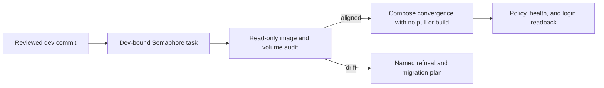

# NetBox Runtime Convergence

**Date:** 2026-09-23  
**Status:** PROPOSED  
**Context:** Production NetBox blocks authoritative IP allocation for the observability receiver. This plan records the measured outage and the review gates for restoring the existing stack through source-controlled automation.

## Problem

Dev-bound, read-only Semaphore task 1152 ran commit `440cfbd53696914ce222b89b23e3b53e93265e99`. The NetBox app, Postgres, and both Redis containers were exited with code 255, `oom=false`, zero restarts, and `policy=no`; their finish times followed the host's 2026-09-19 boot. The login endpoint was unreachable. The committed Compose file now declares `restart: always`, but that declaration has not converged onto these existing containers. The ordinary NetBox deploy pulls images, rebuilds the app image, stops the stack, and synchronizes database passwords, so it is not an unexamined recovery action.

## Design Principles

- Compose remains the authority for container policy. Do not change a live container through an ad-hoc Docker command or API call.
- Run each read or write through a reviewed playbook and a Semaphore template bound to `dev`; verify the exact checkout SHA before mutation.
- Preserve existing named volumes and credentials. OpenBao remains the source of secrets; no credential values enter task output.
- Refuse an image, volume, or data-layout change until a separate migration and rollback plan is reviewed.

## Architecture

The first change extends the existing read-only audit with the exact image references and named-volume identities of the four stopped services. The apply workflow is designed only after those values are read back. It will reuse the committed Compose declaration and the existing Ansible/OpenBao credential path, and will not run `compose down`, pull, or build as part of restart-policy recovery.

## Implementation Phases

1. **Preflight:** merge the audit extension after green checks and one CodeRabbit review; run its Dev template in production. Record live image references, image IDs, and named-volume identities without printing secrets or bind paths. Acceptance: every required container is identified and the report changes no host state.
2. **Convergence design:** compare the report to the reviewed Compose images and volume declarations. If any data-bearing image or mount differs, stop and write a migration/rollback procedure before applying. Acceptance: the apply playbook has a narrow, proven set of unchanged images and named volumes.
3. **Apply:** merge an idempotent playbook and Dev template after the same review gate. Use the normal OpenBao-backed env rendering and Compose to restore backing services before the app, without pulling, building, or deleting volumes. Acceptance: a dry run names every planned change and the apply reaches healthy services without changing a volume identity.
4. **Verify:** read back restart policies, container health, `/login/`, and the NetBox automation-token prerequisite through Semaphore. Acceptance: a second apply is a no-op, then the IPAM workflow can report a free receiver address.

## Validation Criteria

| Check | Pass condition |
| --- | --- |
| Read-only audit | Semaphore reports `changed=0`, the reviewed `dev` SHA, images, and named volumes. |
| Unsafe drift | A mismatched image or volume refuses before a container or secret change. |
| Recovery | Existing named volumes remain attached; core services and `/login/` are healthy. |
| Repeatability | A second convergence run reports no container changes. |
| PR gate | Every PR has one completed CodeRabbit review, resolved actionable findings, and green final-head checks. |

## Security Considerations

The audit prints image and named-volume metadata only. It excludes environment variables, bind paths, logs, and credential contents. Secret retrieval and env rendering keep the existing scoped `no_log` boundary; health and policy readback remain visible in Semaphore. The production inventory and private addresses stay in `site-config`.

## Cross-references

- [Platform principles](../../PRINCIPLES.md)
- [Automation model](../architecture/01-automation-model.md)
- [Service onboarding](../architecture/02-service-onboarding.md)
- [Recorded reboot failure](../../docs/MISTAKES.md)
- [Observability dependency](05-observability.md)

## Revision History

| Date | Change |
| --- | --- |
| 2026-09-23 | Initial production diagnosis and reviewed convergence sequence. |
