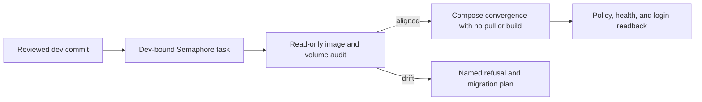

# NetBox Runtime Convergence

**Date:** 2026-09-23  
**Status:** PROPOSED  
**Context:** Production NetBox blocks authoritative IP allocation for the observability receiver. This plan records the measured outage and the review gates for restoring the existing stack through source-controlled automation.

## Problem

Dev-bound, read-only Semaphore task 1152 ran commit `440cfbd53696914ce222b89b23e3b53e93265e99`. The NetBox app, Postgres, and both Redis containers were exited with code 255, `oom=false`, zero restarts, and `policy=no`; their finish times followed the host's 2026-09-19 boot. The login endpoint was unreachable. The committed Compose file now declares `restart: always`, but that declaration has not converged onto these existing containers. The ordinary NetBox deploy pulls images, rebuilds the app image, stops the stack, and synchronizes database passwords, so it is not an unexamined recovery action.

## Design Principles

- Compose remains the authority for container policy. Do not change a live container through an ad-hoc Docker command or API call.
- Run each read or write through a reviewed playbook and a Semaphore template bound to `dev`; verify the exact checkout SHA before mutation.
- Preserve existing named volumes and credentials. OpenBao remains the source of secrets; no credential values enter task output.
- Refuse an image, volume, or data-layout change until a separate migration and rollback plan is reviewed.

## Architecture

PR #207 merged to `dev` as `a06ae82aebb60346486dda46a1e8bf4e25d6c82e` after CodeRabbit approval and green final-head checks. Dev-bound production task 1161 ran that merge, succeeded with `changed=0`, and found all four stopped core containers on the declared image references and named volumes. Postgres uses `netbox_netbox-postgres:/var/lib/postgresql`; Redis and Redis cache retain their separate `/data` volumes; NetBox retains its media, reports, and scripts volumes. The four containers still have `policy=no`. Hydra and the NetBox worker are running; they are outside this recovery's mutation scope.

The recovery playbook updates the host's source checkout to the exact reviewed `dev` SHA, then compares the existing containers with `docker compose --project-name netbox config`: image references, local image IDs, restart declarations, and named-volume names/destinations. It refuses drift before a container change. The default Semaphore run reports safe metadata and stops. An explicitly selected apply uses Compose for the three backing services, waits for health, then converges NetBox, with `--no-deps --no-build --pull never` and no `down`. Existing OpenBao-rendered env and bind-mount secret files are required and preserved; the recovery does not generate or rewrite credentials. A second run must make no container change.

## Implementation Phases

1. **Preflight:** complete. The reviewed Dev-bound task 1161 identified all four core containers and changed no host state.
2. **Convergence design:** compare the report to the reviewed Compose images and volume declarations. Immediately before container mutation, the apply playbook resolves each Compose image locally and compares its image ID with the existing container; a missing image or changed ID refuses the run. If any data-bearing image or mount differs, stop and write a migration/rollback procedure before applying. Acceptance: the playbook has a narrow, proven set of unchanged images and named volumes.
3. **Apply:** merge the idempotent playbook and Dev template after the same review gate. Run its default preflight first, then select apply if it passes. Preserve the existing OpenBao-rendered runtime files and use Compose to restore backing services before the app, without pulling, building, or deleting volumes. Acceptance: the preflight names the scope and the apply reaches healthy services without changing a volume identity.
4. **Verify:** read back restart policies, container health, `/login/`, and the NetBox automation-token prerequisite through Semaphore. Acceptance: a second apply is a no-op, then the IPAM workflow can report a free receiver address.

## Validation Criteria

| Check | Pass condition |
| --- | --- |
| Read-only audit | Semaphore reports `changed=0`, the reviewed `dev` SHA, images, and named volumes. |
| Unsafe drift | A missing or mismatched local image ID, or a mismatched volume, refuses before a container or secret change. |
| Recovery | Existing named volumes remain attached; core services and `/login/` are healthy. |
| Repeatability | A second convergence run reports no container changes. |
| PR gate | Every PR has one completed CodeRabbit review, resolved actionable findings, and green final-head checks. |

## Security Considerations

The audit prints image and named-volume metadata only. It excludes environment variables, bind paths, logs, and credential contents. Secret retrieval and env rendering keep the existing scoped `no_log` boundary; health and policy readback remain visible in Semaphore. The production inventory and private addresses stay in `site-config`.

## Cross-references

- [Platform principles](../../PRINCIPLES.md)
- [Automation model](../architecture/01-automation-model.md)
- [Service onboarding](../architecture/02-service-onboarding.md)
- [Recorded reboot failure](../../docs/MISTAKES.md)
- [Observability dependency](05-observability.md)

## Revision History

| Date | Change |
| --- | --- |
| 2026-09-23 | Initial production diagnosis and reviewed convergence sequence. |
