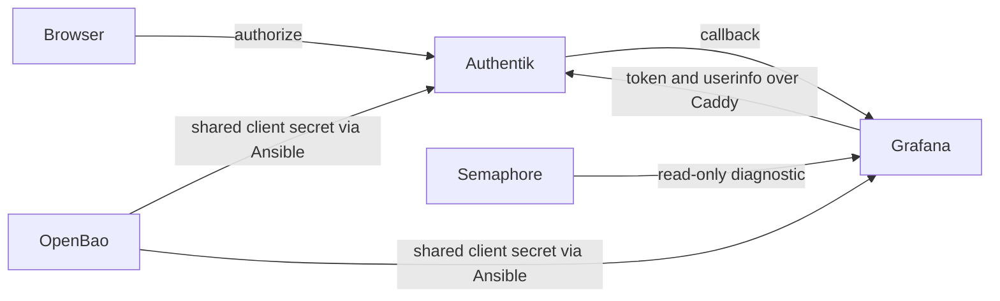
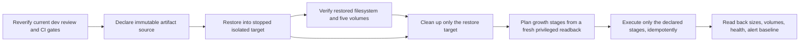

# Grafana Authentik sign-in incident

**Date:** 2026-09-30  
**Status:** PROPOSED  
**Context:** Production Grafana returns to its login page after the Authentik OAuth round trip. This plan records the evidence and the controlled repair path.

## Problem

The public Grafana login links to `/login/generic_oauth`. A live browser check reached Authentik's login flow with `client_id=grafana` and the `https://o11y.uhstray.io/login/generic_oauth` callback. An existing Authentik `stray` session listed Grafana, yet repeating the OAuth flow returned to Grafana's login page without signing in. The server-side rejection reason is not yet observed. A separate report says direct Authentik sign-in fails; its exact error remains unknown.

## Design principles

- Diagnose the actual rejection before changing the OAuth client, group rules, or credentials.
- Keep OpenBao authoritative for the shared client secret and apply any repair through reviewed `dev` and Semaphore.
- Preserve Grafana state and all observability data; use the normal non-destructive deploy path only if needed.
- Report only sanitized error categories, never authorization codes, tokens, cookies, email addresses, or raw logs.

## Architecture

The current public template declares the production root URL, Authentik endpoints, group gate, and a LAN Caddy origin. The current private `site-config` main branch declares Grafana as an enabled Authentik application with the matching strict callback. A read-only TLS check from this workstation trusted the inventory-declared Caddy origin certificate; this does not prove the Grafana container's TLS path.

## Implementation phases

1. Add a Dev-bound, read-only Semaphore diagnostic for a bounded recent Grafana OAuth failure. Restrict output to a fixed allowlist of error categories, with no raw log lines. **Acceptance:** a launched task prints an actionable category plus exact reviewed revision; no matching OAuth failure or an unavailable diagnostic is reported as a fixed category and fails the task.
2. Use the resulting category and the operator's direct-login error to select the smallest config-as-code correction. **Acceptance:** source and live evidence agree on the root cause; the change is reviewed, CI green, and merged to `dev`.
3. Apply only the required normal Semaphore deployment(s), then repeat an existing-session browser sign-in and direct Authentik sign-in. **Acceptance:** Grafana opens an authenticated page, and the operator confirms direct login. No volumes are removed.

## Read-only diagnostics after task 2103

Task 2103 checked the exact merged revision from a clean Semaphore checkout, then became unreachable before the diagnostic command could run because Ansible could not create its default remote temporary directory on a full guest root filesystem. Independent Proxmox filesystem information confirmed the guest's ext4 root was full while its virtual disk was larger than the root logical volume. No service or storage changes were made.

Both read-only diagnostics set Python's `TMPDIR` and Ansible's `ansible_remote_tmp` to `/dev/shm/ansible-tmp`, so remote module unpacking does not depend on free space in the full root filesystem. The read-only preflight rejects symlinks and non-directories; for an existing temp path it also requires tmpfs, writability, ownership by the connecting user, and no group/other write permission. If absent, it checks the parent `/dev/shm` tmpfs and lets Ansible create its own directory. Ansible's current shell implementation creates each per-task module directory with mode `0700`; a narrow race remains between the absent-path check and Ansible creating its base directory, so this is not a hardened multi-user isolation boundary. Both paths require at least 1 MiB available before module transfer. The preflight does not create a directory or use persistent storage. The rootless host-storage diagnostic reports sanitized guest-root filesystem capacity and best-effort LVM capacity using unprivileged, read-only reports. LVM details can be unavailable when the connecting account lacks read access; this path does not escalate. Device and volume-group names are omitted. These measurements are diagnostic evidence only. Any LVM or filesystem growth remains gated on reviewing the live readback and an explicit, separately reviewed change.

### Privileged root-LVM survey plan and current evidence

Semaphore task 2115 succeeded on the exact reviewed `dev` checkout `2d567d86eef1f2cd9f7cda63ba0ac03f6663d642`. Its sanitized readback showed a full ext4 root filesystem of about 9.75 GiB, a reported 10 GiB LVM root block, an approximately 18.2 GiB partition, and a 100 GiB virtual disk. Rootless Podman volumes share the full root filesystem. The unprivileged LVM join returned `root_logical_volume_unresolved`, so the LV-to-root-device correlation and VG free space remain unverified; no disk, partition, LV, or filesystem was changed.

Semaphore backup/restore inspections 2116 and 2117 found two non-PBS `vma.zst` candidates, with no immutability or isolated-restore evidence. A separate capacity survey reported off-source image-storage capacity, but it did not verify backup safety. The next retention/growth gate remains a verified immutable backup artifact and a successful isolated restore. OAuth task 2113 reached Grafana but observed no matching failure in its bounded log window; the full guest root is not established as the OAuth cause.

This implementation adds a Dev-bound, read-only privileged LVM survey to the existing host-storage diagnostic flow. The rootless Podman probe remains unprivileged. `become: true` is scoped to one separate helper task that reads root block topology and read-only `lvs`/`vgs` data, correlates the mounted root device to exactly one LV and VG, and prints only sanitized sizes and fixed status facts. The existing sudo credential is resolved through the shared OpenBao task; raw reports, LV paths, and VG names are never displayed. Ansible's remote temporary directory and Python `TMPDIR` remain on tmpfs. This survey is diagnostic only: it does not authorize VM, disk, LVM, filesystem, retention, or telemetry changes.

### Task 2170 privileged root-LVM receipt

The privileged survey has now run once. Dev-bound Semaphore task **2170**, running the `Diagnose o11y Host Storage (Dev)` template declared in `platform/semaphore/templates.yml:1460`, returned `success` with `dry_run: null` — a real run, not check mode — and a playbook recap of `changed=0` on both plays. The run asserted and passed its own revision gates: controller checkout `4474c2b392bb86a27e56cfdcd12096f37cbe7cc7`, and the **live** deployed receiver revision `4f2c6b476eb917e6537c15825c5cbe5fe7430f78` (the run reads the receiver's deployed revision and fails closed on a mismatch, so this is a fresh re-verification, not reuse of the historical figure recorded for task 1922).

| Sanitized fact | Reported value |
| --- | --- |
| Guest root filesystem total | `10464022528` bytes |
| Guest root filesystem available | `0` bytes |
| Root logical volume size | `10737418240` bytes |
| Root volume group free (reported free extents) | `8829009920` bytes |
| Largest block-chain size in the sanitized line | `107374182400` bytes (the virtual disk) |
| Privileged correlation | `status: observed` — the root LV/VG join succeeded |
| Unprivileged correlation, same run | still `root_logical_volume_unresolved` |
| Podman storage | volume path and graph root still share the guest root filesystem |

The Semaphore task 2170 record is the receipt. Every figure in the table above is taken from that run's own sanitized readback output, which is the sanctioned place exact measured sizes may appear; this plan reproduces those sizes and the fixed status facts, and nothing else. No raw `lvs`/`vgs`/`lsblk` report, device name, LV or VG name, node or storage name, VMID, or artifact identifier is reproduced here or belongs in a later receipt.

The privileged path joined the mounted root device to exactly one logical volume by block major/minor, required that LV's reported size to equal the LVM node in the root block chain, and resolved exactly one volume group — that is the correlation task 2115 could not make, and it is now observed. It is the only change in the picture: the root filesystem is still completely full.

**What 2170 shows.** The guest root is an LVM logical volume of `10737418240` bytes; its volume group reports `8829009920` free bytes; the root filesystem has zero bytes available; and rootless Podman's volume and graph storage still share that filesystem. Ansible also reported `changed=0` on both plays, and every command in the playbook is a reviewed read-only one — but that is the run's own reported change count over that command set, not proof that nothing on the host ever changed outside it.

**What 2170 does not show.** Reported volume-group free space is free *extents in that volume group*: not a safe allocation target and not a growth forecast. Whether those extents could be allocated as-is, or only after the partition and physical volume beneath them change, is **not determined by this readback** — it depends on the exact live topology, which must be re-read before any plan is written. The virtual disk is `107374182400` bytes while the volume group reports `8829009920` free, so the layout between them is unmeasured. The partition-level figure lives only in the task 2115 record; the sanitized 2170 line does not re-capture the block chain node by node. Nothing here revises the root filesystem type recorded earlier, and nothing here establishes root fullness as the cause of the Grafana OAuth rejection.

### Review provenance of the executed controller revision

Task 2170 ran from `dev` head `4474c2b392bb86a27e56cfdcd12096f37cbe7cc7`, the merge commit of PR #369. That record was **re-queried live from GitHub on 2026-10-01 (UTC) and `4474c2b3…` is still `dev`'s head**. Read with an independent query, not from a session log:

| Record | Verified value |
| --- | --- |
| PR #369 | `state=MERGED`, `reviewDecision=CHANGES_REQUESTED`, merged `2026-10-01T00:13:17Z`, merge commit `4474c2b3…`, head `6b6c4393…` |
| PR #369 reviews | exactly one: `coderabbitai[bot]` `CHANGES_REQUESTED`, submitted `2026-09-30T22:33:41Z`, **against the earlier head commit `b7d9945b…`, not the merged head** |
| PR #369 checks | 11 check runs on head `6b6c4393…`, none failing (pass or skip); the merge commit `4474c2b3…` itself has 0 check runs — CI runs on PR heads here, not on merge commits |
| PR #366 | `state=MERGED`, `reviewDecision=APPROVED`, merged `2026-10-01T00:08:25Z`, merge commit `629bde80…`, head `ebfc6932…` |
| PR #366 reviews / checks | one `coderabbitai[bot]` `APPROVED` at `2026-09-30T20:13:28Z` on head `ebfc6932…`; 11 check runs, none failing |

Two corrections to what an earlier draft of this section asserted, both from the same query: the `2026-09-30T20:13:17Z` merge timestamp was wrong (GitHub reports `2026-10-01T00:13:17Z`; the earlier figure looks like local time written with a `Z`), which means the change request at `22:33:41Z` **preceded** the merge rather than following it; and the `APPROVED` review belongs to PR #366, not to PR #369, which has no approving review at all. **The whole-source review gate on the current `dev` head is therefore unresolved as a matter of record, not of missing data.**

One limitation on this reading: GitHub only lists reviews posted to GitHub. These records show no approving review on #369; they cannot show whether a review happened off-platform, so nothing here is evidence about any review that would not appear in this API.

Independently verified in this repository: `git diff --stat 629bde80..4474c2b3` touches only `AGENTS.md`, `plan/development/openspec/changes/production-internal-ca/tasks.md`, `platform/playbooks/issue-internal-leaf.yml`, `platform/playbooks/tasks/issue-internal-leaf.yml`, `platform/semaphore/templates.yml`, and two step-ca test files (+408/−3). No host-storage diagnostic playbook, on-target helper, focused test, launcher, or o11y service file differs. So the bytes the survey executed are the approved #366 bytes.

That byte-equality statement is narrow and must not be widened. **The controller revision as a whole is not fully reviewed**: it carries an unresolved `CHANGES_REQUESTED` on files outside this survey. Two consequences, both binding:

1. Do not label `4474c2b3…` "a reviewed revision" in any later receipt, and do not treat the byte-equality check as a substitute for the review gate on the current `dev` head.
2. **No further live operation against `dev`** — diagnostic or otherwise. The head's review and CI state has now been reverified independently (above) and the result is that the gate is *open*, so the prohibition stands until something on the current head actually changes it.

### Bounded guest-growth proposal (prepared, not authorized)

This section is a proposal for separate review. It authorizes nothing, requests nothing, and deliberately names no target storage, node, VMID, device, volume-group, path, or desired size. Every identifier below is a decision to be declared privately in `site-config`, not a value to be filled in from a public document. Measured sizes observed by a sanctioned read-only survey are a different thing and are recorded, as measurements, in the receipt above.

| Stage | Precondition | Effect if approved | Readback that closes it | Refusal / no-op |
| --- | --- | --- | --- | --- |
| G0 review gate | none | none (verification only) | current `dev` head review decision and required checks, recorded per receipt (performed 2026-10-01: unresolved, see the provenance section) | any unresolved change-request state stops everything downstream |
| G1 immutable artifact | private declaration of the exact artifact selector, backend, source VM, and explicit inclusion of every source disk | none — read-only | mechanism-specific immutability proof plus complete disk inclusion | presence of an archive, Proxmox `protected`, candidate count, timestamp guessing, or `nextid` all refuse; `inspect_o11y_backup_artifact.py:228` reports immutability false by design |
| G2 isolated restore | G1 plus a declared target node, storage, VMID, name, and pre-boot isolation mechanism | creates only the declared restore VM, stopped and isolated | target exists, stopped, isolated, correctly placed; source VM and artifact still present | target identity present or ambiguous beforehand; target on the source node; shared or inactive storage; restore task result ambiguous |
| G3 restore verification | G2 and a declared guest verification channel | none beyond attaching/reading restored storage | restored filesystem readable **and** all five named telemetry volumes resolve uniquely and read: Prometheus, Loki, Tempo, Grafana, Pyroscope (`platform/playbooks/files/inspect-o11y-volume-capacity.py:9-14`) | missing or unreadable volume, wrong target, isolation drift, unavailable verification channel, any production traffic from the target |
| G4 cleanup | G2, run from `always:` | removes only target-owned resources | target VM and its residual volumes absent; source VM and artifact still present | identity mismatch, foreign or partial target, any request that would touch the artifact; failed cleanup overrides earlier success and no receipt is issued |
| G5 growth plan | G4 and a fresh privileged readback of the current layout | none — pure planning | a sanitized plan naming only the required stages | unsupported topology, ambiguous device join, a request smaller than the current size, or a layout that differs from the reviewed assumption |
| G6 growth execution | G5 plus a separately reviewed idempotent implementation and a privately declared desired size | only the stages G5 declared, in order (how many that is depends on the refreshed topology and the declared size) | hypervisor and guest sizes, root filesystem capacity, and unchanged five-volume readability | no immutable-restore receipt; any shrink, format, new filesystem, auto-selected device, or unreviewed reboot; a failed stage stops the later stages instead of rolling back destructively |
| G7 post-growth verify | G6 | none | capacity readback, five volumes intact, stack health and active-alert baseline | any topology drift, missing readback, or volume regression fails the stage |

Every mutating stage carries the same three requirements: check mode emits a preview and performs no write; each stage re-reads live state first and becomes a no-op when already converged; and a re-run converges rather than duplicating. One constraint is settled by the code: `platform/playbooks/resize-vm.yml` grows only the virtual disk and states plainly that the filesystem still has to be extended inside the guest (`resize-vm.yml:510`). Whether that makes G6 one stage or several is **not decided here** — G5 declares the stages from a fresh privileged readback of the exact topology plus the privately declared desired size, and every stage it declares needs its own readback. A stage that the live layout shows to be unnecessary is not executed.

Capacity growth is also not symmetric: a grown disk, logical volume, or filesystem is not shrunk back by these stages, so nothing in G5-G7 may be described as reversible or used as its own rollback. A failed stage stops the chain and goes to the operator.

**Known unknowns, kept separate from the facts above.** Whether the reported free extents can be allocated as-is or need the partition and physical volume changed first; whether the hypervisor disk can be grown at all and by how much; whether the seven-day history needed for retention exists in any current series; and whether the full root filesystem has any causal relation to the OAuth rejection. None of these is answerable from task 2170, and none may be assumed by an implementation.

### Private decisions still required

Each of these is a decision for `site-config` or for the operator — not something this document, a public playbook, or a survey may choose:

1. Which single artifact is the restore source, and through which read-only channel its exact identity is obtained. The public survey intentionally exposes no artifact identifier or hash (`platform/tests/test_o11y_backup_artifact.py:89-90`) while two candidates exist (`plan/development/05-observability.md:1229-1230`).
2. Which technical mechanism provides immutability, and what evidence source proves it. Proxmox's `protected` flag is mutable metadata and cannot satisfy this.
3. Whether the source path is the existing non-PBS artifact or a future PBS artifact; the PBS path first requires tasks 4.6c4 and 4.6d.
4. Exact isolated restore target: node, storage, VMID, name, and the reservation process. No VMID may be inferred from `/cluster/nextid`; `inspect_o11y_restore_feasibility.py:262-265` keeps VMID reservation, immutability, isolated target, and restore all false by design.
5. The isolation mechanism that is effective before first boot, and the guest verification channel (guest agent, isolated management network, or offline disk inspection) — with no invented fallback when the chosen channel fails.
6. Cleanup policy after a failed verification, and who owns the resulting receipt field: the existing trace-rollout receipt or a new capacity/growth receipt with its own semantics.
7. The desired guest capacity, and whether hypervisor disk growth is required at all. No size is proposed here.
8. The source and cadence for retained per-backend stored-byte history; today's budget verifier yields point-in-time volume bytes only.
9. Re-verification of the current deployed receiver revision before any next run; `4f2c6b47…` is current proof only for the run that asserted it.

### Emergency filesystem recovery is not retention expansion

These are two different questions with two different gates, and conflating them is how a full disk ends up authorizing an unreviewed resize.

- **Emergency filesystem recovery** is an availability action on a receiver whose root filesystem reports zero bytes free. It is bounded to non-destructive steps that never mutate telemetry data, and it needs explicit operator authorization for the specific action. Do not describe it as reversible: any capacity growth performed under it cannot be shrunk back. **No emergency exception is asserted or requested by this proposal, and none may be claimed before this proposal is reviewed.** The warning path for this condition already exists and is proven: `o11y_receiver_root_disk_low` firing, routing, and Discord delivery were verified (estate-wide tasks 1.5/1.6).
- **Retention expansion** is a capacity decision that additionally requires at least seven representative days of receiver CPU/memory history plus per-backend stored-byte growth, a nonzero Prometheus size cap, and a forecast leaving ≥30% free disk and ≥25% memory headroom with CPU p95 below 70%, referenced by a numeric ID pointing at a separately reviewed successful capacity receipt. The effective production tuple stays **15d / 7d / 168h** until that receipt exists. Growing the root filesystem satisfies none of these conditions on its own.
- Guest growth itself requires the immutable artifact, the successful isolated restore with filesystem and five-volume readback, cleanup, and a separately reviewed idempotent operation — an archive's presence, a snapshot's presence, or aggregate off-source storage capacity are not sufficient, and the capacity forecast is required *on top* of those for a retention change.
- Root fullness is an observed condition, not a diagnosis. It is not established as the OAuth cause; whether root fullness causes the OAuth failure, or whether capacity recovery is needed for sign-in at all, remains unverified.

### Operational publication boundaries

Task output remains sanitized. What is prohibited: artifact identifiers or hashes, device, partition, LV, VG, node, storage or image-storage names, VMIDs, raw `lvs`/`vgs`/`lsblk` output, raw log lines, and secret material. What the sanctioned sanitized readback **does** emit, and what this plan is allowed to reproduce from a Semaphore task record, is aggregate measured sizes in bytes (filesystem total and available, logical volume size, volume-group free, block-chain node sizes) plus fixed status strings — the diagnostic's own output shape. So the rule is about identifiers, names and raw reports, not about rounding measured capacities into bands. Secret-bearing steps keep `no_log: true` scoped to the credential boundary only; deploys, waits, health checks, and verification stay visible. A growth or restore receipt states its stages and fixed status facts, and any numeric value is taken from the successful Semaphore task record rather than a runner-injected identifier. A **declared target** — the desired size, the artifact selector, the restore node/storage/VMID — is a private decision and never appears in a public document; a **measured** size from a sanctioned readback may.

### Next smallest implementation slice

None for growth. G0 has now been performed — the current `dev` head's review and CI state was re-queried from GitHub (above) and it came back **unresolved**: PR #369, whose merge commit is `dev`'s head, still carries `CHANGES_REQUESTED` with no approving review. So nothing downstream of G0 is available, and no live operation against `dev` is authorized.

No implementation slice of the G1→G7 chain is supported by today's evidence even setting the gate aside, because artifact identity, immutability mechanism, restore target, isolation, verification channel, cleanup policy and desired size are all undecided. The next slice that becomes available is G1's read-only restore-plan preflight, and only once decisions 1-6 are privately declared and the review gate on the head actually being run is closed; writing growth code before that point would encode guesses as policy.

## Validation criteria

| Check | Pass condition |
| --- | --- |
| Diagnostic safety | No secrets, identities, or raw URLs in task output |
| Revision | Semaphore checks out the exact controller revision named at launch, and that revision's review decision and required checks were verified before launch |
| OAuth | Authentik session reaches an authenticated Grafana page |
| Direct login | Operator confirms Authentik login works |
| Preservation | Existing Grafana and telemetry volumes remain intact |
| Survey provenance | A live survey receipt names the controller and live receiver revisions it asserted, and never calls a `dev` head "reviewed" without a current review decision and green checks |
| Growth proposal | Every mutating stage states its precondition, readback, refusal, and converged no-op; no identifier or declared desired size appears in a public document, and no growth stage is described as reversible |
| Growth authorization | Growth is refused without an immutable-artifact proof, a successful isolated restore, filesystem and five-volume readback, cleanup, and a separately reviewed idempotent operation |
| Retention | Effective retention stays 15d / 7d / 168h until a seven-day forecast, a nonzero Prometheus size cap, and a referenced capacity receipt exist |

## Security considerations

OAuth logs can include authorization codes and personal identifiers. The diagnostic must classify locally and print fixed strings only. It must not print environment variables, provider secrets, request headers, or raw log excerpts. Do not disable TLS verification or weaken the group gate to pass the test.

A restore or growth run widens that boundary: no artifact identifier or hash, device, partition, LV, VG, node, storage, or VMID name, and no raw `lvs`/`vgs`/`lsblk` output may reach task output, and `become`-escalated reads stay scoped to the one read-only helper task. Growth stages are refused rather than improvised when the live layout differs from the reviewed assumption, and a receipt never carries a size or identifier that only private `site-config` is allowed to declare.

## Cross-references

- [Platform principles](../../PRINCIPLES.md)
- [Credential and access governance](../architecture/04-credentials-access.md)
- [Caddy and container runtime](../architecture/05-platform-infra.md)
- [Observability implementation](05-observability.md)
- [Estate instrumentation design](openspec/changes/estate-wide-observability-instrumentation/design.md)
- [Canonical agent instructions](../../AGENTS.md)

## Revision history

| Date | Summary |
| --- | --- |
| 2026-09-30 | Opened the incident; recorded task 2103's blocked diagnostic and the tmpfs workaround; added the privileged root-LVM survey plan |
| 2026-09-30 | Recorded the sanitized task 2170 receipt and its review-provenance caveat, the bounded growth proposal with its staged dependency sequence, the private-decision checklist, and the emergency-recovery / retention-expansion boundary |
| 2026-10-01 | Re-queried the PR #369/#366 and `dev`-head metadata from GitHub and corrected this plan's review-provenance section with it, including two wrong claims in the first draft (the merge timestamp, and an approval attributed to the wrong PR); replaced the session-log evidence citations with the durable task 2170 receipt; softened the `changed=0` claim to what it actually is; made VG free extents an open topology question instead of an assumed prerequisite; stopped describing growth as reversible; and reconciled the publication boundary so it no longer forbids the exact measured sizes its own sanctioned receipt emits |
