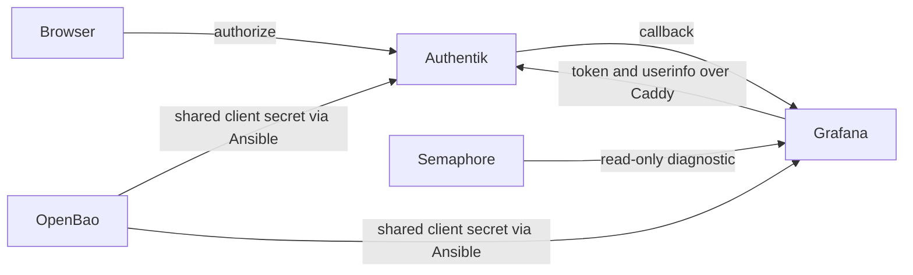

# Grafana Authentik sign-in incident

**Date:** 2026-09-30  
**Status:** PROPOSED  
**Context:** Production Grafana returns to its login page after the Authentik OAuth round trip. This plan records the evidence and the controlled repair path.

## Problem

The public Grafana login links to `/login/generic_oauth`. A live browser check reached Authentik's login flow with `client_id=grafana` and the `https://o11y.uhstray.io/login/generic_oauth` callback. An existing Authentik `stray` session listed Grafana, yet repeating the OAuth flow returned to Grafana's login page without signing in. The server-side rejection reason is not yet observed. A separate report says direct Authentik sign-in fails; its exact error remains unknown.

## Design principles

- Diagnose the actual rejection before changing the OAuth client, group rules, or credentials.
- Keep OpenBao authoritative for the shared client secret and apply any repair through reviewed `dev` and Semaphore.
- Preserve Grafana state and all observability data; use the normal non-destructive deploy path only if needed.
- Report only sanitized error categories, never authorization codes, tokens, cookies, email addresses, or raw logs.

## Architecture

The current public template declares the production root URL, Authentik endpoints, group gate, and a LAN Caddy origin. The current private `site-config` main branch declares Grafana as an enabled Authentik application with the matching strict callback. A read-only TLS check from this workstation trusted the inventory-declared Caddy origin certificate; this does not prove the Grafana container's TLS path.

## Implementation phases

1. Add a Dev-bound, read-only Semaphore diagnostic for a bounded recent Grafana OAuth failure. Restrict output to a fixed allowlist of error categories, with no raw log lines. **Acceptance:** a launched task prints an actionable category plus exact reviewed revision; no matching OAuth failure or an unavailable diagnostic is reported as a fixed category and fails the task.
2. Use the resulting category and the operator's direct-login error to select the smallest config-as-code correction. **Acceptance:** source and live evidence agree on the root cause; the change is reviewed, CI green, and merged to `dev`.
3. Apply only the required normal Semaphore deployment(s), then repeat an existing-session browser sign-in and direct Authentik sign-in. **Acceptance:** Grafana opens an authenticated page, and the operator confirms direct login. No volumes are removed.

## Read-only diagnostics after task 2103

Task 2103 checked the exact merged revision from a clean Semaphore checkout, then became unreachable before the diagnostic command could run because Ansible could not create its default remote temporary directory on a full guest root filesystem. Independent Proxmox filesystem information confirmed the guest's ext4 root was full while its virtual disk was larger than the root logical volume. No service or storage changes were made.

Both read-only diagnostics set Python's `TMPDIR` and Ansible's `ansible_remote_tmp` to `/dev/shm/ansible-tmp`, so remote module unpacking does not depend on free space in the full root filesystem. The read-only preflight rejects symlinks and non-directories; for an existing temp path it also requires tmpfs, writability, ownership by the connecting user, and mode `0700`. If absent, it checks the parent `/dev/shm` tmpfs and lets Ansible create its own directory. Both paths require at least 1 MiB available before module transfer. The preflight does not create a directory or use persistent storage. The host storage diagnostic reports sanitized guest-root filesystem capacity and best-effort root logical-volume and volume-group capacity using unprivileged, read-only LVM reports. LVM details can be unavailable when the connecting account lacks read access; no privilege escalation is added. Device and volume-group names are omitted. These measurements are diagnostic evidence only. Any LVM or filesystem growth remains gated on reviewing the live readback and an explicit, separately reviewed change.

## Validation criteria

| Check | Pass condition |
| --- | --- |
| Diagnostic safety | No secrets, identities, or raw URLs in task output |
| Revision | Semaphore checks out the reviewed `dev` SHA |
| OAuth | Authentik session reaches an authenticated Grafana page |
| Direct login | Operator confirms Authentik login works |
| Preservation | Existing Grafana and telemetry volumes remain intact |

## Security considerations

OAuth logs can include authorization codes and personal identifiers. The diagnostic must classify locally and print fixed strings only. It must not print environment variables, provider secrets, request headers, or raw log excerpts. Do not disable TLS verification or weaken the group gate to pass the test.

## Cross-references

- [Platform principles](../../PRINCIPLES.md)
- [Credential and access governance](../architecture/04-credentials-access.md)
- [Caddy and container runtime](../architecture/05-platform-infra.md)
- [Observability implementation](05-observability.md)
- [Canonical agent instructions](../../AGENTS.md)
