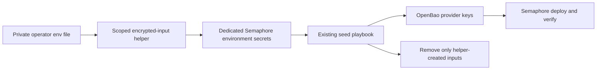

# Postiz Production Readiness

**Date:** 2026-09-05
**Status:** ACTIVE
**Context:** Prepare a scoped Postiz release and a reproducible provider-credential input workflow. Deployment, credential validity, account connection and social publishing are separate acceptance gates.

## Problem

The selective release needs the tested search overlay, backend-health check and API-key capture without including unrelated service changes. A secret-inventory check alone cannot establish whether retained application data exists; the release must verify both before generating stateful credentials.

The seed playbook safely merge-patches provider credentials, but the documented encrypted Semaphore input channel requires manual configuration. Task extra variables are persisted in plaintext and must never carry credentials.

## Design Principles

- Keep deployments and OpenBao access on the Semaphore controller.
- Parse the operator file as data. Import only declared provider fields; exclude signing, database, OIDC, URL and security settings.
- Preserve existing environment configuration and secrets. Refuse colliding seed inputs rather than overwrite unknown values.
- Use existing tested code for the production release and preserve feature → dev → main review gates.
- Record deployment, login, account connection and publishing as separate outcomes.

## Architecture

## Implementation Phases

1. Add the scoped input helper and seed read-back assertion. Preserve literal provider fields in the mounted application config and test the actual compose loader; its explicit export already avoids shell evaluation. A dry run reports provider names only. The seed template must first receive a dedicated environment through configuration-as-code; the existing shared binding is refused, even when idle. Its live sequence refuses existing seed inputs and concurrent users of the environment, preserves configuration, records created secret IDs, runs only the named seed template, waits for a terminal result, and removes only its inputs. An uncertain task submission is not retried or treated as failure; retain encrypted inputs for reconciliation.
2. Prepare a selective production release from tested integration changes. Required components: Postiz six-container runtime and tests; shared compose-overlay support; sibling-preserving secret storage; API-key capture; applicable transport/privilege fixes; Authentik URL resolution and live verification; production Caddy route adoption/rollback fixes. Review account-blueprint effects separately before redeploying the shared IdP. Do not promote unrelated n8n/tududi changes or publish their templates.
3. Verify retained container/data state and the existing IdP client through a controller-side read-only preflight before generation or deployment. Missing OpenBao state alongside retained data is a refusal requiring migration, never permission to generate replacement credentials.
4. After the reviewed release is merged, seed provider credentials, verify names, deploy the IdP only as needed, deploy Postiz, publish its proxy route and reconcile the service firewall. Require backend, workflow engine, search node and TLS checks. Complete the first approved sign-in and close registration through inventory.
5. Leave social account consent, callback-console changes, scheduled publishing and restart-with-pending-post acceptance open until separately authorized.

### Dedicated seed environment

The controller provisions a named environment for each seed-template variant.
It resolves existing controller AppRole inputs in memory and places only the
required authentication fields into Semaphore's encrypted environment secrets;
provider inputs remain the separate import helper's responsibility. No AppRole
is exported to the operator or copied into task arguments or plaintext JSON.

The provisioning operation must verify the declared seed template, repository,
source binding and exclusive target ownership before mutation. Existing provider
inputs, ambiguous records, active seed tasks or changed records cause a refusal.
It preserves unrelated template settings and existing encrypted inputs, verifies
the stored metadata, and never retries an uncertain mutation automatically.
A reservation is required because the API has no compare-and-swap.

`isolated_environment` in `templates.yml` declares the desired environment name;
generated Dev variants receive a distinct suffixed name. The existing catalog
applier creates missing empty environments and resolves their IDs. It does not
copy credentials or preserve an arbitrary live binding as desired state.
First full publication leaves the seed variants unavailable until their named
environments are provisioned. Reserve this installation window, run the
provisioner for each needed variant, and complete the read-only survey check
before importing provider inputs.
The controller provisioner supplies authentication before changing its selected
binding; scoped survey publication continues to preserve all bindings.
The seed playbook gains a read-only access mode that authenticates and reads its
fixed OpenBao path, then exits before every write even if provider inputs exist.
Run that mode through the dedicated binding before importing credentials.

Acceptance: repeat provisioning converges without changing existing credentials;
full and scoped publication retain the dedicated binding; wrong ownership and
concurrent work fail before writes; read-only validation performs no secret-store
write. Initial installation still requires the reviewed controller entrypoint.

This is trigger-converged automation: declarative metadata with guarded API
operations, following `01-automation-model.md` (Configuration-as-Code, Workflow
Decoupling, and taxonomy §4). `04-credentials-access.md` §1 limits genesis to
initial trust bootstrap; a missing template on a running controller does not
authorize a new manual access path. Credential tasks retain scoped `no_log` per
the current engineering instructions; the older blanket-ban migration text in
`03-testing-ci-quality.md` is not an implemented redaction guarantee.

## Validation Criteria

| Check | Pass condition |
|---|---|
| Parser | Quotes and literal metacharacters preserved without execution; duplicate or ambiguous selected fields refused |
| Input isolation | No secret values in output, arguments, task extra variables, artifacts or fixtures; existing inputs/configuration preserved |
| Failure recovery | No blind mutation retries; cleanup bound to created IDs; uncertain running task retains inputs |
| OpenBao write | Server-side merge, stateful siblings preserved, read-back equals supplied fields |
| Release | Exact dependency manifest reviewed, applicable tests and CI green, no unrelated service promotion |
| Production | Recorded controller run IDs, six healthy containers, backend and TLS proof, registration closed |

## Selective Release Dependency Manifest

The following reviewed integration sources establish the release boundary. This
is a preparation manifest, not a claim that a production release is merged.

| Concern | Required source | Scope control |
|---|---|---|
| Postiz runtime | PR #145 (`df13a08`): Postiz deployment tree, deploy playbook, API-key capture, Postiz tests | Six containers, backend health and scheduled-work engine prerequisites |
| Compose overlays | `platform/lib/common.sh` at `df13a08` | Take overlay support; exclude subsequent unrelated n8n generator removal |
| Secret preservation | `tasks/bao-merge-keys.yml` at `df13a08`, `tasks/manage-secrets.yml` at `81575e9` | Preserve undeclared sibling keys on every deploy |
| Transport and escalation | Guard fixes from PR #139 and current include dependencies | Prevent invalid task attributes or unavailable sudo credentials before deploy |
| IdP | URL resolution and live verification fixes at `9584441` and `61dcede` | Review existing production account state before selecting any user-blueprint delta |
| Proxy | Route adoption, grammar and rollback fixes through `d0f1ab7` | Carry the reviewed parser and rollback behavior used by the route manager |
| Host firewall | Current reviewed `apply-firewall.yml` and its include dependencies | Scope the run to `postiz_svc`; existing admin-access proof remains a prerequisite |
| New credential boundary | This prerequisite change after dev review/merge | Literal provider values, encrypted input lifecycle and read-back proof |

Existing production template bindings are retained. Shared template publication,
new credential import and a service rollout are separate operations. The account
connection/publishing gates remain open, irrespective of deployment health.

## Security Considerations

Only HTTPS with verified TLS and no redirects is accepted for the operator API. Authentication comes from an existing authorized token supplied through stdin, not a command argument. Environment edits use fresh read-back and preserve all non-secret configuration; the dedicated environment must be reserved during the operation because the API has no compare-and-swap. Existing encrypted seed inputs are a collision, not something to replace. The source file stays private and is never copied into this repository. The helper never logs raw API error bodies.

## Cross-references

- [Existing change checklist](openspec/changes/deploy-postiz-social-publishing/tasks.md)
- [Postiz deployment](../../platform/services/postiz/deployment/README.md)
- [Seed playbook](../../platform/playbooks/seed-postiz-secrets.yml)
- [Engineering standards](../../AGENTS.md)
- [Automation model](../architecture/01-automation-model.md)

## Revision History

| Date | Change |
|---|---|
| 2026-09-05 | Scoped release manifest and encrypted input work |
