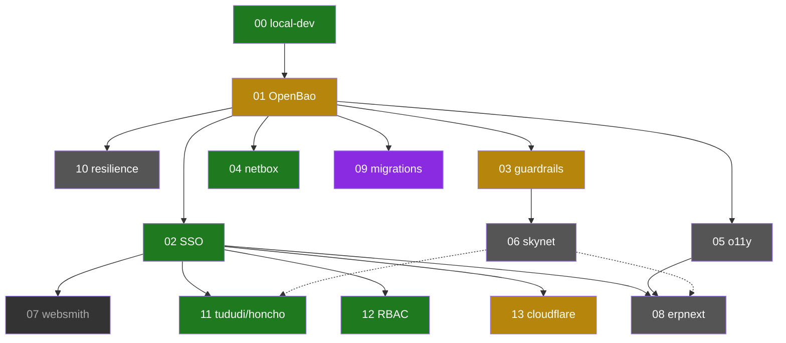

# Development Roadmap — agent-cloud

Central index + dependency-ordered execution plan for everything under
`plan/development/`. Each numbered doc (`00`–`13`) is a self-contained plan; this
file is the map over them — **current status, what blocks what, and what to do
next**. Read this first, then open the specific plan.

> Keep this in sync: when a plan's status changes or a new `NN-*.md` is added,
> update its row + the backlog here (and fix the plan's own `**Status:**` header).

## Status legend

`LIVE` in prod · `LOCAL` local-dev only · `PARTIAL` some phases shipped ·
`PLANNED` written, not started · `HELD` blocked on a decision/prereq · `PARKED`
blocked on hardware.

## Plan status dashboard

| # | Plan | Depends on | Status | Where it stands |
|---|------|-----------|--------|-----------------|
| 00 | Foundation & local-dev | — | `LOCAL` | `make` bootstraps the local stack; prod uses the same playbooks. Promotion-pipeline polish + the private `uhhcraft` image still open. |
| 01 | Secrets & credentials (OpenBao) | 00 | `PARTIAL` | Single-node OpenBao live (local + prod), secrets flow working. **HA (Raft + auto-unseal + snapshots) not built** — biggest prod single-point-of-failure. |
| 02 | SSO & auth (Authentik) | 00, 01 | `LIVE` (prod) | `auth.uhstray.io` live; Semaphore/OpenHands/tududi/honcho gated (OIDC + forward_auth). **Fleet not finished:** netbox/n8n/openbao still on `*.agent-cloud.test` orphans → see backlog P1. |
| 03 | Guardrails & governance | 00, 01 | `PARTIAL` | OPA deployed (local); `protect-main` ruleset is config-as-code **in `evaluate`/dry-run** (not enforcing); source-of-truth ADR endorsed. |
| 04 | NetBox & discovery | 00, 01 | `LIVE` (prod) | Diode discovery pipeline operational on a schedule. SNMPv3 (D) + LLDP (E) deferred. |
| 05 | Observability (o11y) | 00, 01 | `PLANNED` | `platform/services/o11y/` stub only. Gates 08 and ops visibility. |
| 06 | Inference plane (skynet) | 00, 01, 03 | `PLANNED` | Doc/catalog reframe only; no runtime. Gates honcho's real LLM (11/D3) + 08. |
| 07 | WebSmith & UhhCraft | 00, 01, 02 | `PARKED` | Code committed (Phases 1–11); go-live blocked on GPU VMs / PCIe passthrough (Phase 10 smoke). |
| 08 | ERPNext | 00, 01, 02, 05, (06) | `PLANNED` | Local slim tier code-complete (deploy pending image pull); most-gated plan. |
| 09 | Service migrations & tooling | 00, 01 | `HELD` | n8n has a guarded seed/cutover path on `dev`; NocoDB still needs equivalent stateful-secret validation before migration. |
| 10 | Infrastructure & resilience | 00, 01 | `PLANNED` | Dev-Proxmox + DR runbooks are stubs. |
| 11 | tududi & honcho | 00, 01, 02, (06) | `LIVE` (prod) | Both live: `todo.uhstray.io` + `memory.uhstray.io`, API + Authentik OIDC, hardened + firewalled. honcho's LLM on interim Gemini (config-only swap to skynet later). **Done.** |
| 12 | RBAC user provisioning | 02 | `LIVE` (prod) | `wisward` (admin) + `andrew.godlewsky` (developer+business) provisioned in prod Authentik; `platform-business` group added. Per-service role-map refinement is the tail. |
| 13 | Cloudflare as code (OpenTofu) | 00, 01, 02 | `PARTIAL` | WAF ruleset + 14 platform DNS records adopted at zero-diff (R2 state); Semaphore `plan` path proven. **Remaining:** register the `tofu` Semaphore template on `main` + Phase 3 (zone settings). |

## Dependency graph

The two universal gates are **00 (local-dev)** and **01 (OpenBao)** — nothing
ships without them. **02 (SSO)** is the next fan-out hub. Solid arrows are hard
dependencies; the dotted arrow is the soft "honcho's real LLM" tie.

## Prioritized backlog (dependency order)

Ranked to (a) finish what's nearly done, (b) de-risk prod, then (c) unblock new
capability. Each item names its plan + the concrete next action.

### P1 — Finish + govern (small, high-closure)
1. **Finish the SSO fleet (02).** Promote `netbox`/`n8n`/`openbao` to prod OIDC + add the **idempotent orphan-GC (tombstone)** so prod Authentik shows only the enabled set (removes the stale `*.agent-cloud.test` orphans). The promotion mechanism already exists. *(tracked: task #40)*
2. **Close out Cloudflare IaC (13).** Register the `Apply Cloudflare Tofu` Semaphore template on `main` (the plan/apply path is proven) so steady-state runs are one click; then Phase 3 zone settings as needs arise.
3. **Enforce branch protection (03).** Flip the `protect-main` ruleset from `evaluate` → `active` after Insights verification — a cheap, high-value governance win.

### P2 — De-risk the foundation (prod resilience)
4. **OpenBao HA (01).** Single-node + manual unseal is the platform's biggest single-point-of-failure — everything reads from it. Build Raft + Transit auto-unseal + step-ca TLS + scheduled snapshots (Phase B0 TLS is the hard prereq). Highest-leverage resilience work.
5. **DR runbooks (10).** Write the concrete recovery procedures for the top failure modes (OpenBao sealed, Semaphore down, a service VM lost) — even before the dev-Proxmox cluster exists.

### P3 — Unblock capability
6. **NocoDB + n8n composable migration (09).** Preserve the existing stateful secrets (`N8N_ENCRYPTION_KEY`, NocoDB JWT, Postgres passwords) in OpenBao. For each existing service, require a Semaphore cutover playbook that fails before container restart if a stateful value is missing or differs from the live configuration; an operator's manual diff does not satisfy this gate. n8n has the idempotent seed and pre-restart comparison on `dev`; NocoDB still needs an equivalent guarded path before cutover. *(reconciles PR #15)*
7. **Observability (05).** Stand up Grafana + Prometheus + Loki + Alloy via the composable pattern — ops visibility now, and it gates ERPNext.
8. **Inference plane (06) → ERPNext (08).** skynet's `/v1` gateway unblocks honcho's real LLM (11/D3) and is a soft prereq for ERPNext; land 05 + 06, then 08.

### Parked
- **WebSmith/UhhCraft (07)** — code is ready; blocked on GPU VMs / PCIe passthrough. Resume when hardware lands.

## How to use this file
- Pick the top unstarted P-item whose dependencies are all `LIVE`/`PARTIAL`-sufficient.
- Open its plan doc for the phased detail; execute through Semaphore per the plan.
- On completion, update the row's status here + the plan's own header, and move
  the backlog item to the plan's "done" record.
