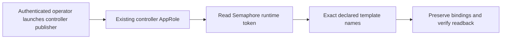

# Semaphore Scoped Runtime Access

**Date:** 2026-09-05
**Status:** ACTIVE
**Context:** Production validation needs one declared survey update without
republishing unrelated templates or extracting backup credentials.

## Problem

The template publisher applies the entire catalog and assumes an externally
supplied Semaphore token. A workstation OpenBao session was tested and received 403, but controller
AppRole access had already passed in production task 411. These are separate
identities; a browser login is not a shell credential source.

## Design Principles

Use existing operator playbooks, preserve target bindings, never delete or revoke,
and keep credential resolution in memory under scoped `no_log`. An unavailable
login is a named prerequisite, never a reason to read backups.

## Architecture

## Implementation Phases

1. Add shared runtime access for the three operator configuration playbooks.
   Accept an already injected runtime token or read `secret/services/semaphore`
   through the existing controller AppRole; never print or persist the result.
2. Add exact-name, existing-record-only template publication. Reject empty,
   unknown, duplicate or ambiguous selections before writes. Preserve current
   inventory, environment and operational settings; refuse mismatched repository
   or playbook bindings. Scoped survey publication never publishes schedules.
   A separate bootstrap installs only the generated Dev publisher with explicit
   reviewed target IDs; no full-catalog update or controller restart.
3. Exercise the actual playbook against disposable HTTP fixtures: one-template
   update, repeat no-op, refusal paths, unchanged unrelated records, and readback
   mismatch. Commit and review before production publication.
4. After approved runtime access exists, publish the token proof survey only.
   Production token proof, identity/project visibility, existing marker recovery,
   dev-test record comparisons and broader rollout remain separate gates.

## Validation Criteria

| Check | Pass condition |
|---|---|
| Scope | Only exact selected template IDs receive writes |
| Preservation | Existing bindings/settings and unrelated objects unchanged |
| Refusal | Invalid selection or ambiguous records produce zero writes |
| Convergence | Second identical publication produces zero writes |
| Evidence | Saved survey fields match declaration after readback |
| Credentials | Missing/denied runtime access fails without raw secret output |

## Security Considerations

Semaphore uses HTTPS or loopback HTTP. OpenBao transport uses the shared guard.
No backup files, browser credential export, new auth method, token rotation, task
launch or ownership mutation is part of this change. The controller AppRole needs
read access to `secret/data/services/semaphore`; a missing initial publisher
entry point is separate from runtime authentication health.

## Cross-references

- [Engineering standards](../../AGENTS.md)
- [Credentials and access](../architecture/04-credentials-access.md)
- [Tududi release gates](openspec/changes/integrate-tududi-github-issue-sync/release-preparation.md)
