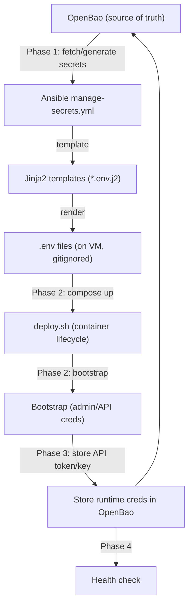

# NocoDB & n8n Composable Deployment Migration

> **For agentic workers:** REQUIRED SUB-SKILL: Use superpowers:subagent-driven-development (recommended) or superpowers:executing-plans to implement this plan task-by-task. Steps use checkbox (`- [ ]`) syntax for tracking.

## Problem

NocoDB and n8n currently use legacy deploy scripts that generate secrets in bash and store them in `secrets/` directories on disk. This violates the composable deployment pattern where OpenBao is the single source of truth for credentials.

## Design Principles

1. **OpenBao as source of truth** -- All credentials generated, stored, and fetched via OpenBao
2. **Jinja2 templating** -- Ansible templates `.env` files from OpenBao data; no secrets in code
3. **Container-only deploy.sh** -- Deploy scripts handle compose lifecycle only, no secret generation
4. **Independent workflows** -- Each playbook is self-contained, retryable, and idempotent
5. **Test-first** -- BATS tests validate templates before implementation

## Architecture

**Goal:** Migrate NocoDB and n8n from legacy deploy scripts to the composable pattern (OpenBao -> Ansible `manage-secrets.yml` -> Jinja2 templates -> deploy.sh container-only).

Both services follow the same 4-phase playbook pattern proven by NetBox: Phase 1 clones the repo, authenticates to OpenBao, generates/fetches secrets, and templates `.env` files via Jinja2. Phase 2 runs `deploy.sh` which only manages container lifecycle (compose up, health check). Phase 3 runs application bootstrap (admin/owner creation, API token/key generation) and stores runtime credentials back to OpenBao. Phase 4 verifies health. The `deploy.sh` scripts are refactored to remove secret generation and read pre-templated `.env` files instead.



**Tech Stack:** Ansible, Jinja2, OpenBao (HashiCorp Vault compatible API), Bash, Docker Compose, BATS (testing)

## Security Considerations

No real IPs, credentials, or sensitive data in any committed files. All secrets use `{{ secrets.* }}` Jinja2 placeholders. Real values live in site-config (private) and OpenBao.

---

## File Structure

### NocoDB Files

| Action | Path | Purpose |
|--------|------|---------|
| Create | `platform/services/nocodb/deployment/templates/nocodb.env.j2` | Jinja2 template for NocoDB + Postgres env vars |
| Modify | `platform/services/nocodb/deployment/deploy.sh` | Remove secret generation, read `.env` from config/ |
| Modify | `platform/services/nocodb/deployment/compose.yml` | No changes needed (already reads `./config/nocodb.env`) |
| Create | `platform/playbooks/deploy-nocodb.yml` | Full 4-phase composable playbook (replaces thin wrapper) |
| Create | `platform/playbooks/clean-deploy-nocodb.yml` | Destructive clean + redeploy |
| Create | `platform/tests/test_nocodb_templates.bats` | BATS tests for Jinja2 template rendering |

### n8n Files

| Action | Path | Purpose |
|--------|------|---------|
| Create | `platform/services/n8n/deployment/templates/n8n.env.j2` | Jinja2 template for n8n + Postgres + Redis env vars |
| Modify | `platform/services/n8n/deployment/deploy.sh` | Remove secret generation, read `.env` from config/ |
| Modify | `platform/services/n8n/deployment/compose.yml` | No changes needed (already reads `./config/n8n.env`) |
| Create | `platform/playbooks/deploy-n8n.yml` | Full 4-phase composable playbook (replaces thin wrapper) |
| Create | `platform/playbooks/clean-deploy-n8n.yml` | Destructive clean + redeploy |
| Create | `platform/tests/test_n8n_templates.bats` | BATS tests for Jinja2 template rendering |

### Shared Files

| Action | Path | Purpose |
|--------|------|---------|
| Modify | `platform/semaphore/templates.yml` | Add Clean Deploy NocoDB + Clean Deploy n8n templates |
| Modify | `platform/lib/common.sh` | No removal yet — keep `generate_nocodb_env` and `generate_n8n_env` for backward compatibility until deploy is validated |

---

## Task 1: NocoDB Jinja2 Template

**Files:**
- Create: `platform/services/nocodb/deployment/templates/nocodb.env.j2`
- Create: `platform/tests/test_nocodb_templates.bats`

This template replaces the hardcoded `generate_nocodb_env()` function in `common.sh`. The compose.yml already reads `./config/nocodb.env` so the template destination matches.

**Secrets required by NocoDB** (derived from `generate_nocodb_env()` in `common.sh:147-169`):
- `postgres_password` — Postgres auth + NocoDB `NC_DB` connection string
- `jwt_secret` — NocoDB `NC_AUTH_JWT_SECRET` for session tokens

- [ ] **Step 1: Write the BATS test for NocoDB template rendering**

Create `platform/tests/test_nocodb_templates.bats`:

```bash
#!/usr/bin/env bats
# test_nocodb_templates.bats — Verify NocoDB Jinja2 template renders correctly

TEMPLATE_DIR="$(cd "$(dirname "$BATS_TEST_FILENAME")/../services/nocodb/deployment/templates" && pwd)"

@test "nocodb.env.j2 exists" {
  [ -f "$TEMPLATE_DIR/nocodb.env.j2" ]
}

@test "nocodb.env.j2 contains POSTGRES_PASSWORD placeholder" {
  grep -q '{{ secrets.postgres_password }}' "$TEMPLATE_DIR/nocodb.env.j2"
}

@test "nocodb.env.j2 contains NC_AUTH_JWT_SECRET placeholder" {
  grep -q '{{ secrets.jwt_secret }}' "$TEMPLATE_DIR/nocodb.env.j2"
}

@test "nocodb.env.j2 contains NC_DB connection string with placeholder" {
  grep -q '{{ secrets.postgres_password }}' "$TEMPLATE_DIR/nocodb.env.j2"
  grep -q 'NC_DB=' "$TEMPLATE_DIR/nocodb.env.j2"
}

@test "nocodb.env.j2 does not contain hardcoded secrets" {
  ! grep -qiE '(password|secret)\s*=\s*[A-Za-z0-9+/]{8,}' "$TEMPLATE_DIR/nocodb.env.j2"
}

@test "nocodb.env.j2 renders with ansible-compatible Jinja2 syntax" {
  # Verify all placeholders use {{ secrets.* }} pattern
  local placeholders
  placeholders=$(grep -oE '\{\{[^}]+\}\}' "$TEMPLATE_DIR/nocodb.env.j2" | sort -u)
  for p in $placeholders; do
    echo "Checking placeholder: $p"
    echo "$p" | grep -qE '\{\{ *secrets\.' || echo "$p" | grep -qE '\{\{ *[a-z_]+ *\}\}'
  done
}
```

- [ ] **Step 2: Run test to verify it fails**

Run from repo root: `bats platform/tests/test_nocodb_templates.bats`
Expected: FAIL — `nocodb.env.j2` does not exist yet

- [ ] **Step 3: Create the NocoDB Jinja2 template**

Create `platform/services/nocodb/deployment/templates/nocodb.env.j2`:

```jinja2
# NocoDB environment — generated by Ansible manage-secrets.yml
# Do not edit manually — rerun deploy-nocodb.yml to regenerate
POSTGRES_USER=nocodb
POSTGRES_PASSWORD={{ secrets.postgres_password }}
POSTGRES_DB=nocodb
NC_DB=pg://workflow-nocodb-postgres:5432?u=nocodb&p={{ secrets.postgres_password }}&d=nocodb
NC_AUTH_JWT_SECRET={{ secrets.jwt_secret }}
```

- [ ] **Step 4: Run tests to verify they pass**

Run from repo root: `bats platform/tests/test_nocodb_templates.bats`
Expected: All 6 tests PASS

- [ ] **Step 5: Commit**

```bash
git add platform/services/nocodb/deployment/templates/nocodb.env.j2 platform/tests/test_nocodb_templates.bats
git commit -m "feat(nocodb): add Jinja2 env template for composable deployment"
```

---

## Task 2: n8n Jinja2 Template

**Files:**
- Create: `platform/services/n8n/deployment/templates/n8n.env.j2`
- Create: `platform/tests/test_n8n_templates.bats`

n8n is more complex than NocoDB — it has a Postgres admin user, a non-root application user (for the init script), and an encryption key. The compose.yml reads `./config/n8n.env` for all services.

**Secrets required by n8n** (derived from `generate_n8n_env()` in `common.sh:173-200`):
- `admin_password` — Postgres admin (POSTGRES_PASSWORD)
- `user_password` — Postgres non-root user (n8n_user) + n8n DB connection
- `encryption_key` — n8n internal encryption (N8N_ENCRYPTION_KEY)

- [ ] **Step 1: Write the BATS test for n8n template rendering**

Create `platform/tests/test_n8n_templates.bats`:

```bash
#!/usr/bin/env bats
# test_n8n_templates.bats — Verify n8n Jinja2 template renders correctly

TEMPLATE_DIR="$(cd "$(dirname "$BATS_TEST_FILENAME")/../services/n8n/deployment/templates" && pwd)"

@test "n8n.env.j2 exists" {
  [ -f "$TEMPLATE_DIR/n8n.env.j2" ]
}

@test "n8n.env.j2 contains POSTGRES_PASSWORD placeholder" {
  grep -q '{{ secrets.admin_password }}' "$TEMPLATE_DIR/n8n.env.j2"
}

@test "n8n.env.j2 contains non-root user password placeholder" {
  grep -q '{{ secrets.user_password }}' "$TEMPLATE_DIR/n8n.env.j2"
}

@test "n8n.env.j2 contains N8N_ENCRYPTION_KEY placeholder" {
  grep -q '{{ secrets.encryption_key }}' "$TEMPLATE_DIR/n8n.env.j2"
}

@test "n8n.env.j2 contains DB_POSTGRESDB_PASSWORD for n8n app connection" {
  grep -q 'DB_POSTGRESDB_PASSWORD=' "$TEMPLATE_DIR/n8n.env.j2"
  grep -q '{{ secrets.user_password }}' "$TEMPLATE_DIR/n8n.env.j2"
}

@test "n8n.env.j2 does not contain hardcoded secrets" {
  ! grep -qiE '(password|secret|key)\s*=\s*[A-Za-z0-9+/]{8,}' "$TEMPLATE_DIR/n8n.env.j2"
}

@test "n8n.env.j2 has POSTGRES_NON_ROOT_USER for init script" {
  grep -q 'POSTGRES_NON_ROOT_USER=' "$TEMPLATE_DIR/n8n.env.j2"
  grep -q 'POSTGRES_NON_ROOT_PASSWORD=' "$TEMPLATE_DIR/n8n.env.j2"
}
```

- [ ] **Step 2: Run test to verify it fails**

Run from repo root: `bats platform/tests/test_n8n_templates.bats`
Expected: FAIL — `n8n.env.j2` does not exist yet

- [ ] **Step 3: Create the n8n Jinja2 template**

Create `platform/services/n8n/deployment/templates/n8n.env.j2`:

```jinja2
# n8n environment — generated by Ansible manage-secrets.yml
# Do not edit manually — rerun deploy-n8n.yml to regenerate
POSTGRES_USER=n8n_admin
POSTGRES_PASSWORD={{ secrets.admin_password }}
POSTGRES_DB=n8n
POSTGRES_NON_ROOT_USER=n8n_user
POSTGRES_NON_ROOT_PASSWORD={{ secrets.user_password }}
DB_POSTGRESDB_PASSWORD={{ secrets.user_password }}
N8N_ENCRYPTION_KEY={{ secrets.encryption_key }}
```

- [ ] **Step 4: Run tests to verify they pass**

Run from repo root: `bats platform/tests/test_n8n_templates.bats`
Expected: All 7 tests PASS

- [ ] **Step 5: Commit**

```bash
git add platform/services/n8n/deployment/templates/n8n.env.j2 platform/tests/test_n8n_templates.bats
git commit -m "feat(n8n): add Jinja2 env template for composable deployment"
```

---

## Task 3: Refactor NocoDB deploy.sh

**Files:**
- Modify: `platform/services/nocodb/deployment/deploy.sh`

Refactor to container-lifecycle-only. Remove `step_generate_secrets` (Ansible handles this). Remove `step_store_in_openbao` (Ansible stores secrets). Keep `step_start_services`, `step_bootstrap_credentials` (runtime API token creation), and `step_validate`. The bootstrap step still needs to read the admin password — it now reads from `config/nocodb.env` instead of `secrets/`.

- [ ] **Step 1: Write the updated deploy.sh**

Replace `platform/services/nocodb/deployment/deploy.sh` with:

```bash
#!/usr/bin/env bash
# deploy.sh — Deploy NocoDB (container lifecycle only)
#
# Secrets and env files are managed by Ansible (deploy-nocodb.yml).
# This script starts containers, bootstraps the admin user + API token,
# and validates the deployment.
#
# Idempotent: safe to re-run on an existing deployment.
set -euo pipefail

SCRIPT_DIR="$(cd "$(dirname "${BASH_SOURCE[0]}")" && pwd)"
LIB_DIR="$(dirname "$(dirname "$(dirname "$SCRIPT_DIR")")")/lib"
source "${LIB_DIR}/common.sh"

CONFIG_DIR="${SCRIPT_DIR}/config"
NOCODB_URL="${NOCODB_URL:-http://localhost:8181}"
ADMIN_EMAIL="${NOCODB_ADMIN_EMAIL:-admin@uhstray.io}"

# Step 1: Start services

step_start_services() {
  info "Step 1: Starting NocoDB services..."
  cd "$SCRIPT_DIR"
  compose up -d
  wait_for_http "${NOCODB_URL}/api/v1/health" "NocoDB" 120
}

# Step 2: Bootstrap admin user + API token

step_bootstrap_credentials() {
  info "Step 2: Bootstrapping NocoDB credentials..."

  # Read admin password from env file (templated by Ansible)
  local admin_pass
  admin_pass=$(grep '^POSTGRES_PASSWORD=' "${CONFIG_DIR}/nocodb.env" 2>/dev/null | cut -d= -f2-)
  if [ -z "$admin_pass" ]; then
    warn "  No admin password found in config/nocodb.env — skipping bootstrap."
    return 0
  fi

  # Try signup (first boot — no users exist yet)
  local signup_response jwt_token auth_payload
  auth_payload=$(jq -n --arg email "$ADMIN_EMAIL" --arg pass "$admin_pass" \
    '{"email":$email,"password":$pass}')

  signup_response=$(curl -sf -X POST "${NOCODB_URL}/api/v1/auth/user/signup" \
    -H "Content-Type: application/json" \
    --data-raw "$auth_payload" 2>/dev/null) || true

  if [ -n "$signup_response" ]; then
    jwt_token=$(echo "$signup_response" | jq -r '.token // empty')
    if [ -n "$jwt_token" ]; then
      info "  Admin user created via signup."
    fi
  fi

  # If signup failed (user exists), try signin
  if [ -z "${jwt_token:-}" ]; then
    local signin_response
    signin_response=$(curl -sf -X POST "${NOCODB_URL}/api/v1/auth/user/signin" \
      -H "Content-Type: application/json" \
      --data-raw "$auth_payload" 2>/dev/null) || true

    jwt_token=$(echo "${signin_response:-}" | jq -r '.token // empty' 2>/dev/null) || jwt_token=""
    if [ -n "$jwt_token" ]; then
      info "  Signed in as existing admin."
    else
      warn "  Could not authenticate to NocoDB. Token creation deferred."
      return 0
    fi
  fi

  # Create persistent API token
  local token_response api_token
  token_response=$(curl -sf -X POST "${NOCODB_URL}/api/v1/tokens" \
    -H "xc-auth: ${jwt_token}" \
    -H "Content-Type: application/json" \
    -d '{"description":"nemoclaw-agent"}' 2>/dev/null) || true

  if [ -z "$token_response" ]; then
    token_response=$(curl -sf -X POST "${NOCODB_URL}/api/v1/meta/api-tokens" \
      -H "xc-auth: ${jwt_token}" \
      -H "Content-Type: application/json" \
      -d '{"description":"nemoclaw-agent"}' 2>/dev/null) || true
  fi

  api_token=$(echo "${token_response:-}" | jq -r '.token // empty' 2>/dev/null) || api_token=""

  if [ -n "$api_token" ]; then
    info "  API token created."
    # Write to stdout for Ansible to capture and store in OpenBao
    echo "NOCODB_API_TOKEN=${api_token}"
  else
    warn "  API token creation failed — may need manual creation."
  fi
}

# Step 3: Validate

step_validate() {
  info "Step 3: Validating NocoDB deployment..."
  check_http "${NOCODB_URL}/api/v1/health" "Health"
}

# Main

main() {
  info "=== NocoDB Deployment ==="
  detect_runtime

  step_start_services
  step_bootstrap_credentials
  step_validate

  info "=== NocoDB deployment complete ==="
}

main "$@"
```

- [ ] **Step 2: Verify shellcheck passes**

Run: `shellcheck -S warning platform/services/nocodb/deployment/deploy.sh`
Expected: No warnings

- [ ] **Step 3: Commit**

```bash
git add platform/services/nocodb/deployment/deploy.sh
git commit -m "refactor(nocodb): deploy.sh to container-lifecycle-only"
```

---

## Task 4: Refactor n8n deploy.sh

**Files:**
- Modify: `platform/services/n8n/deployment/deploy.sh`

Same pattern as NocoDB. Remove secret generation and OpenBao storage. Keep container start, owner bootstrap, API key creation, and validation. The owner password is read from `config/n8n.env`.

- [ ] **Step 1: Write the updated deploy.sh**

Replace `platform/services/n8n/deployment/deploy.sh` with:

```bash
#!/usr/bin/env bash
# deploy.sh — Deploy n8n (container lifecycle only)
#
# Secrets and env files are managed by Ansible (deploy-n8n.yml).
# This script starts containers, bootstraps the owner + API key,
# and validates the deployment.
#
# Idempotent: safe to re-run on an existing deployment.
set -euo pipefail

SCRIPT_DIR="$(cd "$(dirname "${BASH_SOURCE[0]}")" && pwd)"
LIB_DIR="$(dirname "$(dirname "$(dirname "$SCRIPT_DIR")")")/lib"
source "${LIB_DIR}/common.sh"

CONFIG_DIR="${SCRIPT_DIR}/config"
N8N_URL="${N8N_URL:-http://localhost:5678}"
ADMIN_EMAIL="${N8N_ADMIN_EMAIL:-admin@uhstray.io}"

# Step 1: Start services

step_start_services() {
  info "Step 1: Starting n8n services..."
  cd "$SCRIPT_DIR"
  compose up -d
  wait_for_http "${N8N_URL}/healthz" "n8n" 120
}

# Step 2: Bootstrap owner + API key

step_bootstrap_credentials() {
  info "Step 2: Bootstrapping n8n credentials..."

  # Read owner password from env file (templated by Ansible)
  local owner_pass
  owner_pass=$(grep '^POSTGRES_NON_ROOT_PASSWORD=' "${CONFIG_DIR}/n8n.env" 2>/dev/null | cut -d= -f2-)
  if [ -z "$owner_pass" ]; then
    warn "  No owner password found in config/n8n.env — skipping bootstrap."
    return 0
  fi

  # Try owner setup (first boot only — fails if owner already exists)
  local setup_response setup_payload
  setup_payload=$(jq -n \
    --arg email "$ADMIN_EMAIL" \
    --arg pass "$owner_pass" \
    '{"email":$email,"firstName":"Admin","lastName":"User","password":$pass}')

  setup_response=$(curl -sf -X POST "${N8N_URL}/rest/owner/setup" \
    -H "Content-Type: application/json" \
    --data-raw "$setup_payload" 2>/dev/null) || true

  if [ -n "$setup_response" ]; then
    info "  Owner account created."
  else
    info "  Owner already exists — proceeding to login."
  fi

  # Login to get session cookie
  local cookie_jar login_payload
  cookie_jar=$(mktemp)
  trap 'rm -f "$cookie_jar"' EXIT INT TERM

  login_payload=$(jq -n \
    --arg email "$ADMIN_EMAIL" \
    --arg pass "$owner_pass" \
    '{"emailOrLdapLoginId":$email,"password":$pass}')

  curl -sf -c "$cookie_jar" -X POST "${N8N_URL}/rest/login" \
    -H "Content-Type: application/json" \
    --data-raw "$login_payload" >/dev/null 2>&1 || {
    warn "  Login failed — API key creation deferred."
    return 0
  }
  info "  Logged in."

  # Create API key
  local key_response api_key
  key_response=$(curl -sf -b "$cookie_jar" -X POST "${N8N_URL}/rest/api-keys" \
    -H "Content-Type: application/json" \
    -d '{"label":"nemoclaw-agent","scopes":["workflow:read","workflow:execute","workflow:list"],"expiresAt":0}' \
    2>/dev/null) || true

  api_key=$(echo "${key_response:-}" | jq -r '.data.rawApiKey // empty' 2>/dev/null) || api_key=""

  if [ -n "$api_key" ]; then
    info "  API key created."
    echo "N8N_API_KEY=${api_key}"
    return 0
  fi

  # Fallback: direct DB insert
  info "  API endpoint unavailable — trying direct DB insert..."
  detect_runtime
  api_key=$(openssl rand -hex 20)
  if ! [[ "$api_key" =~ ^[0-9a-f]+$ ]]; then
    warn "  Generated key failed hex validation — aborting DB insert."
    return 0
  fi
  local insert_result
  insert_result=$($CONTAINER_ENGINE exec workflow-n8n-postgres \
    psql -U n8n_user -d n8n -t -A -c \
    "INSERT INTO api_key (user_id, label, api_key, created_at, updated_at)
     SELECT '1', 'nemoclaw-agent', '${api_key}', NOW(), NOW()
     WHERE NOT EXISTS (SELECT 1 FROM api_key WHERE label = 'nemoclaw-agent')
     RETURNING api_key;" 2>/dev/null) || insert_result=""

  if [ -n "$insert_result" ]; then
    info "  API key created via DB insert."
    echo "N8N_API_KEY=${api_key}"
  else
    warn "  API key creation failed — may need manual creation."
  fi
}

# Step 3: Validate

step_validate() {
  info "Step 3: Validating n8n deployment..."
  check_http "${N8N_URL}/healthz" "Health"
}

# Main

main() {
  info "=== n8n Deployment ==="
  detect_runtime

  step_start_services
  step_bootstrap_credentials
  step_validate

  info "=== n8n deployment complete ==="
}

main "$@"
```

- [ ] **Step 2: Verify shellcheck passes**

Run: `shellcheck -S warning platform/services/n8n/deployment/deploy.sh`
Expected: No warnings

- [ ] **Step 3: Commit**

```bash
git add platform/services/n8n/deployment/deploy.sh
git commit -m "refactor(n8n): deploy.sh to container-lifecycle-only"
```

---

## Task 5: NocoDB Composable Playbook

**Files:**
- Modify: `platform/playbooks/deploy-nocodb.yml` (replace thin wrapper with full 4-phase playbook)

The playbook follows the NetBox pattern exactly: Phase 1 (clone + secrets + template), Phase 2 (deploy.sh), Phase 3 (capture API token → store in OpenBao), Phase 4 (verify).

- [ ] **Step 1: Write the composable playbook**

Replace `platform/playbooks/deploy-nocodb.yml` with:

```yaml
---
# deploy-nocodb.yml — Full NocoDB deployment per composable pattern
#
# Phase 1: Clone repo, manage secrets via OpenBao, template env files
# Phase 2: Run deploy.sh (container lifecycle + bootstrap)
# Phase 3: Store runtime credentials in OpenBao
# Phase 4: Verify deployment health
#
# OpenBao is the source of truth. Ansible templates compose-ready
# env files from OpenBao data. deploy.sh only manages containers.

# Phase 1: Clone + Secrets + Env Files
- name: "Phase 1 - Clone repo and configure secrets"
  hosts: nocodb_svc
  gather_facts: false
  become: false
  vars:
    _monorepo_dir: "/home/{{ ansible_user }}/agent-cloud"
    _deploy_dir: "{{ _monorepo_dir }}/{{ monorepo_deploy_path }}"
    _branch: "{{ service_branch | default('main') }}"
    _bao_url: "{{ openbao_addr | default('') }}"
    _bao_role_id: "{{ bao_role_id | default(lookup('env', 'BAO_ROLE_ID')) }}"
    _bao_secret_id: "{{ bao_secret_id | default(lookup('env', 'BAO_SECRET_ID')) }}"
    _service_url: "{{ service_url | default('http://localhost:8181') }}"
    _secret_definitions:
      - {name: postgres_password, type: random, length: 32}
      - {name: jwt_secret, type: random, length: 32}
      - {name: admin_password, type: random, length: 24}
      # Runtime credentials (generated by deploy.sh, stored back by Phase 3)
      - {name: api_token, type: user}
    _env_templates:
      - {src: nocodb.env.j2, dest: config/nocodb.env}

  tasks:
    - name: "Install git if needed"
      ansible.builtin.apt:
        name: git
        state: present
      become: true

    - name: "Clone or update agent-cloud monorepo"
      ansible.builtin.git:
        repo: "{{ monorepo_repo }}"
        dest: "{{ _monorepo_dir }}"
        version: "{{ _branch }}"
        force: true

    - name: "Create convenience symlink"
      ansible.builtin.file:
        src: "{{ _deploy_dir }}"
        dest: "/home/{{ ansible_user }}/{{ service_name }}"
        state: link
        force: true
      register: _symlink_result
      failed_when:
        - _symlink_result is failed
        - _symlink_result.msg is defined
        - "'permission denied' in (_symlink_result.msg | lower)"

    - name: "Manage secrets and template env files"
      ansible.builtin.include_tasks: tasks/manage-secrets.yml

# Phase 2: Container lifecycle + bootstrap
- name: "Phase 2 - Start NocoDB containers and bootstrap"
  hosts: nocodb_svc
  gather_facts: false
  become: false
  vars:
    _monorepo_dir: "/home/{{ ansible_user }}/agent-cloud"
    _deploy_dir: "{{ _monorepo_dir }}/{{ monorepo_deploy_path }}"

  tasks:
    - name: "Run deploy.sh"
      ansible.builtin.shell: |
        cd "{{ _deploy_dir }}"
        bash deploy.sh
      environment:
        CONTAINER_ENGINE: "{{ container_engine | default('') }}"
        NOCODB_URL: "{{ service_url | default('http://localhost:8181') }}"
      register: _deploy
      changed_when: true

    - name: "Deploy output"
      ansible.builtin.debug:
        var: _deploy.stdout_lines

    - name: "Extract API token from deploy output"
      ansible.builtin.set_fact:
        _nocodb_api_token: "{{ _deploy.stdout | regex_search('NOCODB_API_TOKEN=(.+)', '\\1') | first | default('') }}"
      when: "'NOCODB_API_TOKEN=' in _deploy.stdout"

# Phase 3: Store runtime credentials in OpenBao
- name: "Phase 3 - Store runtime credentials"
  hosts: nocodb_svc
  gather_facts: false
  become: false
  vars:
    _bao_url: "{{ openbao_addr | default('') }}"
    _bao_role_id: "{{ bao_role_id | default(lookup('env', 'BAO_ROLE_ID')) }}"
    _bao_secret_id: "{{ bao_secret_id | default(lookup('env', 'BAO_SECRET_ID')) }}"

  tasks:
    - name: "Authenticate to OpenBao"
      ansible.builtin.uri:
        url: "{{ _bao_url }}/v1/auth/approle/login"
        method: POST
        body_format: json
        body:
          role_id: "{{ _bao_role_id }}"
          secret_id: "{{ _bao_secret_id }}"
        status_code: [200]
      register: _bao_auth
      delegate_to: localhost
      run_once: true
      when: _nocodb_api_token | default('') | length > 0

    - name: "Store API token in OpenBao"
      ansible.builtin.uri:
        url: "{{ _bao_url }}/v1/secret/data/services/nocodb"
        method: POST
        headers:
          X-Vault-Token: "{{ _bao_auth.json.auth.client_token }}"
        body_format: json
        body:
          data:
            api_token: "{{ _nocodb_api_token }}"
            url: "{{ service_url | default('http://localhost:8181') }}"
        status_code: [200]
      delegate_to: localhost
      run_once: true
      when: _nocodb_api_token | default('') | length > 0

    - name: "API token stored"
      ansible.builtin.debug:
        msg: "NocoDB API token stored in OpenBao at secret/services/nocodb"
      when: _nocodb_api_token | default('') | length > 0

# Phase 4: Verify
- name: "Phase 4 - Verify deployment"
  hosts: nocodb_svc
  gather_facts: false
  become: false
  tasks:
    - name: "Health check"
      ansible.builtin.uri:
        url: "{{ service_url | default('http://localhost:8181') }}/api/v1/health"
        status_code: [200]
        validate_certs: false
        timeout: 30
      retries: 5
      delay: 10
      when: service_url is defined

    - name: "NocoDB deployed"
      ansible.builtin.debug:
        msg: "NocoDB is healthy at {{ service_url | default('N/A') }}"
```

- [ ] **Step 2: Run ansible-lint**

Run from repo root: `ansible-lint platform/playbooks/deploy-nocodb.yml`
Expected: Clean (may show info-level warnings which are acceptable)

- [ ] **Step 3: Commit**

```bash
git add platform/playbooks/deploy-nocodb.yml
git commit -m "feat(nocodb): composable 4-phase deployment playbook"
```

---

## Task 6: n8n Composable Playbook

**Files:**
- Modify: `platform/playbooks/deploy-n8n.yml` (replace thin wrapper with full 4-phase playbook)

Same structure as NocoDB but with n8n-specific secrets and n8n's owner password convention.

- [ ] **Step 1: Write the composable playbook**

Replace `platform/playbooks/deploy-n8n.yml` with:

```yaml
---
# deploy-n8n.yml — Full n8n deployment per composable pattern
#
# Phase 1: Clone repo, manage secrets via OpenBao, template env files
# Phase 2: Run deploy.sh (container lifecycle + bootstrap)
# Phase 3: Store runtime credentials in OpenBao
# Phase 4: Verify deployment health
#
# OpenBao is the source of truth. Ansible templates compose-ready
# env files from OpenBao data. deploy.sh only manages containers.

# Phase 1: Clone + Secrets + Env Files
- name: "Phase 1 - Clone repo and configure secrets"
  hosts: n8n_svc
  gather_facts: false
  become: false
  vars:
    _monorepo_dir: "/home/{{ ansible_user }}/agent-cloud"
    _deploy_dir: "{{ _monorepo_dir }}/{{ monorepo_deploy_path }}"
    _branch: "{{ service_branch | default('main') }}"
    _bao_url: "{{ openbao_addr | default('') }}"
    _bao_role_id: "{{ bao_role_id | default(lookup('env', 'BAO_ROLE_ID')) }}"
    _bao_secret_id: "{{ bao_secret_id | default(lookup('env', 'BAO_SECRET_ID')) }}"
    _service_url: "{{ service_url | default('http://localhost:5678') }}"
    _secret_definitions:
      - {name: admin_password, type: random, length: 48}
      - {name: user_password, type: random, length: 48}
      - {name: encryption_key, type: random, length: 64}
      - {name: owner_password, type: random, length: 24}
      # Runtime credentials (generated by deploy.sh, stored back by Phase 3)
      - {name: api_key, type: user}
    _env_templates:
      - {src: n8n.env.j2, dest: config/n8n.env}

  tasks:
    - name: "Install git if needed"
      ansible.builtin.apt:
        name: git
        state: present
      become: true

    - name: "Clone or update agent-cloud monorepo"
      ansible.builtin.git:
        repo: "{{ monorepo_repo }}"
        dest: "{{ _monorepo_dir }}"
        version: "{{ _branch }}"
        force: true

    - name: "Create convenience symlink"
      ansible.builtin.file:
        src: "{{ _deploy_dir }}"
        dest: "/home/{{ ansible_user }}/{{ service_name }}"
        state: link
        force: true
      register: _symlink_result
      failed_when:
        - _symlink_result is failed
        - _symlink_result.msg is defined
        - "'permission denied' in (_symlink_result.msg | lower)"

    - name: "Manage secrets and template env files"
      ansible.builtin.include_tasks: tasks/manage-secrets.yml

# Phase 2: Container lifecycle + bootstrap
- name: "Phase 2 - Start n8n containers and bootstrap"
  hosts: n8n_svc
  gather_facts: false
  become: false
  vars:
    _monorepo_dir: "/home/{{ ansible_user }}/agent-cloud"
    _deploy_dir: "{{ _monorepo_dir }}/{{ monorepo_deploy_path }}"

  tasks:
    - name: "Run deploy.sh"
      ansible.builtin.shell: |
        cd "{{ _deploy_dir }}"
        bash deploy.sh
      environment:
        CONTAINER_ENGINE: "{{ container_engine | default('') }}"
        N8N_URL: "{{ service_url | default('http://localhost:5678') }}"
      register: _deploy
      changed_when: true

    - name: "Deploy output"
      ansible.builtin.debug:
        var: _deploy.stdout_lines

    - name: "Extract API key from deploy output"
      ansible.builtin.set_fact:
        _n8n_api_key: "{{ _deploy.stdout | regex_search('N8N_API_KEY=(.+)', '\\1') | first | default('') }}"
      when: "'N8N_API_KEY=' in _deploy.stdout"

# Phase 3: Store runtime credentials in OpenBao
- name: "Phase 3 - Store runtime credentials"
  hosts: n8n_svc
  gather_facts: false
  become: false
  vars:
    _bao_url: "{{ openbao_addr | default('') }}"
    _bao_role_id: "{{ bao_role_id | default(lookup('env', 'BAO_ROLE_ID')) }}"
    _bao_secret_id: "{{ bao_secret_id | default(lookup('env', 'BAO_SECRET_ID')) }}"

  tasks:
    - name: "Authenticate to OpenBao"
      ansible.builtin.uri:
        url: "{{ _bao_url }}/v1/auth/approle/login"
        method: POST
        body_format: json
        body:
          role_id: "{{ _bao_role_id }}"
          secret_id: "{{ _bao_secret_id }}"
        status_code: [200]
      register: _bao_auth
      delegate_to: localhost
      run_once: true
      when: _n8n_api_key | default('') | length > 0

    - name: "Store API key in OpenBao"
      ansible.builtin.uri:
        url: "{{ _bao_url }}/v1/secret/data/services/n8n"
        method: POST
        headers:
          X-Vault-Token: "{{ _bao_auth.json.auth.client_token }}"
        body_format: json
        body:
          data:
            api_key: "{{ _n8n_api_key }}"
            url: "{{ service_url | default('http://localhost:5678') }}"
        status_code: [200]
      delegate_to: localhost
      run_once: true
      when: _n8n_api_key | default('') | length > 0

    - name: "API key stored"
      ansible.builtin.debug:
        msg: "n8n API key stored in OpenBao at secret/services/n8n"
      when: _n8n_api_key | default('') | length > 0

# Phase 4: Verify
- name: "Phase 4 - Verify deployment"
  hosts: n8n_svc
  gather_facts: false
  become: false
  tasks:
    - name: "Health check"
      ansible.builtin.uri:
        url: "{{ service_url | default('http://localhost:5678') }}/healthz"
        status_code: [200]
        validate_certs: false
        timeout: 30
      retries: 5
      delay: 10
      when: service_url is defined

    - name: "n8n deployed"
      ansible.builtin.debug:
        msg: "n8n is healthy at {{ service_url | default('N/A') }}"
```

- [ ] **Step 2: Run ansible-lint**

Run from repo root: `ansible-lint platform/playbooks/deploy-n8n.yml`
Expected: Clean

- [ ] **Step 3: Commit**

```bash
git add platform/playbooks/deploy-n8n.yml
git commit -m "feat(n8n): composable 4-phase deployment playbook"
```

---

## Task 7: Clean Deploy Playbooks + Semaphore Templates

**Files:**
- Create: `platform/playbooks/clean-deploy-nocodb.yml`
- Create: `platform/playbooks/clean-deploy-n8n.yml`
- Modify: `platform/semaphore/templates.yml`

- [ ] **Step 1: Create clean-deploy-nocodb.yml**

Create `platform/playbooks/clean-deploy-nocodb.yml`:

```yaml
---
# clean-deploy-nocodb.yml — Destroy and redeploy NocoDB from scratch
#
# WARNING: Destroys ALL NocoDB data (database, volumes, containers).
# Uses composable tasks/clean-service.yml then runs deploy-nocodb.yml.

- name: "Clean NocoDB deployment"
  hosts: nocodb_svc
  gather_facts: false
  become: false
  vars:
    _monorepo_dir: "/home/{{ ansible_user }}/agent-cloud"
  tasks:
    - name: "Destroy existing deployment"
      ansible.builtin.include_tasks: tasks/clean-service.yml

- name: "Fresh deploy"
  import_playbook: deploy-nocodb.yml
```

- [ ] **Step 2: Create clean-deploy-n8n.yml**

Create `platform/playbooks/clean-deploy-n8n.yml`:

```yaml
---
# clean-deploy-n8n.yml — Destroy and redeploy n8n from scratch
#
# WARNING: Destroys ALL n8n data (database, volumes, workflows, containers).
# Uses composable tasks/clean-service.yml then runs deploy-n8n.yml.

- name: "Clean n8n deployment"
  hosts: n8n_svc
  gather_facts: false
  become: false
  vars:
    _monorepo_dir: "/home/{{ ansible_user }}/agent-cloud"
  tasks:
    - name: "Destroy existing deployment"
      ansible.builtin.include_tasks: tasks/clean-service.yml

- name: "Fresh deploy"
  import_playbook: deploy-n8n.yml
```

- [ ] **Step 3: Add Semaphore templates for clean deploys**

In `platform/semaphore/templates.yml`, add after the "Clean Deploy NetBox" entry (after line 88):

```yaml
  - name: Clean Deploy NocoDB
    playbook: platform/playbooks/clean-deploy-nocodb.yml
    survey_vars:
      - name: service_branch
        title: "Branch"
        description: "Git branch to deploy (leave as 'main' for production)"
        type: string
        required: false
        default_value: "main"

  - name: Clean Deploy n8n
    playbook: platform/playbooks/clean-deploy-n8n.yml
    survey_vars:
      - name: service_branch
        title: "Branch"
        description: "Git branch to deploy (leave as 'main' for production)"
        type: string
        required: false
        default_value: "main"
```

- [ ] **Step 4: Run yamllint and ansible-lint**

Run from repo root:
```bash
yamllint platform/playbooks/clean-deploy-nocodb.yml platform/playbooks/clean-deploy-n8n.yml platform/semaphore/templates.yml
ansible-lint platform/playbooks/clean-deploy-nocodb.yml platform/playbooks/clean-deploy-n8n.yml
```
Expected: Clean

- [ ] **Step 5: Commit**

```bash
git add platform/playbooks/clean-deploy-nocodb.yml platform/playbooks/clean-deploy-n8n.yml platform/semaphore/templates.yml
git commit -m "feat(playbooks): add clean-deploy playbooks and Semaphore templates for NocoDB and n8n"
```

---

## Task 8: Run Full Test Suite + Security Scan

**Files:** No changes — validation only.

- [ ] **Step 1: Run all existing tests to verify no regressions**

Run from repo root:

```bash
pytest platform/services/netbox/deployment/tests/ -v
bats platform/tests/
```
Expected: All existing tests PASS plus new NocoDB and n8n template tests PASS

- [ ] **Step 2: Run all linters**

Run from repo root:

```bash
ruff check .
shellcheck -S warning platform/services/nocodb/deployment/deploy.sh platform/services/n8n/deployment/deploy.sh
ansible-lint platform/playbooks/deploy-nocodb.yml platform/playbooks/deploy-n8n.yml
yamllint platform/playbooks/deploy-nocodb.yml platform/playbooks/deploy-n8n.yml
```
Expected: All clean

- [ ] **Step 3: Security scan — no leaked secrets**

Run:
```bash
git diff main --staged | grep -iE '^\+.*192\.168\.' | grep -v 'target\|host:\|subnet\|scope\|example' || echo "No IP leaks"
git diff main --staged | grep -iE '^\+.*password\s*[:=]\s*[A-Za-z0-9]{8}|^\+.*secret_id[:=]\s*[a-f0-9-]{30}' || echo "No secret leaks"
```
Expected: "No IP leaks" and "No secret leaks"

---

## Task 9: Documentation Updates

**Files:**
- Modify: `CLAUDE.md` (update OpenBao secrets layout and deployment status)

- [ ] **Step 1: Update CLAUDE.md OpenBao Secrets Layout**

In the `CLAUDE.md` OpenBao Secrets Layout table, update the nocodb and n8n entries to reflect the full secret set:

Change:

```markdown
| `secret/services/nocodb` | NocoDB API token, URL |
| `secret/services/n8n` | n8n API key, URL |
```

To:

```markdown
| `secret/services/nocodb` | postgres_password, jwt_secret, admin_password, api_token, URL |
| `secret/services/n8n` | admin_password, user_password, encryption_key, owner_password, api_key, URL |
```

- [ ] **Step 2: Update Deployment Status**

Move NocoDB and n8n from "In Progress" to "Completed" in the deployment status section, adding:

```markdown
- **NocoDB composable deployment** — 4-phase playbook, Jinja2 templates, OpenBao integration
- **n8n composable deployment** — 4-phase playbook, Jinja2 templates, OpenBao integration
```

- [ ] **Step 3: Commit**

```bash
git add CLAUDE.md
git commit -m "docs: update CLAUDE.md for NocoDB and n8n composable deployment"
```

---

## Summary

| Task | Description | Files Changed |
|------|-------------|---------------|
| 1 | NocoDB Jinja2 template + tests | 2 created |
| 2 | n8n Jinja2 template + tests | 2 created |
| 3 | NocoDB deploy.sh refactor | 1 modified |
| 4 | n8n deploy.sh refactor | 1 modified |
| 5 | NocoDB composable playbook | 1 modified |
| 6 | n8n composable playbook | 1 modified |
| 7 | Clean deploy playbooks + Semaphore | 2 created, 1 modified |
| 8 | Full test suite + security scan | validation only |
| 9 | Documentation updates | 1 modified |

Total: 7 files created, 5 files modified, 9 commits.

---

## Cross-references

- [AUTOMATION-COMPOSABILITY.md](../architecture/AUTOMATION-COMPOSABILITY.md) -- Composable deployment pattern and task library
- [CREDENTIAL-LIFECYCLE-PLAN.md](../architecture/CREDENTIAL-LIFECYCLE-PLAN.md) -- Secret generation, storage, rotation, and retirement
- [architecture-reference.md](../architecture/architecture-reference.md) -- Document standards and master index
- [IMPLEMENTATION_PLAN.md](IMPLEMENTATION_PLAN.md) -- Full implementation plan (phases, architecture, decisions)
- [SERVICE-INTEGRATION-PLAN.md](../architecture/SERVICE-INTEGRATION-PLAN.md) -- Service onboarding checklist

---

## Revision History

| Date | Change |
| --- | --- |
| 2026-05-10 | Initial creation. 9-task migration plan for NocoDB and n8n composable deployments. |
