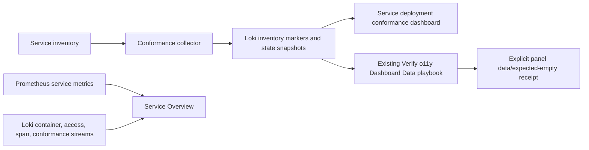

# O11y Dashboard Accuracy

**Date:** 2026-10-10
**Status:** SOURCE IMPLEMENTED; focused checks passed; Dev acceptance pending
**Context:** Plan correction of the production Service deployment conformance and Service Overview dashboards, with OpenSpec contract in `openspec/changes/o11y-dashboard-accuracy/`. Current source references are local to this feature checkout; the live evidence below was supplied with this task.

---

## Problem

At baseline, the conformance dashboard used fixed `[16m]` queries for collector snapshots, even though the reported collector cadence is 15 minutes and recent tasks take about 12 minutes; therefore a healthy delayed cycle could leave panels empty. “Services tracked” counted recent conformance streams rather than inventory markers. The shared dashboard verifier treated every selected panel without data as an error, including empty exception panels; OpenSpec tasks 1.1–1.3 now correct that verifier contract. The Service Overview container selectors omit the known journal stream, which has `signal="container"` and no `container` label (`service-conformance.json:25-37,57-66,70-105,110-131,151-163,287-308`; `verify-o11y-dashboard-data.py`; `service-overview.json:159-210`; `journal.alloy.j2:3-8`).

Current acceptance evidence supplied with this task: Dev is `a052555060b4c9ca5fb59fb44fa64906fc38bd69`. Dev-bound read-only check-mode verifier task 4243, against receiver `b1be2a7b2de884baf10d72bb09646e50dd6d63ba`, returned data for “Services tracked”, “Services not yet run” and “Latest step status by service”; “History incomplete” was empty, so that selected required-data request failed. Task 4244 found no logs for `log_service="o11y/alloy"` in six hours. Task 4246 succeeded for the Overview “All Loki streams” panel using `log_service=.+`, proving at least one Loki stream is queryable. Task 4247 found “Recent container logs” empty across all nonempty service labels. An earlier `.*` selector probe errored; `+` is the accepted nonempty selector. Current Dev `a052555060b4c9ca5fb59fb44fa64906fc38bd69` has no diff in the relevant dashboard/verifier files from receiver `b1be2a7b2de884baf10d72bb09646e50dd6d63ba`. These receipts prove mixed Overview Loki coverage and container-log absence; they do not prove container ingestion. The journal rollout gate remains separate. Collector OTLP delivery was reported successful in scheduled tasks 4235, 4232 and 4230, which does not establish container-log ingestion.

### Collector timing calibration

The supplied read-only Semaphore API measurement covers 12 successive successful collector runs, with the latest ending at `2026-10-10 23:26:50 UTC`. Task durations were 11.7–11.9 minutes and completion gaps were 14.8–15.1 minutes. The dashboards use a 45-minute latest-marker window and mark age at 30 minutes as stale: roughly three observed completion intervals, with a 15-minute stale-to-unavailable allowance. This calibrates the current view to those 12 observations; it is not a lifetime cadence guarantee. No separate Loki delivery-delay measurement was supplied. Revisit the thresholds against later collector and dashboard-verifier receipts if completion gaps or delivery delay change.

## Design Principles

1. **Use owned evidence:** derive tracked services and freshness from collector inventory markers; preserve the collector’s retained latest state (`collect-service-conformance.yml:241-257`).
2. **Make absence explicit:** only exact, selected exception panels may pass empty; query errors and required-panel no-data remain failures.
3. **Keep observability bounded:** reuse existing Prometheus/Loki signals and stable datasource UIDs; add no unbounded labels (`plan/architecture/02-service-onboarding.md:68-80`; `PRINCIPLES.md:366-375`).
4. **Operate through the platform:** validate and deploy with Semaphore; no direct production changes or Clean Deploy (`AGENTS.md:25-40,167-174`).

## Architecture

## Implementation Phases

### Phase 1: Contract and local verification

**Goal:** make required versus expected-empty data behavior testable before dashboard edits.

**Tasks:**
1. Extend the existing dashboard evaluator contract to report exact selected empty-allowed panels as `expected_empty`; keep query errors and all other no-data results failing.
2. Add focused tests for the three described empty exceptions (“Services not yet run”, “Recent failed task snapshots”, “History incomplete”), no inventory markers, query errors, and at least one finite non-empty required result.
3. Run existing dashboard evaluator and dashboard consistency tests.

**Acceptance criteria:** expected empty is visible in the report and does not mask a query error; required no-data remains a failure.

### Phase 2: Dashboard corrections

**Goal:** show tracked estate, source freshness and useful, non-overlapping service signals.

**Tasks:**
1. Count tracked services from valid inventory-marker records and show age of the newest valid marker. Use the measured 45-minute latest-marker window and 30-minute stale boundary above; future receipts may require recalibration.
2. Keep latest pass/fail/skip state through collector recovery using the existing retained-state path. Preserve Grafana dashboard UIDs `service-conformance` and `service-overview`.
3. Update Overview log selection to include the existing `signal="container"` journal stream, retain useful existing container/access/span/conformance streams, and keep their source aggregates disjoint. Keep raw mixed-source drill-down separate from source counts. Use only existing Prometheus series for metrics; live coverage still requires a receipt.
4. Update deploy read-back assertions and focused fixtures/tests for panel titles, UIDs, stable datasource UIDs, query coverage, bounded labels and no-double-count behavior.

**Acceptance criteria:** inventory markers define the tracked count; freshness distinguishes current, stale and unavailable evidence; recent-state display survives a gap; source totals do not double count; source absence is not shown as healthy service state.

### Phase 3: Reviewed Dev acceptance

**Goal:** verify the exact final revision safely on Dev before considering promotion.

**Tasks:**
1. Obtain independent review and green CI for the final commit head.
2. Run the existing `Deploy o11y (Dev)` through Semaphore in check mode, then perform the non-destructive Dev-bound deployment only after review and CI pass. Do not use Clean Deploy or production inventory.
3. Reuse `Verify o11y Dashboard Data (Dev)` with exact selected panel titles. When appropriate, explicitly name only “Services not yet run”, “Recent failed task snapshots”, and “History incomplete” as expected-empty panels. Capture the final receiver revision, task ID, source and panel results. Required Overview metrics and log sources need exact live query receipts. Existing receipts establish that at least one Loki stream is queryable and that “Recent container logs” is empty across the nonempty service labels; do not claim container ingestion. The journal rollout gate remains separate.

**Acceptance criteria:** live data appears for required panels; explicitly permitted empty panels are reported as expected empty; query failures and required no-data fail. Identify the promoted Dev merge commit that contains the reviewed final-head content, then verify the receiver SHA equals that promoted Dev commit. Do not require equality with the pre-merge reviewed SHA because GitHub squash merges rewrite the commit SHA.

## Validation Criteria

| Check | Pass Condition |
|---|---|
| OpenSpec strict validation | `openspec validate o11y-dashboard-accuracy --strict` succeeds directly from the canonical `plan/development` checkout |
| Focused unit/static coverage | Evaluator, dashboard, and playbook assertions cover both positive and empty/error cases |
| Final-head CI and review | Independent review approved and CI green on the exact final head |
| Dev dry run and deployment | Semaphore task uses reviewed revision; no Clean Deploy or production target |
| Live dashboard receipt | Required series/streams return data; expected-empty panels are explicitly named; no runtime claim without receipt |

## Security Considerations

- Keep labels limited to bounded service, step and signal dimensions; task IDs and error detail stay in log bodies, not labels (`collect-service-conformance.yml:16-23`; `plan/architecture/02-service-onboarding.md:68-80`).
- Keep verifier output to safe panel counts/statuses; the evaluator deliberately suppresses backend error bodies and sample values (`verify-o11y-dashboard-data.py:58-70`).
- Deploy only through Semaphore and do not inspect or modify private site-config values from this public repository.

## Cross-references

| Document | Relationship |
|---|---|
| [OpenSpec proposal](openspec/changes/o11y-dashboard-accuracy/proposal.md) | Scope and capability |
| [OpenSpec design](openspec/changes/o11y-dashboard-accuracy/design.md) | Technical choices and risks |
| [Observability architecture](../architecture/06-observability-instrumentation.md) | Existing signals and service view |
| [Service onboarding](../architecture/02-service-onboarding.md) | Signal and label contract |
| [Service deployment workflow](openspec/changes/service-deployment-workflow/tasks.md) | Existing collector workflow and status contract |
| [Observability estate](openspec/changes/observability-estate/tasks.md) | Existing receiver and dashboard rollout gates |

## Revision History

| Date | Change |
|---|---|
| 2026-10-10 | Initial architecture-governed plan and OpenSpec change |
