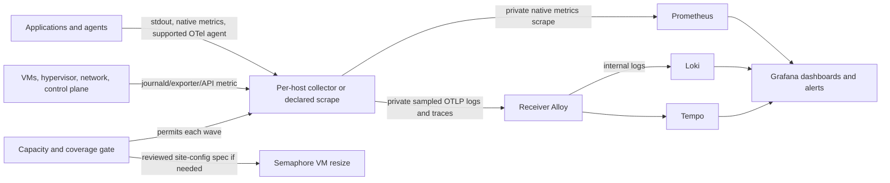

## Context

### Cross-signal identity and profile adoption baseline

The initial receiver contract uses the bounded `service` identity for metrics
and Loki, `service.name` for OTLP resources, and `service_name` for profiles.
`cluster` and `environment` come from controlled inventory values. Alert rules
add bounded `owner` and `severity` values. Request/user identifiers, trace IDs,
timestamps, raw paths, addresses, prompts, and secrets are not indexed metric
or Loki stream labels. Container and instance details remain for drill-down.

Service Overview lists metric-enabled services from Prometheus and queries Loki
by `service`; log-only coverage remains visible in the estate inventory and
Logs Drilldown. Missing telemetry remains a gap rather than a healthy default.
Profiling begins with one opt-in, measured Alloy self-profile target after its
resource and privacy gates pass. Add no other producer until measured ingestion,
retention, host headroom, and a successful profile receipt support the next wave.

See [proposal.md](proposal.md) for motivation and [the capability spec](specs/platform/estate-instrumentation/spec.md) for the behavior contract. The production receiver uses Prometheus for metrics, Loki for logs, and a private Alloy OTLP/gRPC path into single-node Tempo with local persistent storage (`platform/services/o11y/deployment/config/`, `compose.yml`). Grafana self-monitoring and agentgateway dashboards are provisioned. On 2026-09-28, a Dev-bound production deploy of reviewed commit `970dfa3ab545fa64f3c3829f99cf8ab29b7d32f2` passed live checks for all five stack components, the data sources, both dashboards, provisioned cross-signal link settings, alert rules, and the Discord contact point. Separate successful Semaphore receipts proved a named metrics target, a recent trace, alert delivery, retention, and cardinality; their IDs remain in private inventory. A user-visible trace-pivot click-through and some owning OpenSpec task checkboxes remain open. Production Alloy has no engine-socket mount, so its local container log/metrics discovery is not a production coverage receipt. These facts establish a receiver baseline, not estate-wide coverage; the broader rollout remains tracked by `observability-estate` and `inference-telemetry-production`. The architecture's old socket-scraped Prometheus and future Mimir sketches are not current collection mechanisms (`plan/architecture/06-observability-instrumentation.md`, as-built amendments).

The candidate set is generated from the current `platform/services/` and `agents/` trees at census time, including empty scaffolds. A directory is not proof of deployment: the first implementation phase must reconcile every candidate with private inventory, Semaphore templates, and live read-only discovery. The inventory also includes Proxmox, guest OS and container hosts, pfSense/network, DGX Spark, and external endpoints that Agent Cloud actually manages; scope is based on a declared managed target, not an indiscriminate network scan.

## Goals / Non-Goals

**Goals:** Reuse the receiver and onboarding verifier; give each deployed target an explicit signal contract; favor automatic runtime instrumentation; make cost, capacity, privacy, and recovery visible before increasing telemetry.

**Non-Goals:** Require traces from non-request infrastructure, claim traces from unsupported runtimes, switch to Mimir/object storage or high availability in this change, expose OTLP publicly, or clean-redeploy o11y and delete its current data. Future Kubernetes injection is a separate migration concern; the present estate uses Compose/Podman and VMs.

## Architecture

## Decisions

### 1. Inventory the actual estate before choosing exporters

Create one coverage declaration keyed by stable `service.name`/target identity, with lifecycle (`deployed`, `planned`, `retired`, `excluded`), owner, runtime/language, environment, host, signal applicability, method, expected endpoint, budget, and verification receipt. Generate an expected-target report from public service/agent definitions and private inventory; compare it with live read-only discovery, then resolve each discrepancy by a reviewed declaration. The public repo holds the schema and generic methods; `site-config` owns real hosts and network details. Extend the existing `Verify o11y Service` exact-target pattern instead of adding a separate verifier per service.

The audit enumerates every current service and agent directory at run time, including scaffolds, then adds managed infrastructure represented by deployment/inventory (Proxmox, guest OS/container runtimes, pfSense, DGX, and any supported edge dependencies). Every candidate gets an explicit lifecycle classification. This is a **candidate audit**, not a claim that all entries are running.

Alternative rejected: mark every repository directory covered. Several are scaffolds or retired; that would create false-green coverage.

### 2. Use the simplest supported signal source per target

Container stdout/stderr and journald/file logs go through a least-privilege, independently deployable host collector where central socket discovery cannot reach the host; the production receiver is the first such pilot because its engine socket is not mounted. Host collectors send OTLP logs and traces to receiver Alloy, which forwards them internally to Loki and Tempo. Native application/exporter `/metrics` is preferred over a second instrumentation library; two existing required opt-in labels (`scrape`, `port`) and optional `path`/`high_churn` labels serve co-located local containers, while remote targets use private inventory-rendered Prometheus scrape declarations. Do not expose Loki push or Prometheus remote-write as new external ingress. A process that serves HTTP/RPC requests gets a compatibility pilot for the current [OpenTelemetry zero-code mechanism](https://opentelemetry.io/docs/concepts/instrumentation/zero-code/) of its runtime, using deployment parameters rather than a source fork. Zero-code covers supported libraries, not the application's own domain operations; add a small explicit span only for a critical unobserved boundary. Default to no body/prompt/token capture, stable resource attributes, context propagation, bounded attribute values, and sampled traces. Do not inject unreviewed agents into privileged control-plane processes or require eBPF privileges across the fleet.

**Receiver-host journal pilot decision (2026-10-09):** Dev-bound Semaphore survey 3662 at reviewed `dev` revision `7c863948` observed rootless Podman's `journald` default, seven running o11y containers using that driver, and 216 exact-name entries in a bounded user-journal metadata read. Receiver Alloy has no read-only host journal mount. This proves a journal source exists for the receiver host; it does not prove container-side file access or log delivery. Pilot an independent Alloy v1.9.2 collector with only declared read-only journal directories, persistent collector state, no engine socket, no host network, and no published listener. Use [Alloy's journal source](https://grafana.com/docs/alloy/latest/reference/components/loki/loki.source.journal/) and [Loki-to-OTLP bridge](https://grafana.com/docs/alloy/latest/reference/components/otelcol/otelcol.receiver.loki/) to send bounded, allowlisted container records to the existing private receiver OTLP endpoint. Keep `service`, `signal`, `cluster`, and `environment` bounded; exclude raw journal fields, request identifiers, and content from labels. The read-only survey uses only a cached receiver Alloy v1.5.1 image, with `--pull=never`, as a rootless UID `0:0` file-read probe; it does not validate collector configuration. If that cached probe image is absent, report the fixed `probe_unavailable` result and do not pull. Apply separately acquires the exact Alloy v1.9.2 collector image if absent, then runs the official [Alloy `validate` command](https://grafana.com/docs/alloy/latest/reference/cli/validate/) before any collector recreation. The command performs supported static configuration validation of syntax, components, and properties, with runtime stability flags matched; v1.9.2's [official changelog](https://github.com/grafana/alloy/blob/main/CHANGELOG.md) includes a validator fix for `livedebugging` blocks. First prove the exact host journal directory exists and is readable by the rootless collector, then require a receiver-side Loki query for the declared pilot container. Refuse ambiguous directories, permissions, an empty source, or a missing receiver receipt. Explicit stop and failed-delivery rollback stop and remove only the pilot container without `podman rm -v`, verify that it is absent from Podman's reboot restart set, and verify the named positions volume remains. This matches [Podman's restart behavior](https://docs.podman.io/en/latest/markdown/podman-create.1.html) and [container removal semantics](https://docs.podman.io/en/latest/markdown/podman-rm.1.html). Deploy and rollback through separate Dev-bound Semaphore workflows without changing or deleting the receiver's volumes. The current local socket pipeline remains local-only; a later cohort may reuse this collector mechanism after its privacy and volume gates pass.

**Positions-volume survey and repair gate (2026-10-09):** The explicit `survey` action resolves the one existing local `journal-collector-state` volume by Compose project and logical-volume labels, including when the journal collector is absent. It reads bounded root and direct-child metadata in the rootless Podman user namespace and never mounts the volume or reads positions content. A fixed `podman volume inspect --format` template reads `NeedsChown` and `NeedsCopyUp` as literal `false`/`true`; JSON field presence remains a separate diagnostic because Podman v4.9.3 may omit false-valued fields. Inventory, named JSON reads before/after the template, and template identity are cross-checked; invalid output or identity races refuse every gate. The separate `repair-positions` action retains its initialized-volume path: after fresh evidence proves an unused initialized volume's root ownership alone blocks `0:0`, it changes only root owner/group, verifies readback, and runs the restricted Alloy create/write/rename/delete probe. **Narrow pending-volume exception:** for exactly one empty unused volume with `NeedsChown=false`, `NeedsCopyUp=true`, blocked non-`0:0` root ownership, and fresh identity/metadata checks, repair may change only the root owner/group to `0:0` when mode is already safe. The source-level pending mode-reduction implementation additionally permits clearing only group/other write bits before that owner change; reviewed live Semaphore repair and collector/Loki acceptance remain pending. It performs no access-probe mount, preserves contents, and verifies identity, owner, the exact expected mode, and emptiness; repair success does not authorize first mount or collector apply; after any pending-volume mutation, failure preserves the volume and returns bounded uncertain status; no automatic owner restoration is attempted because a mount followed by removal cannot be ruled out from current state. No owner rollback or state deletion is permitted after Compose's first mount. Free-byte and free-inode thresholds are checked independently from stable metadata: above-threshold counter changes do not invalidate root/child/ACL/mount evidence, while low or unavailable counters refuse repair. Pending repair checks both GraphRoot and volume-filesystem capacity; initialized repair checks the volume filesystem. Both paths refuse ACLs, mount boundaries, symlinks, non-regular or multiply linked children, and child ownership mismatch. Unsafe modes refuse except for the implemented pending-only group/other write reduction; initialized-volume repair retains mode unchanged. Check mode reports `check_mode_unverified` without Podman or filesystem calls.

**Pending-volume repair diagnostics (2026-10-09):** Survey and the initial `pending_volume_unsupported` refusal share one fixed checklist derived from the strict pending owner-only gate. The implemented mode-reduction exception evaluates the same checks while permitting only the combined write/special-bit check to fail from group/other write bits alone; a present write-bit diagnostic remains unsafe until actual reduction and fresh readback prove otherwise. Expose only owner-RWX and unsafe-mode-bit enums, separate volume/GraphRoot byte and inode categories (`sufficient`, `low`, `unverified`), and the bounded `failed_checks` enum list. The diagnostic uses the existing discovery snapshot; it adds no Podman command, probe mount, content read, or ownership change. Repair refusal remains `refused`; the receipt explains only the initial observation and does not replace fresh identity rechecks or authorize mutation. Check mode and exception fallback preserve the schema with all evidence unverified.

**Pending-volume mode-bit follow-up (2026-10-09):** The Dev-bound read-only survey 3917 at exact merged Dev SHA `63946505875639b8b0080a045fa1e0ae08ab4a9b` confirmed the existing combined group/other-write-or-special-bit check failed while the pending volume remained otherwise available for diagnosis. Add five separate fixed categories (`group_write`, `other_write`, `setuid`, `setgid`, and `sticky`) from the same metadata snapshot. Preserve the combined category and `failed_checks` predicate; these extra fields explain the combined result but do not alter any acceptance or repair condition. Missing mode, check mode, and survey exception output use `unverified`. No raw mode, ownership, path, or capacity values are exposed, and the change adds no runtime probe or mutation.

**Pending mode reduction implementation (2026-10-09):** User-supplied sanitized evidence records successful read-only Dev-bound Semaphore task 3925 at exact merged Dev SHA `8050f2768903e09f68285f90c1598cb120006219`: the pending positions volume was unused, empty and unmounted, owner mismatched, owner RWX complete, ACL absent, collector absent, and volume/GraphRoot byte and inode capacity sufficient. Only `group_other_write_or_special_absent` failed; `group_write` was present while `other_write`, `setuid`, `setgid`, and `sticky` were absent. Earlier repair task 3899 refused before mutation. These receipts were supplied by the user, not independently reread here; they bound the implemented exception but do not authorize mutation, establish repair readback, collector readiness, or Loki delivery.

Retain the safe-mode pending owner-only path and the initialized-volume path. Add only an explicit pending repair exception when fresh evidence proves exactly one local expected volume, `NeedsChown=false`, `NeedsCopyUp=true`, no collector in all containers (including stopped), zero consumers/mounts, exactly empty root, owner mismatch with collector access blocked, complete owner RWX, ACL absent, and all identity, metadata and capacity guards passing. The only permitted initial failed check is `group_other_write_or_special_absent`, and its cause must be proven group/other write alone: special bits absent and mode an exact integer in `0..0o7777`. Unknown or malformed observations refuse. Derive `target_mode = original_mode & ~0o022`; never substitute a fixed `0700`, add owner permissions, strip group/other read/search, clear special bits to make an unsafe case eligible, or apply this exception to initialized/nonempty state. Keep the combined diagnostic and failed-check list truthful for the original snapshot; separate mode-bit diagnostics do not authorize repair.

Pin the volume creation timestamp, configuration, expected name/project and mountpoint, root device/inode, original owner/group and mode. The mode and owner changes use separate rootless helper processes, so one open descriptor cannot span the required full Podman discovery between mutations. Before each mutation, open the exact directory without following symlinks and compare descriptor metadata with the pinned root device/inode and the exact expected owner/mode. The first helper reduces permissions to `original_mode & ~0o022` and verifies exact target mode plus unchanged identity/owner/emptiness. Then repeat full discovery and emptiness/ACL/use/mount/capacity checks with the reduced mode as the sole expected metadata change. Only after that readback passes may the second helper change root owner/group to `0:0`; it independently pins and rechecks the same root device/inode before changing ownership. Verify fresh discovered identity, exact target mode, new owner, empty contents, initialization flags, collector absence, zero consumers/mounts, ACL absence and capacity. No recursive operation, content read/write, probe mount, volume creation/deletion, or Compose start belongs to pending repair. A rerun of an already converged safe volume must not mutate it again or start a collector.

Any failure before mutation refuses with no change. Once permission reduction or ownership change may have occurred, every command failure, exception, identity/metadata drift or failed readback returns bounded `uncertain`, preserves the volume, and never automatically restores mode or owner. Descriptor pinning protects the selected inode but does not serialize Podman, other same-user processes, child creation, ACL changes, or mount history; repeated snapshots cannot rule out mount-then-remove races. Require an operator-controlled quiescent repair window and fresh checks; refuse observed races, retain uncertainty after mutation, and require separately reviewed recovery if certainty cannot be re-established. No claim of atomicity or historical first-mount proof is made.

Alternatives rejected: fixed `0700` removes unrequested read/search permissions; owner-first leaves write exposure during the owner transition; automatic restoration can reintroduce write permissions or alter state after an unobserved mount; broad mode normalization admits unsafe special-bit or owner-access cases. The permission reduction is deliberately limited to the empty pending root.

Implementation: the pending branch retains the original failed-check list and permits only exact write-bit reduction for an empty, unused pending volume when it is the sole failed guard. The mode helper pins and verifies the root descriptor; complete fresh discovery/readback then gates the existing owner helper, which independently pins the same device/inode. Post-mutation failures return bounded `uncertain` with no restore. Focused coverage includes write-bit combinations with read/search preservation, safe-mode owner-only behavior, initialized-path behavior, converged rerun, malformed/special modes, missing owner RWX, unrelated failed guards, pre/post-mutation races, readback, capacity and sanitized failure results. Check mode remains unverified and runtime-free. Source-level validation does not accept the live repair: after independent exact-head review and green CI, run the Dev-bound check-mode workflow, a fresh read-only survey at exact merged SHA, a separately selected `repair-positions` task, and a separate read-only post-repair survey. Record sanitized task IDs/SHA and safe-mode `0:0` readback; this implementation session runs none of those live tasks. Only a separately authorized later collector-apply task, with its full pre-apply and immediate pre-start gates, may perform Compose's first mount. Require live mount/cursor/access/health, unchanged receiver set and fresh exact-target Loki delivery before closing task 1.2.

**First-start bootstrap and bounded survey fallback (2026-10-09):** The pre-apply and immediately-before-start read-only gates may return `bootstrap_allowed` for a missing expected volume only after complete bounded inventory, no expected-name collision, and an all-container inventory (including stopped containers) proves the journal collector absent. An existing pending volume is eligible only with one exact local identity, zero users and mounts, effective `NeedsChown=false` and `NeedsCopyUp=true`, and an empty, unambiguous root already owned by `0:0` with owner RWX and no group/other write, special bits, ACL, nested mount, or metadata ambiguity. The narrowly scoped root-only repair and implemented mode-reduction exception above may establish that same safe ownership and mode before first mount only after comparing volume `CreatedAt`, volume configuration, and root device/inode across observations; Compose `up` remains the sole creator/initializer. The first-mount headroom gate requires at least 16 MiB available and 128 available inodes on both GraphRoot and the pending volume filesystem; this does not replace or weaken the independent 30% retention headroom gate. The immediate pre-start check runs outside rollback handling. After Compose's first mount, a persistent `NeedsCopyUp=true` flag is not success by itself: require the exact live RW mount, namespace create/write/rename/delete, bounded allowlisted Alloy layout, the parsed `positions.yml` map entry for `cursor-loki.source.journal.o11y_alloy` with an empty label set and a valid journal cursor, collector health, unchanged seven receiver containers, and a fresh exact-target Loki receipt. Empty image destination can leave copy-up pending; partial copy or unexpected files refuse and preserve the volume. Rollback removes only the pilot container, without `-v`; it never restores ownership or deletes copied state. The strict cursor gate can expose first-start failure or replay risk when initialization is partial. Unexpected survey exceptions remain bounded as `survey_failed`; the positions helper remains `check_mode_unverified` in check mode without its own Podman or filesystem operations. These are source-level facts, not live receiver evidence; task 1.2 remains open.

The helper's `verify` action is the pre-start gate; `verify-live` is the post-start gate. Pre-start may return `ready` without a cursor only for a complete observed volume with both initialization flags false, no collector in the all-container inventory, zero consumers and mounts, an exact safe identity, root `0:0`, access and capacity evidence on GraphRoot and the volume filesystem, no ACL or nested mount, an allowlisted empty/seed/component layout, and explicitly observed absence of `positions.yml`. This permits one bounded Compose start attempt and is not delivery proof. A present invalid or unreadable file, unknown cursor presence, or incomplete/unsafe component layout refuses. Here, partial copy means a present invalid/unreadable cursor file, a pending temporary positions file, or any layout outside the allowlist; proven cursor absence before start is a separate retry case. Post-start always requires the valid parsed cursor plus the live mount and access evidence; it never returns `bootstrap_allowed`. No phase deletes or replaces positions state or automatically restores ownership after pending mutation. Empty or allowlisted state cannot establish historical copy-up or cursor-loss history, so replay/loss safety remains unproven until live evidence is recorded.

**Collector state-path permission correction (2026-10-09):** The pinned [Alloy v1.9.2 Dockerfile](https://github.com/grafana/alloy/blob/v1.9.2/Dockerfile) creates `/var/lib/alloy` for UID/GID 473 with mode `770`. The journal pilot intentionally runs as `0:0` with all capabilities dropped, so its named state volume must not sit below that image-owned parent. Keep the existing named volume and mount it at `/alloy-state`, set `--storage.path=/alloy-state`, and require the helper's exact destination check plus the playbook's live write probe and rollback volume lookup to use that same path. This avoids relying on copy-up through an inaccessible image ancestor and preserves the UID/capability boundary. Dev task 3973 failed health and rolled back after 80 permission-denied log lines, with the fixed positions target and fixed TCP readiness probe both failing; read-only task 3977 found the collector absent and the existing named volume empty, unused, unmounted, owned by UID 0 with RWX mode and no ACL. These receipts do not establish successful collector health or Loki delivery; task 1.2 remains open.

**Positions initialization-schema diagnostic follow-up (2026-10-09):** Dev survey 3856 succeeded with `volume_initialization_unverified`, zero consumers and entries, root owner mismatch, blocked access, ACL absent, clear mount state, and safe direct children. The journal source was available while the target positions path was denied. Keep initialization flags fail-closed for every gate. The survey alone adds a second exact-name volume inspection and Podman client/server version query after unique volume identity is established; it reports only field presence/type, actual boolean values, named-query outcome, identity comparison, and validated bounded version strings. Unrecognized values, command failures, and malformed or duplicate named results remain categorical/unavailable. Check mode performs no Podman calls and returns the same diagnostic shape as unverified. The extra named-volume identity diagnostic and version query run only during survey and never change gate decisions; the identity-bracketed initialization-flag read is required by every gate and does control decisions.

Signal selection per cohort:

| Cohort | Default collection | Trace decision |
|---|---|---|
| o11y, Caddy, DNS, step-ca, OpenBao, OPA, Authentik, Semaphore, NetBox | host/container logs; native or vetted exporter metrics; readiness | request-serving components only after runtime compatibility/security pilot |
| App and data services: n8n, Postiz, tududi, honcho, UhhCraft, ERPNext, OpenHands, Nextcloud/NocoDB/WikiJS if deployed | stdout plus DB/queue/app metrics; request/worker identity | runtime agent where supported, manual span for an important workflow gap |
| Agent and inference workloads: agentgateway, DGX, NemoClaw, NetClaw, WisBot, WebSmith, ComfyUI, Hunyuan3D | retain proven gateway/DGX paths; add worker/job and GPU/model metrics where supported | keep existing gateway trace path; pilot agent/runtime tracing with prompt redaction |
| Proxmox, guest OS, container engine, pfSense and other managed devices | node/hypervisor/device exporter or read-only API metrics, system logs, health | not applicable unless a request-serving software component has safe support |
| GitHub runner hosts | host health and bounded metrics first; job logs only after an entitlement and redaction decision | job tracing is not assumed |

Alternative rejected: mandate the same three signals for every process. A router or database can be fully diagnosable with logs and metrics while a fabricated trace requirement obscures missing real coverage.

### 3. Preserve one private receiver and bound every signal

Collectors use site-config source allowlists enforced by the reviewed host firewall; this is source-IP admission, not cryptographic host identity. OpenBao supplies any credentials through Ansible memory. Prometheus scrapes only declared private targets; OTLP ingress stays on a private interface behind source-scoped rules. Task 3.4 tests a rejected connection from a named, unapproved vantage host. Receiver Alloy gets explicit memory/backpressure handling and exporter retry/queue limits before more senders are added, following [Alloy's access and permission guidance](https://grafana.com/docs/alloy/latest/access_permissions/). Per-target scrape sample limits, allowed labels, log redaction/volume controls, trace head sampling, backend ingestion limits, and retention are declared and verified. Set a non-zero Prometheus size retention and receiver disk-free alert before the first expansion wave. Normalize the environment/cluster label from inventory in both Prometheus and Alloy before cross-environment joins; migrate existing dashboards and alerts with the label change. Alert on receiver refusal, collector drops, unhealthy scrape, missing logs, and absent expected traces. Correlate by normalized `service`/`service.name`, environment, and bounded instance identity; never put request IDs, user IDs, prompts, secrets, or raw URLs in metric labels.

Alternative rejected: allow every discovered host to export all telemetry. It expands network and cardinality risk before a service has a budget or owner.

### 4. Resize from evidence, not a guessed VM size

First deploy and verify a receiver-host node metric source through Semaphore; the current five-component scrapes do not provide VM CPU, memory, or filesystem capacity. This bounded source is the only sender allowed before the baseline. Start the representative seven-day clock at its first successful exact-target receipt, then measure peak log bytes/day, active and new Prometheus series, samples/s, Tempo spans/s and bytes/span, p95 host CPU/memory, guest disk use and growth by backend, Alloy drops/queue, and dashboard query pressure. Extend the window if traffic is unrepresentative. Pilot one workload in each cohort to estimate the next wave. Extend the existing production budget verifier and comparator for a read-only forecast rather than creating a parallel receipt path. Forecast retained bytes using measured ingestion and compression per backend multiplied by the declared retention, then add the pilot's peak factor and at least 30% free disk headroom. Require at least 25% memory headroom at observed peak and p95 CPU below 70%; a refusal/drop or unhealthy query is a stop even if the numeric margins pass. Record the forecast, assumptions, and receipt without private addresses in the public repo.

If the capacity gate fails, change `site-config` VM resource declarations and inventory together, review them, then run existing `platform/playbooks/resize-vm.yml` through its Dev-bound Semaphore template. That playbook grows only the Proxmox disk; before any disk resize, implement and check an idempotent Semaphore-managed guest partition/LV/filesystem growth path for the receiver's actual layout. Refuse unsupported layouts and require a backup/restore receipt. The receipt must identify an immutable backup artifact and exact source disk/layout, prove restoration to an isolated target, validate the restored guest filesystem and preserved telemetry-volume access, and record cleanup of the isolated target. Snapshot creation and snapshot-list presence are insufficient: existing `snapshot-vm.yml` does not restore data. No such restore-test workflow currently exists, so guest growth remains prohibited until it is designed, reviewed, and successfully exercised. Its reboot remains opt-in; first read the current-vs-desired diff and confirm Proxmox storage, schedule any required reboot, then read back VM capacity, guest filesystem capacity, stack readiness, and preserved telemetry. A size increase is a measured gate, not a preselected number. Tempo's own [sizing guidance](https://grafana.com/docs/tempo/latest/set-up-for-tracing/setup-tempo/plan/size/) depends on span rate, span size, query rate, and retention; the same variables are recorded here.

2026-09-28: read-only receiver task 1801 confirmed the exporter runtime boundary (private PID, read-only host-root mount, one private network, no published ports). It found guest root is ext4 on an LVM-backed virtual disk and Podman's volume/graph paths share that filesystem; only 6.88% free remains, below the retention-expansion threshold. Exact device identifiers/capacities are private. No restore-test receipt exists; the current snapshot workflow is not a substitute.

Alternative rejected: immediately allocate a larger o11y VM. It could waste resources or still under-size the wrong bottleneck; retention and label cardinality must be measured first.

### 5. Deliver coverage in controlled cohorts

Complete the remaining o11y/agentgateway user-visible and owning-task receipts first. Build the coverage census and budget gate next. Pilot receiver-host metrics/log collection, then one other infrastructure VM and one application VM before expanding to control-plane/network, stateful applications, and agent/inference cohorts. For each remote target, probe from the receiver, apply the reviewed source-scoped firewall rule, prove HTTP 200 or OTLP admission, and only then merge its scrape/export declaration; an early `up=0` fires the existing service-down alert. Runner hosts stay a separate decision gate: their private-repository job output cannot enter shared Loki without an entitlement/redaction review, and their egress and OpenBao restrictions require a reviewed collector design. Each wave is a reviewed feature-to-`dev` change with one completed CodeRabbit or Claude review and green final-head CI, followed by Dev-bound Semaphore dry-run/check mode where meaningful, apply, exact-target proof, dashboards/alert drill, and an operator-driven reviewed revert/redeploy drill. Keep tightly related public changes in few PRs; private site-config declarations get their own reviewed PR because that repository owns production facts. Reconcile the coverage report after each wave; only a complete deployed-target inventory with fresh receipts closes this change.

## Risks / Trade-offs

- **Host collector permissions or remote logs expose sensitive data** → pilot least privilege; filter/redact before export; verify secrets and request bodies do not appear in Loki or task output.
- **Automatic agents alter process behavior or create high-cardinality telemetry** → compatibility matrix and one-service pilot per runtime; explicit version pin, startup/rollback switch, sampling and attribute limits.
- **Single-node local Tempo storage or receiver VM fills** → capacity gate, retention, disk alerts, no clean-volume validation; document backup/restore and separate storage migration if the measured load outgrows this topology.
- **A green `up` masks the wrong target** → exact instance and fresh log/trace checks; failed or stale receipts remain visible.
- **A VM resource change requires downtime** → keep reboot opt-in, verify guest filesystem and health after it, and pause the next wave until the previous baseline is restored.

## Migration Plan

1. Reconcile remaining receiver and agentgateway acceptance tasks with their live receipts; verify a user-visible trace pivot. Deploy a receiver-host node metric source and log collector, obtain an exact-target receipt, then begin the seven-day measurement window.
2. Add census declarations and extend the existing production budget verifier for read-only coverage/capacity reports; resolve all unclassified deployed targets. No other sender is enabled in this phase.
3. Pilot reusable host collection and runtime auto-instrumentation, then gate and release one cohort at a time. Add code-provisioned dashboards and alerts only for metrics and traces actually present.
4. When a wave needs capacity, merge the private resource declaration, converge it via Semaphore, run the reviewed guest-growth playbook if disk grew, verify preserved state, and rerun the budget forecast before enabling the wave.
5. On failure, an operator reverts the reviewed declaration through the branch workflow and redeploys from `dev`, verifies the old signal/alert baseline, and retains data. Disk growth is not rolled back by shrinking; unused capacity is left in place.

## Open Questions

- Which source-only service directories correspond to current production workloads? Resolve from private inventory and Semaphore/live readback in the census, then record lifecycle explicitly.
- What are the actual per-backend daily ingestion and compression factors? Measure after current acceptance; they determine the VM number but do not change this design.

## 2026-09-28 production receipts and bounded follow-up

Non-destructive production o11y deploy task 1822 succeeded on reviewed `dev`
SHA `c0f65d9b4dca84a3c5b2e33f7e876e72ccac8b25` and passed the receiver-host
versus guest-root metric check. Read-only budget task 1823 resolved all five
named volumes to the shared guest-root backing filesystem and measured 7.06%
free. The deploy preserved existing volumes and they remained mounted and
observed; this does not establish historical data continuity inside every
volume. Retention remains Prometheus 15d, Loki 7d, Tempo 168h, and the
Prometheus size cap remains 0B. Task 1823 observed 13,088 active head series,
87.55% guest memory headroom, and sample limit 2,000. These are point-in-time
readings, not a seven-day capacity forecast or Loki/Tempo growth trend. Log
delivery and the seven-day baseline remain open.

The provisioned root-filesystem warning is scoped to the verified
`receiver-host` job, `o11y/receiver-host` service, and `/` mountpoint. It uses a
less-than-10% threshold for 15 minutes, warning severity, and the existing ops
contact; missing filesystem samples become alerting. Source and render tests
are not live firing evidence; see the 2026-09-29 production receipt below.

The Dev-bound backup readiness survey uses OpenBao-sourced Proxmox credentials
and read-only API requests against the single declared `o11y_svc` VM. Its
sanitized result contains aggregate counts only: active storage entries that
declare backup content, their PBS versus non-PBS backend classes, and matching
backup-content records for the VM. Missing or malformed backend types refuse
the result; storage identifiers, paths, and free-form values are never shown.
Listed records are candidates only: the survey cannot establish immutable
retention, choose an artifact, identify an isolated restore target, or prove a
restore. The separately reviewed restore workflow must validate the restored
guest filesystem and telemetry-volume access, then record isolated-target
cleanup before guest growth is allowed.

Read-only Semaphore survey task 1835 succeeded against exact reviewed `dev`
SHA `fb7e5315f4f8d85a6b5b26a4f24d93f4692dbc7a`; it reported three active
backup-capable storage entries and zero matching backup artifacts. Later,
read-only Dev-bound survey task 1945 succeeded and reported one candidate
artifact, three non-PBS backup-capable stores, zero PBS stores, and a verified
target VM. Its listing was complete, while artifact immutability, isolated
target verification, and restore verification were all false. It did not
select storage or alter Proxmox state. These facts still do not identify an
immutable source or restore destination, so tasks 4.2 and 4.6 remain gated.

The new Dev-bound `survey-o11y-backup-artifact.yml` is read-only and reports
only allow-listed candidate metadata (backend class, format, byte size,
creation epoch, and protection status) plus source VM disk device/size/backup
inclusion layout, including EFI and TPM state disks. Raw API results, volume
IDs, storage names, and free-form values remain under `no_log`; no hash or
reversible identifier is included in the visible receipt. A future restore
workflow must use a separately declared private artifact selector. The
inspector validates PBS VM records in the official `backup/vm/<vmid>/<UTC
timestamp>` form with `pbs-vm` format, and requires the volume storage prefix to
match the listing source. See the [Proxmox PBS storage implementation](https://github.com/proxmox/pve-storage/blob/master/src/PVE/Storage/PBSPlugin.pm).
An absent protection field remains `unknown`; a reported protection flag is
not immutability evidence. The survey always reports immutability and restore
verification as false. Reviewed Dev task 1953 succeeded with one non-PBS
candidate and complete source disk sizes. At least one backup-inclusion flag was
absent, so backup inclusion remains unverified; parsed layout does not prove
guest state was included. The run did not establish immutability, an isolated
target, or restore success. Read-only Proxmox cluster validation task 1955
reported image-storage capacity facts, but did not inspect physical disks, LVM,
or filesystems. Use these facts to declare any artifact selector and then
design the isolated target and immutable storage mechanism in private
site-config before implementing a restore workflow.

The follow-on restore-feasibility receipt is deliberately narrow. It reports
source-layout parse and size completeness separately from whether exactly one
supported artifact candidate is present. It reports the count of distinct
storage IDs that Proxmox reports active, non-shared, and image-capable on at
least one online node other than the source VM's node, with enough
point-in-time `avail`/`total` capacity for the complete source disk layout while
retaining at least 30% of reported total capacity. If any source disk size is
unknown, no storage qualifies. EFI and TPM state disks are included in the
aggregate size. An absent or malformed `shared` field fails closed for an
active image-capable storage; shared storage is not counted. It does not choose
a storage; non-shared storage IDs count once. Malformed or incomplete
node/storage reads fail closed. A returned
`cluster/nextid` value means only that a candidate was available at read time:
the value is suppressed and no ID is reserved. Neither result proves a future
restore can be placed or that an artifact is usable.

Reviewed Dev task 1964 at merged SHA
`2c8382c77b8ccf2542b69faf72044a18d2c7f9fc` completed this feasibility
receipt; publisher tasks 1962 (check mode) and 1963 (apply) passed. It reported
one supported non-PBS candidate, complete source disk sizes, backup inclusion
unverified, three distinct off-source non-shared image-storage IDs meeting the
point-in-time capacity/headroom test, and a current VMID candidate that was not
reserved. Immutability, an isolated target, and restore success remain
unverified. The storage count is based on Proxmox status rows, not a physical
device mapping or a reservation.

The selected backup destination remains local-only PBS on a separately declared
cluster node; the node declaration belongs in private `site-config`. The
current image-capacity and VMID checks do not establish that node's physical
disk safety or PBS datastore readiness. The new Dev-bound physical-storage
survey reads only `/nodes/{node}/disks/list?include-partitions=1`, `/disks/lvm`,
`/disks/lvmthin`, `/disks/directory`, and `/nodes/{node}/storage`, after
validating the private node declaration against the live node list. These
official Proxmox endpoints expose device paths, usage classes, VG/PV and thin
pool sizes, managed mount paths/devices/types/options, and storage status. The
survey maps these to allow-listed aggregate counts and coarse reported-capacity
bands under `no_log`; it emits no names, IDs, paths, serials, mount details, or
exact capacities. See the upstream [disk inventory API](https://github.com/proxmox/pve-storage/blob/master/src/PVE/API2/Disks.pm),
[LVM API](https://github.com/proxmox/pve-storage/blob/master/src/PVE/API2/Disks/LVM.pm),
[thin-pool API](https://github.com/proxmox/pve-storage/blob/master/src/PVE/API2/Disks/LVMThin.pm),
[directory API](https://github.com/proxmox/pve-storage/blob/master/src/PVE/API2/Disks/Directory.pm),
and [storage status API](https://github.com/proxmox/pve-storage/blob/master/src/PVE/API2/Storage/Status.pm).
The Proxmox API token needs `Sys.Audit` for node/disk inventory and
`Datastore.Audit` (or `Datastore.AllocateSpace`) for each visible storage
status read.
An absent disk `used` field remains unknown. Directory entries can represent
local directories or mounted shares; the survey does not establish locality.
Storage capacity bands are reported as per-storage counts rather than summed
capacity, since separate storage declarations may overlap backing resources.
All reported capacity is descriptive, not PBS suitability or physical
readiness. The survey is GET-only and never selects a device. Separately
reviewed idempotent disk/LVM/filesystem automation must match the private
declared layout before any write; no unused device may be presumed safe or
selected automatically. Live survey execution remains pending.

The physical survey succeeded as Dev-bound Semaphore task 1981 at merged SHA
`ab98eaa3489937a854431ad046ddc5cd19c5c196`; publisher tasks 1978 (check mode)
and 1979 (apply) passed. Its sanitized receipt reported 7 physical devices,
3 partitions, 3 disk-usage values unknown, 4 LVM volume groups containing 4
physical volumes, 1 thin pool, 0 Proxmox-managed directories, 6 visible
storage-status rows (5 active), 3 explicitly non-shared rows, 3 shared rows,
and 5 rows with positive reported capacity while 1 capacity was unreported.
Device selection/safety, filesystem readiness, PBS suitability/readiness, and
write authorization remained false. A first invocation refused because the
private VM-image storage declaration was absent; the existing code-managed
inventory synchronization reconciled that private declaration before task
1981 succeeded. Private identifiers and exact capacities remain outside this
repository.

The local-only PBS placement strategy is a VM with a new virtual data disk on
the separately declared image store; this does not authorize initializing a
physical host disk. The GET-only preflight requires the exact declared active,
non-shared `lvmthin` `images` row, reads its storage configuration to resolve
`vgname`/`thinpool`, and requires one matching thin-pool record. The node
storage-status `total`/`used`/`avail` must agree with the linked thin-pool
`lv_size`/`used`; any disagreement refuses the receipt. The content request
has no `content=images` filter, so it can include every visible image and
rootdir row. Each volume ID must have the exact declared storage prefix, a
supported `vm-` or `base-` owner/name form, a unique ID, an allowed content
type, a raw format, and a positive size. IDs and capacities are never printed.
However, this is only a visible-volume inventory: Proxmox's LVM-thin
`list_images` excludes `snap_*` logical volumes, while its snapshot operations
create those volumes. The preliminary calculation also requires the storage
configuration to declare exactly both `images` and `rootdir`: an images-only
configuration could omit preexisting rootdir volumes from the content API
listing. No snapshot-complete read is established in this survey.
Therefore `snapshot_inventory_complete_verified` is always false and the
256/512/1024-GiB results are named
`snapshot_unverified_visible_volume_preflight_passes_*`; they are preliminary
facts only, not safe-allocation guidance. VM/disk provisioning requires a
separate reviewed snapshot-complete audit gate before any allocation.

The preliminary visible-volume calculation passes only if the listed virtual
sizes plus the proposed disk leave at least 30% of pool size, a hypothetical
full write of the proposal leaves at least 30% of pool size in reported
physical availability, and current thin-pool metadata free space is at least
30% of metadata size. The metadata condition is a current threshold, not a
forecast of metadata use caused by a new unwritten disk. These are
point-in-time, non-reserving facts and never authorize allocation or establish
PBS, guest filesystem, physical safety, or restore readiness. The Proxmox
LVM-thin plugin reports volume `size` from `lv_size`, while its status reports
pool size, used, and available; the thin-pool API exposes metadata size and
used bytes. The storage-content API can silently filter rows using per-VM
`VM.Config.Disk` permissions, so HTTP 200 alone does not prove the visible
listing is permission-complete. Before interpreting it, the survey reads the
caller's effective permissions for the exact declared storage and requires
both `Datastore.Allocate` (which upstream `check_volume_access` uses to bypass
per-VM filtering) and `Datastore.Audit` (required by the content endpoint).
If either privilege is absent from a valid permissions response, the fixed
`visible_volume_permissions_verified` fact and all preliminary size booleans
remain false. If the private declaration is missing or malformed, or a
required Proxmox API request fails (including permission-denied content
listing), the task can stop before producing a sanitized receipt; raw request
details remain hidden by `no_log`. No API-token ACL is changed here. Exact
pool/status `used` equality is required across separate GET requests; concurrent
writes can cause a fail-closed refusal, in which case rerun the survey after
activity settles. No tolerance is applied. See the [Proxmox storage
guide](https://pve.proxmox.com/pve-docs/pvesm.1.html) and [LVM-thin status
implementation](https://github.com/proxmox/pve-storage/blob/master/src/PVE/Storage/LvmThinPlugin.pm), [storage-content API](https://github.com/proxmox/pve-storage/blob/master/src/PVE/API2/Storage/Content.pm), [thin-pool API](https://github.com/proxmox/pve-storage/blob/master/src/PVE/API2/Disks/LVMThin.pm), and [effective-permissions API](https://github.com/proxmox/pve-access-control/blob/master/src/PVE/API2/AccessControl.pm).
Live execution of the expanded virtual-disk preflight remains pending.

## 2026-09-29 thick-LVM visible-store preflight

Task 1998's sanitized result showed one directory, two LVM, one LVM-thin, and
two other visible storage backends. The follow-on uses the existing Dev-bound
physical-storage survey with one added protected `GET /storage`. It joins
visible storage config/status rows to `/nodes/{node}/disks/lvm` by validated
storage ID and `vgname`. Only active `lvm` rows with explicit `shared=0` and
`images` content are candidates; each must map to exactly one unique volume
group. Status total/used/available must exactly match that VG's size/free
extents. Malformed or duplicate IDs/VG mappings and inconsistent values fail
closed. Because configuration fields such as `content` can be optional, rows
are validated for storage ID and type globally; `content` is required and
validated only when a matching active, non-shared LVM status row advertises
image content. A config row with `disable=1` is excluded even if node status
reports it active. Any other visible `lvm` or `lvmthin` config row naming the same
VG excludes that candidate, including shared, inactive, non-image, or
foreign-node rows; incomplete or node-unmapped local VG mappings
suppress only thick-LVM candidate and headroom counts, while aggregate
diagnostic counts remain available.
Either a local-applicable LVM/LVM-thin config row without same-type target-node
status (including disabled configs), or a target-node status row without a
matching same-type local-applicable config row, makes the mapping incomplete
and suppresses only thick-LVM candidate and headroom counts. A matching
foreign-scoped config/status pair marked `enabled=0` is excluded from local
completeness; local-applicable configs remain checked even when disabled. An
invalid or duplicate storage ID, or a missing/non-string
type, in the new visible cluster-config response can refuse the entire sanitized
survey; types may repeat. Only the candidate's linked capacity tuple is
required to match exactly. Existing unrelated node-status and VG validation
remains governed by the original survey.

Task 2011 completed the GET-only survey at reviewed SHA
`4c1806652ed15cab8d1a4b50fd241bab52724646`; the receipt showed incomplete
thick-LVM mappings and zero candidate/headroom counts but did not identify the
cause. Do not infer that cause. Proxmox's `/storage` config API emits optional
`nodes` as an encoded comma-separated string; omission means no node restriction,
while an explicit list restricts applicability. The inspector validates this
scope only for LVM/LVM-thin configs and builds local VG joins and candidate
selection from configs applicable to the declared online node. Alias exclusion
checks each local candidate against every visible LVM/LVM-thin config, including
foreign-node rows, because backing identity is not established by node scope. It
reports only aggregate counts for foreign LVM config rows, incomplete local VG
joins, unmatched local status/config rows, and visible alias-suppressed
candidates. Malformed LVM node scopes fail closed; unrelated storage types do
not need the field. These are
permission-filtered visible facts; hidden config/status rows cannot be ruled out.
Source behavior: [Config.pm](https://github.com/proxmox/pve-storage/blob/master/src/PVE/API2/Storage/Config.pm), [Plugin.pm](https://github.com/proxmox/pve-storage/blob/master/src/PVE/Storage/Plugin.pm), [Storage.pm](https://github.com/proxmox/pve-storage/blob/master/src/PVE/Storage.pm), [Status.pm](https://github.com/proxmox/pve-storage/blob/master/src/PVE/API2/Storage/Status.pm).

The existing private declared-store detail/config/permissions/content reads now
support either the existing LVM-thin path or a separately declared thick-LVM
candidate. The thin path and its snapshot-unverified booleans are unchanged. For
thick LVM, the inspector requires an exact candidate plus equality between the
detail config and visible config/status facts, then emits only an exact-match
boolean and fixed 256/512/1024-GiB reported-VG-headroom booleans. A mismatch or
ineligible row leaves them false. These facts neither change the private store
declaration nor establish backing locality, complete visibility, PBS readiness,
reservation, allocation authority, or write authority; all authorization and
physical-backing flags remain false. No API request is added.

The sanitized output contains aggregate visible-candidate counts and fixed
256/512/1024-GiB headroom counts. A count includes only a candidate whose
reported free extents after the hypothetical size retain at least 30% of
reported VG size. It does not identify/select a store, reserve capacity, or
authorize allocation. Proxmox's current [storage guide](https://pve.proxmox.com/pve-docs/pvesm.1.html)
states regular LVM allocates blocks when a volume is created; the [LVM plugin](https://github.com/proxmox/pve-storage/blob/master/src/PVE/Storage/LVMPlugin.pm)
reports status from VG size/free and checks free extents before allocation.
The [storage config API](https://github.com/proxmox/pve-storage/blob/master/src/PVE/API2/Storage/Config.pm)
and [node status API](https://github.com/proxmox/pve-storage/blob/master/src/PVE/API2/Storage/Status.pm)
silently filter rows without per-store `Datastore.Audit` or
`Datastore.AllocateSpace`, so counts are visible-store facts and may be
incomplete. Explicit `shared=0` does not establish direct local physical media
or rule out thin allocation behind a SAN/LUN.

The existing private `proxmox_pbs_vm_storage_id` declaration still names the
thin store until a separate site-config review. Thick-LVM candidate counts do
not use or modify that declaration; if it still selects the thin store, the
separate snapshot-complete allocation audit remains required before
provisioning. Physical backing, device safety, filesystem readiness, PBS
readiness, and write authorization remain false; raw API data is protected by
`no_log`.

Dev task 2024 succeeded at reviewed SHA
`fc967ca1faf17e4fe31ce51dcce2e9227b625357`. Its sanitized receipt reported one
visible thick-LVM candidate with reported headroom and complete config/VG
mappings; physical backing remained unverified. This completes the visible-store
thick-LVM survey step only.

Task 2070 ran at reviewed SHA
`fc967ca1faf17e4fe31ce51dcce2e9227b625357`. Subsequent sanitized artifact/job
survey receipts report two non-PBS artifacts and one backup-job membership;
those inspect runs did not select an exact job ID. Multiple artifacts leave
artifact selection unresolved. No immutability or isolated restore was
verified; membership is not restore evidence.

## Candidate PV path lineage follow-on

The next code-only extension reuses the disk and LVM API responses already held
by the survey. For eligible visible thick-LVM candidates, compare each PV path
with the reported disk paths and, for a reported partition, its parent path.
Report only aggregate candidate-PV totals and counts of exact direct path
matches, exact partition-parent matches, exact path joins with absent `used`,
missing paths, unverifiable relations, and candidate VGs whose PV child list is
absent or empty. Malformed or duplicate disk/PV inventory refuses the sanitized
receipt; ambiguity is not reported as a count because duplicate paths are
malformed input. Candidate PV names that are not exact disk paths are
unverifiable; unrelated VG PV names retain the broader LVM inventory
validation. When `used` is present, only exact `LVM` is accepted; absent `used`
stays unknown and is reported separately from path lineage. Exact path joins
describe only the two API inventories. They cannot prove physical locality,
underlying media identity, safe device use, or filesystem readiness. No new API
request or write is added, and physical-backing, allocation, and write
authorization remain false. The implementation is present on
`dev` after PR #361. Dev-bound task 2085 ran at merged, reviewed SHA
`700de080ffd19d3eea1a8859bd1e8a73dbda2384` and a clean controller checkout.
It reported one candidate PV, one exact direct disk-path join with `LVM` use,
no other join or incomplete-inventory count, and one visible thick-LVM store
meeting each fixed reported-headroom check. Backing, allocation, PBS readiness,
and write authorization remained false. The path fields follow Proxmox's
[disk-list API](https://github.com/proxmox/pve-storage/blob/master/src/PVE/API2/Disks.pm),
where `parent` is supplied for partitions, and its
[LVM inventory API](https://github.com/proxmox/pve-storage/blob/master/src/PVE/API2/Disks/LVM.pm),
whose child rows represent underlying PVs. The
[disk usage classifier](https://github.com/proxmox/pve-storage/blob/master/src/PVE/Diskmanage.pm)
reports exact `LVM` usage for paths recognized as PVs. Its disk scan admits
several block-device classes while excluding iSCSI, so this API path join
does not prove directly attached physical media. Separate physical-origin
evidence and a reviewed private store declaration remain required before
PBS VM disk allocation.

The 90d/45d retention target remains blocked: keep the effective 15d
Prometheus / 7d Loki / 168h Tempo settings and 0B Prometheus size cap until the
representative seven-day forecast, nonzero cap, at least 30% backing-filesystem
headroom, and immutable isolated-restore receipt pass review.

The backup-job reconciliation is a separate Dev-bound Semaphore workflow.
It reads the Proxmox job list before mutation, reports candidate job IDs only
in the private task receipt, and takes the selected `o11y_backup_job_id` from
private inventory. The selected job must be enabled and use an explicit VMID
list. A `PUT /cluster/backup/{id}` with only the unioned `vmid` membership is
safe for that mode; Proxmox clears `all`, `exclude`, and `pool` on a `vmid`
update, so those modes are refused. The playbook changes no schedule, storage,
retention, or other job option, reads the job back, and converges to a no-op
on a second run. Check mode issues no write. Backup artifact and isolated
restore validation remain independent follow-on gates.

## 2026-09-29 production disk-alert receipt

Non-destructive production deploy task 1830 and read-only budget task 1831
passed with retention unchanged at Prometheus 15d / 0B size cap, Loki 7d, and
Tempo 168h. At approximately 04:56 UTC, Grafana showed
`o11y_receiver_root_disk_low` firing with healthy evaluation while the
service-down rule remained normal. Grafana showed one notification routed to
the existing ops contact, and matching Discord delivery was independently
verified. This verifies the low-space warning and delivery path for this event.
It does not establish a seven-day capacity forecast, backup/restore readiness,
or delivery of other alert classes.
