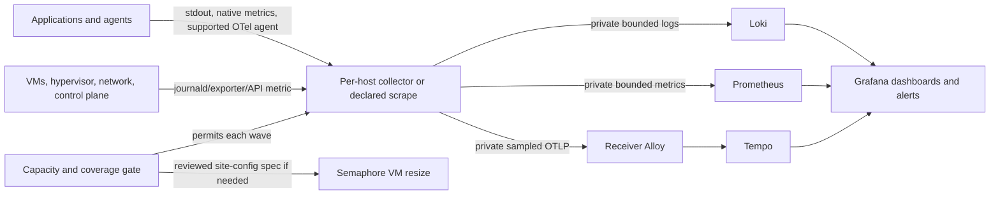

## Context

See [proposal.md](proposal.md) for motivation and [the capability spec](specs/platform/estate-instrumentation/spec.md) for the behavior contract. The current receiver uses Alloy for local container logs and opted-in metrics, Prometheus for metrics, Loki for logs, and a private Alloy OTLP/gRPC path into a single-node Tempo with local persistent storage (`platform/services/o11y/deployment/config/`, `compose.yml`). Grafana self-monitoring and agentgateway dashboards are provisioned. On 2026-09-28, a Dev-bound production deploy of reviewed commit `970dfa3ab545fa64f3c3829f99cf8ab29b7d32f2` passed live checks for all five stack components, the data sources, both dashboards, cross-signal links, alert rules, and the Discord contact point. Separate successful receipts proved a named metrics target, a recent trace, alert delivery, retention, and cardinality. Those receipts establish the receiver baseline, not estate-wide coverage; the broader rollout remains tracked by `observability-estate` and `inference-telemetry-production`. The architecture's old socket-scraped Prometheus and future Mimir sketches are not current collection mechanisms (`plan/architecture/06-observability-instrumentation.md`, as-built amendments).

The source graph contains 23 `platform/services/` directories and four `agents/` directories. A directory is not proof of deployment: the first implementation phase must reconcile those names with private inventory, Semaphore templates, and live read-only discovery. The inventory also includes Proxmox, guest OS and container hosts, pfSense/network, DGX Spark, and external endpoints that Agent Cloud actually manages; scope is based on a declared managed target, not an indiscriminate network scan.

## Goals / Non-Goals

**Goals:** Reuse the receiver and onboarding verifier; give each deployed target an explicit signal contract; favor automatic runtime instrumentation; make cost, capacity, privacy, and recovery visible before increasing telemetry.

**Non-Goals:** Require traces from non-request infrastructure, claim traces from unsupported runtimes, switch to Mimir/object storage or high availability in this change, expose OTLP publicly, or clean-redeploy o11y and delete its current data. Future Kubernetes injection is a separate migration concern; the present estate uses Compose/Podman and VMs.

## Architecture

## Decisions

### 1. Inventory the actual estate before choosing exporters

Create one coverage declaration keyed by stable `service.name`/target identity, with lifecycle (`deployed`, `planned`, `retired`, `excluded`), owner, runtime/language, environment, host, signal applicability, method, expected endpoint, budget, and verification receipt. Generate an expected-target report from public service/agent definitions and private inventory; compare it with live read-only discovery, then resolve each discrepancy by a reviewed declaration. The public repo holds the schema and generic methods; `site-config` owns real hosts and network details. Extend the existing `Verify o11y Service` exact-target pattern instead of adding a separate verifier per service.

The starting audit includes the 23 platform directories (agentgateway, authentik, caddy, dns, erpnext, github-runner, honcho, inference-comfyui, inference-hunyuan3d, n8n, netbox, nextcloud, nocodb, o11y, opa, openbao, openhands, postiz, semaphore, step-ca, tududi, uhhcraft, wikijs) and NemoClaw, NetClaw, WebSmith, and WisBot. It then adds managed infrastructure represented by deployment/inventory (Proxmox, guest OS/container runtimes, pfSense, DGX, and any supported edge dependencies). This is a **candidate audit**, not a claim that all entries are running.

Alternative rejected: mark every repository directory covered. Several are scaffolds or retired; that would create false-green coverage.

### 2. Use the simplest supported signal source per target

Container stdout/stderr and journald/file logs go through a least-privilege, independently deployable host collector where central socket discovery cannot reach the host. Native application/exporter `/metrics` is preferred over a second instrumentation library; two existing opt-in labels serve co-located containers, while remote targets use private inventory-rendered scrape declarations. A process that serves HTTP/RPC requests gets a compatibility pilot for the current [OpenTelemetry zero-code mechanism](https://opentelemetry.io/docs/concepts/instrumentation/zero-code/) of its runtime, using deployment parameters rather than a source fork. Zero-code covers supported libraries, not the application's own domain operations; add a small explicit span only for a critical unobserved boundary. Default to no body/prompt/token capture, stable resource attributes, context propagation, bounded attribute values, and sampled traces. Do not inject unreviewed agents into privileged control-plane processes or require eBPF privileges across the fleet.

Signal selection per cohort:

| Cohort | Default collection | Trace decision |
|---|---|---|
| o11y, Caddy, DNS, step-ca, OpenBao, OPA, Authentik, Semaphore, NetBox | host/container logs; native or vetted exporter metrics; readiness | request-serving components only after runtime compatibility/security pilot |
| App and data services: n8n, Postiz, tududi, honcho, UhhCraft, ERPNext, OpenHands, Nextcloud/NocoDB/WikiJS if deployed | stdout plus DB/queue/app metrics; request/worker identity | runtime agent where supported, manual span for an important workflow gap |
| Agent and inference workloads: agentgateway, DGX, NemoClaw, NetClaw, WisBot, WebSmith, ComfyUI, Hunyuan3D | retain proven gateway/DGX paths; add worker/job and GPU/model metrics where supported | keep existing gateway trace path; pilot agent/runtime tracing with prompt redaction |
| Proxmox, guest OS, container engine, runners, pfSense and other managed devices | node/hypervisor/device exporter or read-only API metrics, system logs, health | not applicable unless a request-serving software component has safe support |

Alternative rejected: mandate the same three signals for every process. A router or database can be fully diagnosable with logs and metrics while a fabricated trace requirement obscures missing real coverage.

### 3. Preserve one private receiver and bound every signal

Collectors use site-config allowlists and host identities; OpenBao supplies any credentials through Ansible memory. Scrape ports and OTLP ingress stay on private interfaces. Receiver Alloy gets explicit memory/backpressure handling and exporter retry/queue limits before more senders are added, following [Alloy's access and permission guidance](https://grafana.com/docs/alloy/latest/access_permissions/). Per-target scrape sample limits, allowed labels, log redaction/volume controls, trace head sampling, and backend retention are declared and verified. Alert on receiver refusal, collector drops, unhealthy scrape, missing logs, and absent expected traces. Correlate by normalized `service`/`service.name`, environment, and bounded instance identity; never put request IDs, user IDs, prompts, secrets, or raw URLs in metric labels.

Alternative rejected: allow every discovered host to export all telemetry. It expands network and cardinality risk before a service has a budget or owner.

### 4. Resize from evidence, not a guessed VM size

Before a wave, collect at least a representative seven-day baseline after the accepted 2026-09-28 receiver revision, including peak log bytes/day, active and new Prometheus series, samples/s, Tempo spans/s and bytes/span, p95 CPU/memory, disk use and growth by backend, Alloy drops/queue, and dashboard query pressure. The first full seven-day window cannot close before 2026-10-05; extend it if traffic is unrepresentative. Pilot one workload in each cohort to estimate the next wave. Forecast retained bytes using measured ingestion and compression per backend multiplied by the declared retention, then add the pilot's peak factor and at least 30% free disk headroom. Require at least 25% memory headroom at observed peak and p95 CPU below 70%; a refusal/drop or unhealthy query is a stop even if the numeric margins pass. Record the forecast, assumptions, and receipt without private addresses in the public repo.

If the capacity gate fails, change `site-config` VM resource declarations and inventory together, review them, then run existing `platform/playbooks/resize-vm.yml` through its Dev-bound Semaphore template. Its disk path grows only and reboot is opt-in; first read the current-vs-desired diff, confirm Proxmox storage and guest filesystem growth/backup path, schedule any required reboot, then read back VM capacity, filesystem capacity, stack readiness, and preserved telemetry. A size increase is a measured gate, not a preselected number. Tempo's own [sizing guidance](https://grafana.com/docs/tempo/latest/set-up-for-tracing/setup-tempo/plan/size/) depends on span rate, span size, query rate, and retention; the same variables are recorded here.

Alternative rejected: immediately allocate a larger o11y VM. It could waste resources or still under-size the wrong bottleneck; retention and label cardinality must be measured first.

### 5. Deliver coverage in controlled cohorts

Complete the current o11y/agentgateway work and production receipts first. Build the coverage census and budget gate next. Pilot host collection on one infrastructure VM and one application VM, then expand to control-plane/network, stateful applications, and agent/inference cohorts. Each wave is a reviewed feature-to-`dev` change with one completed CodeRabbit or Claude review and green final-head CI, followed by Dev-bound Semaphore dry-run/check mode where meaningful, apply, exact-target proof, dashboards/alert drill, and recorded rollback. Keep tightly related public changes in few PRs; private site-config declarations get their own reviewed PR because that repository owns production facts. Reconcile the coverage report after each wave; only a complete deployed-target inventory with fresh receipts closes this change.

## Risks / Trade-offs

- **Host collector permissions or remote logs expose sensitive data** → pilot least privilege; filter/redact before export; verify secrets and request bodies do not appear in Loki or task output.
- **Automatic agents alter process behavior or create high-cardinality telemetry** → compatibility matrix and one-service pilot per runtime; explicit version pin, startup/rollback switch, sampling and attribute limits.
- **Single-node local Tempo storage or receiver VM fills** → capacity gate, retention, disk alerts, no clean-volume validation; document backup/restore and separate storage migration if the measured load outgrows this topology.
- **A green `up` masks the wrong target** → exact instance and fresh log/trace checks; failed or stale receipts remain visible.
- **A VM resource change requires downtime** → keep reboot opt-in, verify guest filesystem and health after it, and pause the next wave until the previous baseline is restored.

## Migration Plan

1. Finish the current production receiver and agentgateway acceptance, including retention/cardinality and alert receipts. Freeze the baseline revision and collect the seven-day measurement window.
2. Add census declarations and read-only coverage/capacity reports; resolve all unclassified deployed targets. No new sender is enabled in this phase.
3. Pilot reusable host collection and runtime auto-instrumentation, then gate and release one cohort at a time. Add code-provisioned dashboards and alerts only for metrics and traces actually present.
4. When a wave needs capacity, merge the private resource declaration, converge it via Semaphore, verify preserved state, and rerun the budget forecast before enabling the wave.
5. On failure, disable the wave's declared sources, redeploy from reviewed `dev`, verify the old signal/alert baseline, and retain data. Disk growth is not rolled back by shrinking; unused capacity is left in place.

## Open Questions

- Which source-only service directories correspond to current production workloads? Resolve from private inventory and Semaphore/live readback in the census, then record lifecycle explicitly.
- What are the actual per-backend daily ingestion and compression factors? Measure after current acceptance; they determine the VM number but do not change this design.
