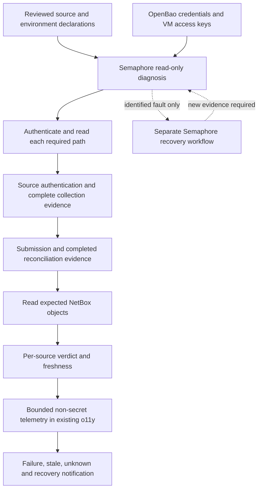

# NetBox Discovery Recovery Design

**Date:** 2026-09-05

**Status:** PROPOSED

## Context

See [proposal.md](proposal.md#why) for motivation and the operator-reported outage history. No production query, credential operation, or scan was performed during proposal creation. Code evidence below was checked against integration commit `108c09009c8d04d56cf855deba12b3b0ca09c87e`; the prior Explore checkout had no differences in the load-bearing NetBox paths. Historical counts and dates in plan 04 are not a baseline for current acceptance.

| Verified repository evidence | Design consequence |
|---|---|
| [Plan 04](../../../04-netbox-discovery.md), lines 16 and 539–607, combines an operational claim with a later outage and unknown token-mint failure | Label provenance and run fresh diagnosis before choosing repairs |
| [Agent template](../../../../../platform/services/netbox/deployment/templates/agent.yaml.j2), lines 17, 37, 85, 129 and 149: vault polling 1h, network 4h, SNMP 6h, both API workers 15m | Derive source deadlines independently; a 15m wait does not cover vault polling or all scans |
| [Proxmox worker](../../../../../platform/services/netbox/deployment/workers/proxmox_discovery/proxmox_discovery/__init__.py), lines 181–232, and [pfSense worker](../../../../../platform/services/netbox/deployment/workers/pfsense_sync/pfsense_sync/__init__.py), lines 113–141, return an empty list on missing credentials or caught failures | Empty output needs an explicit outcome, not implicit success |
| [Proxmox object builders](../../../../../platform/services/netbox/deployment/workers/proxmox_discovery/proxmox_discovery/__init__.py), lines 490–529 and 714–739, do not explicitly set discovery tags or a last-seen field | Verify actual attribution/SDK behavior; do not build the gate around an assumed tag or modification timestamp |
| [Checker](../../../../../platform/playbooks/check-discovery.yml), lines 6–87 and 89–109, ignores errors and saves missing Site GPS | Remove the mutation from verification; reject incomplete reads |
| [Seed declaration](../../../../../platform/playbooks/seed-discovery-credentials.yml), lines 30–37, overrides identity; [seed task](../../../../../platform/playbooks/tasks/seed-discovery-credential.yml), lines 26–54, does not read the destination before a whole-value write | Validate identity/field completeness; preserve sibling fields and concurrent changes |
| [Agent deploy](../../../../../platform/playbooks/deploy-orb-agent.yml), lines 72–76, templates AppRole material as 0644; [runtime check](../../../../../platform/playbooks/tasks/deploy-orb-agent.yml), lines 51–72, checks running state and tails logs | Protect the credential boundary; introduce actual per-source acceptance |
| [Token provisioner](../../../../../platform/playbooks/provision-netbox-automation-token.yml), lines 88–102, assumes a readable token key and 40-character length | Do not claim a version-specific root cause without deployed evidence; decouple read-only diagnosis from this write-token bootstrap |
| [Alloy configuration](../../../../../platform/services/o11y/deployment/config/config.alloy) ships local container logs; [Prometheus configuration](../../../../../platform/services/o11y/deployment/config/prometheus.yml) scrapes itself and describes agent telemetry as later work | No existing production discovery alert path is assumed; notification and missing-monitor proof are acceptance tasks |
| [Governance D5](../../../03-guardrails-governance.md#d5--containers-reflect-as-container-role-devices-never-as-virtualmachines-pruning-happens-only-via-tagged-reconciliation) retires the local ORM writer; [local startup](../../../../../scripts/local-netbox-up.sh) remains Mac-driven | Keep local conversion and container modeling separate from incident recovery |

## Goals / Non-Goals

**Goals:** A source-specific evidence chain and a minimal, repeatable repair of demonstrated faults, with no hidden write in diagnosis. Extend existing tasks, workers, and observability provisioning; do not introduce another service or inventory authority.

**Non-Goals:** Runtime conversion; full local Semaphore onboarding; local ORM feed retirement or replacement; SNMPv3; LLDP; inventory pruning/deactivation; broad device-creation automation; bulk retagging; database migrations. These remain explicit separate work, including governance plan 03 D5 and stale-sweep work. No destructive canary or production fault injection is needed for this proposal's acceptance.

## Decisions

### 1. Run evidence-first diagnosis through Semaphore

Private `site-config` supplies environment inventory, source targets, expected object selectors, endpoint names and credential references; live secret material remains in OpenBao. Semaphore obtains VM keys from OpenBao through the established platform mechanism and executes the scoped checks on the NetBox host. Workstation SSH is neither a prerequisite nor a fallback. If that access mechanism is missing, add or repair its reusable playbook/task rather than issuing ad-hoc SSH or API commands.

The private repository's guidance was read during planning; its inventory is configuration authority and its credential files are backup/reference material, not the runtime source. Preserve its existing branch and uncommitted files. Do not repeat the historical claim that no pfSense source exists until current documented references and OpenBao have been checked; do not assume a backed-up token identity still matches its live secret. New acceptance selectors/timing fields are proposed additions, not a claim that current private inventory already defines them.

Separate three operations: diagnosis (read-only), repair (explicit bounded mutations), and acceptance (read-only). Authentication may establish transient sessions needed for reads but must not provision or rotate long-lived credentials during diagnosis. Reuse `check-discovery.yml` as the operator entry point; remove its GPS setter rather than automatically relocating that unrelated repair into the recovery path.

Use a fixed, reviewed read-only NetBox query through the existing Semaphore container-exec mechanism, with a read-only database transaction for ORM reads. Pass selectors as data rather than interpolated code. Prefer an already valid appropriately scoped read API identity when available, but absence of `automation_api_token` must not block diagnosis or cause it to mint a token. Any necessary new read identity is a separate explicit setup step, tested before selection, never part of verification. Repair the existing write-token provisioner only if evidence makes it a dependency; Build #1 itself remains out of scope.

Rejected: rerun the seed and deploy first, because that changes the evidence and may replace valid fields; use container status as the diagnosis, because it cannot discriminate the documented failures.

### 2. Classify the first failing stage without guessing later stages

The report includes source, run/correlation ID, attempted and completed stage timestamps, code/configuration identities, expected-object result and a controlled reason code. Distinguish absent path, absent/empty required field, path ACL denial, vault auth failure, transport failure, source auth rejection, failed/partial/empty collection, submission failure, reconciliation failure and read-back mismatch. Preserve multiple independent faults across sources. Do not print response bodies, raw exception strings, URLs containing credentials, or private object identities into public evidence.

A read failure from an agent identity is not proof of absence. If permitted, the controller's separately authorized existence read can distinguish absent from denied; otherwise retain unknown. Agent scope is tested using the actual agent identity and exact paths, not only the controller's broader privileges. Verify TLS/transport through the existing transport guard before credentials are sent; never relax TLS or increase privileges to obtain a green check.

### 3. Safe credential recovery extends the existing mechanism

Start with `seed-discovery-credentials.yml` and its shared task. Before writing, read candidate and destination, require every declared field, validate the identity/secret pair against the intended source via a read-only call, and verify destination access under the agent identity. Remove the fixed Proxmox identity override; site-specific identity comes from its authoritative credential record. A destination with a different working pair causes a named conflict, not automatic replacement.

Use the repository's existing OpenBao field-preserving pattern where it satisfies the full contract; add compare-and-set against the observed KV version for conflicting writes. On mismatch, re-read and compare owned fields; never retry a stale whole-document payload. Skip identical writes. Preserve unknown destination fields. When an owned field was concurrently changed, refuse selection until the new state is validated. Source records are never rewritten by the discovery seed.

For missing operator-owned pfSense/SNMP material, accept only the approved secret provisioning path into OpenBao; no survey value, persisted extra-variable credential, shell argv value, or substitute test secret. No new issuer/rotation framework: reuse an existing approved rotation mechanism if replacement is necessary, with recoverable candidate identity/version in OpenBao and create → verify → select → retire ordering. If such a mechanism is absent, stop the dependent replacement and make its bounded implementation explicit before resuming.

Scope `no_log` to auth/read/resolve/write/secret-template tasks, including failure paths; emit a separate allowlisted verdict outside that boundary. Render agent AppRole material owner-only (0600 file, protected directory), verify the runtime can read it, and avoid new intermediary secret copies. Enumerate the needed NetBox/discovery paths in the agent policy rather than widening the wildcard. Reapplying policy is not evidence that access works; test it with the actual identity.

Rejected: source-to-destination blind copy, hardcoded token-ID repair, whole-document restoration, and a string-length check as credential validation. Each can manufacture a green result without proving the credential works.

### 4. One validated source declaration drives scheduling and acceptance

Introduce a validated source mapping with `enabled`, approved disablement reason when false, allowed targets, cron schedule, maximum interval seconds, collection timeout seconds, ingestion deadline seconds and expected-object selectors. Use the same mapping to render agent policy and verifier input. Missing fields fail before mutation; strings masquerading as booleans do not become silent opt-outs. Validate correspondence between cron and maximum interval for the supported periodic schedules.

Preserve the current source schedules by default:

| Source | Current period | Acceptance examples, values from private site-config |
|---|---:|---|
| Proxmox | 15 minutes | Declared physical node and VM, cluster membership and expected VM interface/IP linkage |
| pfSense | 15 minutes | Firewall device plus declared interface and primary address |
| Network | 4 hours | At least one declared reachable address from the authorized target scope |
| SNMP | 6 hours | At least one declared SNMP device with expected enrichment |

Vault polling is currently hourly. First recovery must observe the new credential version actually consumed; a 15-minute sleep is insufficient evidence. An explicit agent redeploy to reload configuration is a repair operation, never hidden inside the verifier.

Default verifier polling is five minutes; freshness budget is `2 × source interval + collection timeout + ingestion deadline`. Explicit failures are non-healthy immediately; an expired budget becomes stale by the next poll. Validate positive finite bounds, timestamps, and clocks. Confirm backend timeout units on the actual installed versions before converting their existing settings; do not interpret SNMP's current `600` by analogy with nmap's timeout. Observability retention must exceed the longest freshness budget plus verifier margin; use bounded log retention and reject missing history as unknown.

No SNMP decision is silently made here. It stays enabled. An operator can later approve a reasoned source configuration change; disabling it displays disabled and reduces declared scope visibly, not retroactively proving SNMP recovery. If no expected SNMP target exists, its enabled-source gate remains incomplete until that choice is made.

### 5. Separate cycle success from object modification

Collection emits a terminal outcome with source/run identity, complete versus partial scope and entity count. Ingestion evidence must identify the corresponding submission and completed reconciliation; an accepted enqueue alone is insufficient. Read-back compares normalized expected object identities, relevant fields and links from the completed collection to current NetBox data. Device name alone, aggregate counts and the newest `discovery:auto` write cannot prove coverage. Require source attribution for the first recovery proof and prohibit manually inserted production sentinels.

During the initial compatibility investigation, inspect the deployed Orb/Diode/SDK versions and the actual terminal events/read APIs. Reuse their source/run correlation when available; otherwise add the smallest adapter/instrumentation at the existing worker and ingestion observation boundary. Do not fabricate acknowledgement from a worker's returned list. The requirement is fixed even if the adapter's exact event fields differ by version. A missing observable reconciliation result blocks that source's acceptance until instrumentation is implemented and demonstrated.

For an unchanged cycle, a fresh complete collection plus correlated completed reconciliation and matching fresh read-back passes even if NetBox `last_updated` stays unchanged. No forced dummy edit is needed. Keep cycle timestamps in telemetry, not as a second authoritative IPAM database. Current global discovery tags cannot be assumed to cover API workers; verify attribution without bulk retagging or changing existing object merge keys. Do not prune objects when a source fails, returns empty, or ages out.

### 6. Reuse o11y for transition alerts and verifier absence

The Semaphore verifier emits a sanitized structured summary and heartbeat to the existing Loki/Grafana stack through a narrowly scoped configured endpoint. Provision the relevant Grafana log-based alert rules and contact routing as code using the platform deployment mechanism; any access credential is resolved from OpenBao. No new telemetry server, alert daemon, or inventory database is introduced. Verify the production endpoint and routing rather than assuming the local Alloy configuration covers the NetBox VM.

Poll every five minutes and evaluate source status independently. Configure failure/stale/unknown transitions and recovery notifications; unchanged healthy cycles stay quiet. A separate Grafana absence rule on the verifier heartbeat expires after two polling intervals, with no-data/data-source-error behavior set to alert rather than green. Test an interrupted verifier and telemetry failure in an isolated environment; a notification delivery test is a required gate, not a screenshot of an alert rule. If the existing target o11y stack or approved contact route is unavailable, the observability phase remains blocked and recovery is not declared fully delivered.

Configure and test a separate notification delivery allowance of one minute after the verifier verdict, including alert evaluation and routing; thus a freshness expiry is detected by the next five-minute poll and delivered within six minutes in total. A missed-verifier alert is delivered within eleven minutes of the last heartbeat. Delivery outside those bounds fails the observability gate rather than silently extending the budget.

This is a bounded addition to existing observability provisioning, not delivery of the broader OTLP roadmap. If existing compatible telemetry already meets the contract when inspected, reuse it instead of adding duplicate emission. The independent alert evaluator must be outside the verifier process whose absence it watches.

## Risks / Trade-offs

| Risk | Mitigation |
|---|---|
| Worker/Diode versions expose insufficient correlation | Phase 1 documents the actual surfaces; minimal instrumentation must prove reconciliation before acceptance |
| A static expected set masks partial collection | Validate source completeness/pagination separately, then expected projection; negative tests cover omissions and ambiguous identities |
| Monitoring itself fails | Independent heartbeat-absence and datasource-error alerts; verify the delivery route |
| Slow cadences lengthen live qualification | Fixtures prove failure logic; qualification still observes consecutive scheduled cycles. With SNMP enabled, allow up to roughly 12 hours plus bounded execution time for two cycles |
| Secret copy or retry damages a working environment | Validate before selection, owned-field CAS, no-op re-run, interrupted-rotation and sibling-preservation tests |

## Migration Plan

1. Establish private site-config inputs and authorized Semaphore access, capture a redacted baseline and prove diagnostic reads are side-effect free. Do not run today's mutating checker as a baseline.
2. Implement and test classification, source declarations, credential preflight, and only demonstrated recovery fixes. Use isolated fixtures/services for negative cases and branch-specific Semaphore declarations; never alter shared bindings.
3. Add cycle correlation, read-back acceptance and o11y alert provisioning. Prove failed/empty/partial/unchanged cycles and missed-monitor behavior in isolation.
4. Validate on `dev` against a representative Linux target using the exact branch revision; record source coverage and remaining blockers. Production operations require the normal authorized promotion/deployment step, not this proposal.
5. During authorized production qualification, observe two consecutive scheduled successful cycles for every enabled source plus delivered alert/recovery tests on an isolated route. Re-run recovery to prove no-op credentials and no duplicate objects. Record code/config IDs, source periods, private task/evidence references and rollback result; do not copy private payloads into the public repository.

Rollback follows [proposal.md](proposal.md#rollback-plan): restore owned prior code/config and verified credential selection through Semaphore, keep data and sibling fields, and report the resulting state honestly. Rolling back monitoring removes visibility; it does not establish health. No destructive data rollback is part of this change.

## Validation Criteria

| Gate | Pass condition |
|---|---|
| Diagnosis | All classified failure fixtures produce correct stage verdicts; GPS and queried data unchanged; downstream untested stages unknown |
| Credential safety | Missing/mismatched candidates refused, concurrent siblings preserved, identical retry no-op, interrupted rotation recoverable, synthetic secrets absent from captured output |
| Source acceptance | Complete collection, correlated completed reconciliation and expected-object read-back for each enabled source; static successful cycle passes; failed/partial/empty-required cycle fails |
| Observability | One failed source is visible despite another's success; failure/recovery notification delivered; missed verifier and telemetry outage detected |
| Promotion | Correct revision verified, representative Linux coverage, two scheduled cycles per enabled source, repeat/rollback without duplicate objects or credential/data loss |

## Security Considerations

Private `site-config` remains environment configuration authority; OpenBao remains credential authority. Semaphore is the VM access and mutation boundary, obtaining VM keys from OpenBao. Source and NetBox queries use scoped identities/read-only transactions; credential data is segregated from ordinary diagnostic output. No public real IP, token identity, endpoint credential, or topology is added. No blanket `no_log`, privilege broadening, workstation SSH bypass, unauthenticated telemetry endpoint, or direct source-device configuration is introduced.

## Implementation Phases

The executable checklist is [tasks.md](tasks.md). Each phase ends in named scenarios from [the capability spec](specs/platform/netbox-discovery-recovery/spec.md); fixtures are not substitutes for the final environment gate.

## Open Questions

These are implementation-discovery inputs; none changes the contract or silently relaxes its gates:

- Which exact deployed versions and terminal reconciliation evidence are available? Resolve in phase 1 and document the adapter evidence.
- Which private expected-object selectors, allowed targets and approved notification route apply to the target environment? Resolve from site-config/operator input before that environment's qualification.
- Does fresh diagnosis reproduce the historical missing/denied credential and token-mint failures? Report measured outcomes separately from the operator's historical report.

## Cross-references

- [Platform principles](../../../../../PRINCIPLES.md), [AGENTS.md](../../../../../AGENTS.md), and [recorded verification/live-state mistakes](../../../../../docs/MISTAKES.md).
- [04 — NetBox & Discovery](../../../04-netbox-discovery.md); [03 — Governance](../../../03-guardrails-governance.md), especially D5 and freshness invariants.
- [01 — Secrets & Credentials](../../../01-secrets-credentials.md); [00 — Local development](../../../00-foundation-local-dev.md), whose NetBox conversion stays separate.
- [Automation model](../../../../architecture/01-automation-model.md); [credential/access boundaries](../../../../architecture/04-credentials-access.md); [code-managed inventory sync](../../../../../platform/semaphore/sync-inventory.yml).

The later plan-04 update must preserve historical evidence, add plan-03 dependency, correct source cadences, replace manual inventory PUT advice with the existing sync mechanism, and label local proof as incomplete Semaphore integration. Do not add duplicate env example files: the current NetBox playbook already declares the Jinja env templates. SNMPv3/LLDP remain deferred; no unrelated plan checkbox is closed by this recovery.
