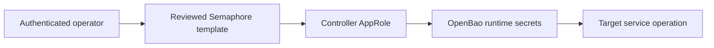

# Semaphore access and scoped publication

## Use the executor's credentials

For an existing service template, use the authenticated operator session to
launch the reviewed Semaphore automation. The controller authenticates with its
existing OpenBao AppRole and reads the target credentials in memory:



A missing workstation `SEMAPHORE_TOKEN`, or a cached workstation `bao` login
receiving HTTP 403, says nothing about the controller AppRole. Do not require a
workstation OpenBao login before work that an existing Semaphore template can
execute. Never export the controller AppRole from the browser or use backup
credentials to manufacture workstation access.

**Verified production evidence:** task 411, `Verify tududi-github Sync (Dev)`,
authenticated through the controller AppRole, read runtime secrets, checked the
GitHub App's repository coverage and reached n8n. It stopped at an absent
credential-visible sync workflow with `changed=0`; it did not verify task/issue
correspondence. This proves that executor's access at the time of the run, not
every credential's validity or ongoing AppRole health.

## What Semaphore can see: `main` and `dev` only

The controller runs a template from one of the two repository records declared in
[`repositories.yml`](repositories.yml): `agent-cloud` (branch `main`) and
`agent-cloud dev` (branch `dev`). A template names its record with `repository:`
in `templates.yml`; `dev_variant: true` generates the `(Dev)` twin bound to `dev`.
**A feature branch is invisible to the controller.** Code that a Semaphore task
must execute — a new playbook, a new OpenTofu file, a changed template — has to
be merged into `dev` (feature → `dev` PR, checks green, reviewed) before the
`(Dev)` variant can run it, and into `main` before the base template can. Plan
the live step after the merge, not after the commit. Recorded 2026-09-14, when
`ratelimit.tf` sat committed on its feature branch with nothing able to plan it.

## Launching a task from outside the controller (the API path)

Nothing on a workstation talks to the controller today: no `SEMAPHORE_TOKEN` is
set, the operating evidence above was produced from the UI, and an anonymous
request to `https://semaphore.uhstray.io/api/ping` is answered by Cloudflare with
`403` + `cf-mitigated: challenge` (verified 2026-09-14). The pieces of a
scripted path exist and are recorded here so it is built once, deliberately:

1. **Edge.** The WAF skip rule `Semaphore API - bypass challenge for
   token-bearing non-browser clients` (`platform/infra/cloudflare/waf.tf`) lets a
   request through only when it is on `semaphore.uhstray.io`, under `/api/`, AND
   carries a non-empty `Authorization` header. A tokenless probe is challenged by
   design.
2. **Credential.** An API token is minted per user with `POST /user/tokens` and
   sent as the `Authorization` header (`Bearer <token>`); the controller's own
   token is at `secret/services/semaphore:api_token` in OpenBao and is read only
   inside the controller (see the publisher section). A workstation token is an
   operator-held value — provisioned into the workstation environment, never
   into a repo, a survey parameter or a launch argument.
3. **Launch and read back.** `POST /api/project/{project_id}/tasks` with
   `template_id` (or `template_name`) and, for a survey template, `environment`
   as a JSON string of the survey values; `GET /api/project/{project_id}/tasks/{task_id}`
   for status; `GET .../tasks/{task_id}/output` for the log. Endpoint shapes are
   from the upstream `api-docs.yml` on the `develop` branch (read 2026-09-14) and
   the `/api/project/{id}/...` prefix the committed playbooks already use;
   confirm against the running version before scripting.

Until an operator token is provisioned, the honest state is: **operator launches
from the UI; the agent hands over the exact template name, survey values and the
verification commands.** Do not fabricate access by reading the controller's own
token out of OpenBao from a workstation.

## Publish selected survey fields

The declared **Publish Semaphore Template Surveys (Dev)** template runs
[`publish-semaphore-templates.yml`](../playbooks/publish-semaphore-templates.yml).
Its only survey input is `semaphore_template_names_json`, for example:

```json
["Store tududi API Token (Dev)"]
```

It uses the controller AppRole to read the fixed OpenBao
`secret/services/semaphore:api_token` field. The token stays in Ansible memory;
the controller API destination is fixed to its container's loopback port 3000,
not a survey-controlled URL. This entry point assumes execution inside the
declared Semaphore controller container. A separate remote runner needs its own
reviewed transport design; do not redirect this token with a launch argument.

Only exact, nonempty, unique names of existing declared templates are accepted.
Repository URL/branch and template repository/playbook bindings must match the
declaration. The selected surveys are updated and read back; inventory,
environment, arguments and operational settings are preserved. No schedules,
service jobs, repository records, inventory records or credentials are changed.

**Deployment status:** this controller entry point is newly implemented and
tested against disposable providers. It is not yet installed or verified in
production. Do not describe its existence in Git as live availability.

A later full-catalog publication also creates the main-bound base template.
Do not run that base until the publisher code has been selectively promoted to
`main`; the scoped bootstrap installs the Dev variant only.

## Bootstrap the missing entry point once

[`bootstrap-survey-publisher.yml`](bootstrap-survey-publisher.yml) installs only
the generated Dev publisher from `templates.yml`. It requires explicit verified
`semaphore_project_id`, `semaphore_inventory_id` and `semaphore_environment_id`,
plus the approved Semaphore HTTPS endpoint. It uses an already approved injected
runtime token or AppRole; it acquires no browser/cache/backup credential.

1. Review and merge the publisher code to `dev` before its first controller run.
2. Inspect the current project, inventory, variable-group and Dev repository
   bindings through approved metadata access. Preserve the running controller.
3. In an approved bootstrap executor, run the playbook with those non-secret
   bindings. Readback must confirm the new template and its declared survey.
4. Launch that template through Semaphore with the exact selected names.

If no published template can run the publisher and no approved bootstrap
executor has runtime access, report **initial publisher installation** as the
specific gap. A controller AppRole may be healthy while this entry point is
missing. Do not redeploy Semaphore, repurpose a service template, edit a shared
repository binding, publish the entire catalog, or extract credentials to bridge
the gap. Create every template and automation through committed configuration
and its installer, including the initial publisher. Manual UI creation is not
an installation path. Resolve approved executor access before applying the
bootstrap; do not substitute a manually configured template.

## Troubleshoot at the failing boundary

| Evidence | Next check |
|---|---|
| Operator cannot launch the existing template | Operator session/project permissions |
| Controller AppRole login fails | That task's existing variable-group binding and AppRole validity |
| OpenBao secret read is denied | Controller policy for the named fixed secret path |
| Secret reads pass; target rejects it | Target transport, credential validity and account scope |
| Publisher template is absent | Initial installation through the scoped bootstrap mechanism |
| Survey readback or repository binding fails | Stop; inspect the declared and live values before another write |

Report task ID, observed source revision when available, target names, failed
step and change counts. Do not print secret values, auth IDs or raw variable
groups. A checked branch head is not proof of a task's actual checked-out SHA.

The full-catalog [`setup-templates.yml`](setup-templates.yml), repository
bootstrap and inventory sync remain explicit operator configuration operations.
Their shared runtime access task supports the controller AppRole without making
those broader operations available through the survey-only entry point.
