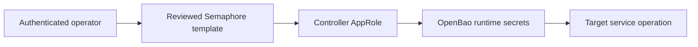

# Semaphore access and scoped publication

## Use the executor's credentials

For an existing service template, use the authenticated operator session to
launch the reviewed Semaphore automation. The controller authenticates with its
existing OpenBao AppRole and reads the target credentials in memory:



A missing workstation `SEMAPHORE_TOKEN`, or a cached workstation `bao` login
receiving HTTP 403, says nothing about the controller AppRole. Do not require a
workstation OpenBao login before work that an existing Semaphore template can
execute. Never export the controller AppRole from the browser or use backup
credentials to manufacture workstation access.

**Verified production evidence:** task 411, `Verify tududi-github Sync (Dev)`,
authenticated through the controller AppRole, read runtime secrets, checked the
GitHub App's repository coverage and reached n8n. It stopped at an absent
credential-visible sync workflow with `changed=0`; it did not verify task/issue
correspondence. This proves that executor's access at the time of the run, not
every credential's validity or ongoing AppRole health.

## Declared production repository records: `main` and `dev`

The production templates use the two repository records declared in
[`repositories.yml`](repositories.yml): `agent-cloud` (branch `main`) and
`agent-cloud dev` (branch `dev`). A template names its record with `repository:`
in `templates.yml`; `dev_variant: true` generates the `(Dev)` twin bound to `dev`.
**No production feature-branch record is declared, and a production template cannot run a
feature branch either.** On v2.19.11, the pinned production version, the runner applies a
task's `git_branch` only when the template sets `allow_override_branch_in_task`
(`services/tasks/local_executor.go:938`), and `setup-templates.yml` sets it on no template.
v2.18.12 applied a task's branch unconditionally and checked the flag only in the web UI
(`services/tasks/LocalJob.go:817`, `docs/MISTAKES.md` 1.9), so a controller still on that
version runs any pushed branch an API token names. Code that a Semaphore task
must execute — a new playbook, a new OpenTofu file, a changed template — has to
be merged into `dev` (feature → `dev` PR, checks green, reviewed) before the
`(Dev)` variant can run it, and into `main` before the base template can. Plan
the live step after the merge, not after the commit. Recorded 2026-09-14, when
`ratelimit.tf` sat committed on its feature branch with nothing able to plan it.

## Launching a task from outside the controller (the API path)

No workstation path to the production controller was verified in the 2026-09-14
check: no `SEMAPHORE_TOKEN` was set, the operating evidence came from the UI, and an anonymous
request to `https://semaphore.uhstray.io/api/ping` is answered by Cloudflare with
`403` + `cf-mitigated: challenge` (verified 2026-09-14). The pieces of a
scripted path exist and are recorded here so it is built once, deliberately:

1. **Edge.** The WAF skip rule `Semaphore API - bypass challenge for
   token-bearing non-browser clients` (`platform/infra/cloudflare/waf.tf`) lets a
   request through only when it is on `semaphore.uhstray.io`, under `/api/`, AND
   carries a non-empty `Authorization` header. A tokenless probe is challenged by
   design.
2. **Credential.** An API token is minted per user with `POST /user/tokens` and
   sent as the `Authorization` header (`Bearer <token>`); the controller's own
   token is at `secret/services/semaphore:api_token` in OpenBao and is read only
   inside the controller (see the publisher section). A workstation token is an
   operator-held value — provisioned into the workstation environment, never
   into a repo, a survey parameter or a launch argument.
3. **Launch and read back.** `POST /api/project/{project_id}/tasks` with
   `template_id` (or `template_name`) and, for a survey template, `environment`
   as a JSON string of the survey values. Semaphore v2.17.31 merges EVERY key of that
   JSON into the run's extra vars; it does not filter by the survey
   (`services/tasks/TaskRunner.go` `populateTaskEnvironment`). The launcher's
   declared-fields check is client-side only, not a server control. **Check mode and diff go inside
   `params`:** `"params": {"dry_run": true, "diff": true}` (v2.17.31 `db/Task.go`,
   `AnsibleTaskParams`). A top-level `dry_run` is silently ignored and the task
   runs for real (`docs/MISTAKES.md` 3.8). Semaphore starts a task the moment it is
   created, so reading it back and stopping it cannot make a launch safe; the stop
   can arrive after secrets are written. Launch with
   [`scripts/semaphore-launch.py`](../../scripts/semaphore-launch.py): it builds the
   body with the flags in `params`, refuses check mode on a server version whose
   shape is unverified, allows only the template's declared survey fields, and
   refuses while the template already has a running task, all before the POST.
   Its read-back-and-stop after the POST is only a tripwire for a changed server; `GET /api/project/{project_id}/tasks/{task_id}`
   for status; `GET .../tasks/{task_id}/output` for the log. Endpoint shapes are
   from the upstream `api-docs.yml` on the `develop` branch (read 2026-09-14) and
   the `/api/project/{id}/...` prefix the committed playbooks already use;
   confirm against the running version before scripting.

Until an operator token is provisioned, the honest state is: **operator launches
from the UI; the agent hands over the exact template name, survey values and the
verification commands.** Do not fabricate access by reading the controller's own
token out of OpenBao from a workstation.

## Publish selected survey fields

The declared **Publish Semaphore Template Surveys (Dev)** template runs
[`publish-semaphore-templates.yml`](../playbooks/publish-semaphore-templates.yml).
Its required survey input is `semaphore_template_names_json`, for example:

```json
["Store tududi API Token (Dev)"]
```

It uses the controller AppRole to read the fixed OpenBao
`secret/services/semaphore:api_token` field. The token stays in Ansible memory;
the controller API destination is fixed to its container's loopback port 3000,
not a survey-controlled URL. This entry point assumes execution inside the
declared Semaphore controller container. A separate remote runner needs its own
reviewed transport design; do not redirect this token with a launch argument.

Normally, only exact, nonempty, unique names of existing declared templates are
accepted. To create one missing declared template, set the optional
`semaphore_allow_scoped_create` survey to `true` and enter verified numeric
`semaphore_project_id`, `semaphore_inventory_id`, and
`semaphore_environment_id` values. The default is `false`; the controller
refuses create requests for names without the `(Dev)` suffix, lists with more
than one name, or absent bindings. Leave all three ID fields blank for an
ordinary survey update. The publisher can
first update its own Dev template to expose these fields by selecting
`["Publish Semaphore Template Surveys (Dev)"]` with the existing survey.
Repository URL/branch and template repository/playbook bindings must match the
declaration. The selected surveys are updated and read back; inventory,
environment, arguments and operational settings are preserved. No schedules,
service jobs, repository records, inventory records or credentials are changed.

**Deployment status:** this controller entry point is newly implemented and
tested against disposable providers. It is not yet installed or verified in
production. Do not describe its existence in Git as live availability.

A later full-catalog publication also creates the main-bound base template.
Do not run that base until the publisher code has been selectively promoted to
`main`; the scoped bootstrap installs the Dev variant only.

## Bootstrap the missing entry point once

[`bootstrap-survey-publisher.yml`](bootstrap-survey-publisher.yml) installs only
the generated Dev publisher from `templates.yml`. It requires explicit verified
`semaphore_project_id`, `semaphore_inventory_id` and `semaphore_environment_id`,
plus the approved Semaphore HTTPS endpoint. It uses an already approved injected
runtime token or AppRole; it acquires no browser/cache/backup credential.

1. Review and merge the publisher code to `dev` before its first controller run.
2. Inspect the current project, inventory, variable-group and Dev repository
   bindings through approved metadata access. Preserve the running controller.
3. In an approved bootstrap executor, run the playbook with those non-secret
   bindings. Readback must confirm the new template and its declared survey.
4. Launch that template through Semaphore with the exact selected names.

If no published template can run the publisher and no approved bootstrap
executor has runtime access, report **initial publisher installation** as the
specific gap. A controller AppRole may be healthy while this entry point is
missing. Do not redeploy Semaphore, repurpose a service template, edit a shared
repository binding, publish the entire catalog, or extract credentials to bridge
the gap. Create every template and automation through committed configuration
and its installer, including the initial publisher. Manual UI creation is not
an installation path. Resolve approved executor access before applying the
bootstrap; do not substitute a manually configured template.

## Seed a secret through an isolated environment

A secret an operator holds, and no service generates, reaches OpenBao through a
**seed template**: one that declares `isolated_environment` and `seed_inputs` in
`templates.yml`. Seed OpenBao Key is the general one. The value travels as an
encrypted environment input in that template's own environment. It is never a
survey field or an extra var, because Semaphore persists both and returns them over
its API. It is never staged in the shared environment, where every other template's
task could receive it.

The environment holds only the encrypted AppRole inputs and, during one seed, the staged
value: no extra vars. The OpenBao address comes from the inventory's top-level `all.vars`
(declared there for every host, the implicit `localhost` included). The environment is
checked when it is bound and again by every seed CLI preflight. Before the seed task logs
in to OpenBao it also refuses:

- an address other than the one the inventory file it was given declares (an extra var in
  the environment, or a `-e`, would override the inventory's). This catches drift, a plain
  stray address. It does not stop a deliberate templated extra var: whoever may launch the
  template or edit its environment controls its extra vars, so those Semaphore permissions
  are the boundary (`docs/MISTAKES.md` 1.15; plan 01, "launch permission is extra-var
  control")
- any seed input (`BAO_VALUE`, `SEED_*`) its template does not declare, such as a leftover
  from another seed's interrupted run

An environment provisioned before 2026-09-25 carries an `openbao_addr` pin. Publication
refuses it until **Provision Seed Environment** runs again, which removes the pin and keeps
the AppRole inputs.

1. **Once per seed template and variant:** run **Provision Seed Environment (Dev)**
   with `seed_template` set to the declared base name, plus the verified
   `semaphore_project_id`, `semaphore_inventory_id` and `semaphore_source_environment_id`
   its survey requires, and `seed_variant=dev` (main only after the seed code is
   promoted). It creates the environment, gives it an encrypted copy of the controller
   AppRole, and binds only that template. As of 2026-09-25 both Dev seed templates are
   provisioned and bound; the main variants are not.
2. **Once after provisioning:** prove the environment's AppRole may seed the path,
   without writing anything. It checks the token's own capabilities on the path:
   `read`, plus `create` for a missing path or `patch` for an existing one, the
   capability that seed's write will actually need. A GET alone cannot tell a missing
   path from one the token cannot see:

   ```bash
   scripts/semaphore-seed-input.py --template "Seed OpenBao Key" \
     --set bao_path=services/<svc> --set bao_key=<key> \
     --inventory <approved-id> --url https://semaphore.uhstray.io --verify-only --apply < <token-file>
   ```

3. **Each seed:** put the value in a file, one line, then run a dry run without
   `--apply`, then the real one:

   ```bash
   scripts/semaphore-seed-input.py --template "Seed OpenBao Key" \
     --set bao_path=services/<svc> --set bao_key=<key> \
     --input BAO_VALUE=<value-file> --inventory <approved-id> --url https://semaphore.uhstray.io --apply < <token-file>
   ```

The CLI accepts only the input names the template declares and only its survey
settings. It resolves the template and environment by name and refuses unless they
are bound to each other, the template still runs from its declared repository record
(URL and branch checked against `repositories.yml`) and from the inventory you approve
with `--inventory` (which is also where the seed task takes its OpenBao address), and it
is an Ansible template with no extra arguments. Dry run,
`--verify-only` and the real seed all run that same read-only preflight first, so a
dry run fails on anything the seed would refuse. It refuses a leftover input from an earlier run, runs
exactly one task, removes exactly the input it created, and never prints the value.
An interrupted run leaves the encrypted input in place and names it, so it can be
reconciled rather than silently retried. Postiz provider credentials use
`scripts/postiz-seed-input.py`, which shares the same lookup, preflight and lifecycle code
(`scripts/semaphore_seed.py`, also the Semaphore client `scripts/semaphore-launch.py` uses).

## Publish the local observability alert destination

[`sync-local-o11y-alert-inventory.py`](../../scripts/sync-local-o11y-alert-inventory.py)
reads the two Discord destination IDs already declared under `o11y_svc.vars` in
private site-config's production inventory. It changes only those entries in
Semaphore's existing local static inventory and reads the record back. Run it
from a clean checkout of reviewed, pushed `dev`, with an unchanged private
production inventory file and exact `--expected-dev-sha` and `--site-config-sha`
pins. Supply the
local inventory ID, the verified Semaphore HTTPS origin, and the operator token
on stdin. The default run previews names only; `--apply` performs the scoped,
idempotent update. Do this before the Dev-bound webhook seed or fault drill;
their channel IDs come from Semaphore's stored inventory, not from a survey.
After a matching API readback, `--apply` also writes an owner-only projection
at `~/.agent-cloud-local/o11y-alert-destination.json`. The local bootstrap
reads that generated input when it rebuilds Semaphore inventory; it refuses
to erase an already synced destination if the projection is missing. Refresh
the projection by rerunning the sync after a reviewed private inventory change.
The projection is a local copy, not a new source of truth.

## Troubleshoot at the failing boundary

| Evidence | Next check |
|---|---|
| Operator cannot launch the existing template | Operator session/project permissions |
| Controller AppRole login fails | That task's existing variable-group binding and AppRole validity |
| OpenBao secret read is denied | Controller policy for the named fixed secret path |
| Secret reads pass; target rejects it | Target transport, credential validity and account scope |
| Publisher template is absent | Initial installation through the scoped bootstrap mechanism |
| Survey readback or repository binding fails | Stop; inspect the declared and live values before another write |

Report task ID, observed source revision when available, target names, failed
step and change counts. Do not print secret values, auth IDs or raw variable
groups. A checked branch head is not proof of a task's actual checked-out SHA.

The full-catalog [`setup-templates.yml`](setup-templates.yml), repository
bootstrap and inventory sync remain explicit operator configuration operations.
Their shared runtime access task supports the controller AppRole without making
those broader operations available through the survey-only entry point.

For a missing template already declared on a reviewed branch,
`setup-templates.yml` accepts one exact `semaphore_template_names` entry with
`semaphore_allow_scoped_create=true`. Supply verified non-secret
`semaphore_project_id`, `semaphore_inventory_id` and `semaphore_environment_id`.
It creates only that template, checks its repository URL and branch against
`repositories.yml`, and reads back its repository, inventory, environment and
playbook bindings. Existing templates and schedules remain unchanged; rerunning
an already matching declaration makes no write. Without the explicit create
flag, a missing scoped template still refuses.
