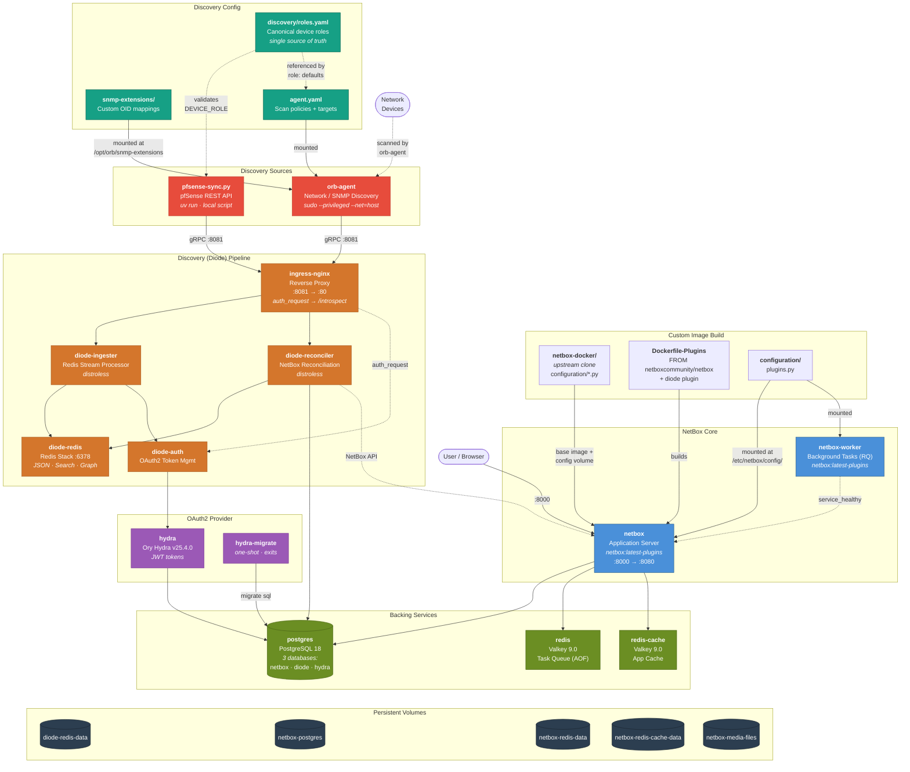
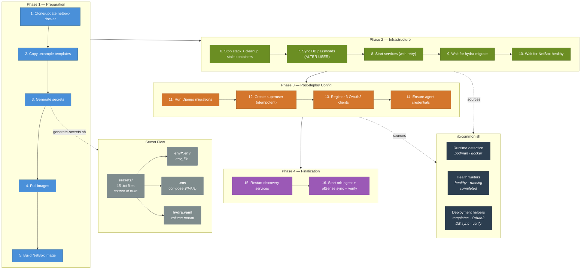

# NetBox Deployment

NetBox infrastructure resource modeling (IPAM/DCIM) deployment for the Uhstray.io platform. Uses **Podman** or **Docker** as the container runtime (auto-detected) with the [netbox-docker](https://github.com/netbox-community/netbox-docker) project as the upstream base.

## Table of Contents

- [Prerequisites](#prerequisites)
- [Quick Start](#quick-start)
- [Access](#access)
- [Managing the Stack](#managing-the-stack)
- [Updating NetBox](#updating-netbox)
- [Architecture](#architecture)
  - [Service Topology](#service-topology)
  - [Deployment Pipeline](#deployment-pipeline)
- [Services](#services)
- [Configuration](#configuration)
  - [File Layout](#file-layout)
  - [Secrets Management](#secrets-management)
  - [Standardized Device Roles](#standardized-device-roles)
  - [Data Volumes](#data-volumes)
  - [Shared Script Library](#shared-script-library)
- [Troubleshooting](#troubleshooting)
- [Production Hardening](#production-hardening)
- [References](#references)

---

## Prerequisites

- **Container runtime**: [Podman](https://podman.io/) (preferred) or [Docker](https://www.docker.com/). The deployment auto-detects which is available.
- **sudo access** (optional): Required for the orb-agent network scanner. Without it, use the rootless fallback template (`discovery/agent.yaml.rootless.example`).
- **pfSense REST API** (optional): For pfSense sync, install the [pfrest](https://github.com/pfrest/pfSense-pkg-RESTAPI) package on your pfSense device and store the API key in `secrets/pfsense_api_key.txt`.
- **Python / uv** (optional): Required only if running `lib/pfsense-sync.py` for pfSense REST API ingestion.

## Quick Start

```bash
# First-time deployment or update (all 16 steps are idempotent)
./deploy.sh

# With a custom URL
./deploy.sh http://192.168.1.100:8000

# Skip pulling images (only rebuild custom image)
./deploy.sh --no-pull
```

The script handles everything automatically: cloning the upstream repo, generating secrets, building images, starting services, running migrations, registering OAuth2 clients, creating agent credentials, and starting network discovery.

Re-running `./deploy.sh` on an existing deployment is safe -- secrets are reused from `secrets/` and database passwords are synced automatically.

<details>
<summary>What the 16 steps do</summary>

1. Updates/clones the netbox-docker upstream repository
2. Copies `.example` templates to live files (if missing)
3. Generates or reuses secrets (persisted to `secrets/`)
4. Pulls latest upstream images (unless `--no-pull`)
5. Builds the custom NetBox image with the Diode plugin
6. Stops the stack gracefully
7. Syncs DB passwords to Postgres (if volumes already exist)
8. Starts all services
9. Waits for hydra-migrate to complete
10. Waits for NetBox to become healthy
11. Runs database migrations
12. Creates the admin superuser (idempotent -- skips if exists)
13. Waits for diode-auth + registers OAuth2 clients
14. Creates orb-agent credential via Diode plugin API (or reuses existing from `secrets/`)
15. Restarts discovery services with registered credentials
16. Starts the Orb Agent with `sudo --privileged` (if `discovery/agent.yaml` exists), runs pfSense sync (if API key and `uv` are available), and verifies all services

</details>

## Access

| Service | URL |
|---------|-----|
| NetBox UI | http://localhost:8000/ |
| Diode gRPC | localhost:8081 |

### Admin Credentials

| Field | Value |
|-------|-------|
| Username | `admin` |
| Email | `admin@uhstray.io` |
| Password | Auto-generated -- printed by `deploy.sh` (stored in `secrets/superuser_password.txt`) |

All secrets are automatically generated on first deployment and persisted to `secrets/`. No manual secret configuration is needed.

## Managing the Stack

Commands below use `podman compose`; substitute `docker compose` if Docker is your runtime.

```bash
# View logs
podman compose logs -f netbox

# Stop all compose services (preserves volumes/data)
podman compose down

# Stop and destroy all data
podman compose down -v

# Restart NetBox after config changes
podman compose restart netbox netbox-worker

# Create an additional superuser interactively
podman compose exec netbox /opt/netbox/netbox/manage.py createsuperuser

# Run Django management commands
podman compose exec netbox /opt/netbox/netbox/manage.py <command>

# Access Django shell
podman compose exec netbox /opt/netbox/netbox/manage.py shell

# Orb Agent (standalone, requires sudo for privileged SYN scans)
sudo podman logs -f netbox-orb-agent           # view agent logs
sudo podman stop netbox-orb-agent              # stop agent
sudo podman rm netbox-orb-agent                # remove agent container
```

## Updating NetBox

Use `deploy.sh` for routine updates (same script as initial deployment -- all steps are idempotent):

```bash
./deploy.sh                              # pull latest images, rebuild, restart, migrate
./deploy.sh --no-pull                    # skip image pull, only rebuild custom image
./deploy.sh http://192.168.1.100:8000    # custom host
```

The NetBox version is controlled by the `VERSION` variable in `docker-compose.yml` (defaults to `v4.5-4.0.0`). The `netbox-docker/` directory is a clone of [netbox-community/netbox-docker](https://github.com/netbox-community/netbox-docker) (branch: `release`) -- do not modify files inside it.

<details>
<summary>Manual update steps</summary>

1. Check [release notes](https://github.com/netbox-community/netbox-docker/releases) for breaking changes
2. Update the `VERSION` variable in `docker-compose.yml`
3. Pull new images: `podman compose pull` (or `docker compose pull`)
4. Rebuild custom image: `podman build --no-cache -t netbox:latest-plugins -f Dockerfile-Plugins --build-arg VERSION=<version> .`
5. Restart services: `podman compose up -d`
6. Run migrations: `podman compose exec netbox /opt/netbox/netbox/manage.py migrate`

</details>

---

## Architecture

### Service Topology

12 compose-managed containers (11 services + 1 one-shot migration) plus 1 standalone privileged agent:



### Deployment Pipeline

`deploy.sh` orchestrates a 16-step idempotent pipeline. `lib/common.sh` provides all shared functions. `lib/generate-secrets.sh` manages the secret lifecycle.



## Services

**NetBox Core:**
- `netbox` -- application server (port 8000 -> 8080), custom image with Diode plugin. Plugin configured via `configuration/plugins.py` (`PLUGINS_CONFIG`) with `diode_target_override`, `diode_username`, and `netbox_to_diode_client_secret`.
- `netbox-worker` -- background task processor (RQ)

**Backing Services:**
- `postgres` -- PostgreSQL 18 (shared by NetBox, Diode, and Hydra; three databases created on first startup)
- `redis` -- Valkey 9.0 task queue (password via `.env` compose substitution)
- `redis-cache` -- Valkey 9.0 application cache (password via `.env` compose substitution)

**Discovery (Diode) Pipeline:**
- `ingress-nginx` -- reverse proxy for gRPC/HTTP (port 8081). Validates OAuth2 tokens on gRPC requests via `auth_request` to diode-auth's `/introspect` endpoint.
- `diode-ingester` -- processes incoming discovery data via Redis streams
- `diode-reconciler` -- reconciles discovered data against NetBox objects
- `diode-auth` -- OAuth2 token management
- `hydra` -- Ory Hydra v25.4.0 OAuth2/OIDC provider. **Important:** Hydra v25 ignores `HYDRA_*` environment variables for `urls.self.issuer`, `strategies.access_token`, and `oauth2.client_credentials.default_grant_allowed_scope`. These must be set in `discovery/hydra.yaml` directly.
- `hydra-migrate` -- one-shot Hydra database migration (exits after completion)
- `diode-redis` -- dedicated Redis Stack for Diode (port 6378, includes RedisJSON/RediSearch/RedisGraph modules)
- `orb-agent` -- network & SNMP discovery agent (**standalone**, not compose-managed). Runs with `sudo $CONTAINER_ENGINE run --privileged --net=host`. `start_orb_agent()` auto-detects the OS: on macOS, forces TCP connect scans (Podman VM NAT blocks raw sockets); on Linux, uses default SYN scans. Container name: `netbox-orb-agent`. Credentials are automatically created by `deploy.sh` step 14. SNMP community string is read from `secrets/snmp_community.txt` (user-managed). Custom sysObjectID-to-device mappings are loaded from `discovery/snmp-extensions/` (mounted at `/opt/orb/snmp-extensions`). A rootless fallback template (`agent.yaml.rootless.example`) is available for environments where sudo is unavailable. Device roles in agent policies must conform to `discovery/roles.yaml`.

**Additional Discovery Sources:**
- `lib/pfsense-sync.py` -- pfSense REST API ingestion script (runs locally via `uv run`, not a container). Queries device info, interfaces, IPs, gateways, and ARP entries from pfSense and pushes them to NetBox via the Diode gRPC pipeline. Validates its device role (`gateway-router`) against `discovery/roles.yaml` at startup. Automatically run by `deploy.sh` if the API key and `uv` are available.

## Configuration

### File Layout

```
.
├── deploy.sh                    # Unified deployment script (16 idempotent steps)
├── docker-compose.yml           # All service definitions (single compose file)
├── Dockerfile-Plugins           # Custom NetBox image with diode plugin
├── pyproject.toml               # Python project config for uv (pfsense-sync deps)
├── requirements.txt             # Python deps reference (managed via pyproject.toml)
├── .env                         # Compose variable substitution (generated)
├── configuration/
│   └── plugins.py               # NetBox Diode plugin configuration (PLUGINS_CONFIG)
├── env/
│   ├── netbox.env               # NetBox app settings (gitignored -- contains secrets)
│   ├── netbox.env.example       # Template -- committed with empty secret values
│   ├── postgres.env             # Database settings (gitignored -- contains secrets)
│   ├── postgres.env.example     # Template -- committed with empty passwords
│   ├── discovery.env            # Diode pipeline secrets (gitignored)
│   └── discovery.env.example    # Template -- committed with empty secrets
├── secrets/                     # Persisted secrets -- source of truth
│   └── (up to 17 .txt files)   # Generated + user-managed, chmod 600
├── lib/
│   ├── common.sh                # Shared library (all scripts source this)
│   ├── generate-secrets.sh      # Secret generator -- writes env files + secrets/
│   └── pfsense-sync.py          # pfSense REST API → Diode ingestion script
├── discovery/
│   ├── roles.yaml               # Canonical device role list (source of truth)
│   ├── init-db.sh               # Creates Hydra/Diode databases in Postgres
│   ├── nginx.conf               # Ingress proxy configuration
│   ├── hydra.yaml               # Hydra OAuth2 config (gitignored -- contains secret)
│   ├── hydra.yaml.example       # Template -- committed with placeholder secret
│   ├── agent.yaml               # Orb Agent config (gitignored -- site-specific)
│   ├── agent.yaml.example       # Template -- OS-aware scan mode (SNMP + OID lookup)
│   ├── agent.yaml.rootless.example  # Template -- static rootless fallback (TCP connect scans)
│   └── snmp-extensions/         # Custom sysObjectID → device name mappings
│       └── pfsense.yaml         # Maps pfSense OID to Netgate-4200-pfSense
└── netbox-docker/               # Upstream repository clone (do not modify)
```

### Secrets Management

Secrets are managed in three layers, in order of priority:

1. **`secrets/`** (source of truth) -- up to 17 individual `.txt` files with `chmod 600` (13 from `lib/generate-secrets.sh`, 2 agent credentials from `deploy.sh` step 14, up to 2 user-managed: `snmp_community.txt`, `pfsense_api_key.txt`). Also contains `agent-resolved.yaml` (runtime, generated by `start_orb_agent()`)
2. **`env/`** (container config) -- env files written from the same values, consumed by containers via `env_file:`
3. **`.env`** (compose substitution) -- subset of secrets used for `${VARIABLE}` interpolation in `docker-compose.yml`:
   - `REDIS_PASSWORD` / `REDIS_CACHE_PASSWORD` -- injected into redis/redis-cache `environment:` blocks
   - `HYDRA_POSTGRES_*` / `DIODE_POSTGRES_*` -- used in Hydra DSN and diode-reconciler config
   - `SUPERUSER_PASSWORD` -- passed to netbox container
   - `DIODE_INGEST_CLIENT_SECRET` -- used by `diode-ingest` infrastructure client
   - `ORB_AGENT_CLIENT_ID` / `ORB_AGENT_CLIENT_SECRET` -- read by `start_orb_agent()` from `secrets/`
   - `SNMP_COMMUNITY` -- SNMP community string for orb-agent (read from `secrets/snmp_community.txt`, defaults to `public`)

On re-deployment, `deploy.sh` detects an existing Postgres volume and runs `ALTER USER` to sync the netbox, diode, and hydra database passwords, preventing authentication mismatches.

### Standardized Device Roles

`discovery/roles.yaml` defines the canonical set of valid device roles for all discovery sources:

```
application-server  firewall  gateway-router  hypervisor  kubernetes-cluster
container  nas  network  server  switch
```

- **`lib/pfsense-sync.py`** loads and validates its `DEVICE_ROLE` against this file at runtime. An invalid role raises `ValueError` with the full list of allowed values.
- **Agent configs** (`discovery/agent.yaml*`) reference the file in a header comment. The `snmp_scan` default is `server` (general subnet scan), while `infrastructure_scan` uses `gateway-router` (targeted at 192.168.1.1).
- To add a new role, add it to `discovery/roles.yaml`. All scripts that validate against it will accept the new value immediately.

### Data Volumes

| Volume | Service | Purpose |
|--------|---------|---------|
| `netbox-postgres` | postgres | Database storage |
| `netbox-redis-data` | redis | Task queue persistence |
| `netbox-redis-cache-data` | redis-cache | Cache data |
| `netbox-media-files` | netbox | Uploaded media |
| `netbox-reports-files` | netbox | Custom reports |
| `netbox-scripts-files` | netbox | Custom scripts |
| `diode-redis-data` | diode-redis | Diode stream persistence |

### Shared Script Library

All shell scripts source `lib/common.sh`, which provides:
- Container runtime auto-detection (`CONTAINER_ENGINE` -- prefers Podman, falls back to Docker)
- Logging (`info`, `warn`, `error`), cross-platform `sedi`, `compose` wrapper
- Health/state waiters (`wait_for_healthy`, `wait_for_running`, `wait_for_completed`)
- Secret generation/persistence (`gen_secret`, `get_secret`, `put_secret`, etc.)
- Postgres password sync (`sync_postgres_passwords` -- `ALTER USER` when volumes already exist)
- Deployment helpers (`copy_example_templates`, `register_oauth2_clients`, `ensure_agent_credentials`, `restart_discovery_services`, `verify_services`)
- Agent lifecycle (`start_orb_agent` -- resolves config, detects OS scan mode, sudo privileged run; `stop_orb_agent`, `wait_for_agent_running`)
- `build_netbox_image` -- extracts VERSION from `docker-compose.yml` and runs `$CONTAINER_ENGINE build`

## Troubleshooting

| Issue | Solution |
|-------|----------|
| `init-db.sh` didn't run | The script only runs on first postgres startup. If the volume already exists, run the SQL manually: `podman compose exec postgres psql -U netbox -d netbox -f /docker-entrypoint-initdb.d/init-db.sh` |
| OAuth2 client registration fails | Check `podman compose logs hydra-migrate` -- Hydra database must migrate before clients can be registered. `deploy.sh` step 13 handles registration automatically. |
| "Failed to obtain access token: Not Found" | The Diode plugin's `PLUGINS_CONFIG` in `configuration/plugins.py` is missing required settings (`diode_target_override`, `diode_username`, `netbox_to_diode_client_secret`). Without `diode_target_override`, the plugin defaults to `localhost:8080` and hits NetBox's own HTTP server instead of diode-auth. |
| Reconciler can't reach NetBox | Verify `NETBOX_DIODE_PLUGIN_API_BASE_URL` in `env/discovery.env` is reachable from inside the container |
| Agent authentication fails | Verify `secrets/orb_agent_client_id.txt` and `secrets/orb_agent_client_secret.txt` exist and match a credential in NetBox UI under Plugins > Diode > Client Credentials. Delete both files and re-run `deploy.sh` to recreate. |
| Port 8081 already in use | Change `DIODE_NGINX_PORT` in `docker-compose.yml` and update `DIODE_TARGET_OVERRIDE` to match |
| Passwords out of sync | The Diode/Hydra DB passwords must match between `env/postgres.env` and `env/discovery.env`. Re-run `./deploy.sh` to regenerate and sync |
| Agent "no targets found in the policy" | The `scope` key must be a **sibling** of `config`, not nested inside it. See [upstream config samples](https://github.com/netboxlabs/orb-agent/blob/develop/docs/config_samples.md). |
| `sudo` password prompt during deploy | `deploy.sh` step 6 and 16 use `sudo` to manage the orb-agent container. Configure passwordless sudo for the container engine command, or enter the password when prompted. |
| Agent scan "Operation not permitted" | The agent must run with `sudo --privileged`. If sudo is unavailable, use `agent.yaml.rootless.example` (TCP connect scans, no ICMP) instead. |
| Agent nmap `exit status 1` on macOS | macOS Podman runs containers in a VM -- raw sockets can't traverse VM NAT even with `--privileged`. `start_orb_agent()` auto-detects macOS and forces TCP connect scans. Ensure `agent.yaml` does NOT hardcode `scan_types` (the function injects it). |
| Agent "nmap scan timed out" / "signal: killed" | Increase `timeout` under `config` in `agent.yaml`. Note: timeout is in **minutes**. TCP connect scans need ~10 min per /24. Also limit `ports` to reduce scan scope. |
| SNMP shows "Fraunhofer FOKUS" as manufacturer | The sysObjectID OID has no built-in lookup. Add a custom mapping in `discovery/snmp-extensions/pfsense.yaml` and ensure `lookup_extensions_dir: /opt/orb/snmp-extensions` is set in the SNMP policy scope. |
| pfSense sync "Device role '...' is not valid" | The role in `DEVICE_ROLE` doesn't match any entry in `discovery/roles.yaml`. Fix the constant or add the role to the YAML file. |
| pfSense sync "No pfSense API key found" | Install pfrest on the pfSense device, create an API key (System > REST API > Keys), and store it in `secrets/pfsense_api_key.txt`. |
| "Failed to get clients" / token validation errors | Hydra v25 ignores `HYDRA_*` env vars for issuer, token strategy, and scope settings. Ensure these are set in `discovery/hydra.yaml` directly. |
| `compose pull` fails with "unrecognized arguments: --ignore-buildable" | `podman-compose` (Python) doesn't support `--ignore-buildable`. `deploy.sh` handles this automatically by falling back to pulling specific services. |
| `compose down` leaves stale containers / `compose up` fails with "container already exists" | Podman pod dependency chains can block container removal. `deploy.sh` step 6 force-removes leftover containers automatically. To fix manually: `podman rm -f $(podman ps -a --format '{{.Names}}' \| grep ^netbox_)` then `podman pod rm -f pod_netbox` |

## Production Hardening

The following items are acknowledged security improvements that require architectural decisions or upstream changes beyond this deployment's current scope. Address these before running in production:

- **Remove Hydra `--dev` flag**: The `hydra` service runs with `--dev` which disables TLS enforcement. Removing it requires provisioning TLS certificates for Hydra's public and admin endpoints.
- **Hydra DSN in environment**: Hydra requires the database DSN (including password) as an environment variable. There is no file-based alternative without writing a custom entrypoint wrapper.
- **Network segmentation**: Services currently share the default compose network. Create isolated networks (e.g., `frontend`, `backend`, `discovery`) so only services that need to communicate can reach each other.
- **Bind ports to localhost**: External-facing ports (`8000`, `8081`) bind to `0.0.0.0` by default. Bind to `127.0.0.1` in production and use a reverse proxy for external access.
- **Restrict Hydra admin API**: The Hydra admin API (`port 4445`) should not be accessible from untrusted networks. It is currently only exposed within the compose network.
- **Container hardening**: Add `read_only: true`, `cap_drop: [ALL]`, and explicit `user:` directives to services where compatible. Each service needs individual testing.
- **PostgreSQL sslmode**: Database connections use `sslmode=disable`. Enable SSL for Postgres connections in production.
- **Rename default admin**: The default superuser username is `admin`. Consider using a non-default username.
- **Resource limits**: Add `deploy.resources.limits` (CPU/memory) to each service to prevent resource exhaustion.
- **Image digest pinning**: Pin images by digest (`image@sha256:...`) instead of tags for fully reproducible builds.
- **Writable volumes**: NetBox requires writable volumes for media/scripts/reports upload functionality. This is by design.

## References

- [NetBox Discovery -- Community Setup Instructions](https://netboxlabs.com/docs/discovery/getting-started/#community-setup-instructions)
- [Diode GitHub Repository](https://github.com/netboxlabs/diode)
- [Orb Agent Docker Hub](https://hub.docker.com/r/netboxlabs/orb-agent/tags)
- [Network Discovery Docker Hub](https://hub.docker.com/r/netboxlabs/network-discovery/tags)
- [Orb Agent Config Samples](https://github.com/netboxlabs/orb-agent/blob/develop/docs/config_samples.md)
- [Rootless Podman Deployment](https://github.com/netboxlabs/orb-agent/blob/develop/docs/backends/network_discovery.md#rootless-podman-deployment)
