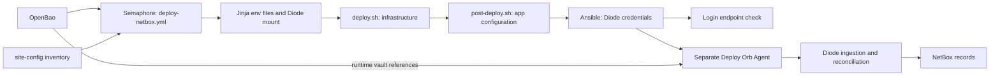

# NetBox Deployment

NetBox provides IPAM/DCIM, with discovery data arriving through Diode. Deploy and
operate it through **Semaphore**; **OpenBao** owns credentials and private
**site-config** owns inventory and discovery scope.

This reference describes the checked-in deployment, not a live-health result.
Discovery recovery remains unverified. Production is the current validation
target; the deployable local environment does not currently have NetBox set up
on Docker. A local app-only Podman script exists, but does not verify the full
production discovery path.

## Prerequisites

- A declared `netbox_svc` host in private inventory, with service URL,
  deployment path, SSH access and container engine.
- Semaphore access to OpenBao using its scoped AppRole.
- Docker for the default production path. `lib/common.sh` accepts an explicit
  `CONTAINER_ENGINE`; this alone is not proof of full-stack Podman compatibility.
  Container naming, compose behavior, bind-mounted secrets and privileged
  discovery must all be validated.
- Discovery credentials provisioned in OpenBao. User-managed credentials such
  as SNMP community and upstream API tokens are not generated by deployment.

## Deploy and update

1. Declare the intended version/configuration in Git and the target in
   site-config. Preserve stateful secrets and follow platform validation rules.
2. Run **Deploy NetBox** in Semaphore. It renders credentials, starts the
   infrastructure, configures the application, manages Diode credentials and
   checks the login endpoint.
3. Run **Deploy Orb Agent** separately after NetBox is ready. It renders the
   discovery configuration and starts the privileged agent with its workers.
4. Verify collection, Diode ingestion/reconciliation and resulting NetBox
   records independently. A healthy login page or running agent is insufficient
   evidence of fresh discovery.

Routine deployment preserves volumes but restarts containers and may migrate the
database. **Clean Deploy NetBox destroys data**; it is not a troubleshooting
shortcut. Do not run deployment scripts over an ad-hoc SSH session.

## Deployment boundaries

```mermaid
flowchart LR
  BAO["OpenBao"] --> ANS["Semaphore: deploy-netbox.yml"]
  CFG["site-config inventory"] --> ANS
  ANS --> ENV["Jinja env files and Diode mount"]
  ENV --> DEP["deploy.sh: infrastructure"]
  DEP --> POST["post-deploy.sh: app configuration"]
  POST --> CREDS["Ansible: Diode credentials"]
  CREDS --> CHECK["Login endpoint check"]
  CREDS --> ORB["Separate Deploy Orb Agent"]
  BAO -->|"runtime vault references"| ORB
  ORB --> DIODE["Diode ingestion and reconciliation"]
  DIODE --> NB["NetBox records"]
```

| Component | Responsibility |
|---|---|
| `deploy-netbox.yml` | Five phases: clone and secrets, infrastructure, application configuration, Diode credentials, login check |
| `deploy.sh` | Verify rendered files, update upstream base, pull/build, preserve volumes, synchronize existing DB passwords, start services in stages and wait |
| `post-deploy.sh` | Migrations, idempotent superuser creation, OAuth2 client registration, discovery service restart and health checks |
| `deploy-orb-agent.yml` | Separate workflow: credentials, AppRole-backed agent template, privileged container and workers |

`lib/generate-secrets.sh` is not part of the current deployment. Legacy secret
and agent helpers remaining in `lib/common.sh` are not the operational entry
point. The upstream `netbox-docker/` clone is build input; do not patch it.

## Services and data

Compose declares NetBox and its worker; shared Postgres; Valkey task/cache
services; ingress-nginx; Diode ingester, reconciler and auth; Hydra and its
one-shot migration; and Diode Redis. Image/version declarations live in
[`docker-compose.yml`](docker-compose.yml) and
[`Dockerfile-Plugins`](Dockerfile-Plugins).

Orb Agent is a **separate privileged container with host networking**. The
[`agent.yaml` template](templates/agent.yaml.j2) declares network discovery every
four hours, SNMP every six hours, and pfSense/Proxmox workers every 15 minutes.
Vault polling is hourly. The pfSense worker is not a one-off invocation of
`lib/pfsense-sync.py` by `deploy.sh`.

Persistent data is in the named Postgres, Redis/cache, NetBox media/reports/scripts
and Diode Redis volumes declared in compose. Backups and rollback must cover the
relevant database state before a version change; restarting a container does not
roll back its database.

## Configuration and credentials

Ansible reads/generates service secrets under `secret/services/netbox`, then
renders `.env`, `env/netbox.env`, `env/postgres.env`, `env/discovery.env` and
`discovery/hydra.yaml`. These generated files are a runtime bridge, never the
source of truth. Admin identity comes from inventory/templates; the password
comes from OpenBao. Do not use task logs as a credential handoff channel.

The current playbook also writes
`secrets/netbox_to_diode_client_secret.txt` for the compose mount at
`/run/secrets/netbox_to_diode`. Despite its task label saying "temporary," the
playbook does not delete it after startup. Do not delete a live bind-mount source
by hand; the broader runtime-secret lifecycle remains an implementation gap.

The Orb Agent's AppRole comes from `secret/services/approles/orb-agent`.
Runtime vault references read Diode/SNMP fields under `secret/services/netbox`,
pfSense fields under `secret/services/discovery/pfsense`, and Proxmox fields
under `secret/services/discovery/proxmox_api`. Align these paths with the scoped
policy and template; do not replace them with local secret files.

`discovery/roles.yaml` defines allowed device roles. Custom sysObjectID mappings
live in `discovery/snmp-extensions/`, mounted read-only by the playbook. Edit the
template/declaration and redeploy rather than editing rendered `agent.yaml`.

## Troubleshooting boundaries

| Symptom | Check |
|---|---|
| Login works but discovery is stale | Inspect collection, ingestion/reconciliation and fresh records separately; retain timestamps and source identity |
| Agent cannot authenticate | Compare vault path access, required fields and Diode credential validity; access to one vault path does not prove access to every path |
| Plugin reports token endpoint not found | Verify `PLUGINS_CONFIG` in `configuration/plugins.py`, the templated Diode target and mounted client secret |
| Database credentials disagree | Check OpenBao and rendered files; the deploy path synchronizes existing database passwords. Do not delete volumes or regenerate secrets as a diagnostic step |
| Missing database initialization | `discovery/init-db.sh` runs on first volume creation. It is a shell script, not SQL input for `psql -f`; encode repairs as reviewed Semaphore tasks |
| Agent policy rejected | Check the committed template: `scope` and `config` are siblings; preserve backend-specific settings |
| Local app works but production scans fail | App-tier readiness does not test raw network access, SNMP, upstream credentials or multi-host reachability |

The existing `check-discovery.yml` is **not read-only**: it also updates site
coordinates and tolerates some query failures. Its output is not an end-to-end
recovery gate. Do not run it under a read-only authorization.

## References

- [Agent guidance](CLAUDE.md) and [platform rules](../../../../AGENTS.md)
- [Deploy NetBox](../../../playbooks/deploy-netbox.yml)
- [Deploy Orb Agent](../../../playbooks/deploy-orb-agent.yml)
- [Discovery checker](../../../playbooks/check-discovery.yml)
- [Automation architecture](../../../../plan/architecture/01-automation-model.md)
- [Discovery plan and historical evidence](../../../../plan/development/04-netbox-discovery.md)
- [Local environment](../../../../LOCAL-DEV-README.md)
